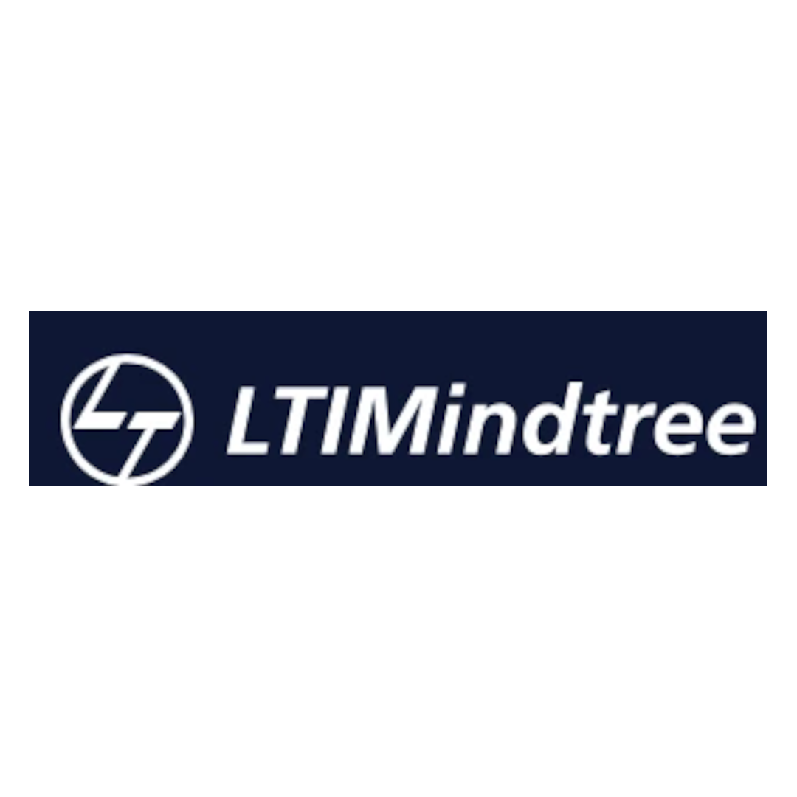
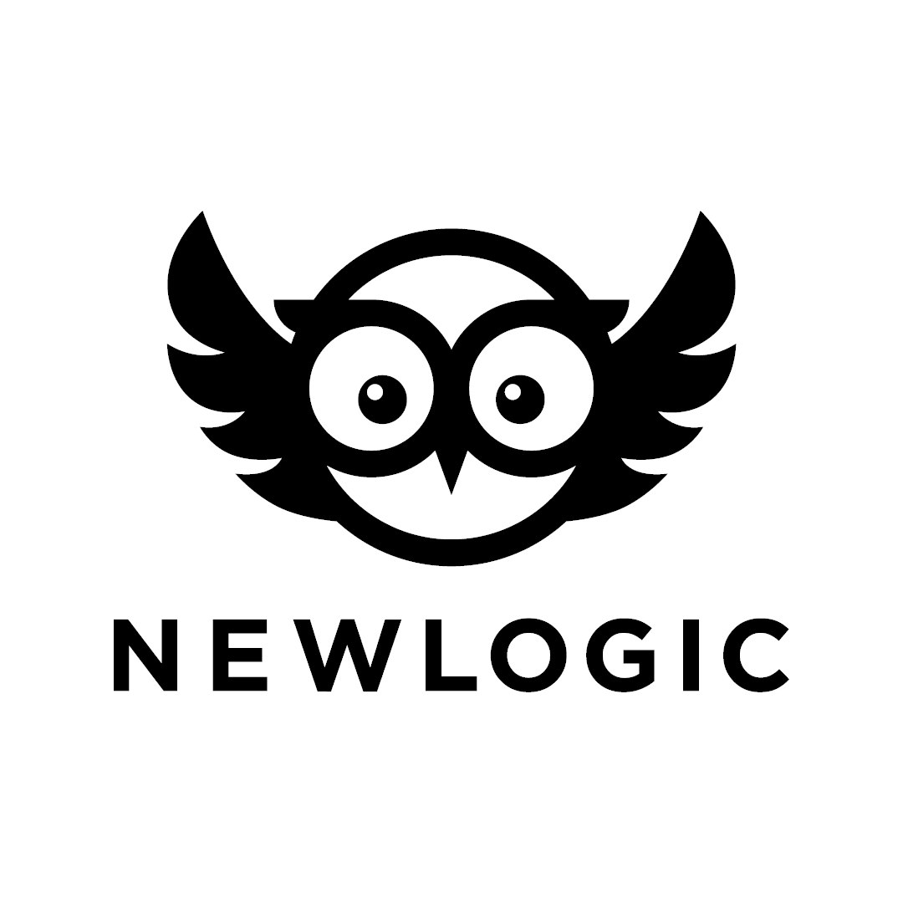
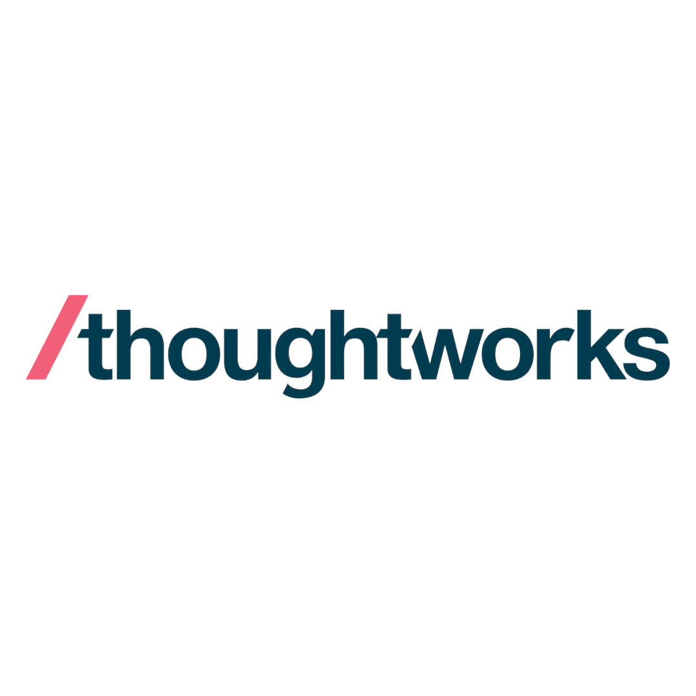
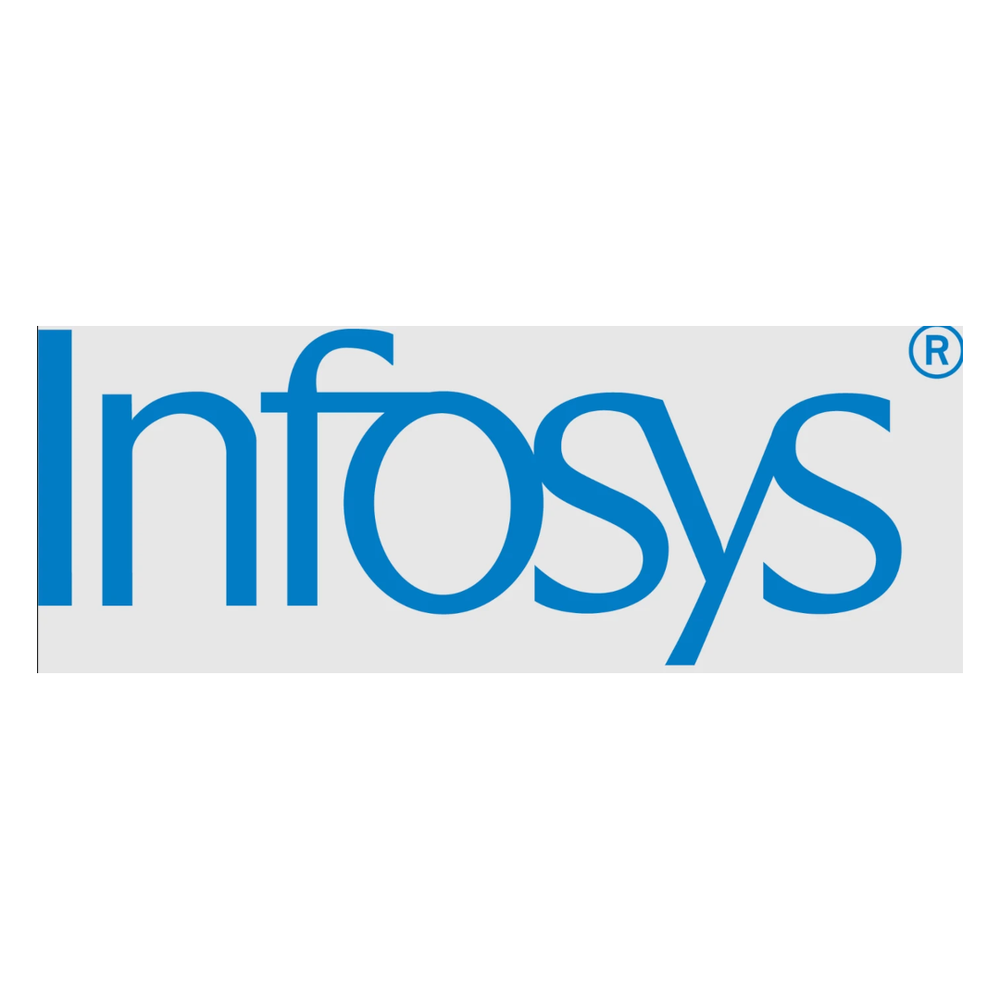
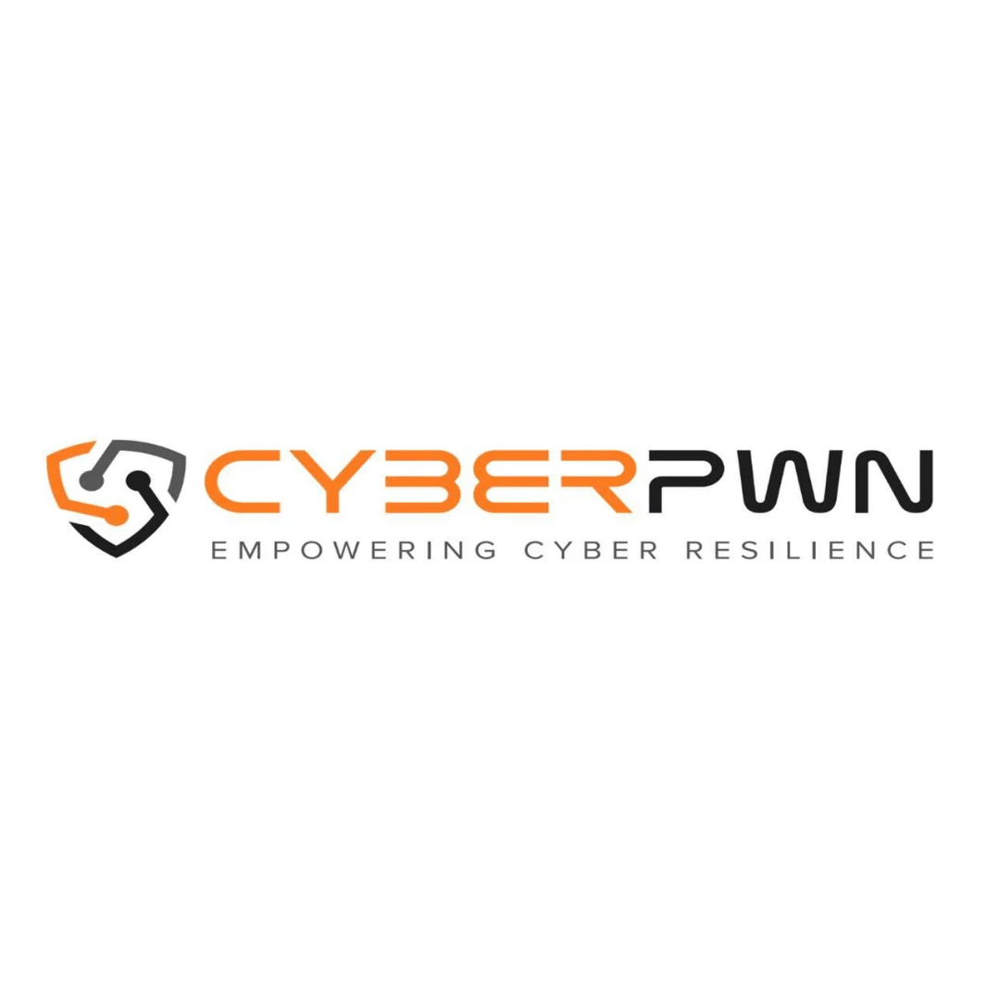
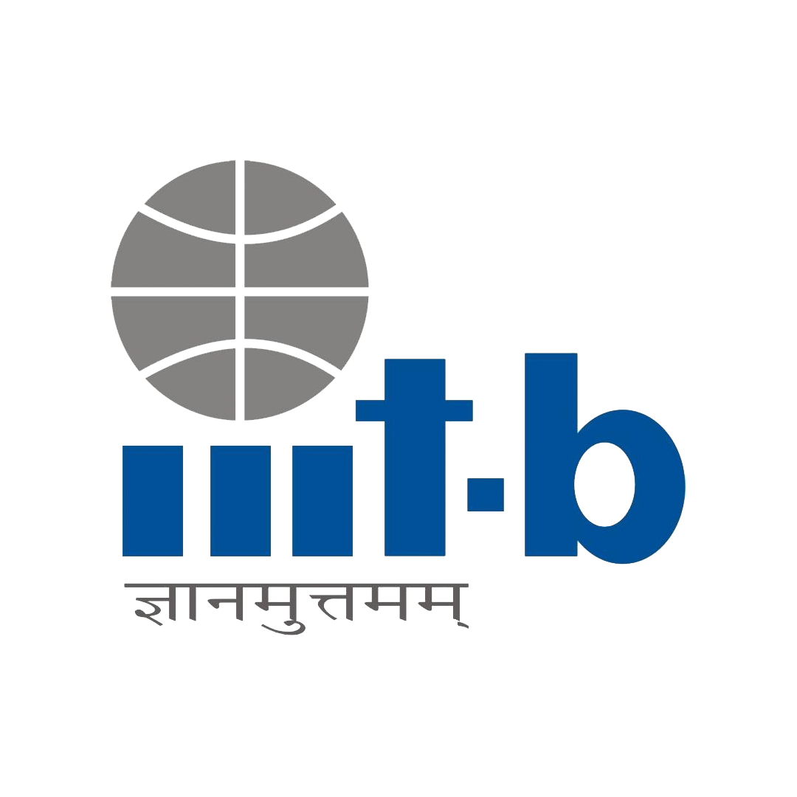
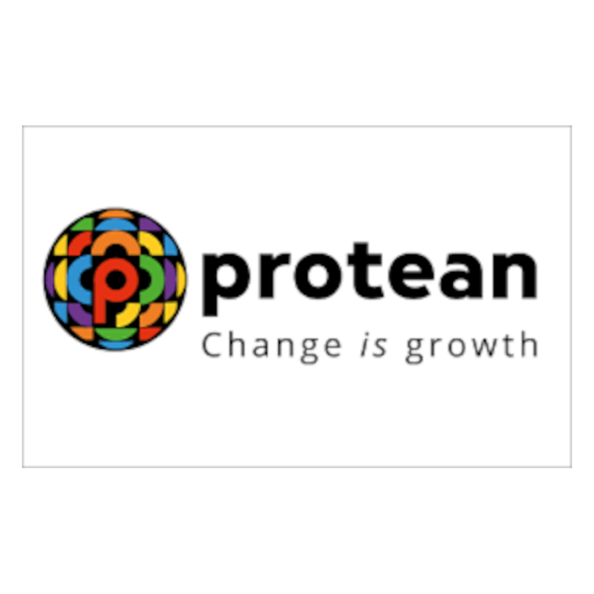
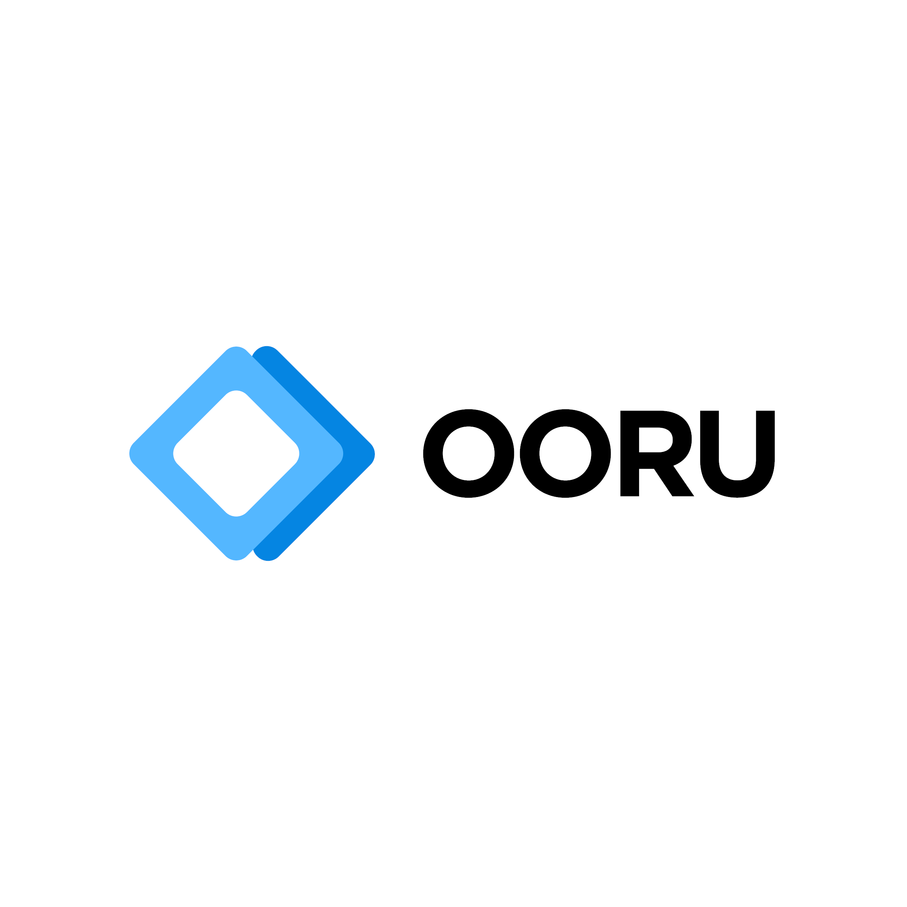
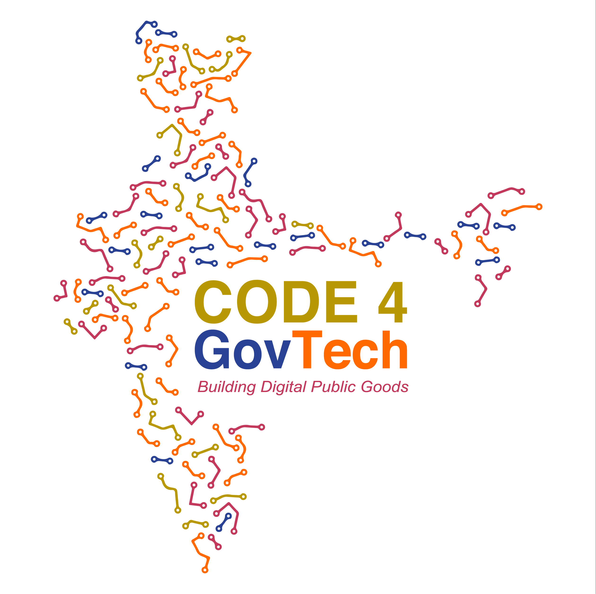

# Contributions

## Overview

MOSIP is a product of the combined efforts of multiple stakeholders. Contributions from the community form the backbone of MOSIP and drive its growth and stability. The contributions have come in multiple ways, ranging from direct code contributions, review of design and architecture, bug fixing, and support for technology evaluation. In this section the MOSIP team would like to acknowledge the contributions of organisations and groups who have been instrumental in driving the project forward.

## [LTIMindtree Ltd](https://www.mindtree.com/)

<figure><figcaption></figcaption></figure>

MOSIP partnered with LTIMindtree in August 2018 and since then it has been a fruitful association in areas of engineering, architecture, devops to name a few. Mindtree has contributed, through secondment of engineering resources, approximately 2260 person days of engineering effort, which roughly translates to more than 21000 person hours of work on the MOSIP project.

**About LTIMindtree**: A digital transformation and technology services company located in Bangalore.

## [Technoforte Software Private Limited](https://www.technoforte.co.in/)

<figure><figcaption></figcaption></figure>

The team at Technoforte has contributed multiple resources towards security testing, manual testing, automated testing, development, and devops. Technoforte has made significant contributions to the development of Partner Management Module, defining the partner policy, and setting up the partner portal. The team is also part of the community led effort of Android Reg Client development.

These valuable contributions were made by the Technoforte team with an approximate cumulative effort of about 4000+ person days which translates to 32000+ person hours.

**About Technoforte**: Technoforte Software Private Limited (Technoforte) is a Bangalore based firm engaged in providing enterprise solutions in the field of Information Technology.

## [Newlogic](https://newlogic.com/)

<figure><figcaption></figcaption></figure>

With its belief in the open source values and the transformative power of Digital Public Goods Newlogic has been partnering with MOSIP in building the next generation of digital government infrastructures.

Newlogic regularly contributes to architecture, development, product management, and testing work.

Newlogic's contribution to MOSIP include:

* Integration of ID PASS Light library to generate and read encrypted QR Codes that allow offline identity sharing with biometric verification.
* Development of the Inji resident mobile app and its Minoto backend service.
* Development of a mobile credential sharing library that works both online and offline.

Singapore based Newlogic is a software consultancy company providing innovative software solutions to companies, organizations, and governments.

## [Thoughtworks](https://www.thoughtworks.com/)

<figure><figcaption></figcaption></figure>

In 2022, Thoughtworks partnered with MOSIP as an engineering ally, embarking on a significant journey together. Key milestone was the creation of Tuvali, a BLE layer adhering to OpenID4VP standards. An alternate to Google Nearby, Tuvali facilitates the exchange of verifiable IDs across wallets and devices even without internet connectivity. This innovation empowers governments to effectively provide efficient and monitored citizen services.

Furthermore, the organization played a pivotal role in developing Inji Wallet, a digital VC wallet reference application. With a strong focus on security and inclusivity, Inji Wallet offers features for downloading, storing, managing, presenting, and verifying VCs within the MOSIP community. Built on OpenID4VCI standards, the wallet also includes data backup capabilities.

The organization has broadened its contributions to other essential components of the digital credentialing stack - Inji.

**About Thoughtworks**: Thoughtworks is a global technology consultancy renowned for integrating strategy, design, and engineering to foster digital innovation. With over 10,500 skilled professionals across 48 offices in 19 countries, the organization has a legacy of delivering impactful solutions for our clients over the past three decades. The company prides itself on leveraging technology to address complex business challenges and drive meaningful change.

## [Infosys](https://www.infosys.com/)

<figure><figcaption></figcaption></figure>

Infosys began collaborating with MOSIP in early 2023 as part of its Technology for good initiative. The company has been actively contributing to the development of the eSignet module, Android Registration Client, and other related modules. Through this pro bono collaboration, Infosys demonstrates its commitment to using technology for social good and empowering individuals with secure and reliable digital identities.

**About Infosys**: Infosys, a global leader in next-generation digital services and consulting, headquartered in Bengaluru, India, is a multinational corporation that provides business consulting, information technology, and outsourcing services to clients across the globe.

## [CyberPWN](https://cyberpwn.com/)

<figure><figcaption></figcaption></figure>

In January 2020, CyberPWN partnered with IIIT Bangalore to offer development assistance for MOSIP. Presently, CyberPWN's product engineering team, consisting of 30+ engineers, actively contributes expertise in multiple areas of MOSIP, encompassing Architecture, Product Management, Product Development, Quality Assurance, DevSecOps, Security, and Biometrics.

**About CyberPWN**: CyberPWN Technologies Private Limited is a respected cybersecurity consultancy and advisory firm. Leveraging their extensive expertise in the field, they collaborate with organizations to enhance their security posture, protect sensitive data, and counter cyber threats.

## <mark style="color:blue;">GH Solutions Consultants</mark>

<figure><figcaption></figcaption></figure>

GHSC has partnered with MOSIP in the critical area of security, making significant contributions to the Security Assurance Services, in collaboration with MOSIP’s core development team. This partnership plays a vital role in strengthening MOSIP’s security framework and ensuring robust protection across its ecosystem.

**About GHSC**: GHSC is a renowned cybersecurity and compliance firm with a strong focus on serving the financial services and government sectors. Leveraging their extensive expertise, they have now expanded into the Digital Public Infrastructure (DPI) domain, actively engaging with several Digital Public Goods (DPGs).\
\
Their contribution to MOSIP highlights their commitment to driving innovation and delivering secure, scalable solutions for emerging global needs.

## [Students @ IIIT Bangalore](https://www.iiitb.ac.in/)

<figure><figcaption></figcaption></figure>

IIIT Bangalore has been home to MOSIP since its inception in 2018 and the students of the institute have been at the forefront of the MOSIP’s community-led development. The students have on an ongoing basis contributed to solving engineering problems in MOSIP for real-world applications. Their major ongoing contributions include:

**Project 1:** Reporting framework for real-time streaming of data and visualization. The dashboards give a visual display of metrics and important data to track the status of various pre and post-enrollment processes. Reporting framework involves setting up the data pipeline for populating data from the database to ElasticSearch.

A set of reference dashboards were also created as a part of this work.

**Project 2:** Registration officers/operators use the registration client application to enroll residents into the ID system. It is a thick client which works on machines with Windows OS.

Students have contributed to the development of Android equivalent of the Registration Client, which can be installed on Android tablets.

**Project 3:** Synthetic IRIS Data generation using ML algorithms

MOSIP test automation suite requires large set of synthetic biometric data such as IRIS. This project attempts to generate larger set of IRIS images from the given set of sample IRIS images. The solution is built using Guided-Diffusion with pre-trained models MOSIP USSD Proxy feature enhancements.

**Project 4:** MOSIP USSD Proxy feature enhancements

MOSIP USSD Proxy is a bridge between Telco SDP and MOSIP Instance. This allows to build custom USSD workflows.

The following workflows were developed under this project:

* Check registration status for a given RID
* Retrieve UIN Lock/Unlock status
* Lock or Unlock a given UIN

## [Protean](https://www.proteantech.in/)

<figure><figcaption></figcaption></figure>

Protean partnered with MOSIP in September 2018 and since then the company has actively contributed in development and testing of various modules of MOSIP like Pre-Registration, Registration, Registration Processor, and other related modules.

So far, Protean has contributed approximately 1905 person per days of development effort, which roughly translates to more than 15000 person hours of work.

**About Protean**: Protean (NSDL e-Governance) offers digital ecosystem, curated to cater to billions. With over 25+ years providing unparalleled experience in creating population scale e-governance solutions, the company has empowered billions of lives across the country. Protean is building a digitised ecosystem for 1.4 billion people transforming citizen services for a better future.

## [Sunbird](https://sunbird.org/)

<figure><figcaption></figcaption></figure>

The Sunbird community has developed 20+ digital solutions (called “building blocks”) which can be used individually or combined to create larger and more complex solutions. One of the building blocks, Sunbird RC has been used in the creation of Inji - a digital credentialing stack. The Sunbird RC team has actively led the development and contribution of a few components within Inji, such as Inji Certify, Inji Verify, and Inji Web.

**About Sunbird**: Sunbird is an open-source collective, seeded by the EkStep Foundation.

## [HireKarma](https://hirekarma.in)

<figure><figcaption></figcaption></figure>

The team at HireKarma has actively contributed to the community by developing multiple test automation suites for the MOSIP ID platform as well as the eSignet and Inji product lines.

**About HireKarma**: HireKarma is an India based software company that delivers innovative technology solutions to enterprises, educational institutions and government organizations.

## [Ooru Digital](https://ooru.io/)

<figure><figcaption></figcaption></figure>

Ooru Digital has collaborated with MOSIP since 2024 and has been working closely towards strengthening the **Inji ecosystem.** The contributions are focussed on code contributions and feature testing.

**About Ooru**: Ooru Digital Private Limited is a product based technology company dedicated to developing innovative and interoperable digital solutions across multiple sectors. With a strong commitment to Digital Public Goods (DPGs), Ooru aims to create impactful products that drive social transformation and sustainable growth.

## [C4GT](https://codeforgovtech.in/)

<figure><figcaption></figcaption></figure>

C4GT began collaborating with MOSIP in February 2025 and has since worked closely to strengthen the **Inji ecosystem**. C4GT contributed with code, feature improvements, and thorough testing, helping to drive innovation and also helping Inji's continued surge towards becoming a fully interoperable and open standards based digital credentialing stack.

**About C4GT**: C4GT enables development and long term maintenance of open-source products (DPGs and beyond), driving population-scale social impact by creating pathways and an ecosystem for young talent to contribute to these products through an active community. Through various efforts, it aims to encourage ongoing contributions and strengthen collaboration between DPG/DPI builders, adopters, and contributors (students or working professionals). The initiative works towards facilitating long-term collaboration and innovation within the fast evolving DPGs/DPI & Tech for Good ecosystem, enhancing the efficiency and quality of contributions, and aligning the incentives for both organizations and contributors. C4GT connects organizations to a network of more than 33,000 contributors, enabling them to engage with and leverage this community to drive high-quality contributions.