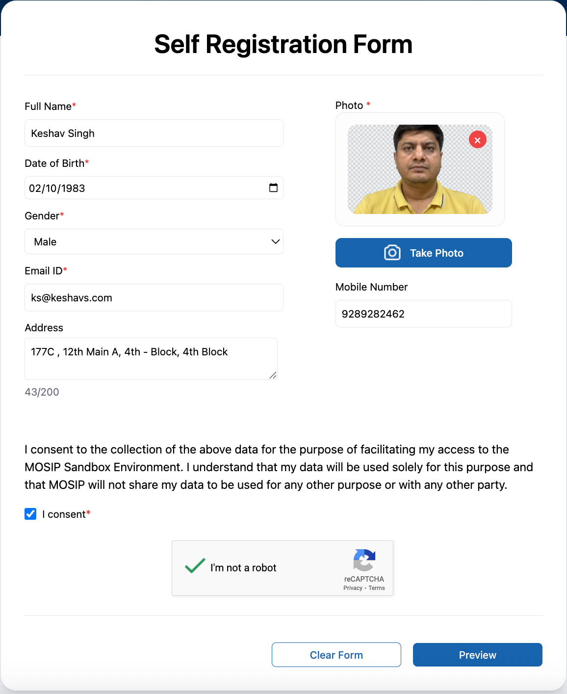
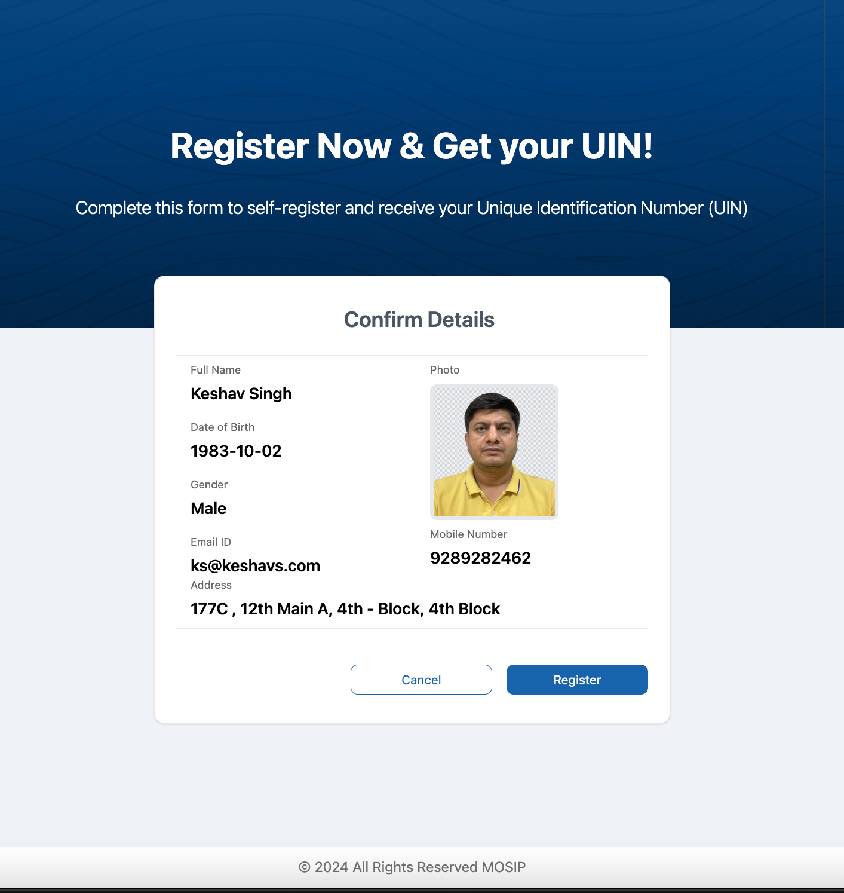
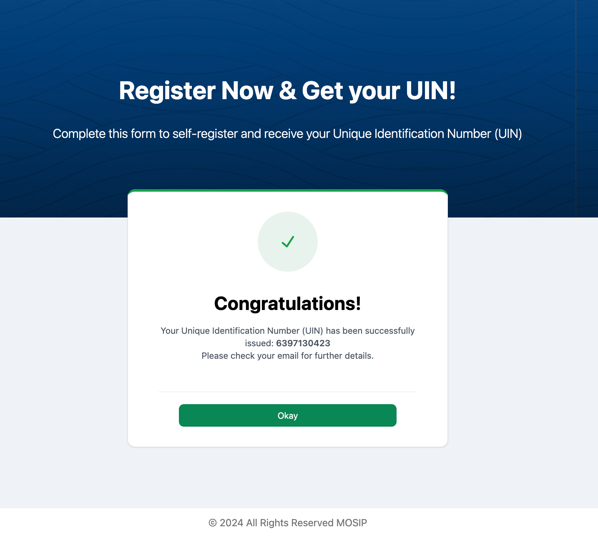
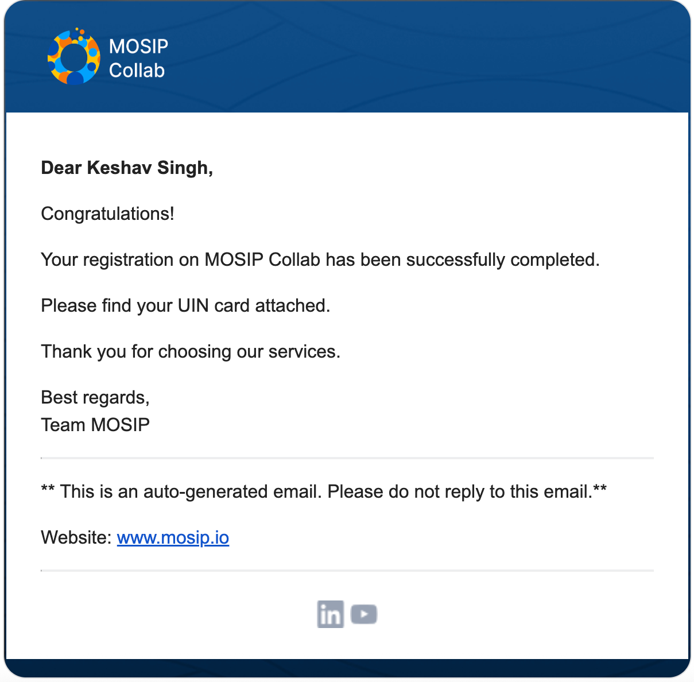
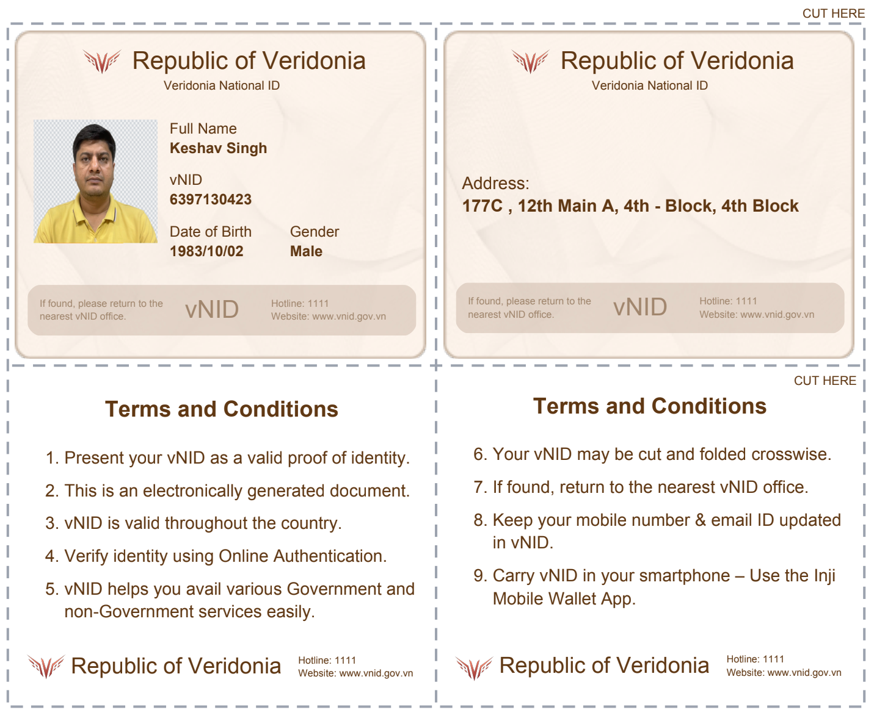

# Generating Demo Digital Identities

Getting a demo [UIN Credential - Unique Identification Number](https://docs.mosip.io/1.2.0/id-lifecycle-management/identifiers#uin) will allow you to explore MOSIP's capabilities and experience seamless identity management firsthand.\
Now you can generate your own **UIN** Credential using the Collab environment's **Self Registration Portal**. Follow these steps to generate a UIN:

1. Navigate to the [Collab Environment](https://collab.mosip.net/) and click on the **Get UIN** button located at the top-right corner of the page. This will open the **Self Registration Form**.

<figure><figcaption>
Self Registration Form
</figcaption></figure>

2. Fill in the required details in the form:
   * **Full Name** (Required)
   * **Date of Birth** (Required)
   * **Gender** (Required)
   * **Email ID** (Required)
   * **Mobile Number**
   * **Address**
3. Upload or capture a photo using the **Photo** section.

<figure><figcaption>
Confirm Details
</figcaption></figure>

4. Read through the consent statement and provide your consent by checking the checkbox.
5. Complete the CAPTCHA to ensure security.
6. Click the **Preview** button to review the details you have entered. On the preview screen, you can:
   * Click **Register** to submit the form and generate your UIN.
   * Click **Cancel** to go back and make any necessary corrections.

<figure><figcaption>
UIN Generation Success
</figcaption></figure>

7. Upon successful registration, you will receive a confirmation message and your UIN as a PDF attachment via email.

<figure><figcaption>
Mail containg the UIN 
</figcaption></figure>

Obtaining demo credentials will enable you to explore various modules seamlessly. The provision of a Unique Identification Number (UIN) as a demonstration credential allows you to experience MOSIP's capabilities firsthand, offering a practical understanding of its identity management features.

<figure><figcaption>
UIN PDF
</figcaption></figure>
