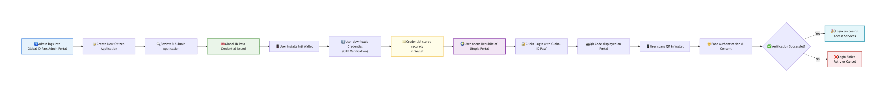
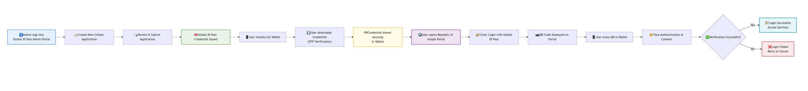

# Global ID Pass Issuance

### Try It Out

Click [**here**](global-id-pass-issuance.md#what-youll-experience) to 'Try This Out' now using the given portal addresses and the demo credentials provided, or, read through the guide to understand the steps and then then explore the solution.

### **Overview**  

**Global ID Pass Credential** is a **government-issued digital identity**, implemented as a **Verifiable Credential (VC)** in the **Republic of Utopia** _(a fictional country used for demonstration purposes)_. It enables residents to securely prove their identity and access government services both **online and offline**, while preserving privacy and user consent. Stored in the Inji Wallet, the credential showcases how modern digital identity systems can enable trusted, seamless, and connectivity-independent service delivery.

Explore how **Global ID Pass Credentials**, issued as secure **Verifiable Credentials (VCs)**, enable **trusted, seamless, and privacy-preserving access to government services** — both **online and offline** across the **Republic of Utopia**.

This step-by-step guide walks you through **issuing, storing, and using Global ID Pass Credentials**, showcasing how digital identity can transform citizen service delivery.

### What You’ll Experience 

#### **Use Case 1: Online Registration and Global ID Pass Issuance** 

* Register and issue a **Global ID Pass** via the [**Global ID Pass Admin Portal**](https://globalid-pass.collab.mosip.net/)
* Download and securely store credentials in the [**Inji Wallet**](global-id-pass-issuance.md#wallet-downloads)**.**
* Use your credentials to **log in and access services** on the [**Republic of Utopia Portal**](https://utopia.collab.mosip.net/)

#### **Use Case 2: Offline Sharing of Global ID Pass via Bluetooth Low Energy (BLE)** 

* Experience **offline credential sharing** using BLE
* Enable secure identity sharing **without internet connectivity**

### Setup Requirements 

Ensure you have:

#### Devices 

* **2 mobile devices** — for BLE demo
* **1 laptop/desktop** — to access portals

> **Note:** The BLE demo requires **two mobile devices**. This can be **either two Android devices or one Android and one iOS device**. A combination of **two iOS devices is not supported** for this demo.

#### Access to 

* [**Global ID Pass Admin Portal**](https://globalid-pass.collab.mosip.net/)
* [**Republic of Utopia Portal**](https://utopia.collab.mosip.net/)
* [**Inji Wallet App**](https://mosip.atlassian.net/wiki/spaces/Inji/pages/edit-v2/2444296193#Wallet-Downloads)

#### Wallet Downloads 

* **Android APK** — Download [**here**](https://mosip.atlassian.net/wiki/external/NmRmMzE3NDJlYjI4NGMxZThmNWUwZGU4MzI4ZjNiNTE)
* **iOS TestFlight** — Download [**here**](https://testflight.apple.com/join/7FTAdjLe)

#### Sample Global ID Pass Admin Login Credentials 

* **Username:** compass
* **Password:** compass@123

Observe the user flow and follow the instructions and steps below it to begin your experience! Let’s get started!

### **Flow 1 — Issuance + Wallet Setup + Online Login** 

<figure><figcaption></figcaption></figure>

### Flow 2 — Offline Credential Sharing (BLE) 

<figure><figcaption></figcaption></figure>

## Use Case 1: Online Registration and Global ID Pass Issuance 

### **Step 1: Issue Global ID Pass via Admin Portal** 

**As an Admin**

#### **1.1 Log in to Global ID Pass Admin Portal** 

Log in to admin [**portal**](https://globalid-pass.collab.mosip.net/) using the credentials provided above as an **authorized Government Agent.**

#### **1.2 Create a New Application** 

* Navigate to **“New Application”**
* Enter citizen details manually
* Review details on the preview screen
* Click **Submit** to complete the application

#### **1.3 Issue Global ID Pass Credential** 

* Submit the application
* The system generates a **Global ID Pass Verifiable Credential**

### Step 2: Download & Store Global ID Pass in Inji Wallet 

**As a Resident**

#### **2.1 Install the Global ID Pass Wallet** 

Install the wallet on your **Android or iOS** device using the links [above](global-id-pass-issuance.md#wallet-downloads).

#### **2.2 Download Global ID Pass Credential** 

* Open **Inji Wallet**
* Select the **Global ID Authority Issuer**
* Authenticate using static **OTP: 111111**
* Credential is **securely stored in the wallet**

### Step 3: Access Services on the Republic of Utopia Portal 

#### **3.1 Open Republic of Utopia Portal** 

Access the [**portal**](https://utopia.collab.mosip.net/) on a **desktop browser** or **another mobile device**.

#### **3.2 Login Using Global ID Pass** 

* Click **“Login with Global ID Pass”**
* A **QR code** appears on screen

#### **3.3 Scan QR Code from Inji Wallet** 

* Open **Inji Wallet**
* Tap **Scan**
* Scan the QR code displayed on the portal

#### **3.4 Face Authentication & Consent** 

* Complete **Face Authentication**
* Provide **consent to share credentials**

#### **3.5 Access Government Services** 

You are now securely logged in and can access available services on the **Republic of Utopia Portal**.

## Use Case 2: Offline Sharing of Global ID Pass via BLE 

### **Step 1: Offline Credential Sharing for Remote Sharing** 

Enable **secure, internet-free verification** using Bluetooth ideal for remote or low-connectivity environments.

#### **1.1 Prepare Devices** 

Enable **Bluetooth** on both devices:

* **Holder Device:** Resident’s Inji Wallet
* **Verifier Device:** Service Provider / Agent’s Inji Wallet

#### **1.2 On Resident’s Device (Wallet Holder)** 

* Tap **Share** in navigation bar
* Grant permissions
* Scan QR code displayed on verifier’s device
* Bluetooth connection is established

**Select a Credential to Share**

* **Share** → Sends credential
* **Share with Selfie** → Captures selfie and verifies face against VC before sending

#### **1.3 On Verifier’s Device (Android Only)** 

* Go to **Settings → Receive Cards**
* Display QR code
* Receive credential securely
* View received credentials under **Settings → Received Cards** _(view-only)_

## Use Case Recap 

As a **Resident of the Republic of Utopia**, you experienced:

* Receiving a **Global ID Pass** issued by government authorities
* Downloading and securely storing credentials in the **Global ID Pass Wallet**
* Logging into the **Republic of Utopia Portal** using verifiable credentials
* Sharing credentials **offline via Bluetooth (BLE)**
* Experiencing **secure, consent-based, and privacy-preserving identity verification**

This experience showcases the power of secure **foundational digital identity** and **verifiable credentials**, in enabling hassle-free access to essential services. We hope this walkthrough gave you valuable insights into the potential of trusted **digital identity ecosystems**, powered by [MOSIP](https://docs.mosip.io/1.2.0), [Inji](https://docs.inji.io/), and [eSignet](https://docs.esignet.io/).

Thank you for participating and stay connected for more exciting innovations ahead!
