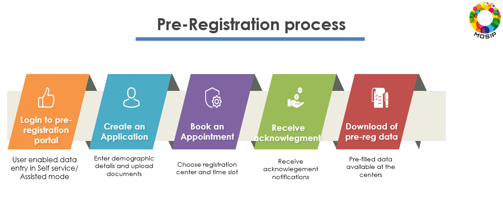
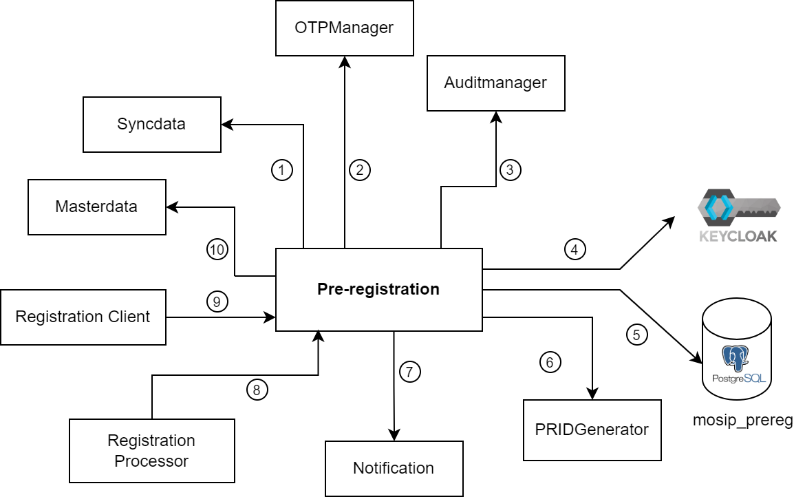

# Features

Content Coming Soon

## Overview
Pre-registration module enables a resident to:

* enter demographic data and upload supporting documents,
* book an appointment for one or many users for registration by choosing a suitable registration center and a convenient time slot,
* receive appointment notifications,
* reschedule and cancel appointments.

Once the resident completes the above process, their data is downloaded at the respective registration centers before their appointment, thus, saving enrollment time. The module supports multiple languages.

MOSIP provides backend APIs for this module along with a reference implementation of [pre-registration portal](#pre-registration-portal).

## Pre-registration process

### Create an application

* User provides consent
* The user provides demographic information
* User uploads supporting documents (Proof of Address, Birth certificate, etc.)
* A pre-registration request ID known as [AID](../../../identity-management/identifiers.md#rid-aid) is generated and provided to the user.

_Note_: The AID was formerly called PRID in the pre-registration context.

### Book an appointment

* The user selects a registration center based on postal code, geo-location, etc.
* The available slots are displayed
* An option to cancel and re-book the appointment is made available

### Receiving acknowledgement notifications

* An acknowledgment is sent via email/SMS
* The user can print the acknowledgment containing AID and QR code.
* This QR code can be scanned at the in-person registration centers.

### Download of pre-registration data at registration centers

* The user provides the AID/ QR code at the registration center.
* The registration form gets pre-filled with the pre-registration data.

## Pre-registration module

The relationship of the pre-registration module with other services is explained here.&#x20;


**NOTE:** The numbers do not signify a sequence of operations or control flow.


1. Fetch [ID Schema](../../../../id-schema) details with the help of Syncdata service.
2. Fetch a new OTP for the user on the login page.
3. Log all events.
4. Pre-Registration interacts with Keycloak via [`kernel-auth-adapater`](https://github.com/mosip/mosip-openid-bridge/tree/release-1.2.0). The Pre-Reg module communicates with endpoints of other MOSIP modules. However, to access these endpoints, a token is required. This token is obtained from Keycloak.
5. The database used by pre-reg.
6. Generate a new AID for the application.
7. Send OTP in the email/SMS to the user.
8. Registration Processor uses reverse sync to mark the pre-reg application as consumed.
9. Registration clients use the [Datasync service](https://github.com/mosip/pre-registration/tree/release-1.2.0/pre-registration/pre-registration-datasync-service) to get the pre-reg application details for a given registration center, booking date, and AID.
10. Request data from the MasterData service to get data for dropdowns, locations, consent forms etc.

## Services

Pre-registration module consists of the following services:

* [Application](https://github.com/mosip/pre-registration/tree/release-1.2.0/pre-registration/pre-registration-application-service)
* [Booking](https://github.com/mosip/mosip-ref-impl/tree/release-1.2.0/pre-registration-booking-service)
* [Batchjob](https://github.com/mosip/pre-registration/tree/release-1.2.0/pre-registration/pre-registration-batchjob)
* [Datasync](https://github.com/mosip/pre-registration/tree/release-1.2.0/pre-registration/pre-registration-datasync-service)
* [Captcha](https://github.com/mosip/pre-registration/tree/release-1.2.0/pre-registration/pre-registration-captcha-service)

For more details, refer to the [Pre-registration repo](https://github.com/pjoshi751/pre-registration/tree/develop).

## Pre-registration portal

MOSIP provides a **reference** implementation of the pre-registration portal that may be customized as per country needs. The sample implementation is available at the [reference implementation repository](https://github.com/mosip/mosip-ref-impl). For getting started with the pre-registration, refer to the [Pre-registration user guide](../test/pre-registration-user-guide.md)

## Build and deploy

To access the build and read through the deployment instructions, refer to the [Pre-registration repo](https://github.com/mosip/pre-registration/tree/release-1.2.0).

## Configurations

For details related to Pre-registration configurations, refer to [Pre-registration configuration](https://github.com/mosip/pre-registration/blob/release-1.2.0/docs/configuration.md).

## Developer Guide

To know more about the developer setup, read the [Pre-registration Developers Guide](https://docs.mosip.io/1.2.0/modules/pre-registration/pre-registration-developer-setup).

## API

Refer to [API Documentation](https://mosip.github.io/documentation/1.2.0/1.2.0.html).

## Source code

[Github repo](https://github.com/mosip/pre-registration/tree/release-1.2.0).

---

<!-

## Overview

The Pre-registration module is designed to streamline the identity registration process by allowing residents to complete preliminary steps online before visiting registration centers. This reduces wait times, improves data accuracy, and enhances the overall user experience.

## Core Features

### 1. Operation Modes

#### **Self-Service Mode**
- **Independent Registration**: Residents can complete pre-registration on their own, using personal devices such as computers, tablets, or smartphones.
- **Multi-language Interface**: Users can interact with the portal in their preferred language, supporting inclusivity and ease of use.

<!-- (No content required here as per review. Section removed.) -->

### 1. Registration and Login
Users can create accounts using email or mobile, verify their identity with OTPs (One-Time Passwords), and use CAPTCHA for security. Pre-registration includes multi-language support, user consent management, secure login with OTP, session management, and options for language selection during login. These features aim to provide a secure, user-friendly, and compliant onboarding and login experience.

#### **Account Creation**
- **Multi-channel Registration**: Create accounts using email or mobile number
- **OTP-based Verification**: Secure account verification through SMS/email OTP
- **CAPTCHA Security**: Bot prevention through CAPTCHA verification
- **Multi-language Support**: Interface available in multiple languages as per country configuration
- **User Consent Management**: Clear consent capture for data processing and terms acceptance

#### **Secure Login**
- **OTP-based Authentication**: Login using mobile/email with OTP verification
- **OTP Retry Mechanism**: Request new OTP if not received initially
- **Session Management**: Secure session handling with configurable timeouts

### 2. Demographic Data Management

#### **Language Configuration**
- **Data Capture Language Selection**: Choose specific languages for data entry (separate from UI language)
- **Mandatory vs Optional Languages**: Support for countries with multiple mandatory and optional regional languages
- **Multi-language Data Entry**: Enter and verify demographic details in multiple configured languages
- **Language-specific Validation**: Validation rules adapted to each selected language

#### **Personal Information Capture**
- **Dynamic ID Schema Support**: Adapts to country-specific ID schema configurations
- **Mandatory and Optional Fields**: Configurable field requirements based on local regulations (marked with *)
- **Real-time Data Validation**: Instant validation of demographic information as users type
- **Cross-language Verification**: Verify data accuracy across multiple selected languages

#### **Family/Group Registration**
- **Multiple Applicant Support**: Register multiple family members or individuals in a single session
- **Add Applicant Functionality**: Seamless addition of new applicants during the process
- **Relationship Mapping**: Define relationships between applicants
- **Shared Document Upload**: Use common documents across multiple applications

### 4. Document Management

#### **Document Upload**
- **Multiple Document Types**: Support for various document categories (Passport, Reference Identity Number, Proof of Address, Birth Certificate, etc.)
- **Format Support**: Accept multiple file formats (PDF, JPEG, PNG)
- **File Size Management**: Configurable file size limits with compression options
- **Document Validation**: Basic validation for document format and size
- **Browse and Select**: User-friendly file browser for document selection

#### **Document Sharing and Reuse**
- **"Same As" Functionality**: Family members can reuse the same Proof of Address document from existing applicants
- **Document Preview**: Preview and verify uploaded documents before submission
- **Document Status Tracking**: Track upload and validation status for each document
- **Category-based Organization**: Organize documents by type and purpose

### 5. Application Management and Status Tracking

#### **Application Status Management**
The system provides clear status tracking with the following states:

- **Incomplete**: Only demographic details filled
  - *User Action Required*: Upload documents and book an appointment
- **Pending Appointment**: Demographic details and documents completed
  - *User Action Required*: Book an appointment
- **Booked**: Complete application with scheduled appointment
  - *User Action Required*: Visit registration center on appointment date and time
- **Expired**: Appointment date has passed
  - *User Action Required*: Re-book an appointment
- **Cancelled**: Appointment has been cancelled by user
  - *User Action Required*: Re-book an appointment

#### Application Dashboard
- **Chronological Sorting**: Applications sorted by creation date (newest first)
- **Visual Status Indicators**: Clear status display for each application
- **Bulk Operations**: Select multiple applicants for group actions
- **Auto-cleanup**: Consumed appointments automatically removed from dashboard
- **Persistent Storage**: Expired and cancelled applications retained for rebooking

#### Application Lifecycle Management
- **Create New Applications**: Generate multiple applications as needed
- **Data Modification**: Edit demographic data and documents before appointment
- **Application Preview**: Comprehensive review before final submission
- **Version Control**: Track changes and maintain data integrity

### 6. Appointment Booking System

#### Registration Center Discovery
- **Recommended Centers**: Automatic display based on demographic details (postal code)
- **Location-based Search**: Find centers using geo-location ("Nearby" option)
- **Search Functionality**: Find centers by name, address, or specific criteria
- **Center Information Display**: View center details, working hours, and available services
- **Distance Calculation**: Show distance from user's location to registration centers
- **Configurable Recommendations**: Customizable location hierarchy for center recommendations

#### **Time Slot Management**
- **Calendar Interface**: User-friendly calendar showing available dates with booking counts
- **Time Categorization**: Slots organized by Morning and Afternoon sessions
- **Real-time Availability**: Live display of available time slots
- **Capacity Management**: Real-time availability based on center capacity
- **Multi-applicant Booking**: Book appointments for multiple applicants simultaneously

#### **Appointment Flexibility**
- **Rescheduling**: Easy appointment date/time modification with 48-hour minimum notice (configurable)
- **Cancellation**: Cancel appointments with automatic slot release for others
- **Booking Confirmation**: Instant booking confirmation with unique appointment details
- **Time Restrictions**: Configurable minimum time between booking and appointment

### 7. Notification and Acknowledgment System

#### **Multi-channel Notifications**
- **Email Notifications**: Appointment confirmations, reminders, and updates
- **SMS Alerts**: Critical updates and appointment reminders via SMS
- **In-app Notifications**: Real-time notifications within the portal

#### **Comprehensive Acknowledgment Features**
- **Multiple Delivery Options**: 
  - Print acknowledgment directly
  - Download PDF version
  - Email to specified addresses
  - SMS to mobile numbers
- **Additional Recipients**: Send acknowledgment to multiple contacts beyond the applicant
- **Complete Information Package**: Includes name, pre-registration ID, age/DOB, contact details, center information, appointment date and time

#### **Notification Types**
- **Booking Confirmations**: Immediate confirmation upon successful booking
- **Appointment Reminders**: Automated reminders before appointment dates
- **Status Updates**: Notifications for application status changes
- **Document Updates**: Alerts for document upload and validation status

### 8. QR Code Generation and Management

#### **QR Code Features**
- **Unique QR Code**: Generate unique QR code for each application containing pre-registration ID
- **Comprehensive Data Encoding**: QR code contains appointment and application information
- **Registration Center Integration**: QR codes scannable at registration centers for quick data retrieval
- **Printable Format**: Generate printable acknowledgment with embedded QR code
- **Multi-format Support**: QR code available in print, digital, and shareable formats

### 9. Data Integration and Synchronization

#### **Registration Center Integration**
- **Data Download**: Pre-registration data downloadable at registration centers
- **Offline Support**: Support for offline data access at registration centers
- **Data Pre-filling**: Auto-populate registration forms with pre-registration data
- **Status Synchronization**: Bi-directional status updates between systems

#### **Master Data Integration**
- **Dynamic Dropdowns**: Real-time data from Master Data service for locations, centers
- **Center Information**: Up-to-date registration center details and availability
- **Holiday Management**: Integration with holiday calendar for slot availability

### 10. Advanced User Experience Features

#### **Application Management Operations**
- **Discard Applications**: Complete removal of unwanted applications
- **Cancel Appointments**: Cancel appointments while preserving application data
- **Modify Applications**: Edit demographic details and documents before appointments
- **Bulk Selection**: Select multiple applicants for group operations

#### **Smart Recommendations**
- **Automatic Center Suggestions**: Based on postal code and demographic data
- **Intelligent Slot Management**: Show availability patterns and popular time slots
- **User Preference Learning**: Adapt recommendations based on user behavior

#### **Accessibility and Usability**
- **Progressive Web App (PWA)**: Mobile-responsive design with app-like experience
- **Accessibility Features**: WCAG compliance for users with disabilities
- **Performance Optimization**: Improved load times and system responsiveness
- **Cross-platform Compatibility**: Works across different devices and browsers

### 11. Security and Privacy Features

#### **Data Protection**
- **Encryption**: End-to-end encryption for sensitive data
- **Access Control**: Role-based access control for administrative functions
- **Audit Logging**: Comprehensive audit trail for all user actions
- **Data Retention**: Configurable data retention policies

#### **Privacy Controls**
- **Consent Management**: Granular consent controls for data usage
- **Data Anonymization**: Options for data anonymization where applicable
- **Right to Deletion**: Support for data deletion requests

### 12. Administrative Features

#### **Configuration Management**
- **UI Specifications**: JSON-based configuration for form fields and document categories
- **Business Rules**: Flexible configuration for booking restrictions (e.g., 48-hour minimum)

#### **System Administration**
- **User Management**: Administrative controls for user account management
- **Center Management**: Tools for managing registration center information and capacity
- **Slot Management**: Real-time monitoring and adjustment of appointment availability
- **Workflow Configuration**: Customize application workflows and approval processes

#### **Reporting and Analytics**
- **Application Statistics**: Comprehensive reporting on application volumes and trends
- **Center Utilization**: Reports on registration center usage and capacity
- **Performance Metrics**: System performance and user experience metrics
- **Status Analytics**: Track application status distribution and completion rates

The Pre-registration module serves as a crucial component in the MOSIP ecosystem, providing a user-friendly gateway to the identity registration process while maintaining high standards of security, privacy, and data integrity.

-->

