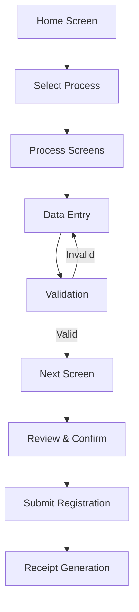

# Registration Client UI Specification Guide

## Table of Contents

1. [Overview](#overview)
2. [UI Component Catalog](#ui-component-catalog)
3. [Process & Task Configuration](#process--task-configuration)
4. [Screen Configuration](#screen-configuration)
5. [Field Specifications](#field-specifications)
6. [Navigation Flow](#navigation-flow)
7. [Validation Framework](#validation-framework)
8. [Best Practices](#best-practices)
9. [Common Use Cases](#common-use-cases)
10. [Troubleshooting](#troubleshooting)

## Overview

The Registration Client UI is **dynamically configured** using JSON specifications derived from the [ID Schema](../../../identity-management/id-schema.md). This approach ensures that registration forms are **country-specific** and **adaptable** to different identity requirements.

### Key Concepts

- **Process/Task**: A registration workflow (NEW, UPDATE, LOST, CORRECTION)
- **Screen**: A page within a process containing multiple fields
- **Field**: Individual input elements with specific data types and validations
- **Dynamic Rendering**: UI components are generated based on JSON specifications

## UI Component Catalog

### Control Types Reference

| Control Type | Description | Data Input | Use Cases |
|--------------|-------------|------------|-----------|
| `textbox` | Single-line text input | String data | Names, addresses, ID numbers |
| `fileupload` | File selection and upload | Document/image files | Certificates, photos, proof documents |
| `dropdown` | Selection from predefined options | Selected value from list | Country, state, document type |
| `checkbox` | Boolean selection | True/false | Consent acceptance, optional flags |
| `button` | Action trigger or selection | Click event/selected option | Language selection, navigation |
| `date` | Date picker with calendar | Date value | Date of birth, expiry dates |
| `ageDate` | Age-based date validation | Date with age constraints | DOB with min/max age limits |
| `html` | Custom HTML content display | Static/dynamic content | Terms & conditions, instructions |
| `biometrics` | Biometric capture interface | Biometric data | Fingerprints, iris, face capture |

### Field Types

| Field Type | Purpose | Configuration |
|------------|---------|---------------|
| `default` | Standard form fields | Static configuration in UI spec |
| `dynamic` | Runtime-configurable fields | Values loaded from master data |

### Data Types

| Type | Description | Examples |
|------|-------------|----------|
| `string` | Text data | Names, addresses, phone numbers |
| `simpleType` | Basic data types | Numbers, booleans, simple strings |
| `documentType` | Document uploads | Certificates, ID proofs, photos |
| `biometricsType` | Biometric data | Fingerprints, iris scans, face images |

## Process & Task Configuration

### Process Specification Structure

```json
{
    "id": "NEW",
    "order": 1,
    "flow": "NEW",
    "label": {
        "eng": "New Registration",
        "ara": "تسجيل جديد",
        "fra": "Nouvelle inscription"
    },
    "screens": [...],
    "caption": {...},
    "icon": "registration.png",
    "isActive": true,
    "autoSelectedGroups": ["Demographics"]
}
```

### Process Configuration Parameters

| Parameter | Type | Required | Description |
|-----------|------|----------|-------------|
| `id` | String | ✅ | Unique process identifier (NEW/UPDATE/LOST/CORRECTION) |
| `order` | Number | ✅ | Display order on home screen |
| `flow` | String | ✅ | Process flow type |
| `label` | Object | ✅ | Multi-language process labels |
| `screens` | Array | ✅ | Screen configurations for the process |
| `caption` | Object | ❌ | Tooltip text for process |
| `icon` | String | ❌ | Icon file name for process |
| `isActive` | Boolean | ✅ | Enable/disable process |
| `autoSelectedGroups` | Array | ❌ | Pre-selected field groups for UPDATE process |

### Supported Process Types

| Process ID | Flow | Description | Use Case |
|------------|------|-------------|----------|
| `NEW` | NEW | Initial registration | First-time identity creation |
| `UPDATE` | UPDATE | Update existing identity | Demographic/biometric updates |
| `LOST` | LOST | Replace lost identity | UIN card replacement |
| `BIOMETRIC_CORRECTION` | CORRECTION | Correct biometric data | Fix biometric capture errors |

## Screen Configuration

### Screen Specification Structure

```json
{
    "order": 1,
    "name": "demographics",
    "label": {
        "eng": "Demographic Details",
        "ara": "التفاصيل الديموغرافية",
        "fra": "Détails démographiques"
    },
    "caption": {...},
    "fields": [...],
    "layoutTemplate": null,
    "preRegFetchRequired": true,
    "additionalInfoRequestIdRequired": false,
    "active": true
}
```

### Screen Configuration Parameters

| Parameter | Type | Required | Description |
|-----------|------|----------|-------------|
| `order` | Number | ✅ | Screen sequence in process |
| `name` | String | ✅ | Unique screen identifier |
| `label` | Object | ✅ | Multi-language screen titles |
| `caption` | Object | ❌ | Screen description/tooltip |
| `fields` | Array | ✅ | Field configurations |
| `layoutTemplate` | String | ❌ | Custom layout template |
| `preRegFetchRequired` | Boolean | ❌ | Enable pre-registration data fetch |
| `additionalInfoRequestIdRequired` | Boolean | ❌ | Capture additional info request ID |
| `active` | Boolean | ✅ | Show/hide screen |

### Screen Types & Navigation

| Screen Type | Purpose | Navigation Behavior |
|-------------|---------|-------------------|
| **Data Entry** | Capture user information | Next/Previous buttons |
| **Review** | Display entered data for confirmation | Edit/Confirm options |
| **Document Upload** | File upload interface | Upload/Preview/Remove |
| **Biometric Capture** | Biometric data collection | Capture/Retry/Exception |

## Field Specifications

### Field Configuration Structure

```json
{
    "id": "fullName",
    "inputRequired": true,
    "type": "string",
    "controlType": "textbox",
    "minimum": 0,
    "maximum": 50,
    "description": "Full name of the applicant",
    "label": {
        "eng": "Full Name",
        "ara": "الاسم الكامل",
        "fra": "Nom complet"
    },
    "fieldType": "default",
    "format": "none",
    "validators": [...],
    "fieldCategory": "pvt",
    "required": true
}
```

### Essential Field Parameters

| Parameter | Type | Required | Description | Example |
|-----------|------|----------|-------------|---------|
| `id` | String | ✅ | Unique field identifier matching ID Schema | `"fullName"` |
| `inputRequired` | Boolean | ✅ | Whether UI input is needed | `true` |
| `type` | String | ✅ | Data type from ID Schema | `"string"` |
| `controlType` | String | ✅ | UI component type | `"textbox"` |
| `label` | Object | ✅ | Multi-language field labels | `{"eng": "Full Name"}` |
| `required` | Boolean | ✅ | Mandatory field flag | `true` |

### Advanced Field Parameters

| Parameter | Type | Description | Use Cases |
|-----------|------|-------------|-----------|
| `minimum` | Number | Minimum value/length | Date ranges, text length |
| `maximum` | Number | Maximum value/length | Age limits, character limits |
| `format` | String | Text case formatting | `"uppercase"`, `"lowercase"`, `"none"` |
| `validators` | Array | Validation rules | Regex patterns, custom validations |
| `fieldCategory` | String | Data sharing category | `"pvt"`, `"evidence"`, `"kyc"` |
| `alignmentGroup` | String | Horizontal field grouping | Layout arrangement |
| `visible` | Object | Conditional display logic | MVEL expressions |
| `group` | String | Field grouping for UPDATE process | Group-based updates |
| `transliterate` | Boolean | Auto-transliteration support | Multi-language names |

### Biometric Field Configuration

```json
{
    "id": "individualBiometrics",
    "type": "biometricsType",
    "controlType": "biometrics",
    "bioAttributes": [
        "leftEye", "rightEye", "rightIndex", "leftIndex", 
        "rightThumb", "leftThumb", "face"
    ],
    "conditionalBioAttributes": [
        {
            "ageGroup": "INFANT",
            "process": "ALL",
            "validationExpr": "face || (leftEye && rightEye)",
            "bioAttributes": ["face", "leftEye", "rightEye"]
        }
    ],
    "exceptionPhotoRequired": true
}
```

### Biometric Attributes Reference

| Attribute | Description | Age Applicability |
|-----------|-------------|-------------------|
| `face` | Facial photograph | All ages |
| `leftEye`, `rightEye` | Iris scans | All ages |
| `leftThumb`, `rightThumb` | Thumb fingerprints | Adults/Children |
| `leftIndex`, `rightIndex` | Index fingerprints | Adults/Children |
| `leftMiddle`, `rightMiddle` | Middle fingerprints | Adults/Children |
| `leftRing`, `rightRing` | Ring fingerprints | Adults/Children |
| `leftLittle`, `rightLittle` | Little fingerprints | Adults/Children |

## Navigation Flow

### User Journey Through Registration



### Navigation Controls

| Control | Function | Availability |
|---------|----------|--------------|
| **Next** | Move to next screen | After validation passes |
| **Previous** | Return to previous screen | All screens except first |
| **Home** | Return to home screen | All screens |
| **Save** | Save current progress | All data entry screens |
| **Submit** | Submit completed form | Final review screen |

### Screen Progression Logic

1. **Linear Flow**: Screens appear in `order` sequence
2. **Conditional Display**: Based on `visible` expressions
3. **Validation Gates**: Next screen unlocked after validation
4. **Group-based Navigation**: UPDATE process allows group selection

## Validation Framework

### Validator Configuration

```json
{
    "type": "regex",
    "validator": "^([0-9]{10,30})$",
    "arguments": [],
    "langCode": null,
    "errorCode": "UI_100001"
}
```

### Validation Types

| Type | Description | Configuration |
|------|-------------|---------------|
| `regex` | Regular expression validation | Pattern in `validator` field |
| `required` | Mandatory field check | `required: true` |
| `length` | String length validation | `minimum`/`maximum` values |
| `date` | Date range validation | Date constraints |
| `age` | Age-based validation | Age group calculations |

### Error Handling

| Error Code Format | Description | Example |
|-------------------|-------------|---------|
| `UI_1xxxxx` | Field validation errors | `UI_100001` - Invalid format |
| `UI_2xxxxx` | Screen validation errors | `UI_200001` - Missing required field |
| `UI_3xxxxx` | Process validation errors | `UI_300001` - Process not available |

### Custom Validation Examples

```json
// Phone number validation
{
    "type": "regex",
    "validator": "^[6-9]\\d{9}$",
    "errorCode": "INVALID_PHONE_NUMBER"
}

// Age validation for adults
{
    "type": "regex",
    "validator": "^(1[8-9]|[2-9]\\d|100)$",
    "errorCode": "INVALID_AGE_ADULT"
}
```

## Best Practices

### 1. Field Configuration

#### ✅ Do's
- **Use descriptive field IDs** that match ID Schema exactly
- **Provide comprehensive labels** in all supported languages
- **Set appropriate field categories** (`pvt`, `evidence`, `kyc`)
- **Configure proper validation** for data integrity
- **Use alignment groups** for logical field grouping

#### ❌ Don'ts
- Don't use generic field IDs like `field1`, `field2`
- Don't skip validation for critical fields
- Don't ignore multi-language requirements
- Don't use inappropriate control types for data

### 2. Screen Design

#### ✅ Recommended Patterns
```json
// Logical screen progression
{
    "screens": [
        {"order": 1, "name": "consent"},
        {"order": 2, "name": "demographics"},
        {"order": 3, "name": "documents"},
        {"order": 4, "name": "biometrics"},
        {"order": 5, "name": "review"}
    ]
}
```

#### ✅ Field Grouping Example
```json
// Horizontal alignment for related fields
{
    "alignmentGroup": "name_group",
    "fields": [
        {"id": "firstName", "alignmentGroup": "name_group"},
        {"id": "middleName", "alignmentGroup": "name_group"},
        {"id": "lastName", "alignmentGroup": "name_group"}
    ]
}
```

### 3. Process Configuration

#### ✅ Process Naming Convention
- Use **UPPERCASE** for process IDs
- Use **descriptive icons** for visual identification
- Set **logical order** for home screen display
- Enable **isActive** only for ready processes

### 4. Conditional Logic

#### ✅ Visibility Expression Example
```json
{
    "visible": {
        "engine": "MVEL",
        "expr": "identity.get('ageGroup') == 'ADULT' && identity.get('maritalStatus') == 'MARRIED'"
    }
}
```

#### ✅ Required Field Logic
```json
{
    "requiredOn": [
        {
            "engine": "MVEL",
            "expr": "identity.get('residencyStatus') == 'FOREIGNER'"
        }
    ]
}
```

## Common Use Cases

### 1. Age-Based Field Display

**Scenario**: Show spouse details only for married adults

```json
{
    "id": "spouseName",
    "visible": {
        "engine": "MVEL",
        "expr": "identity.get('ageGroup') == 'ADULT' && identity.get('maritalStatus') == 'MARRIED'"
    },
    "required": true
}
```

### 2. Document Type Configuration

**Scenario**: Configure proof of address document upload

```json
{
    "id": "proofOfAddress",
    "type": "documentType",
    "controlType": "fileupload",
    "subType": "POA",
    "validators": [
        {
            "type": "fileType",
            "validator": "pdf|jpg|png",
            "errorCode": "INVALID_FILE_TYPE"
        }
    ]
}
```

### 3. Biometric Exception Handling

**Scenario**: Configure fingerprint capture with exception support

```json
{
    "id": "fingerprints",
    "type": "biometricsType",
    "controlType": "biometrics",
    "bioAttributes": ["rightIndex", "leftIndex"],
    "exceptionPhotoRequired": true,
    "conditionalBioAttributes": [
        {
            "ageGroup": "ADULT",
            "process": "NEW",
            "validationExpr": "rightIndex || leftIndex",
            "bioAttributes": ["rightIndex", "leftIndex"]
        }
    ]
}
```

### 4. Dynamic Dropdown Configuration

**Scenario**: Country-based state selection

```json
{
    "id": "state",
    "type": "string",
    "controlType": "dropdown",
    "fieldType": "dynamic",
    "changeAction": "loadDistricts",
    "visible": {
        "engine": "MVEL",
        "expr": "identity.get('country') != null"
    }
}
```

### 5. Multi-Language Name Entry

**Scenario**: Name entry with transliteration

```json
{
    "id": "fullName",
    "type": "string",
    "controlType": "textbox",
    "transliterate": true,
    "format": "none",
    "validators": [
        {
            "type": "regex",
            "validator": "^[a-zA-Z\\s]{1,50}$",
            "langCode": "eng"
        }
    ]
}
```

## Troubleshooting

### Common Issues & Solutions

#### Field Not Displaying

**Problem**: Field configured but not visible
**Solutions**:
1. Check `visible` expression syntax
2. Verify `active` flag on screen
3. Confirm field `id` matches ID Schema
4. Validate `inputRequired` setting

#### Validation Not Working

**Problem**: Field accepts invalid data
**Solutions**:
1. Verify regex pattern syntax
2. Check `langCode` specificity
3. Confirm validator `type` is supported
4. Test with sample data

#### Biometric Capture Issues

**Problem**: Biometric fields not capturing data
**Solutions**:
1. Verify `bioAttributes` configuration
2. Check device connectivity
3. Confirm `exceptionPhotoRequired` setting
4. Validate age group conditions

#### Navigation Problems

**Problem**: Cannot proceed to next screen
**Solutions**:
1. Check required field completion
2. Verify validation rules pass
3. Confirm screen `order` sequence
4. Check conditional navigation logic

### Debug Checklist

- [ ] Field ID matches ID Schema exactly
- [ ] All required fields have values
- [ ] Validation expressions are syntactically correct
- [ ] Multi-language labels are complete
- [ ] Control type matches data type
- [ ] Conditional logic expressions are valid
- [ ] Screen order is sequential
- [ ] Process configuration is active

### Error Code Reference

| Error Pattern | Category | Resolution |
|---------------|----------|------------|
| `UI_1xxxxx` | Field validation | Check field configuration and input data |
| `UI_2xxxxx` | Screen validation | Verify screen-level requirements |
| `UI_3xxxxx` | Process validation | Check process configuration |
| `BIO_xxxxx` | Biometric errors | Verify device and biometric settings |
| `DOC_xxxxx` | Document errors | Check file type and upload settings |

## Advanced Configuration

### Custom HTML Fields

```json
{
    "id": "termsAndConditions",
    "controlType": "html",
    "templateName": "Registration Consent",
    "fieldCategory": "evidence",
    "required": true
}
```

### Location Hierarchy

```json
{
    "id": "address",
    "locationHierarchy": ["country", "state", "district", "city"],
    "controlType": "dropdown",
    "fieldType": "dynamic"
}
```

### Change Actions

```json
{
    "id": "country",
    "changeAction": "loadStates",
    "controlType": "dropdown"
}
```

This comprehensive guide provides the foundation for configuring and customizing Registration Client UI specifications to meet specific country requirements while maintaining consistency and usability.
