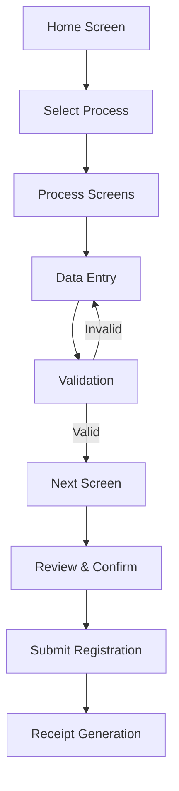

# UI Specifications

## Content

1. [Overview](#overview)
2. [Process & Task Configuration](#process--task-configuration)
3. [Screen Configuration](#screen-configuration)
4. [Field Specifications](#field-specifications)
5. [Navigation Flow](#navigation-flow)
6. [Validation Framework](#validation-framework)
7. [Best Practices](#best-practices)
8. [Common Use Cases](#common-use-cases)
9. [Troubleshooting](#troubleshooting)

## Overview

The Registration Client UI is **dynamically configured** using JSON specifications derived from the [ID Schema](../../../identity-management/id-schema.md). This approach ensures that registration forms are **country-specific** and **adaptable** to different identity requirements.

### Key Concepts

- **Process/Task**: A registration workflow (NEW, UPDATE, LOST, CORRECTION)
- **Screen**: A page within a process containing multiple fields
- **Field**: Individual input elements with specific data types and validations
- **Dynamic Rendering**: UI components are generated based on JSON specifications

## Process & Task Configuration

### Process Specification Structure

```json
{
    "id": "NEW",
    "order": 1,
    "flow": "NEW",
    "label": {
        "eng": "New Registration",
        "ara": "تسجيل جديد",
        "fra": "Nouvelle inscription"
    },
    "screens": [...],
    "caption": {...},
    "icon": "registration.png",
    "isActive": true,
    "autoSelectedGroups": ["Demographics"]
}
```

### Process Configuration Parameters

| Parameter | Type | Required | Description |
|-----------|------|----------|-------------|
| `id` | String |  | Unique process identifier (NEW/UPDATE/LOST/CORRECTION) |
| `order` | Number | Yes | Display order on home screen |
| `flow` | String | Yes | Process flow type |
| `label` | Object | Yes | Multi-language process labels |
| `screens` | Array | Yes | Screen configurations for the process |
| `caption` | Object | No | Tooltip text for process |
| `icon` | String | No | Icon file name for process |
| `isActive` | Boolean | Yes | Enable/disable process |
| `autoSelectedGroups` | Array | No | Pre-selected field groups for UPDATE process |

### Supported Process Types

| Process ID | Flow | Description | Use Case |
|------------|------|-------------|----------|
| `NEW` | NEW | Initial registration | First-time identity creation |
| `UPDATE` | UPDATE | Update existing identity | Demographic/biometric updates |
| `LOST` | LOST | Replace lost identity | UIN card replacement |
| `BIOMETRIC_CORRECTION` | CORRECTION | Correct biometric data | Fix biometric capture errors |

## Screen Configuration

### Screen Specification Structure

```json
{
    "order": 1,
    "name": "demographics",
    "label": {
        "eng": "Demographic Details",
        "ara": "التفاصيل الديموغرافية",
        "fra": "Détails démographiques"
    },
    "caption": {...},
    "fields": [...],
    "layoutTemplate": null,
    "preRegFetchRequired": true,
    "additionalInfoRequestIdRequired": false,
    "active": true
}
```

### Screen Configuration Parameters

| Parameter | Type | Required | Description |
|-----------|------|----------|-------------|
| `order` | Number | Yes | Screen sequence in process |
| `name` | String | Yes | Unique screen identifier |
| `label` | Object | Yes | Multi-language screen titles |
| `caption` | Object | No | Screen description/tooltip |
| `fields` | Array | Yes | Field configurations |
| `layoutTemplate` | String | No | Custom layout template |
| `preRegFetchRequired` | Boolean | No | Enable pre-registration data fetch |
| `additionalInfoRequestIdRequired` | Boolean | No | Capture additional info request ID |
| `active` | Boolean | Yes | Show/hide screen |

### Screen Types & Navigation

| Screen Type | Purpose | Navigation Behavior |
|-------------|---------|-------------------|
| **Data Entry** | Capture user information | Next/Previous buttons |
| **Review** | Display entered data for confirmation | Edit/Confirm options |
| **Document Upload** | File upload interface | Upload/Preview/Remove |
| **Biometric Capture** | Biometric data collection | Capture/Retry/Exception |

## Field Specifications

### Field Configuration Structure

```json
{
    "id": "fullName",
    "inputRequired": true,
    "type": "string",
    "controlType": "textbox",
    "minimum": 0,
    "maximum": 50,
    "description": "Full name of the applicant",
    "label": {
        "eng": "Full Name",
        "ara": "الاسم الكامل",
        "fra": "Nom complet"
    },
    "fieldType": "default",
    "format": "none",
    "validators": [...],
    "fieldCategory": "pvt",
    "required": true
}
```

### Essential Field Parameters

| Parameter | Type | Required | Description | Example |
|-----------|------|----------|-------------|---------|
| `id` | String | Yes | Unique field identifier matching ID Schema | `"fullName"` |
| `inputRequired` | Boolean | Yes | Whether UI input is needed | `true` |
| `type` | String | Yes | Data type from ID Schema | `"string"` |
| `controlType` | String | Yes | UI component type | `"textbox"` |
| `label` | Object | Yes | Multi-language field labels | `{"eng": "Full Name"}` |
| `required` | Boolean | Yes | Mandatory field flag | `true` |

### Control Types Reference

| Control Type | Description | Data Input | Use Cases |
|--------------|-------------|------------|-----------|
| `textbox` | Single-line text input | String data | Names, addresses, ID numbers |
| `fileupload` | File selection and upload | Document/image files | Certificates, photos, proof documents |
| `dropdown` | Selection from predefined options | Selected value from list | Country, state, document type |
| `checkbox` | Boolean selection | True/false | Consent acceptance, optional flags |
| `button` | Action trigger or selection | Click event/selected option | Language selection, navigation |
| `date` | Date picker with calendar | Date value | Date of birth, expiry dates |
| `ageDate` | Age-based date validation | Date with age constraints | DOB with min/max age limits |
| `html` | Custom HTML content display | Static/dynamic content | Terms & conditions, instructions |
| `biometrics` | Biometric capture interface | Biometric data | Fingerprints, iris, face capture |

### Field Types

| Field Type | Purpose | Configuration |
|------------|---------|---------------|
| `default` | Standard form fields | Static configuration in UI spec |
| `dynamic` | Runtime-configurable fields | Values loaded from master data |

### Data Types

| Type | Description | Examples |
|------|-------------|----------|
| `string` | Text data | Names, addresses, phone numbers |
| `simpleType` | Basic data types | Numbers, booleans, simple strings |
| `documentType` | Document uploads | Certificates, ID proofs, photos |
| `biometricsType` | Biometric data | Fingerprints, iris scans, face images |


### Advanced Field Parameters

| Parameter | Type | Description | Use Cases |
|-----------|------|-------------|-----------|
| `minimum` | Number | Minimum value/length | Date ranges, text length |
| `maximum` | Number | Maximum value/length | Age limits, character limits |
| `format` | String | Text case formatting | `"uppercase"`, `"lowercase"`, `"none"` |
| `validators` | Array | Validation rules | Regex patterns, custom validations |
| `fieldCategory` | String | Data sharing category | `"pvt"`, `"evidence"`, `"kyc"` |
| `alignmentGroup` | String | Horizontal field grouping | Layout arrangement |
| `visible` | Object | Conditional display logic | MVEL expressions |
| `group` | String | Field grouping for UPDATE process | Group-based updates |
| `transliterate` | Boolean | Auto-transliteration support | Multi-language names |

### Biometric Field Configuration

```json
{
    "id": "individualBiometrics",
    "type": "biometricsType",
    "controlType": "biometrics",
    "bioAttributes": [
        "leftEye", "rightEye", "rightIndex", "leftIndex", 
        "rightThumb", "leftThumb", "face"
    ],
    "conditionalBioAttributes": [
        {
            "ageGroup": "INFANT",
            "process": "ALL",
            "validationExpr": "face || (leftEye && rightEye)",
            "bioAttributes": ["face", "leftEye", "rightEye"]
        }
    ],
    "exceptionPhotoRequired": true
}
```

### Biometric Attributes Reference

| Attribute | Description | Age Applicability |
|-----------|-------------|-------------------|
| `face` | Facial photograph | All ages |
| `leftEye`, `rightEye` | Iris scans | All ages |
| `leftThumb`, `rightThumb` | Thumb fingerprints | Adults/Children |
| `leftIndex`, `rightIndex` | Index fingerprints | Adults/Children |
| `leftMiddle`, `rightMiddle` | Middle fingerprints | Adults/Children |
| `leftRing`, `rightRing` | Ring fingerprints | Adults/Children |
| `leftLittle`, `rightLittle` | Little fingerprints | Adults/Children |

## Navigation Flow

### User Journey Through Registration



### Navigation Controls

| Control | Function | Availability |
|---------|----------|--------------|
| **Next** | Move to next screen | After validation passes |
| **Previous** | Return to previous screen | All screens except first |
| **Home** | Return to home screen | All screens |
| **Save** | Save current progress | All data entry screens |
| **Submit** | Submit completed form | Final review screen |

### Screen Progression Logic

1. **Linear Flow**: Screens appear in `order` sequence
2. **Conditional Display**: Based on `visible` expressions
3. **Validation Gates**: Next screen unlocked after validation
4. **Group-based Navigation**: UPDATE process allows group selection

## Validation Framework

### Validator Configuration

```json
{
    "type": "regex",
    "validator": "^([0-9]{10,30})$",
    "arguments": [],
    "langCode": null,
    "errorCode": "UI_100001"
}
```

### Validation Types

| Type | Description | Configuration |
|------|-------------|---------------|
| `regex` | Regular expression validation | Pattern in `validator` field |
| `required` | Mandatory field check | `required: true` |
| `length` | String length validation | `minimum`/`maximum` values |
| `date` | Date range validation | Date constraints |
| `age` | Age-based validation | Age group calculations |

### Error Handling

| Error Code Format | Description | Example |
|-------------------|-------------|---------|
| `UI_1xxxxx` | Field validation errors | `UI_100001` - Invalid format |
| `UI_2xxxxx` | Screen validation errors | `UI_200001` - Missing required field |
| `UI_3xxxxx` | Process validation errors | `UI_300001` - Process not available |

### Custom Validation Examples

```json
// Phone number validation
{
    "type": "regex",
    "validator": "^[6-9]\\d{9}$",
    "errorCode": "INVALID_PHONE_NUMBER"
}

// Age validation for adults
{
    "type": "regex",
    "validator": "^(1[8-9]|[2-9]\\d|100)$",
    "errorCode": "INVALID_AGE_ADULT"
}
```

## Best Practices

### 1. Field Configuration

#### Do's
- **Use descriptive field IDs** that match ID Schema exactly
- **Provide comprehensive labels** in all supported languages
- **Set appropriate field categories** (`pvt`, `evidence`, `kyc`)
- **Configure proper validation** for data integrity
- **Use alignment groups** for logical field grouping

#### Don'ts
- Don't use generic field IDs like `field1`, `field2`
- Don't skip validation for critical fields
- Don't ignore multi-language requirements
- Don't use inappropriate control types for data

### 2. Screen Design

#### Recommended Patterns
```json
// Logical screen progression
{
    "screens": [
        {"order": 1, "name": "consent"},
        {"order": 2, "name": "demographics"},
        {"order": 3, "name": "documents"},
        {"order": 4, "name": "biometrics"},
        {"order": 5, "name": "review"}
    ]
}
```

#### Field Grouping Example
```json
// Horizontal alignment for related fields
{
    "alignmentGroup": "name_group",
    "fields": [
        {"id": "firstName", "alignmentGroup": "name_group"},
        {"id": "middleName", "alignmentGroup": "name_group"},
        {"id": "lastName", "alignmentGroup": "name_group"}
    ]
}
```

### 3. Process Configuration

#### Process Naming Convention
- Use **UPPERCASE** for process IDs
- Use **descriptive icons** for visual identification
- Set **logical order** for home screen display
- Enable **isActive** only for ready processes

### 4. Conditional Logic

#### Visibility Expression Example
```json
{
    "visible": {
        "engine": "MVEL",
        "expr": "identity.get('ageGroup') == 'ADULT' && identity.get('maritalStatus') == 'MARRIED'"
    }
}
```

#### Required Field Logic
```json
{
    "requiredOn": [
        {
            "engine": "MVEL",
            "expr": "identity.get('residencyStatus') == 'FOREIGNER'"
        }
    ]
}
```

## Common Use Cases

### 1. Age-Based Field Display

**Scenario**: Show spouse details only for married adults

```json
{
    "id": "spouseName",
    "visible": {
        "engine": "MVEL",
        "expr": "identity.get('ageGroup') == 'ADULT' && identity.get('maritalStatus') == 'MARRIED'"
    },
    "required": true
}
```

### 2. Document Type Configuration

**Scenario**: Configure proof of address document upload

```json
{
    "id": "proofOfAddress",
    "type": "documentType",
    "controlType": "fileupload",
    "subType": "POA",
    "validators": [
        {
            "type": "fileType",
            "validator": "pdf|jpg|png",
            "errorCode": "INVALID_FILE_TYPE"
        }
    ]
}
```

### 3. Biometric Exception Handling

**Scenario**: Configure fingerprint capture with exception support

```json
{
    "id": "fingerprints",
    "type": "biometricsType",
    "controlType": "biometrics",
    "bioAttributes": ["rightIndex", "leftIndex"],
    "exceptionPhotoRequired": true,
    "conditionalBioAttributes": [
        {
            "ageGroup": "ADULT",
            "process": "NEW",
            "validationExpr": "rightIndex || leftIndex",
            "bioAttributes": ["rightIndex", "leftIndex"]
        }
    ]
}
```

### 4. Dynamic Dropdown Configuration

**Scenario**: Country-based state selection

```json
{
    "id": "state",
    "type": "string",
    "controlType": "dropdown",
    "fieldType": "dynamic",
    "changeAction": "loadDistricts",
    "visible": {
        "engine": "MVEL",
        "expr": "identity.get('country') != null"
    }
}
```

### 5. Multi-Language Name Entry

**Scenario**: Name entry with transliteration

```json
{
    "id": "fullName",
    "type": "string",
    "controlType": "textbox",
    "transliterate": true,
    "format": "none",
    "validators": [
        {
            "type": "regex",
            "validator": "^[a-zA-Z\\s]{1,50}$",
            "langCode": "eng"
        }
    ]
}
```

## Troubleshooting

### Common Issues & Solutions

#### Field Not Displaying

**Problem**: Field configured but not visible
**Solutions**:
1. Check `visible` expression syntax
2. Verify `active` flag on screen
3. Confirm field `id` matches ID Schema
4. Validate `inputRequired` setting

#### Validation Not Working

**Problem**: Field accepts invalid data
**Solutions**:
1. Verify regex pattern syntax
2. Check `langCode` specificity
3. Confirm validator `type` is supported
4. Test with sample data

#### Biometric Capture Issues

**Problem**: Biometric fields not capturing data
**Solutions**:
1. Verify `bioAttributes` configuration
2. Check device connectivity
3. Confirm `exceptionPhotoRequired` setting
4. Validate age group conditions

#### Navigation Problems

**Problem**: Cannot proceed to next screen
**Solutions**:
1. Check required field completion
2. Verify validation rules pass
3. Confirm screen `order` sequence
4. Check conditional navigation logic

### Debug Checklist

- [ ] Field ID matches ID Schema exactly
- [ ] All required fields have values
- [ ] Validation expressions are syntactically correct
- [ ] Multi-language labels are complete
- [ ] Control type matches data type
- [ ] Conditional logic expressions are valid
- [ ] Screen order is sequential
- [ ] Process configuration is active

### Error Code Reference

| Error Pattern | Category | Resolution |
|---------------|----------|------------|
| `UI_1xxxxx` | Field validation | Check field configuration and input data |
| `UI_2xxxxx` | Screen validation | Verify screen-level requirements |
| `UI_3xxxxx` | Process validation | Check process configuration |
| `BIO_xxxxx` | Biometric errors | Verify device and biometric settings |
| `DOC_xxxxx` | Document errors | Check file type and upload settings |

## Advanced Configuration

### Custom HTML Fields

```json
{
    "id": "termsAndConditions",
    "controlType": "html",
    "templateName": "Registration Consent",
    "fieldCategory": "evidence",
    "required": true
}
```

### Location Hierarchy

```json
{
    "id": "address",
    "locationHierarchy": ["country", "state", "district", "city"],
    "controlType": "dropdown",
    "fieldType": "dynamic"
}
```

### Change Actions

```json
{
    "id": "country",
    "changeAction": "loadStates",
    "controlType": "dropdown"
}
```

This comprehensive guide provides the foundation for configuring and customizing Registration Client UI specifications to meet specific country requirements while maintaining consistency and usability.


<!--

## Overview

The registration UI forms are rendered using respective UI specification JSON. This is derived from the [ID Schema](../../../identity-management/id-schema.md) defined by a country. Here, we would be discussing about the properties used in the UI specification of Registration Client.

In the Registration Client, currently, Registration Tasks(process) forms are configurable using the UI specifications.

Each process has multiple screens and each screen is rendered with one or more fields.

## Process/ Task spec JSON template

```
{
    "id": "<NEW/UPDATE/LOST/BIOMETRIC_CORRECTION process name as passed in the packet>",
    //order in which the process is displayed on the registration client home screen
    "order": 1,
    "flow": "<NEW/UPDATE/LOST/CORRECTION>",
    //Multi-lingual labels displayed based on the logged in language
    "label": {
        "eng": "Registration",
        "ara": "تسجيل",
        "fra": "Inscription"
    },
    //screen details - follows screen spec structure
    "screens": [
        {}
    ],
    //caption displays on-hover content
    "caption": {
        "eng": "Registration",
        "ara": "تسجيل",
        "fra": "Inscription"
    },
    //icon is the symbol that appears before the process label
    "icon": "registration.png",
    "isActive": true,
    //group names that should be by default selected during UDPATE UIN process
    "autoSelectedGroups": [
        ""
    ]
}
```

## Screen spec JSON template

```
    //Order of the screen in registration page
    "order": 1,
    "name": "<unique identifier for the screen>",
    "label": {
        "ara": "شاشة عينة",
        "fra": "Exemple d'écran",
        "eng": "Sample screen"
    },
    "caption": {
        "ara": "شاشة عينة",
        "fra": "Exemple d'écran",
        "eng": "Sample screen"
    },
    //field details - follows field spec structure
    "fields": [
        {}
    ],
    "layoutTemplate": null,
    //displays field to provide pre-reg application ID, data fetched from pre-reg application will be pre-filled in the current registration form
    "preRegFetchRequired": true,
    //enable below flag to capture additionalInfo request ID , applicable only during correction process
    "additionalInfoRequestIdRequired": false,
    //show or hide screens 
    "active": true
}
```

## Field spec JSON template

```
{
    "id": "<Unique identifier for the field, must be same as that described in the ID Schema>",
    //inputRequired is used to identify if UI input is needed or not
    "inputRequired": true,
    //type defines the datatype of the field, must be same as that is defined in the ID Schema
    "type": "<string/simpleType/documentType/biometricsType>",
    "controlType": "textbox/fileupload/dropdown/checkbox/button/date/ageDate/html/biometrics",
    //minimum- applicable only for date controlType(defined in days)
    "minimum": 0,
    //maximum- applicable only for date controlType(defined in days)
    "maximum": 365,
    "description": "<Field description>",
    "label": {
        "ara": "حقل العينة",
        "fra": "Exemple de champ",
        "eng": "Sample Field"
    },
    //fieldType is used to identify if it is a dynamic field
    "fieldType": "<default/dynamic>",
    //to validate the format should be in upper or lower case
    "format": "<lowercase/uppercase/none>",
    //list of validators for the field
    "validators": [
        {
            //type of validation engine (currently, only regex is supported)
            "type": "regex",
            //expression for the validation
            "validator": "^([0-9]{10,30})$",
            //list of arguments needed for the validator
            "arguments": [],
            //if null, its applicable for all languages, else validator expression can be provided for each langCode
            "langCode": null,
            /*error code to be used to display specific error message, if null, generic validation error message is displayed
                      There error codes must be configured in registration client i18n files*/
            "errorCode": "UI_100001"
        }
    ],
    //determines sharing and longevity policies applicable as defined in ID Schema
    "fieldCategory": "<pvt/evidence/kyc>",
    "alignmentGroup": "<fields belonging to same alignment group are placed horizontally next to each other>",
    //determines when to display and hide the field(set null if the field has to be displayed always)
    "visible": {
        "engine": "MVEL",
        "expr": "identity.get('ageGroup') == 'INFANT' && (identity.get('introducerRID') == nil || identity.get('introducerRID') == empty)"
    },
    "contactType": null,
    //used to group together the list of fields(only applicable in the Update UIN process)
    "group": "<grouping used in update UIN process>",
    "groupLabel": {
        "eng": "Sample group",
        "ara": "مجموعة العينة",
        "fra": "Groupe d'échantillons"
    },
    /*on change of the field value, configured Action will be triggered on other fields
                  Change action handlers should be implemented in registration client*/
    "changeAction": null,
    //enable or disable auto-transliteration
    "transliterate": false,
    /*provide the templateName(applicable only for html controlType fields)
          These templates should be configured in templates table*/
    "templateName": null,
    "fieldLayout": null,
    "locationHierarchy": null,
    //On any biometric exception, Need to capture exception photo as proof if the below flag is enabled
    "exceptionPhotoRequired": true,
    /*applicable only for BiometricsType field, defines the list of attributes to be captured
          All the supported biometric attributes are listed down for reference*/
    "bioAttributes": [
        "leftEye",
        "rightEye",
        "rightIndex",
        "rightLittle",
        "rightRing",
        "rightMiddle",
        "leftIndex",
        "leftLittle",
        "leftRing",
        "leftMiddle",
        "leftThumb",
        "rightThumb",
        "face"
    ],
    //capture of above mentioned bioAttributes can be conditionally mandated based on age group
    "conditionalBioAttributes": [
        {
            "ageGroup": "INFANT",
            "process": "ALL",
            "validationExpr": "face || (leftEye && rightEye)",
            "bioAttributes": [
                "face",
                "leftEye",
                "rightEye"
            ]
        }
    ],
    //set true/false to mark the field as mandatory or optional
    "required": true,
    //if requiredOn is defined, the evaluation result of requiredOn.expr takes the priority over "required" attribute
    "requiredOn": [
        {
            "engine": "MVEL",
            "expr": "identity.get('ageGroup') == 'INFANT' && (identity.get('introducerRID') == nil || identity.get('introducerRID') == empty)"
        }
    ],
    //used to identify the type of field
    "subType": "<document types / applicant / heirarchy level names>"
}
```

### Sample correction process SPEC: Biometric Correction

```
{
   "id": "BIOMETRIC_CORRECTION",
   "order": 4,
   "flow": "CORRECTION"
   "label": {
       "eng": "Biometric correction",
       "ara": "التصحيح البيومتري",
       "fra": "Correction biométrique"
   },
   "screens": [
       {
           "order": 1,
           "name": "consentdet",
           "label": {
               "ara": "موافقة",
               "fra": "Consentement",
               "eng": "Consent"
           },
           "caption": {
               "ara": "موافقة",
               "fra": "Consentement",
               "eng": "Consent"
           },
           "fields": [
               {
                   "id": "consentText",
                   "inputRequired": true,
                   "type": "simpleType",
                   "minimum": 0,
                   "maximum": 0,
                   "description": "Consent",
                   "label": {},
                   "controlType": "html",
                   "fieldType": "default",
                   "format": "none",
                   "validators": [],
                   "fieldCategory": "evidence",
                   "alignmentGroup": null,
                   "visible": null,
                   "contactType": null,
                   "group": "consentText",
                   "groupLabel": null,
                   "changeAction": null,
                   "transliterate": false,
                   "templateName": "Registration Consent",
                   "fieldLayout": null,
                   "locationHierarchy": null,
                   "conditionalBioAttributes": null,
                   "required": true,
                   "bioAttributes": null,
                   "requiredOn": [],
                   "subType": "consentText"
               },
               {
                   "id": "consent",
                   "inputRequired": true,
                   "type": "string",
                   "minimum": 0,
                   "maximum": 0,
                   "description": "consent accepted",
                   "label": {
                       "ara": "الاسم الكامل الكامل الكامل",
                       "fra": "J'ai lu et j'accepte les termes et conditions pour partager mes PII",
                       "eng": "I have read and accept terms and conditions to share my PII"
                   },
                   "controlType": "checkbox",
                   "fieldType": "default",
                   "format": "none",
                   "validators": [],
                   "fieldCategory": "evidence",
                   "alignmentGroup": null,
                   "visible": null,
                   "contactType": null,
                   "group": "consent",
                   "groupLabel": null,
                   "changeAction": null,
                   "transliterate": false,
                   "templateName": null,
                   "fieldLayout": null,
                   "locationHierarchy": null,
                   "conditionalBioAttributes": null,
                   "required": true,
                   "bioAttributes": null,
                   "requiredOn": [],
                   "subType": "consent"
               },
               {
                   "id": "preferredLang",
                   "inputRequired": true,
                   "type": "string",
                   "minimum": 0,
                   "maximum": 0,
                   "description": "user preferred Language",
                   "label": {
                       "ara": "لغة الإخطار",
                       "fra": "Langue de notification",
                       "eng": "Notification Langauge"
                   },
                   "controlType": "button",
                   "fieldType": "dynamic",
                   "format": "none",
                   "validators": [],
                   "fieldCategory": "pvt",
                   "alignmentGroup": "group1",
                   "visible": null,
                   "contactType": null,
                   "group": "PreferredLanguage",
                   "groupLabel": null,
                   "changeAction": null,
                   "transliterate": false,
                   "templateName": null,
                   "fieldLayout": null,
                   "locationHierarchy": null,
                   "conditionalBioAttributes": null,
                   "required": true,
                   "bioAttributes": null,
                   "requiredOn": [],
                   "subType": "preferredLang"
               }
           ],
           "layoutTemplate": null,
           "preRegFetchRequired": false,
           "additionalInfoRequestIdRequired": false,
           "active": false
       },
       {
           "order": 2,
           "name": "BiometricDetails",
           "label": {
               "ara": "التفاصيل البيومترية",
               "fra": "Détails biométriques",
               "eng": "Biometric Details"
           },
           "caption": {
               "ara": "التفاصيل البيومترية",
               "fra": "Détails biométriques",
               "eng": "Biometric Details"
           },
           "fields": [
               {
                   "id": "individualBiometrics",
                   "inputRequired": true,
                   "type": "biometricsType",
                   "minimum": 0,
                   "maximum": 0,
                   "description": "",
                   "label": {
                       "ara": "القياسات الحيوية الفردية",
                       "fra": "Applicant Biometrics",
                       "eng": "Applicant Biometrics"
                   },
                   "controlType": "biometrics",
                   "fieldType": "default",
                   "format": "none",
                   "validators": [],
                   "fieldCategory": "pvt",
                   "alignmentGroup": null,
                   "visible": null,
                   "contactType": null,
                   "group": "Biometrics",
                   "groupLabel": null,
                   "changeAction": null,
                   "transliterate": false,
                   "templateName": null,
                   "fieldLayout": null,
                   "locationHierarchy": null,
                   "conditionalBioAttributes": [
                       {
                           "ageGroup": "INFANT",
                           "process": "ALL",
                           "validationExpr": "face",
                           "bioAttributes": [
                               "face"
                           ]
                       }
                   ],
                   "required": true,
                   "bioAttributes": [
                       "leftEye",
                       "rightEye",
                       "rightIndex",
                       "rightLittle",
                       "rightRing",
                       "rightMiddle",
                       "leftIndex",
                       "leftLittle",
                       "leftRing",
                       "leftMiddle",
                       "leftThumb",
                       "rightThumb",
                       "face"
                   ],
                   "requiredOn": [],
                   "subType": "applicant"
               },
               {
                   "id": "proofOfException",
                   "inputRequired": false,
                   "type": "documentType",
                   "minimum": 0,
                   "maximum": 0,
                   "description": "proofOfException",
                   "label": {
                       "ara": "إثبات الاستثناء",
                       "fra": "Exception Proof",
                       "eng": "Exception Proof"
                   },
                   "controlType": "fileupload",
                   "fieldType": "default",
                   "format": "none",
                   "validators": [],
                   "fieldCategory": "evidence",
                   "alignmentGroup": null,
                   "visible": null,
                   "contactType": null,
                   "group": "Documents",
                   "groupLabel": null,
                   "changeAction": null,
                   "transliterate": false,
                   "templateName": null,
                   "fieldLayout": null,
                   "locationHierarchy": null,
                   "conditionalBioAttributes": null,
                   "required": false,
                   "bioAttributes": null,
                   "requiredOn": [],
                   "subType": "POE"
               }
           ],
           "layoutTemplate": null,
           "preRegFetchRequired": false,
           "additionalInfoRequestIdRequired": true,
           "active": false
       }
   ],
   "caption": {
       "eng": "Biometric correction",
       "ara": "التصحيح البيومتري",
       "fra": "Correction biométrique"
   },
   "icon": "UINUpdate.png",
   "isActive": true,
   "autoSelectedGroups": null
}
```
-->