# ABIS Partner Onboarding by Partner Admin

### Overview

This guide shows how Partner Admins can **Onboard a ABIS Partner in PMS**. Onboarding includes **Creating a ABIS Partner**, **Managing ABIS Partner's Partner Certificates**, **Linking a Data Share Policy** using **PMS portal**.

### What is ABIS Partner?

An **ABIS Partner** refers to an **Automated Biometric Identification System (ABIS) Partner** in the MOSIP ecosystem.An **ABIS Partner** is an external system or vendor integrated with MOSIP that provides **biometric de-duplication and identification services**. Its primary role is to process biometric data (such as fingerprints, iris, or face) and determine whether a biometric record already exists in the system.

### Key Responsibilities of an ABIS Partner

- Perform **1:N biometric de-duplication** during resident enrollment

- Support **biometric matching and identification**

- Return **match/no-match** and candidate lists to MOSIP
### Who can 'Onboard a ABIS Partner' and What you need to know?

Partner Admins with the appropriate credentials can onboard ABIS Partners in PMS. Before starting, ensure CA certificates are uploaded and required policy groups are created.

- You should be logged in with **Partner Admin** credentials (Role: Partner Admin).

- Root and Intermediate CA certificates should have already been uploaded to the PMS **Certificate Trust Store** (these are required before uploading partner CA Signed Certificates).

- Policy Manager should already have created the required **data share** **policy** (such that they can be selected later). See the Policies creation docs- [Policy Manager](https://docs.mosip.io/1.2.0/id-lifecycle-management/support-systems/partner-management-services/functional-overview/policy-manager#policies-has-following-tabs).

### Interface Overview

You (As a Partner Admin) can log into the PMS portal using your credentials. After login, you see the dashboard or left navigation panel, where you click the Partners card to access the 'List of Partners' tabular view.

1. Log into the PMS portal with your Partner Admin account.

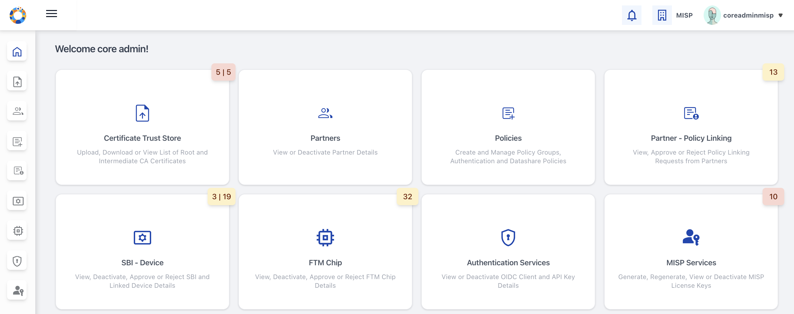

2. Click on **Partners** card (from the left navigation panel or dashboard itself). You will be redirected to 'List of Partners' page (tabular view).
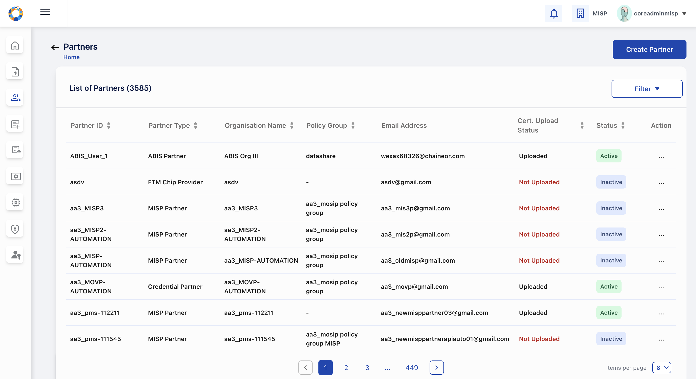

### Onboarding ABIS Partners

Onboarding includes following:

- **Creating a ABIS Partner**

- **Manage ABIS Partner's Partner Certificate**

- **ABIS Partner Policy Linking**

#### Create a ABIS Partner

1. Go to Dashboard > Partner, A 'List View' appears which shows all the partners.

2. Click **Create Partner** button placed on top-right (if partner records already exist) or positioned at the centre of the screen (if no records exist).

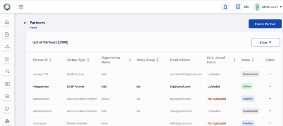

3. Enter details in the **Create Partner** form:

1. Select Partner Type as '**ABIS Partner'** from the dropdown.

2. Enter Address, Organization Name, Email Address, and other mandatory fields and select a policy group.

Note: Ensure that the Organization name matches the one in the 'CA Signed Certificate' that will be uploaded later.

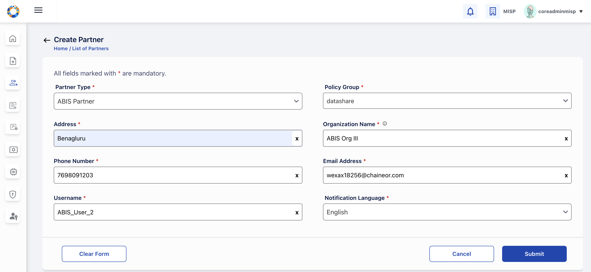

4. Click **Save/Submit**. A confirmation message appears on successful creation.

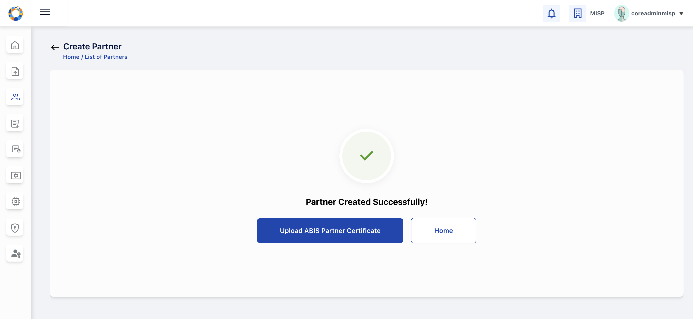

Note: On the 'Success/Confirmation' screen itself, you are provided with an option to upload CA-Signed partner certificate or return to 'Home page'.

5. Click **Upload Certificate** to proceed with uploading the 'CA Signed Partner Certificate'.

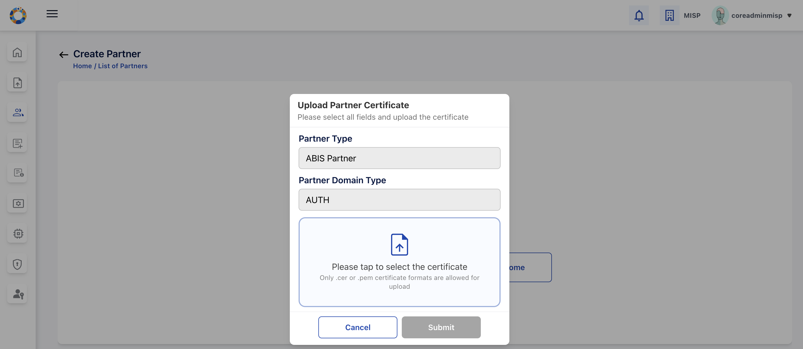

#### Upload 'CA Signed Partner Certificate' (First time upload)

Either you can upload the partner certificate right after ABIS partner creation as explained in Create a ABIS Partner(Link to Create ABIS Partner) or you can do it later from the **'List of Partners'** page.

1. Go to Dashboard > ABIS Partner, A 'List View' appears which shows all the partners.

2. Locate the newly created ABIS Partner(inactive status) and choose **Upload Certificate** from the action menu, The **Upload Partner Certificate** popup opens.

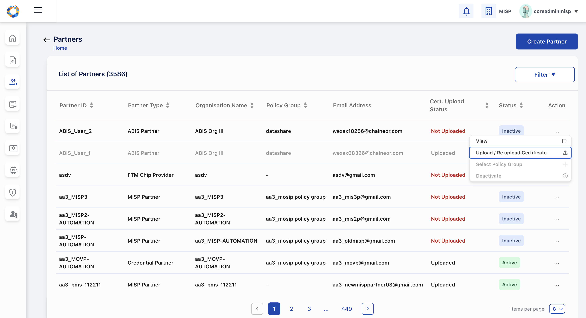

3. Click the upload area and select the 'CA Signed Certificate' file from local folder in `.cer` or `.pem` format.
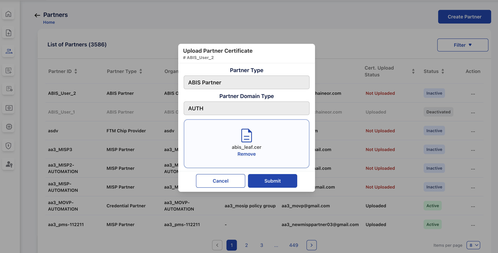

4. Verify the certificate details by clicking **Submit**.

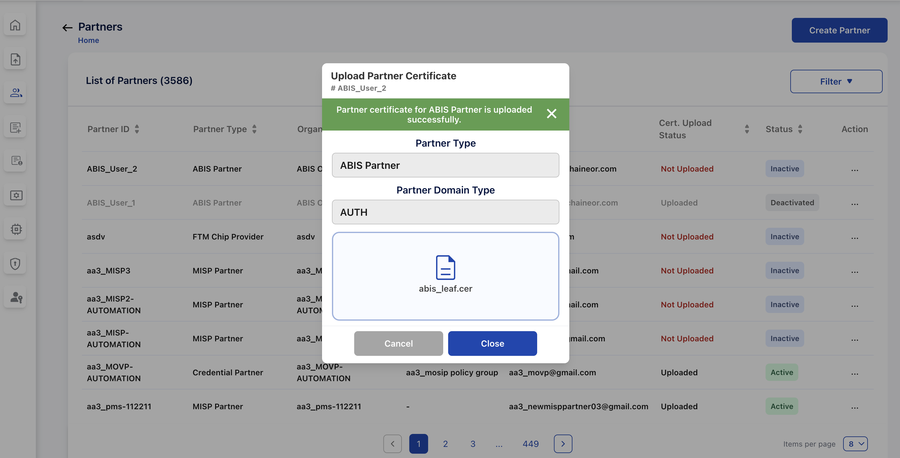

5. On success, you (admin) receives a confirmation and the partner row should show the certificate upload date/status along with status as 'ACTIVE'.
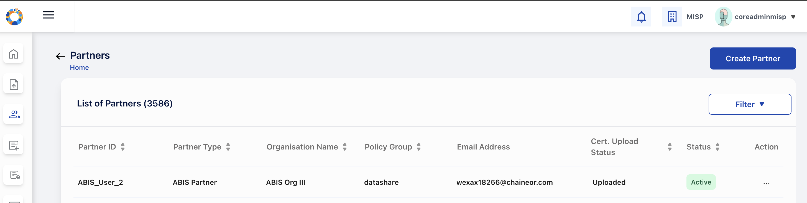

**Note:**
If Root/Intermediate CA is missing, the system will reject the upload. Therefore ensure that the CA certificates are uploaded first in Certificate Trust Store.

#### Re-Upload Partner Certificate (Replacing an existing certificate)

You can replace an existing partner certificate when it is expiring or has been re-issued. This ensures the partner remains compliant and can continue to use PMS services without interruption.

1. Go to Dashboard > Partners, A 'List View' appears which shows all the partners.

2. From Partners table action menu, select **Re-Upload Certificate**.

3. Follow the same upload flow as in [Upload 'CA Signed Partner Certificate' (First time upload)](https://docs.mosip.io/1.2.0/id-lifecycle-management/support-systems/partner-management-services/functional-overview/misp-partner-onboarding#upload-ca-signed-partner-certificate-first-time-upload) and click **Submit**.

4. The new certificate details and updated certificate status is displayed in the Partners list.

#### Partner Policy Linking (requesting and approving ABIS policies)

1. Go to **Partner Policy Linking** (dashboard card or from left side menu).

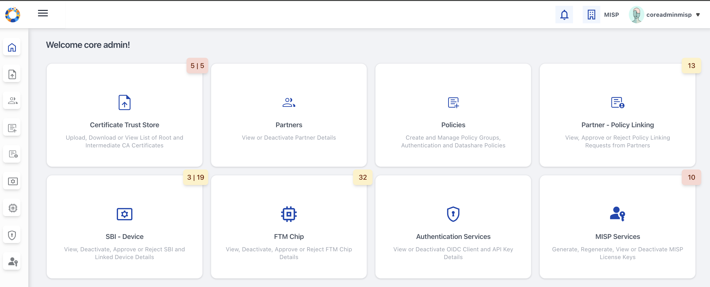

2. Click ‘**Request Policy’** to submit a policy request for the selected **ABIS Partner ID**.\
Once the Partner ID is selected, the **Policy Group** associated during partner creation is **auto-populated**, after which an applicable policy can be selected and submitted.

**Note:** For **ABIS Partners**, only **Data Share Policies** are applicable.The available policies are automatically filtered based on the Policy Group linked to the selected Partner ID.

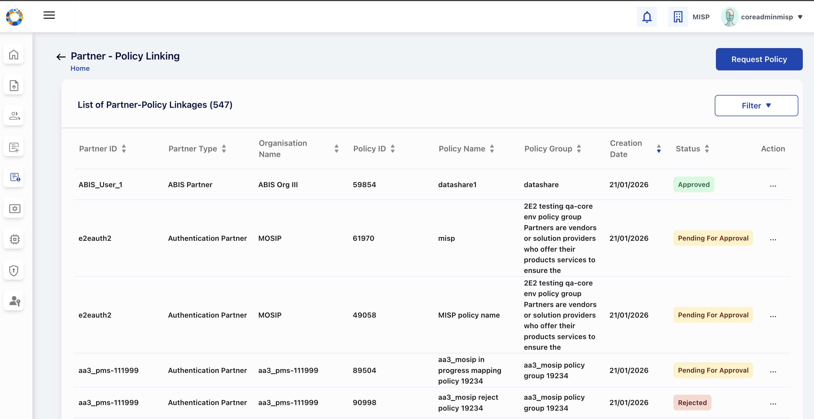

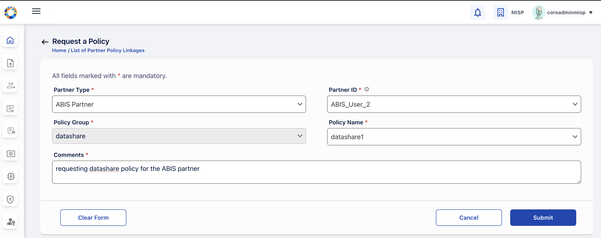

3. On clicking **Submit**, the policy request is submitted successfully with an option to **'Approve'** the policy right Away.

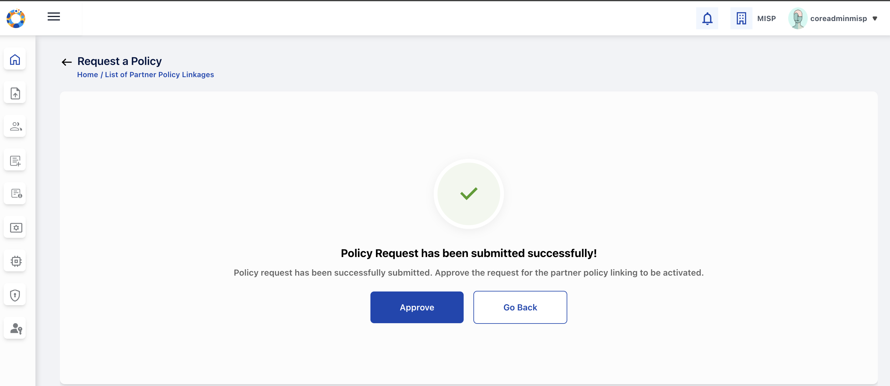

4. If user choses not to **‘Approve'** the policy right after submitting the request the request policy is added to the partner policy linking list page with status **'Pending for Approval’**
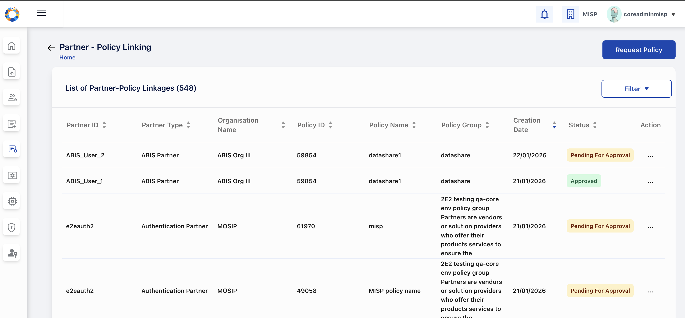

5. Approve the requests after requesting policy, by navigating to the list of all policy requests and selecting 'Approve/Reject' from the action menu against each request. (View details to inspect the mapping and comments before acting).

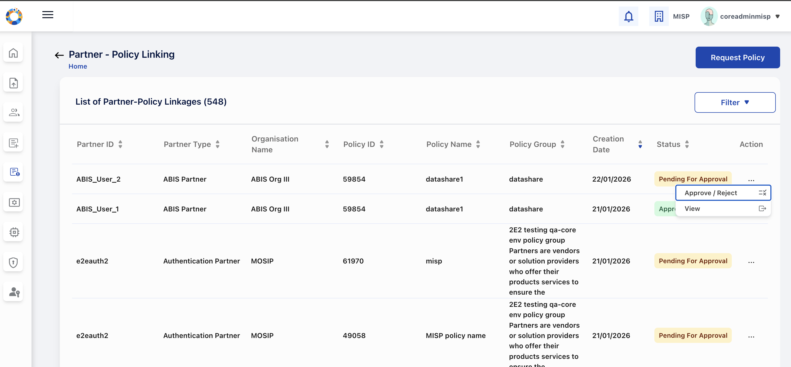

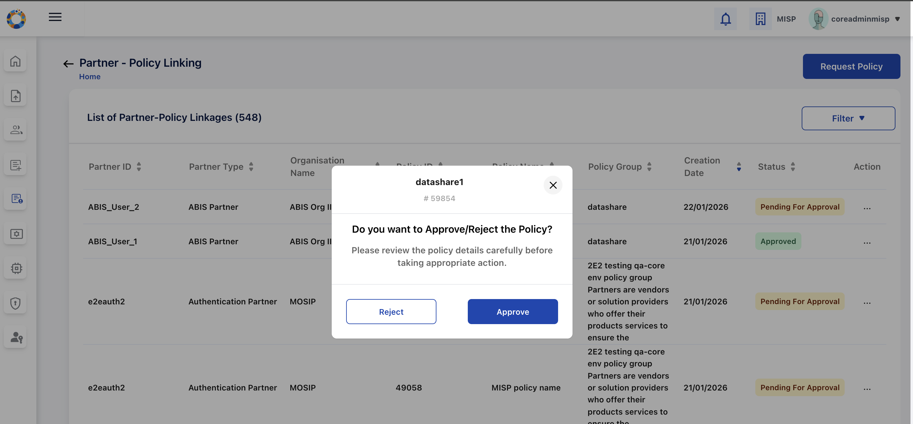

6. Upon successful approval the policy request is approved and policy request status is changed to **'Approved'**

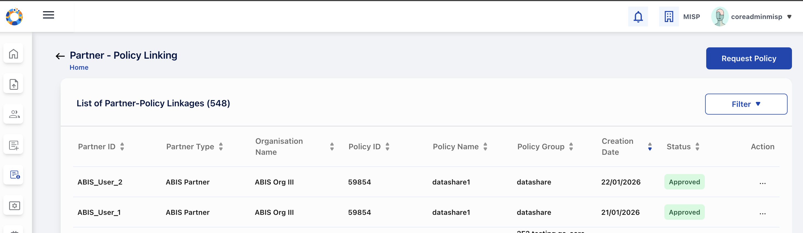

**Success check:** Approved partner-policy links will appear in the partner's policy list.

#### Deactivate Partner

You can deactivate the entire ABIS Partner (prevents future requests & license generation).

1. Go to **Partners**. From Partners list, open the action menu → **Deactivate Partner**.

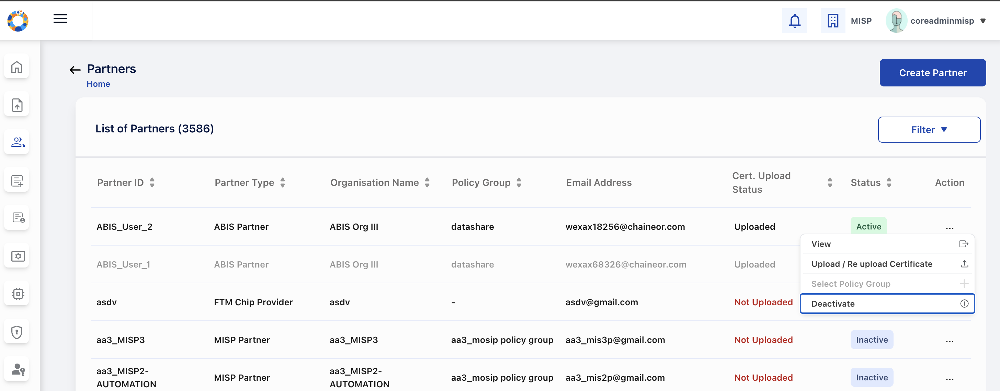

Upon confirmation to deactivate the status is changed to **'Deactivated'** and note the consequences (deactivated ABIS partner cannot request policies )
