# MISP Partner Onboarding

## Overview

This guide shows how Partner Admins can **Onboard a MISP Partner in PMS**. Onboarding includes **Creating a MISP Partner**, **Managing MISP Partner's Partner Certificates**, **Linking a Policy Group**, and **Generating/Managing MISP License Keys** using **PMS portal**.

## What is MISP Partner?

MISP stands for MOSIP Infrastructure Service Provider. It acts as a secure intermediary that facilitates communication between external partners (such as banks, telecoms, or government agencies) and the MOSIP system. The MISP ensures that requests made by these external partners are routed securely and efficiently to the appropriate services within MOSIP, such as the ID Authentication Service.

## Who can 'Onboard a MISP Partner' and What you need to know?

Partner Admins with the appropriate credentials can onboard MISP Partners in PMS. Before starting, ensure CA certificates are uploaded and required policy groups are created.

* You should be logged in with **Partner Admin** credentials (Role: Partner Admin).
* Root and Intermediate CA certificates should have already been uploaded to the PMS **Certificate Trust Store** (these are required before uploading partner CA Signed Certificates).
* Policy Manager should already have created the required **Policy Group** and **MISP policies** (such that they can be selected later). See the Policy Group & MISP Policy creation docs- [Policy Manager](policy-manager/#policies)

## Interface Overview

You (As a Partner Admin) can log into the PMS portal using your credentials. After login, you see the dashboard or left navigation panel, where you click the Partners card to access the 'List of Partners' tabular view.

1. Log into the PMS portal with your Partner Admin account.
2. Click on **Partners** card (from the left navigation panel or dashboard itself). You will be redirected to 'List of Partners' page (tabular view).

## Onboarding MISP Partners

Onboarding includes following:

* **Creating a MISP Partner**
* **Managing MISP Partner's Partner Certificates**
* **Linking a Policy Group**, and
* **Generating/Managing MISP License Keys**

### Create a MISP Partner

1. Go to Dashboard > MISP Partner, A 'List View' appears which shows all the partners.
2. Click **Create Partner** button placed on top-right (if partner records already exist) or positioned at the centre of the screen (if no records exist).

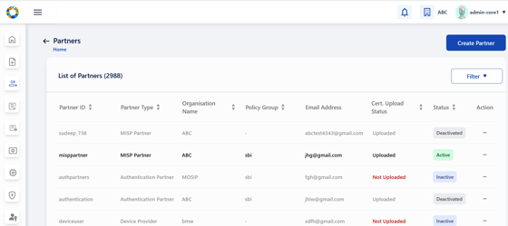

2. Enter details in the **Create Partner** form:
   * Partner Type as MISP is already pre-selected.
   * Enter Address, Organization Name, Email Address, and other mandatory fields. Selecting a Policy Group is optional but highly recommended before proceeding.

> Note: Ensure that the Organization name matches the one in the 'CA Signed Certificate' that will be uploaded later.

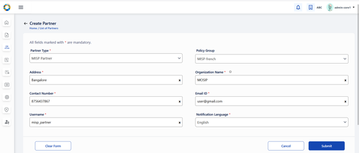

3. Click **Save/Submit**. A confirmation message appears on successful creation.

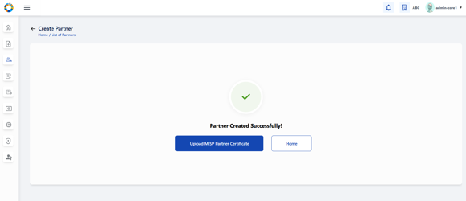

> Note: On the 'Success/Confirmation' screen itself, you are provided with an option to upload CA-Signed partner certificate or return to 'Home page'.

4. Click **Upload Certificate** to proceed with uploading the 'CA Signed Partner Certificate'.

> 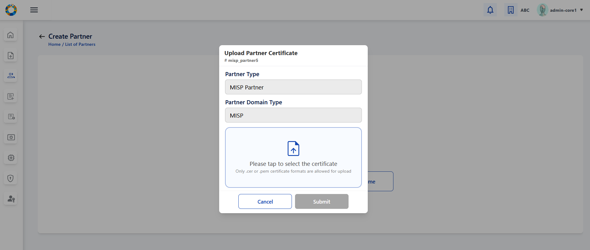

### Upload 'CA Signed Partner Certificate' (First time upload)

Either you can upload the partner certificate right after MISP partner creation as explained in [Create a MISP Partner](misp-partner-onboarding.md#create-a-misp-partner) or you can do it later from the 'List of Partners' page.

1. Go to Dashboard > MISP Partner, A 'List View' appears which shows all the partners.
2. Locate the newly created MISP Partner(inactive status) and choose **Upload Certificate** from the action menu, The **Upload Partner Certificate** popup opens.

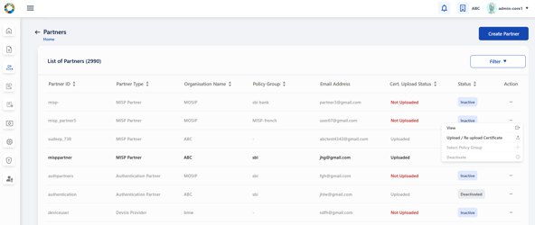

3. Click the upload area and select the 'CA Signed Certificate' file from local folder in `.cer` or `.pem` format.

> 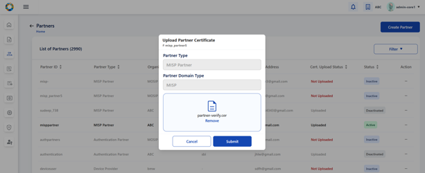

4. Verify the certificate details auto-populated (Issuer, Validity, etc.) and click **Submit**.

> 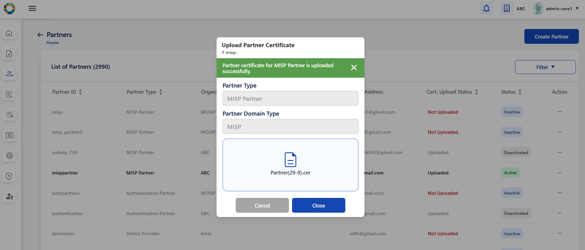

5.  On success, you (admin) receives a confirmation and the partner row should show the certificate upload date/status along with status as 'ACTIVE'.

    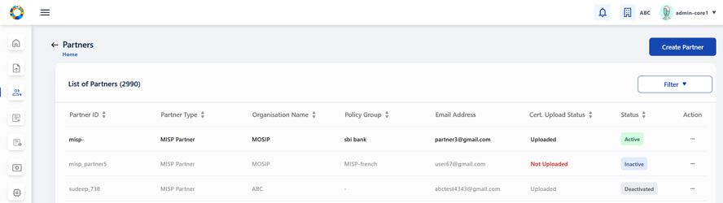

> **Note**:

* If Root/Intermediate CA is missing, the system will reject the upload. Therefore ensure that the CA certificates are uploaded first. [Certificate Trust Store](partner-administration/#certificate-trust-store)

### Re-Upload Partner Certificate (Replacing an existing certificate)

You can replace an existing partner certificate when it is expiring or has been re-issued. This ensures the partner remains compliant and can continue to use PMS services without interruption.

1. Go to Dashboard > Partners, A 'List View' appears which shows all the partners.
2. From Partners table action menu, select **Re-Upload Certificate**.
3. Follow the same upload flow as in [Upload 'CA Signed Partner Certificate' (First time upload)](misp-partner-onboarding.md#upload-ca-signed-partner-certificate-first-time-upload) and click **Submit**.
4. The new certificate details and updated certificate status is displayed in the Partners list.

### Select Policy Group (one-time assignment)

Assign a Policy Group to the MISP Partner, Selecting a policy group ensures the MISP Partner receives the correct permissions, access controls, and features tailored to their needs. It helps enforce organizational policies and simplifies license management.

> Note: Recommended before generating license keys.

1. Go to Dashboard > Partners, A 'List View' appears which shows all the partners.
2. Choose **Select Policy Group** from the Partners action menu, (if it wasn't set during creation).

> 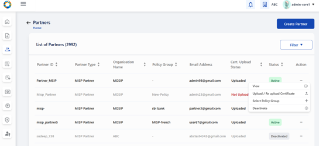

3. The popup lists available Policy Groups; pick the appropriate one for the partner.

> 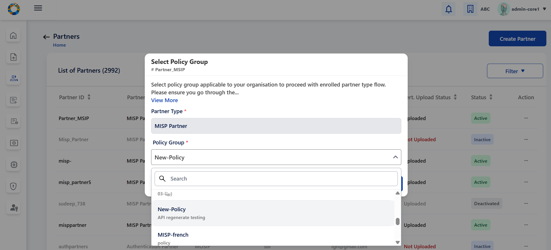

4. Click **Submit**

> Note:

* You (Admin) will not be able to modify the policy group selection after submit.
* Selecting a policy group and policy is optional but strongly recommended prior to license key generation.

### Partner Policy Linking (requesting and approving MISP policies)

1. Go to **Partner Policy Linking** (dashboard card or left menu).

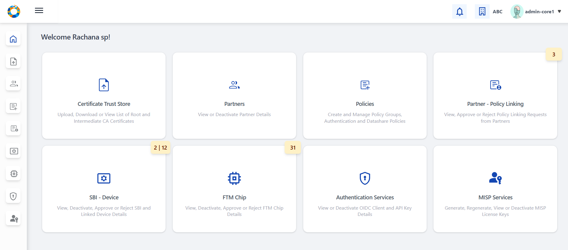

2. Click on 'Request Policy' button to request for a relevant policy within an already selected 'Policy Group' against the MISP partner ID.

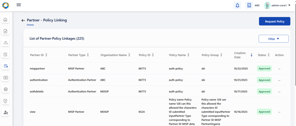 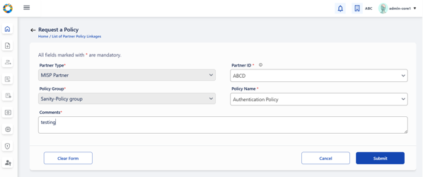

3. Approve the requests after requesting policy, by navigating to the 'Pending Approvals' tab and selecting 'Approve' from the action menu against each request. (View details to inspect the mapping and comments before acting).

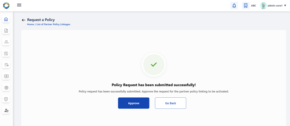

**Success check:** Approved partner-policy links will appear in the partner's policy list.

### MISP Services

The **MISP Services** section in PMS allows Partner Admins to manage license keys for MISP Partners. This includes generating new license keys, viewing and filtering existing keys, regenerating keys when needed, and deactivating keys or partners. These actions ensure secure access and compliance for MISP Partners within the MOSIP Identity System.

#### Generate MISP License Key

You can generate the MISP License Key for a selected policy and partner. The license key is used by the MISP Partner to authenticate and access MOSIP Identity System services as per the linked policy.

1. Go to the **MISP Services** card (from dashboard) or navigate to **MISP Services → Generate MISP License Key**.

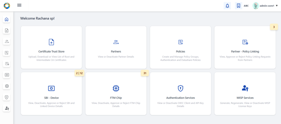 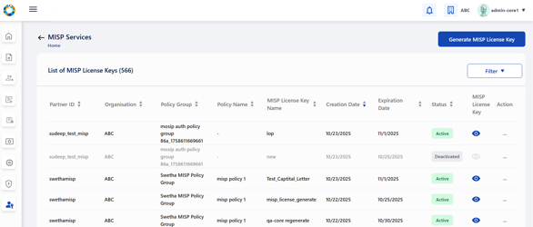

2. On the **Generate MISP License Key** page:
   * Select **Partner ID** (Dropdown shows only MISP partners with uploaded certificates).
   * Policy Group auto-populates (based on Partner ID).
   * Choose **Policy Name** (only approved & active policies show).
   * Enter **MISP License Key Name** (Unique, 1--128 chars).

> 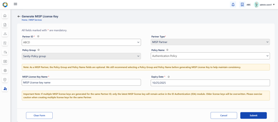

3. Click **Submit**. A popup displays the newly generated MISP License Key (visible only once).
   * Copy the key (Use **Copy** button). The UI may show "Copied" briefly.

> 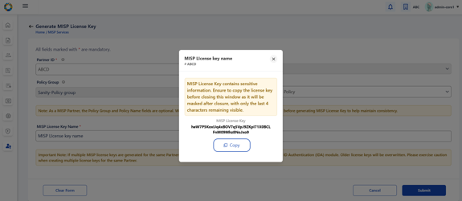

4. Close popup → 'Success Message' screen appears. Use **Go Back** to view the list view.

**Important:** The license key value is displayed only once - ensure you copy and store it securely.

### MISP License Keys - List View (list and filters)

You can review, sort, filter, and act on existing license keys.

1. Go to **MISP Services → List View**.

> 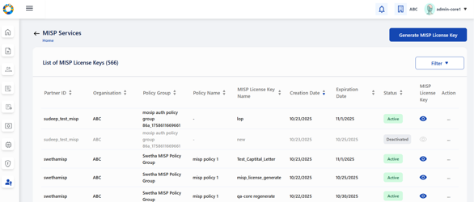

2. Use **Filters** (Partner ID, Policy Group, Policy Name, Name, Status) to narrow results; **Reset Filter** clears filters.

> 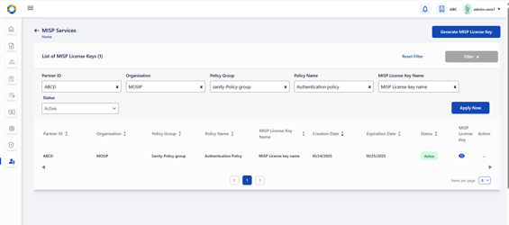

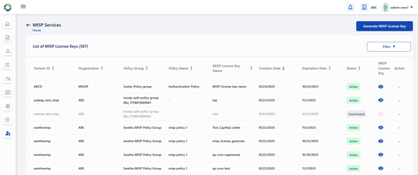

3. Columns include: Partner ID, Policy Group, Policy Name, License Key Name, Created Date, Status and Action
4. Click a row or **View** in the action menu to see details. (Deactivated records appear greyed out.)

### Regenerate MISP License Key

You can create a new license key in place of an existing one.

1. Go to **MISP Services → List View**, From the tabular view select the target license key and choose **Regenerate**.

> 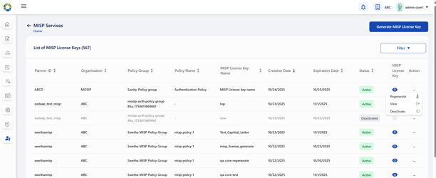

2. A regeneration form opens with read-only fields and editable **Name** and **Validity**.

> 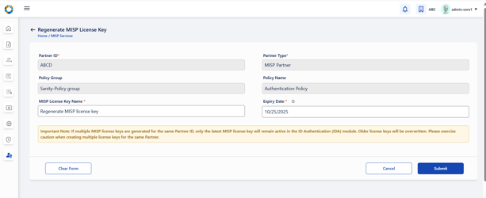

3. Submit → popup shows the new key (visible only once). Copy and store securely.

> 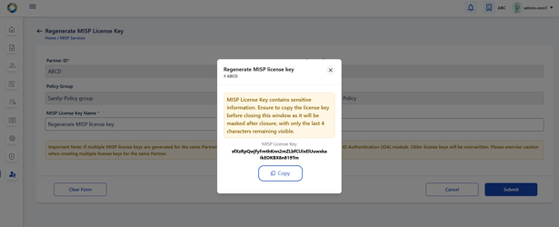

### Deactivate License Key

You can deactivate an active license key such that it can no longer be used for authentication.

1. Go to **MISP Services → List View**, From the tabular view select the target license key and choose **Deactivate**.

> 

2. Confirm the deactivation on the popup.

> 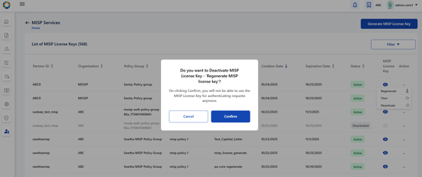

3. On success, the row becomes **Deactivated** and is greyed out; only **View** remains in the action menu.

### Deactivate Partner

You can deactivate the entire MISP Partner (prevents future requests & license generation).

1. Go to **Partners**. From Partners list, open the action menu → **Deactivate Partner**.

> 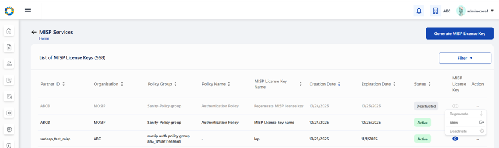

2. Confirm and note the consequences (partner cannot request policies or generate license keys).
