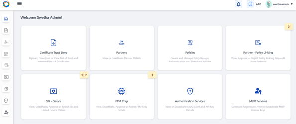

# MISP Partner Onboarding

# MISP Partner Onboarding by Partner Admin (End User Guide)

## Overview

This guide shows Partner Admins how to onboard a **MISP Partner** in
PMS, manage their partner certificates, link a policy group, and
generate/manage MISP License Keys from the PMS portal. Use this as the
"how-to" that operators will follow on the live system.

## Pre-requisites (Before you begin)

1.  You must be logged in with **Partner Admin** credentials (role:
    PARTNER_ADMIN)

2.  Root and Intermediate CA certificates should already be uploaded to
    the PMS **Certificate Trust Store** (these are required before
    uploading partner CA-signed certificates).

3.  Policy Manager should have created the required **Policy Group** and
    MISP policies (so they can be selected later). See the Policy Group
    & MISP Policy creation docs-
    <https://docs.mosip.io/1.2.0/id-lifecycle-management/support-systems/partner-management-services/functional-overview/policy-manager#policies>

## Navigation --- where to start

Steps:

1.  Log into the PMS portal with your Partner Admin account.

2.  From the left navigation panel or dashboard itself, click on
    **Partners** card.

3\. The user is navigated to List of Partners page (tabular view).

## 4. Create a new MISP Partner

Steps:

1.  On the *Partners* tabular screen, click **Create Partner** button
    placed on top-right (if partner records already exist) or positioned
    at the centre of the screen (if no records exist)

> 

2.  In the **Create Partner** form:

    - Partner Type = MISP is already pre-selected.

    - Enter Address, Organization Name, Email Address, and other
      mandatory fields. Selecting a Policy Group is optional but highly
      recommended before proceeding.

    - *Tip:* Ensure the Organization name matches the one in the
      CA-signed certificate that will be uploaded later.

> 

3.  Click **Save / Submit**. A confirmation message appears on
    successful creation.

> 

4.  In the success / confirmation screen, the user is provided an option
    to upload CA-Signed partner certificate or return to home page.

> 

## 5. Upload CA-signed Partner Certificate (First time upload)

Either the user can upload the partner certificate soon after MISP
partner creation as per above steps or In the List of Partners page,
locate the newly created MISP Partner(inactive status) and choose
**Upload Certificate** from the action menu.

Steps:

1.  The **Upload Partner Certificate** popup opens. Click the upload
    area and select the CA-signed certificate file from local folder in
    .ceror .pem format.

> 

2.  Verify the certificate details auto-populated (Issuer, Validity,
    etc.) and click **Submit**.

> 

3.  On success, admin receives a confirmation and the partner row should
    show the certificate upload date/status along with status= ACTIVE.

    1.  

**Notes & tips:**

- If Root/Intermediate CA is missing, the system will reject the upload
  --- ensure CA certificates are uploaded first. [MOSIP
  Docs](https://docs.mosip.io/1.2.0/id-lifecycle-management/support-systems/partner-management-services/functional-overview/partner-administration#certificate-trust-store)

## 6. Re-Upload Partner Certificate (Replacing an existing cert)

**Goal:** Replace previously uploaded certificate (e.g., when expiring
or after re-issue).

Steps:

1.  From Partners table action menu, select **Re-Upload Certificate**.\
    *Screenshot placeholder:*

2.  Follow the same upload flow as in Step 5 and click **Submit**.

3.  The new certificate details and updated certificate status is
    displayed in the Partners list.

*Screenshot placeholder:*

## 7. Select Policy Group (one-time assignment)

Assign a Policy Group to the MISP Partner (recommended before generating
license keys).

Steps:

1.  From the Partners action menu, choose **Select Policy Group** (if it
    wasn't set during creation).

> 

2.  The popup lists available Policy Groups; pick the appropriate one
    for the partner.

> 

3.  Click **Submit** --- note: the user will not be able to modify the
    policy group selection after submit.

**Note:** Selecting a policy group and policy is optional but strongly
recommended prior to license key generation.

## 8. Partner Policy Linking (requesting and approving MISP policies)

Steps :

1.  Navigate to **Partner Policy Linking** (dashboard card or left
    menu).

> 

2.  Click on Request policy button to request for a relavant policy
    within an already selected policy group against the MISP partner ID.

> 
>
> 

3.  After requesting policy, approve the requests

> 

4.  View details to inspect the mapping and comments before acting.

**Success check:** Approved partner-policy links will appear in the
partner's policy list.

## 9. MISP Services --- Generate MISP License Key

**Goal:** Generate the MISP License Key for a selected policy and
partner.

Steps:

1.  Open the **MISP Services** card (from dashboard) or navigate to
    **MISP Services → Generate MISP License Key**.

> 
>
> 

2.  On the **Generate MISP License Key** page:

    - Select **Partner ID** (dropdown shows only MISP partners with
      uploaded certificates).

    - Policy Group auto-populates (based on Partner ID).

    - Choose **Policy Name** (only approved & active policies show).

    - Enter **MISP License Key Name** (unique, 1--128 chars).

> 

3.  Click **Submit**. A popup displays the newly generated MISP License
    Key (visible only once).

    - Copy the key (use **Copy** button). The UI may show "Copied"
      briefly.

> 

4.  Close popup → success message screen appears. Use **Go Back** to
    view the tabular list.

**Important:** The license key value is displayed only once --- ensure
you copy and store it securely.

## 10. Tabular View --- MISP License Keys (list and filters)

**Goal:** Review, sort, filter, and act on existing license keys.

Steps:

1.  Navigate to **MISP Services → Tabular View**.

> 

2.  Use **Filters** (Partner ID, Policy Group, Policy Name, Name,
    Status) to narrow results; **Reset Filter** clears filters.

> 

3.  Columns include: Partner ID \| Policy Group \| Policy Name \|
    License Key Name \| Created Date \| Status \| Action

4.  Click a row or **View** in the action menu to see details.
    (Deactivated records appear greyed out.)

## 11. Regenerate MISP License Key

**Goal:** Create a new license key in place of an existing one.

Steps:

1.  From the tabular view select the target license key and choose
    **Regenerate**.

> 

2.  A regeneration form opens with read-only fields and editable
    **Name** and **Validity**.

> 

3.  Submit → popup shows the new key (visible only once). Copy and store
    securely.

> 

## 12. Deactivate License Key

**Goal:** Deactivate an active license key so it can no longer be used
for authentication.

Steps:

1.  In the License Keys table, open the action menu for the active key
    and select **Deactivate**.

> 

2.  Confirm the deactivation on the popup.

> 

3.  On success, the row becomes **Deactivated** and is greyed out; only
    **View** remains in the action menu.

## 13. Deactivate Partner

**Goal:** Deactivate the entire MISP Partner (prevents future requests &
license generation).

Steps:

1.  From Partners list, open the action menu → **Deactivate Partner**.

> 

2.  Confirm and note the consequences (partner cannot request policies
    or generate license keys).
