<!-- 
Command to convert to word file (This particular file to esternal drive)

pandoc /Users/keshavsingh/Office/MOSIP/MOSIPDocumentation/MOSIPDocumentation/docs/id-lifecycle-management/support-systems/partner-management-services/functional-overview/partner-administration.md -o /Users/keshavsingh/Office/pmp/admin-guide/pmp-admin-v-4.docx

-->

# Partner Administration

## Partner Administration

## End User Guide - Partner Admin & Policy Manager

### What all activities does a 'Partner Admin' perform?

Partner Admin supervises the overall partner and policy management functionalities in PMS. The admin is responsible for:

* Upload Root Certificate
* Intermediate CA Certificates
* Manage Partners and Policies
* Approve / Reject new entries created by different partners or deactivate partner related records

Note:

Partner Admin can also assume the role of Policy Manager to:

* Create and manage Policy Group(s) and Policies

### What all activities does a 'Policy Manager' perform?

As a partner admin cum]{.mark} policy manager you can performs following:

1. Create and manage Policy Group, Authentication Policy and Datashare Policy

**Notes**:

For the '**POLICIES**' card to appear on the dashboard, both; (Partner Admin and Policy Mangaer) roles must be granted.

### Partner Admin / Policy Manager

## Register as Partner Admin and Policy Manager

Partner admin too has to register \[himself]{.mark} just like any other 'Partner Registration' by selecting any one of the partner type i.e. Admin has to register in PMS with any one of the partner type.

### Registering as Partner Admin

You (Partner Admin) can register in PMP as any one of the partner type and then get the various roles/privileges by going to Keycloak.

<figure>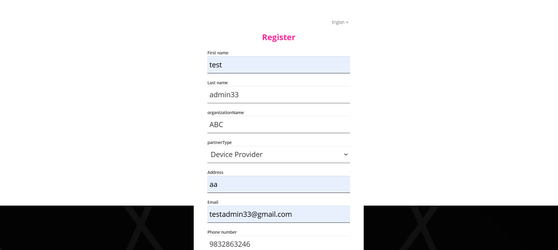<figcaption></figcaption></figure>

### Using Keycloak to allocate 'Partner Admin' and/or 'Policy Manager'

After registration .....you need to come to keycloak..

1. Go to keycloak and search your user name in Users tab.

<figure>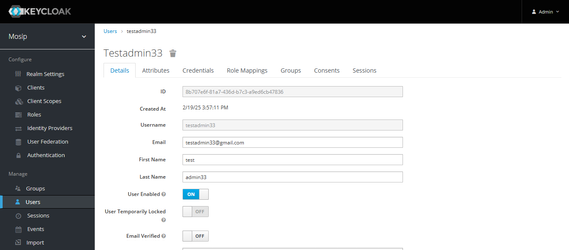<figcaption></figcaption></figure>

2. Go to the **Role Mapping** tab.

<figure>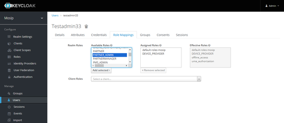<figcaption></figcaption></figure>

3. In the **Available Roles** section, select **PARTNER\_ADMIN** or **POLICYMANAGER**, click **Add** to move the selected role to the **Assigned Roles** list.

<figure>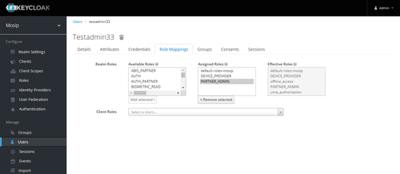<figcaption></figcaption></figure>

4. You can now log in to the **PMS** portal with the same user credentials and you will have access to the **Admin Dashboard**.

<figure>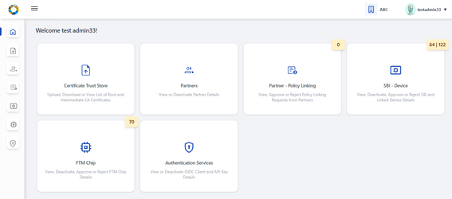<figcaption></figcaption></figure>

**Note:** Add POLICYMANAGER role if Policies card should be made accessible in UI

### Allocating Policy Manager Role

By following the above steps (1-4) in keycloak, the admin can also configure POLICY\_MANAGER role to view and manage **Policies** card as shown in the dashboard below:

<figure>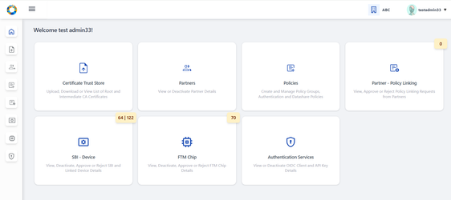<figcaption></figcaption></figure>

**Notes:**

**1.** If only 'Policy Manager' role is configured in keycloak, then the user will still be able to access as a normal partner. Hence 'Partner Admin' & 'Policy Manager' roles are necessary to access all the cards above.

2. After configuring the roles and if PMS portal is still logged in, make sure to logout and login again for the roles to get updated.

## Certificate Trust Store

Certificate Trust Store provides features such as Upload, Download, View Root CA and Intermediate CA certificates to Partner Admin such that at the time of CA Signed Certificate upload by partner MOSIP verifies the certificate chain of trust and then signs the partner's certificate using MOSIP(PMS) private key.

* Root Trust (Root CA) Certificate
* Intermediate Trust (Intermediate CA) Certificate

### Root Trust (Root CA) Certificate

You can use the 'Root Trust (Root CA) Certificate' section to do the following:

* **Upload Certificate** -- Upload **Root CA** certificate such that the root of trust can be verified when an intermediate CA is uploaded.
* **Download Root CA**: Download the root certificate as and when needed.
* **View Root CA**
  * **Root CA**: Tabular view of all uploaded Root CA certificates is displayed.
  * **View Root CA Details**

### Root CA Certificate

#### View Root CA Certificate

**List of Root CA Certificates**

<figure>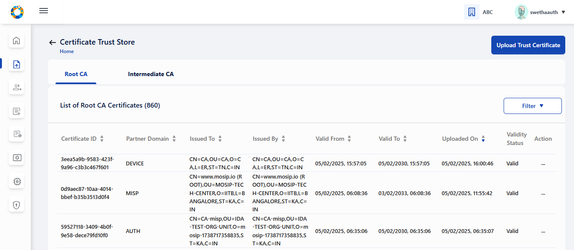<figcaption></figcaption></figure>

**Viewing Root CA Certificate**

In Certificate Trust Store, the user can view the list of '**Root CA Certificates**' uploaded by admin till date with details such as **Certificate ID**, **Partner Domain**, **Issued To**, **Issued By**, **Validity Period** and **Validity Status** (Valid / Expired) \[etc]{.mark}.

<figure>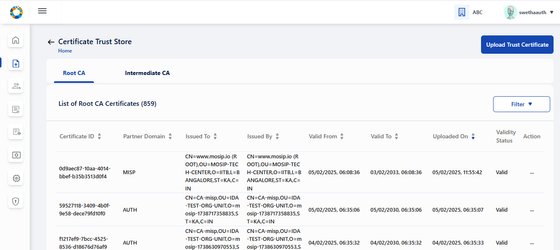<figcaption></figcaption></figure>

Each active certificate record has two options in action menu - **View** and **Download** Certificate.

<figure>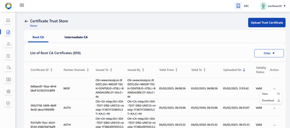<figcaption></figcaption></figure>

**View Root CA details**

On clicking View, the Root CA certificate detail can be viewed individually.

<figure>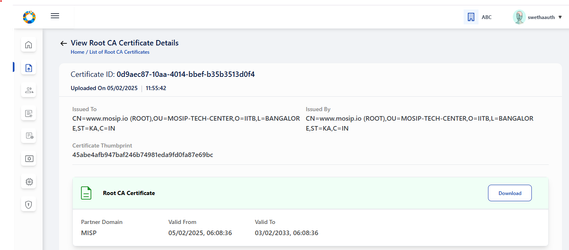<figcaption></figcaption></figure>

**Download Root CA**

In the same page (Root CA details), an option to download the Root CA certificate in .p7b file is also provided. Clicking on download, a success message appears.

<figure>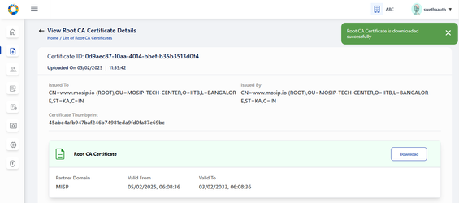<figcaption></figcaption></figure>

On opening the .p7b file from local system, the Root CA Certificate can be viewed as below:

NOTE: any external installation required [swetha.N](https://mosip.atlassian.net/wiki/people/636a272c11c69c7418450dbe?ref=confluence) [Prathmesh Jadhav](https://mosip.atlassian.net/wiki/people/712020:c6ee5f54-fc2c-4d62-986e-97ddd067ffd0?ref=confluence) ???

<figure>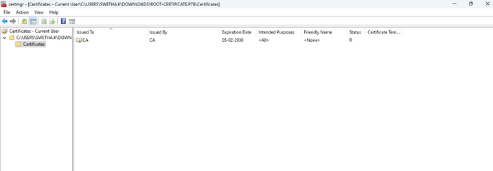<figcaption></figcaption></figure>

#### Upload Root CA

To upload Root CA/ Intermediate CA Certificate, click on 'Upload Trust Certificate'.

<figure><figcaption></figcaption></figure>

Admin is thus \[navigated]{.mark} to Upload Trust Certificate page.

**Note**:

Admin can upload Root CA / Intermediate CA certificate in the same page but should be in a sequential order ie. Root CA Certificate upload first and then Corresponding Intermediate CA certificate upload.

<figure><figcaption></figcaption></figure>

Select the partner domain (AUTH / DEVICE / FTM) **in the Upload section**. Partner Domain typically refers to the specific functional area for which the **Root or Intermediate CA certificate** is being uploaded.

* AUTH: Select Partner domain as AUTH if **Root or Intermediate CA certificate** is being uploaded for Authentication Partner.
* DEVICE: Select Partner domain as DEVICE if **Root or Intermediate CA certificate** is being uploaded for Device Provider.
* FTM: Select Partner domain as FTM if **Root or Intermediate CA certificate** is being uploaded for FTM Chip Provider.

<figure><figcaption></figcaption></figure>

<figure><figcaption></figcaption></figure>

Note:

* Only .cer or .pem format certificates are allowed for upload
* Future dated certificates \[is]{.mark} \[should]{.mark} not \[be]{.mark} allowed for upload, in case it is attempted an error message is thrown.
* Only \[Version 3]{.mark} certificate is allowed for upload.
* If the corresponding root certificate is not uploaded, then while submitting the Intermediate certificate upload, an error message appears asking 'Please upload corresponding Root Certificate to proceed further'.

**Note for Root CA Certificate**:

* Issued To and Issued By is the same - which means these are self signed certificates.

### Intermediate Trust (Intermediate CA) Certificate

* **Upload Root CA Certificate**: Partner Admin can upload **Intermediate CA** certificate so that the root of trust can be verified when a partner uploads Partner / FTM Chip Certificate.
* **Download Certificate Chain of Trust**: Partner Admin downloads the certificate chain of trust of intermediate certificate as and when needed.
* **View Intermediate CA**: Tabular view of all uploaded Intermediate CA certificates is displayed.
* **View Intermediate Certificate details**: Uploaded intermediate certificate details is displayed along with the list of certificates within the certificate trust chain.

#### Viewing the Intermediate CA Certificate

**List of Intermediate CA Certificates**

On clicking the Intermediate CA tab, List of all Intermediate CA certificates uploaded by Partner Admin is displayed.

<figure>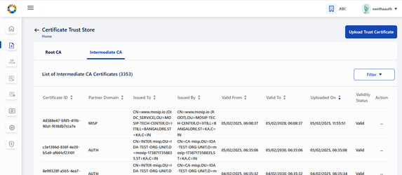<figcaption></figcaption></figure>

Action menu for all active certificates displays the following options:

* View
* Download Certificate Chain

<figure>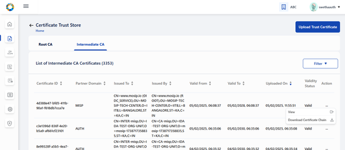<figcaption></figcaption></figure>

**Viewing the Intermediate CA Certificate**

Either by clicking on the row item or the View option in action menu, the admin is \[navigated]{.mark} to View Intermediate CA Certificate details page where the certificate details are displayed such as Certificate ID, Partner Domain - (AUTH, FTM, DEVICE), Issued To- _\<subject > field of Certificate,_ Issued By- _\<issuer > field of Certificate,_ Valid From, Valid To\*- same as system browser date format\* etc

<figure>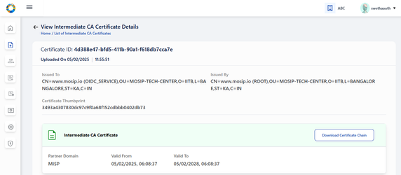<figcaption></figcaption></figure>

#### Downloading the Intermediate CA Certificate

Clicking on Download, downloads the entire certificate chain as .p7b file and a success message is displayed - 'Certificate Chain of Trust for the given Intermediate CA certificate is downloaded successfully'.

**Note:** For expired status, 'Download Certificate Chain' button will be disabled in View Root Certificate page / Tabular View page.

<figure>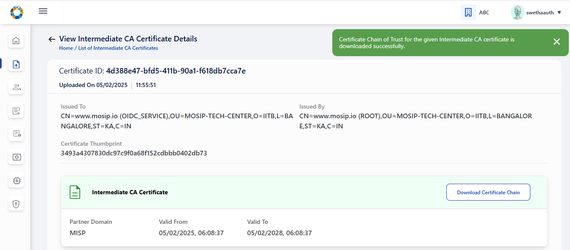<figcaption></figcaption></figure>

On clicking the .p7b file from local system, the certificate hierarchy of the intermediate CA certificate is present where its corresponding root certificate is also downloaded.

<figure><figcaption></figcaption></figure>

#### Upload Intermediate Certificate

To upload the Intermediate CA certificate, carry out the same steps of Root CA Certificate upload.

<figure>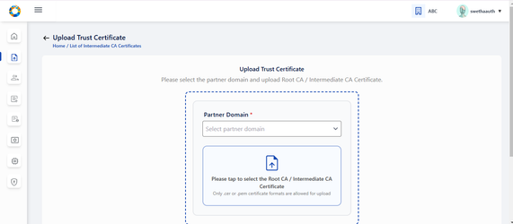<figcaption></figcaption></figure>

<figure>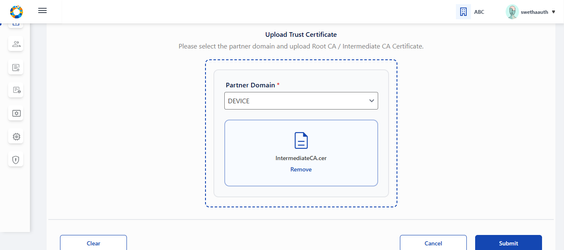<figcaption></figcaption></figure>

<figure>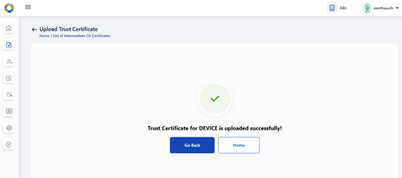<figcaption></figcaption></figure>

<figure><figcaption></figcaption></figure>

**Note for Intermediate CA Certificate**:

* The Subject of the root certificate matches the Issuer of the intermediate certificate.
* Issued To and Issued By are different as the Intermediate CA certificate is signed by the Root CA.
* Intermediate certificate must expire before its root certificate.
* Validity of Root CA Certificate > Intermediate CA Certificate > CA Signed Partner Certificate
* Sequence of Upload: Root CA Certificate (by Partner Admin)→ Intermediate CA Certificate (by Partner Admin) → CA signed Partner Certificate (by Partner)

# Partners

As a **Partner Admin** you can view the list of all partners who have enrolled to PMS portal by clicking on the Partners card on dashboard or side panel, hamburger menu.

## ‘Partner’ has following features:

1. View Partner
  * List View - (Action menu: View, Deactivate)
  * Details View -  of individual Partner and the certificate details
3. Download original Partner Certificate and MOSIP Signed certificate
4. Deactivate Partner

### View Partner Details

#### Viewing a Partner
<figure>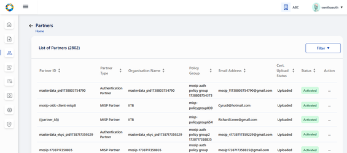<figcaption></figcaption></figure>

**Note:** Deactivate option appears disabled if the partner is already deactivated.

<figure>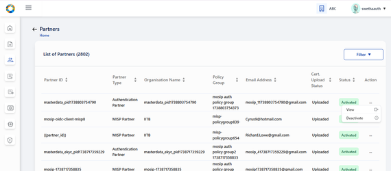<figcaption></figcaption></figure>

#### Viewing a Partner's details

Click on a row item or use the view option in action menu you come to 'Partner Details Page' to view the Partner Details such as **Partner type**, **Organisation name**, First Name, Last Name, Phone Number, Email Address, Policy Group (If partner is of the type 'Authentication Partner'). Partner certificate details are also visible.

<figure>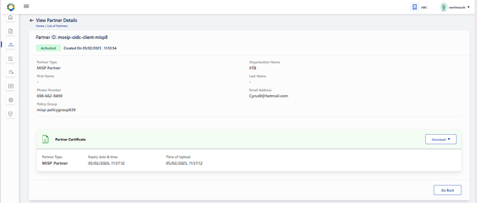<figcaption></figcaption></figure>

### Download original certificate / MOSIP Signed certificate

The admin can download original certificate / MOSIP Signed certificate as and when necessary.

**Note:**

The download functionality of following certificates is possible only during following instances:

* This button is enabled only for Activated partner record of which the certificate is already uploaded.
* This button is disabled for deactivated partner records/partner records whose partner certificate is not uploaded yet.
* If Original Certificate / MOSIP Signed Certificate is expired then on clicking respective menu items in the button-dropdown an appropriate error message is displayed.

<figure>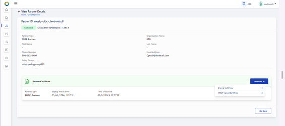<figcaption></figcaption></figure>

On downloading the Original / MOSIP Signed certificate, a success message appears.

<figure>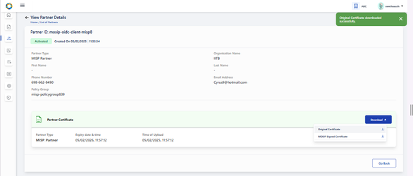<figcaption></figcaption></figure>

<figure>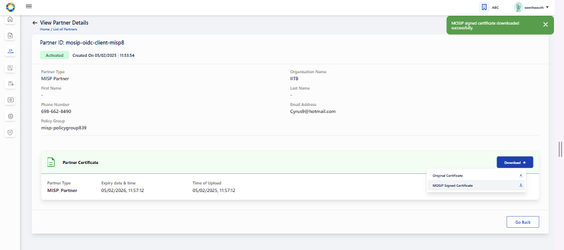<figcaption></figcaption></figure>

### Deactivate a Partner

To deactivate a partner, click on Deactivate option in action menu. A popup window appears seeking for confirmation from the partner.

<figure>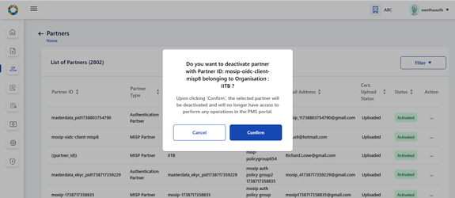<figcaption></figcaption></figure>

After confirming deactivation, the respective record is greyed out in the tabular view. The action menu here appears enabled with only 'View' option after deactivation and Deactivate in action menu is disabled.

**Note:** After deactivation, the View partners page will display the following-

1. 'Deactivated' status
2. Certificate section is greyed out with and download button is disabled.

<figure>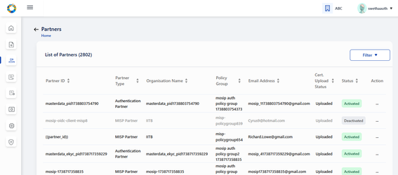<figcaption></figcaption></figure>

The deactivated partner will not be able to create or utilize any of the services in their PMS portal (For e.g. no new transactions will work such as creation of OIDC Client , API Key etc).

**Known Issue:** Even after partner deactivation partner is able to access the existing transactions in their PMS portal such as following:

1. Existing OIDC client ids are still operational for Authentication Partner.
2. Existing API keys are still operational for Authentication Partner.
3. SBI / Devices / FTM - trust validation does not fail even after partner deactivation.

# Policies

You can use the 'Policies' to create and manage Policy Group, Authentication Policy and Datashare (You should have privileges of both; Partner Admin and Policy Manager).

The 'Policies' section is accessible to you only if both **Partner Admin** and **Policy Manager** roles are allocated and only when the 'Policies' card will appear on the the dashboard.

Policies has following theree tabs:

* Policy Group, (This tab is selected by default)
* Authentication Policy,
* Datashare Policy

<figure>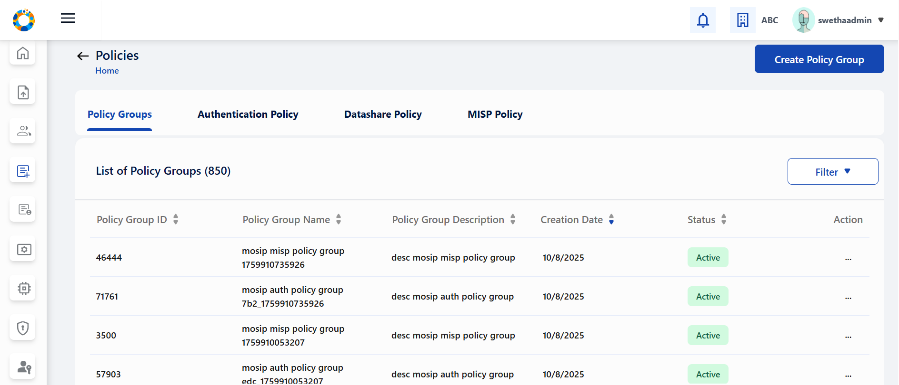<figcaption></figcaption></figure>

**Policy Group**

Policy Group tab allows you to do following:
* View Policy Group
  * List view
  * Details View
* Create Policy Group
* Deactivate Policy Group

&#x20;

**Authentication Policy**

* View Authentication Policy
  * List view
  * Details View
* Create Authentication Policy (by mapping to an already created Policy Group)
* Deactivate Authentication Policy
* Clone Authentication Policy
* Edit Authentication Policy (Which is in draft status)
* Publish Authentication Policy (Which is in draft status so that the status changes to 'Activated')

&#x20;

**Datashare Policy**

* View Datashare Policy:
  * List view
  * Details view
* Create Datashare Policy
* Deactivate Datashare Policy
* Clone Datashare Policy
* Edit Datashare Policy (Which is in draft status)
* Publish Datashare Policy (Which is in draft status so that the status changes to 'Activated')

## Policy Group

### View Policy Group 

#### List View - Policy Groups

All the policy groups created so far by Partner Admin / Policy Manager are displayed on 'List of Policy Groups' page.

<figure><figcaption></figcaption></figure>

#### Details View - Policy Group

Admin can either click on 'Go Back' to redirect to 'List of Policy Groups' page as shown below or click on 'Home' to navigate back to Home page/ dashboard.

The options provided in 'Action menu are: View, Deactivate.

Clicking on View in action menu or by clicking the row item itself, admin is navigated to View Policy Group page where the policy group details are displayed along with its status: Activated or Deactivated.

<figure>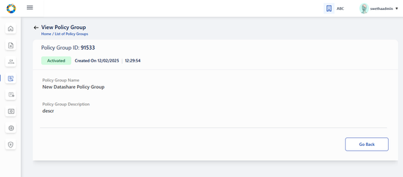<figcaption></figcaption></figure>

#### Create Policy Group

On clicking the 'Create Policy Group' option on the top right of the screen, we can create a Policy Group by providing suitable name and description that is self explanatory for partners, who would be selecting them during Partner Policy Request to create API Key / OIDC Client \[etc]{.mark}.

<figure>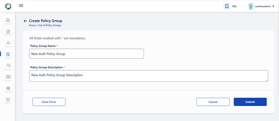<figcaption></figcaption></figure>

On click of Submit, a success message appears.

<figure>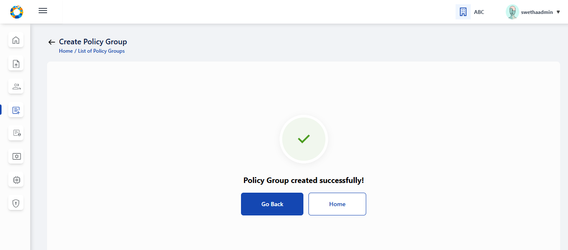<figcaption></figcaption></figure>

#### Deactivate Policy Group

If the admin wants to deactivate the Policy Group, then click on Deactivate option in action menu.

<figure>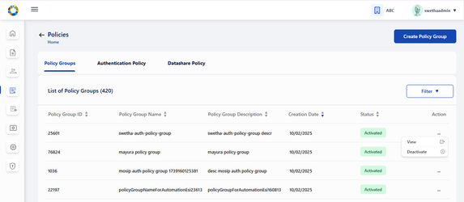<figcaption></figcaption></figure>

> A popup window appears seeking for confirmation before proceeding to deactivate.

<figure>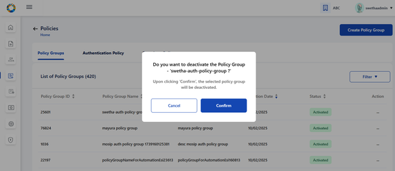<figcaption></figcaption></figure>

After confirming deactivation, the respective record is greyed out in the tabular view.

The action menu here \[should be]{.mark} enabled with only View option. (Deactivate in action menu is disabled).

<figure>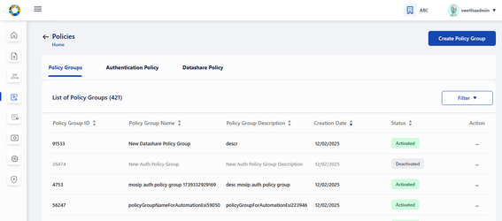<figcaption></figcaption></figure>

After deactivation, the View policy group page [MOSIP-36963](https://mosip.atlassian.net/browse/MOSIP-36963) will display 'Deactivated' status

Once the policy group is deactivated by Policy Manager, the partner will not be able to fetch this policy group in any of the screens in their \[PMS portal]{.mark}.

**Note:**

Policy Group cannot be deactivated if there are active or draft policies associated to the given policy group.

If the Policy Group has active or draft policy / policies associated to it, then on clicking Confirm, following error message is displayed along with the count of such policies -

a) In case of Active and Draft policies associated to Policy Group:

<figure>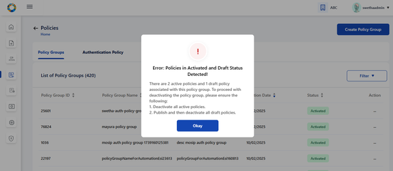<figcaption></figcaption></figure>

b) In case of Active policies associated to Policy Group:

<figure>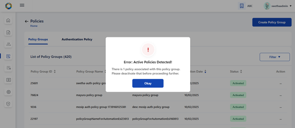<figcaption></figcaption></figure>

c) In case of Draft policies associated to policy group:

<figure>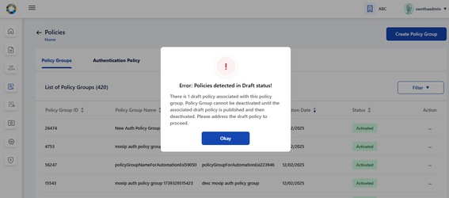<figcaption></figcaption></figure>

### Authentication Policy / Datashare Policy:

* On clicking Authentication Policy tab, List of all previously created Authentication Policies are displayed.
* On clicking Datashare Policy tab, List of all previously created Datashare Policies are displayed.

**Note**:

The steps and features are same for both Authentication and Datashare Policy.

Policies can have the following status - Draft, Activated or Deactivated.

1. Only Draft or Activated row items are clickable which \[navigates]{.mark} to View Authentication Policy details.
2. Action - Action menu displays a common menu item (View, Clone, Deactivate) with only the following menu items enabled for clicking based on below statuses:
   1. Draft: Publish, View, Edit
   2. Activated: View , Clone , Deactivate
   3. Deactivated: View

<figure>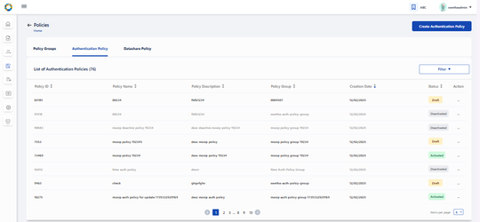<figcaption></figcaption></figure>

#### Create Authentication Policy

On clicking 'Create Authentication Policy' button, Partner Admin / Policy manager is navigated to Create Authentication Policy page where details such as policy group, policy name, description etc will have to be entered.

**Note**:

Only active policy groups are available in the policy group dropdown.

Click on the upload button to upload policy data. Only json files are allowed for upload.

<figure>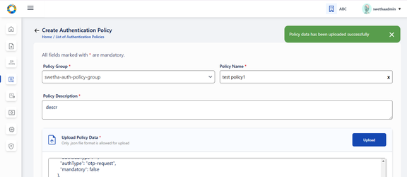<figcaption></figcaption></figure>

Before saving the policy in draft, the policy data can be edited in the text area after policy data json file has been successfully uploaded.

<figure>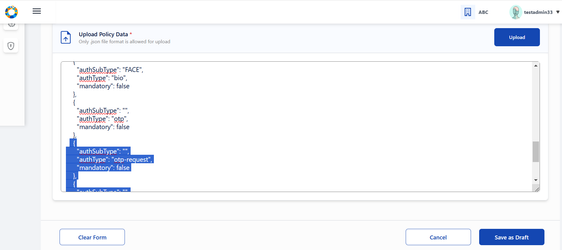<figcaption></figcaption></figure>

On clicking on Save as Draft, following success message appears.

<figure>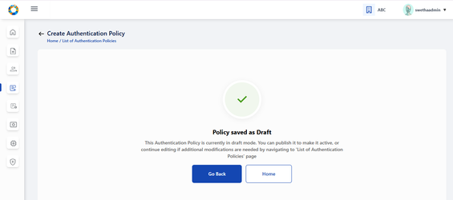<figcaption></figcaption></figure>

On clicking 'Go Back', admin is navigated back to List view where the policy is saved as 'draft' status.

<figure>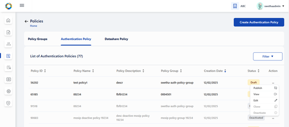<figcaption></figcaption></figure>

The Edit option provided to Draft policy can be used by admin to make any changes in the policy details (except policy group) before publishing the policy.

<figure>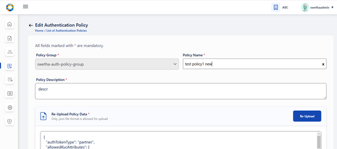<figcaption></figcaption></figure>

On submitting after making required changes, a success message appears.

<figure>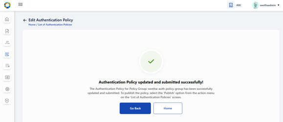<figcaption></figcaption></figure>

To publish policy which is currently in draft status, click on 'publish' option in action menu. A popup window appears seeking for confirmation to publish.

<figure>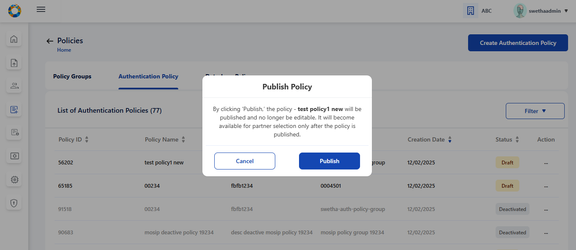<figcaption></figcaption></figure>

On clicking Publish, a success message appears . Click on close to close the window.

<figure>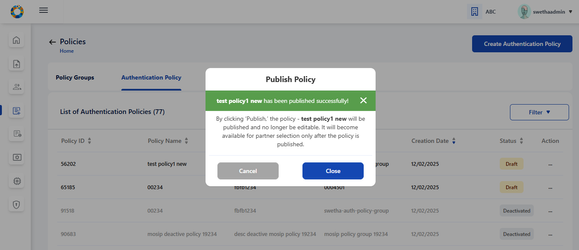<figcaption></figcaption></figure>

The given policy changes to 'Activated' status after being published. Once activated, the admin cannot edit the policy, hence the option is disabled.

<figure>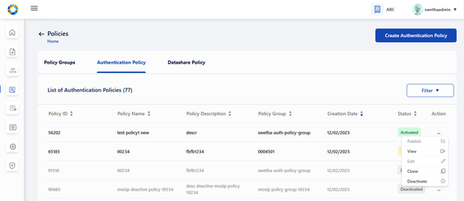<figcaption></figcaption></figure>

#### Clone Policy

To clone any active policy onto another policy group, click on 'clone' in action menu. A popup window appears to select the policy group where the policy has to be cloned.

<figure>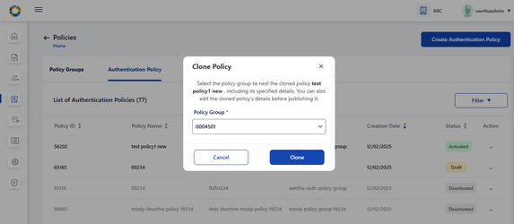<figcaption></figcaption></figure>

On selecting the policy group where policy has to be cloned, click on Clone and a success message appears.

Click on Close to navigate back to List of Authentication Policies screen.

<figure>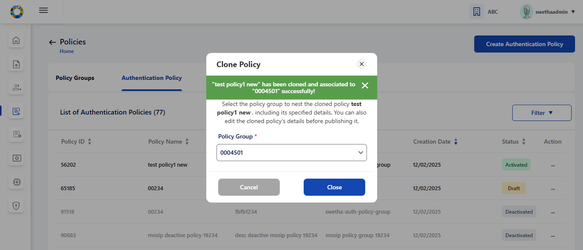<figcaption></figcaption></figure>

#### Deactivate Policy

To deactivate a policy, click on Deactivate option in action menu of any activated policy record. A popup window appears seeking for confirmation.

<figure>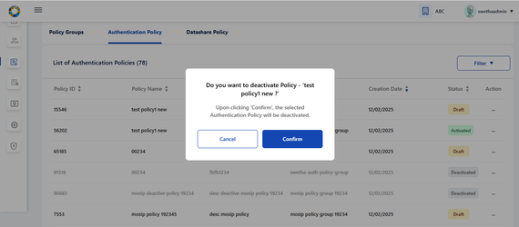<figcaption></figcaption></figure>

Note:

If the Policy has active partners associated to it i.e. there are **Approved** partner policy requests, then on clicking Confirm, following error message is displayed and the admin will be restricted to deactivate such policy groups.

<figure><figcaption></figcaption></figure>

**Note:**

1. Policy can be deactivated if there are no policy requests associated with this policy
2. Policy can be deactivated if there are Rejected policy requests associated with this policy.
3. Policy cannot be deactivated if there are pending policy requests associated with this policy. In this case , following error message is displayed- '\<title> Error: Partner - Policy Request Detected! \<Description> Pending policy requests are associated with this policy. Please take appropriate action in List of Partner Policy Linking screen'
4. Once the policy is deactivated by partner admin/policy manager, the partner will not be able to fetch this policy in any of the screens in their PMS portal.

<figure><figcaption></figcaption></figure>

#### Viewing Policy

On clicking **View** option of any policy or by clicking the row item itself, admin is navigated to View Authentication Policy where policy details can be viewed. Also click on preview to view the policy data in json format.

<figure><figcaption></figcaption></figure>

On clicking preview, policy data can be viewed in json format and an option to Download the data in local system is provided.

<figure><figcaption></figcaption></figure>

### Partner - Policy Linking:

The features provided to Partner Admin:

1. Approve/ Reject Policy requested by partner - clicking on 'Approve/ Reject' option in action menu of a policy record whose status is in pending for approval
2. Tabular view of Policies requested by partners along with the status
3. View individual policy request details : Either on clicking on view option in action menu of any of the active policy request in the tabular view or by clicking on the row item itself, it navigates to View Policy Request details page.

All the policy requests created by various partners are displayed in 'List of Partner - Partner Linkages' . The different statuses possible are: Pending for Approval, Approved, Rejected, Deactivated.

<figure><figcaption></figcaption></figure>

The options provided for policy linking requests in 'Pending for Approval' are to Approve/ Reject. Also an option to view the policy request details is also provided.

<figure><figcaption></figcaption></figure>

On clicking the Approve/ Reject option, the window appears - and partner admin can click on either Approve or Reject to take appropriate action

<figure><figcaption></figcaption></figure>

The status- Approved / Rejected gets updated in the tabular view.

<figure><figcaption></figcaption></figure>

<figure><figcaption></figcaption></figure>

On clicking view of active record or the row item itself, the partner- policy linking view page is displayed along with comment history where partner comments and admin's approval status is displayed.

<figure><figcaption></figcaption></figure>

# **SBI - Device:**

SBI - Device is exclusively used to manage Device Provider's requests on SBI and Device creation.

The 'SBI-Devices' has 2 Tabs namely **SBI and Device**. SBI tab view is selected by default

<figure><figcaption></figcaption></figure>

**SBI features**

* View SBI - 
  * List View of SBIs created by Device Providers along with the status
  * Details View - View submitted SBI details,either on clicking on view option in action menu of any of the submitted SBI details in the tabular view or by clicking on the active row item itself, it navigates to View SBI details page
* Approve/ Reject SBIs - On clicking Approve/Reject in action menu of Pending for Approval records
* Deactivate an SBI - On clicking Deactivate option in action item of activated records in Tabular view screen
* View Linked Devices - Of a given SBI can be viewed through a filtered search on the pre-selected SBI

&#x20;

**Device features:**

* View
  * List View: Of Devices created by Device Providers along with the status
  * View submitted Device details : Either on clicking on view option in action menu of any of the submitted API key details in the tabular view or by clicking on the row item itself, it navigates to View device details page
* Approve/ Reject devices: On clicking Approve/Reject in action menu of Pending for Approval records
* Deactivate Device: On clicking Deactivate option in action item of activated records in Tabular view screen
* List of all SBIs created by various different device providers are available here. Any SBIs that are pending for approval can be approved/ rejected

# SBI

### Approve or reject SBI

 Go to Dashboard → SBI-Device → List of SBIs to Approved or Reject.

<figure><figcaption></figcaption></figure>

Select on Approve / Reject option from the given record and chooses appropriate action.

<figure><figcaption></figcaption></figure>

On approval, the status changes to 'Approved' and on rejection, the status changes to 'Rejected'

<figure><figcaption></figcaption></figure>

You can click on View option in the action menu to view any individual records, 

<figure><figcaption></figcaption></figure>

To approve or reject an SBI, select the approve / reject option in action menu.

<figure><figcaption></figcaption></figure>

The approved / rejected status is updated on the tabular view.

<figure><figcaption></figcaption></figure>

To know the list of linked devices associated to this SBI, click on the linked devices count in the tabular view or in the individual view page.

<figure><figcaption></figcaption></figure>

### Deactivate SBI

To deactivate an SBI, click on Deactivate option in action menu. An alert appears seeking for confirmation. Also admin is informed how the linked devices will be impacted after SBI deactivation.

<figure><figcaption></figcaption></figure>

After confirming Deactivation the respective SBI record is greyed out and the status is displayed as 'Deactivated'.

<figure><figcaption></figcaption></figure>

#### Impact on linked devices after SBI deactivation

Impact on linked devices after SBI deactivation is as below:

1. All approved device records are displayed in 'Deactivated' status and those row items being greyed out. The action menu in such records should be enabled with only View option, (Deactivate in action menu is disabled).
2. The devices of which the status was 'Pending for Approval' before SBI deactivation will now be displayed with 'Rejected' status.
3. Rejected devices will continue to remain in the same status even after SBI deactivation.

<figure><figcaption></figcaption></figure>

 

## **Device**

### View Devices

On clicking 'Devices' tab, **List of all Devices** submitted so far are displayed.

<figure><figcaption></figcaption></figure>

Click on view option in action menu or the row item itself (of any active device record) to view the device details individually.

<figure><figcaption></figcaption></figure>

### Approve / Reject Devices

On clicking the action menu of the respective device record, an option 'Approve / Reject' is provided

<figure><figcaption></figcaption></figure>

A popup window appears for the admin to take appropriate action - Approve / Reject and select the respective button

<figure><figcaption></figcaption></figure>

The status is thus updated accordingly in **List of Devices** Page as Approved / Rejected based on the above action.

'Pending for Approval' status is displayed when the device request is pending with admin for approval and no action has been taken by admin yet.

<figure><figcaption></figcaption></figure>

### Deactivate Device

Click on deactivate option in action menu. A confirmation window appears to proceed for deactivation.

<figure><figcaption></figcaption></figure>

The deactivated device record is greyed out and status is also changed to 'Deactivated'

<figure><figcaption></figcaption></figure>

# **FTM Chip:**

The following features are provided to admin to manager FTM Chip Provider's requests:

* View FTM Chip
  * View List View: Of FTM chip details]{.underline} along with the status of approval
  * View FTM details: Either on clicking on view option in action menu of active FTM Chip details in the tabular view or by clicking on the row item itself, it navigates to View FTM details page
* Approve / Reject FTM chip details: submitted by FTM Chip Providers
* Download FTM Chip Certificate: On clicking on Download option within FTM Chip Certificate section in 'View FTM Chip Certificate' page, then originally uploaded FTM Chip certificate can be downloaded
* Deactivate FTM detail: On clicking on 'Deactivate' option in action menu of approved records in Tabular view of FTM details screen, the respective FTM detail along with its certificate will be deactivated.

## View FTP Chip Details

The List of FTM Chip details displays all FTM Chip details created by FTM Chip Provider

<figure><figcaption></figcaption></figure>

<figure><figcaption></figcaption></figure>

You can navigate to view 'List of FTM Chip details' page where list of all FTM Chip records submitted so far by different FTM Chip providers.

<figure><figcaption></figcaption></figure>

## View Details of FTM Chip&#x20;

To view FTM Chip details indivudally, click on View option in action menu

<figure><figcaption></figcaption></figure>

## Approve / Reject FTM Chip

Click on the action menu of the respective FTM Chip record, an option 'Approve/ Reject' is provided

<figure><figcaption></figcaption></figure>

&#x20;

A popup window appears for the admin to take appropriate action - Approve / Reject and select the respective button

<figure><figcaption></figcaption></figure>

&#x20;

The status is thus updated accordingly in **List of Devices** Page as Approved / Rejected based on the above action.

&#x20;

**Note**: 'Pending for Approval' status is displayed when the FTM Chip request is pending with admin for approval and no action has been taken by admin yet.

<figure><figcaption></figcaption></figure>

## Download FTM Chip Certificate

To download the FTM Chip Certificate uploaded by FTM Chip Provider, click on download button.

<figure><figcaption></figcaption></figure>

To deactivate an FTM Chip record, click on Deactivate option in action menu and a confirmation popup appears.

<figure><figcaption></figcaption></figure>

The deactivated FTM Chip record is greyed out after deactivation.

<figure><figcaption></figcaption></figure>

# Authentication Services

Authentication Services has two tabs namely **OIDC Client and API key**. OIDC Client tab view is selected by default.

**OIDC Client**

* View OIDC Client
  * Lis view of OIDC clients created by partners along with the status
  * View submitted OIDC Client details: Either on clicking on view option in action menu of any of the submitted OIDC details in the tabular view or by clicking on the row item itself, it navigates to View OIDC Client details page
* Deactivate an OIDC Client:  On clicking Deactivate option in action item of activated records in Tabular view screen

**API Key**

* View API Keys
  * Tabular view of API keys: Generated by partners along with the status
  * View submitted API Key details: Either on clicking on view option in action menu of any of the submitted API key details in the tabular view or by clicking on the row item itself, it navigates to View API key details page
* Deactivate: API key on clicking Deactivate option in action item of activated records in Tabular view screen

## OIDC Client

### View OIDC Clients

Within OIDC Client tab, all OIDC Clients created by various Authentication partners are displayed.

<figure><figcaption></figcaption></figure>

For Activated records → the action menu has two options: View, Deactivate

For Deactivated records → the action menu is enabled with only 1 option: View, Deactivate.

On clicking view option in action menu, the admin is redirected to View OIDC Client details page.

<figure><figcaption></figcaption></figure>

### Deactivate OIDC Client:

On clicking view option in action menu, the admin is redirected to View OIDC Client details page.

<figure><figcaption></figcaption></figure>

## API Key

### View API Key

To view the list of all API Keys created by Authentication partner, click on API Key tab

<figure><figcaption></figcaption></figure>

For Activated records → the action menu has two options: View, Deactivate

For Deactivated records → the action menu is enabled with only 1 option: View, Deactivate.

<figure><figcaption></figcaption></figure>

On clicking view option in action menu, the admin is redirected to View API Key details page.

<figure><figcaption></figcaption></figure>

### Deactivate an API Key

To deactivate an API Key, click on deactivate option in action menu.

<figure><figcaption></figcaption></figure>

The deactivated record is greyed out and is updated with Deactivated status.

<figure><figcaption></figcaption></figure>
