# PMS Notification

## What all types of notifications does a Partner Admin get?

**Partner Admin** receives  the below of notifications within the PMS Portal and via email:

1. **Root CA Certificate Expiration**

* Triggered for certificates expiring within the next **30 days**.

2. **Intermediate CA Certificate Expiration**
* Triggered for certificates expiring within the next **30 days**.

3. **MISP License Key Expiration**

* Triggered for the MISP license Keys Expiring within next **30 days.**

4. **Weekly Summary of Partner Certificate Expiration**

* A consolidated summary of all partner certificates, FTM Chip Certificates, API Keys, and SBIs scheduled to expire within the next 7 days, sent weekly..

These notifications are accessible via the **Notification Bell icon** in the top-right corner of the PMS portal.

## Navigating through the interface to view or act on the notifications

### View Notifications

#### Notification Panel

* A red alert on the notification bell icon indicates a new notification been triggered.
* Clicking the bell icon opens a dropdown panel showing the **latest 4 notifications**.

<figure>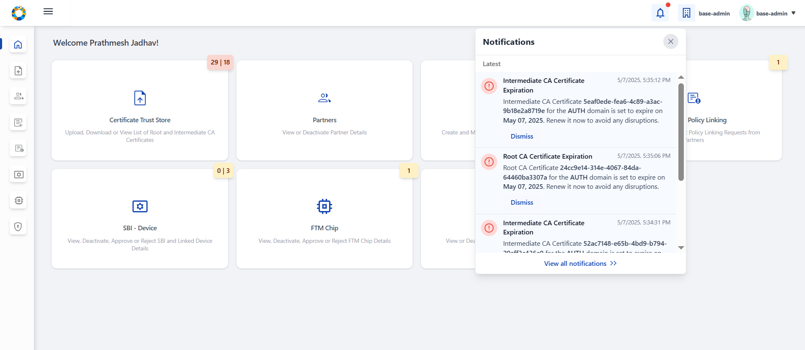<figcaption></figcaption></figure>

* Each notification appears as a row with:
  * **Title**
  * **Timestamp of notification creation** (Displayed in user's local system time based on browser settings)
  * **Description**:
    * \[Root / Intermediate CA Certificate]{.underline}: Includes **Certificate ID**, **partner domain name**, and the **certificate's expiry date**
    * **MISP License Key Expiration**: Includes **License Key Name**, **partner ID** , and the **license expiry date.**
    * \[Weekly Summary of Partner expiring items]{.underline}: Includes number of Partner Certificates, FTM Chip Certificates, API Keys and SBIs expiring in next 7 days of time.
  * **Dismiss** button to remove that specific notification (removes from both Notification panel and Notification list page)
* Dismissing a notification is **user-specific** and does not impact other Partner Admins.

#### View All Notifications

* Click **"View All Notifications"** at the bottom of the panel to access the full **Notifications Page** where entire list of certificates nearing expiry within the next 30 days is listed.
* Notifications are organized across four **tabs**:
  * **Root CA Certificate**
  * **Intermediate CA Certificate**
  * **MISP License Key**
  * **Weekly Summary - Partner**

**Root CA Certificate tab**

The **Root CA Certificate tab** is selected by default upon redirect to Notifications page which displays certificate related details as shown below:

<figure>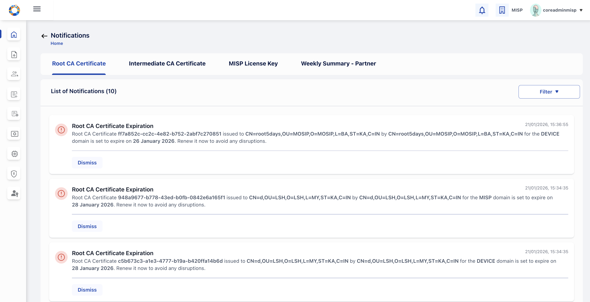<figcaption></figcaption></figure>

* To filter the certificate results, click the **Filter** button and enter one or more of the following fields: Certificate ID, Issued By, Issued To, Partner Domain, or Certificate Expiry Date to perform a targeted search.

<figure>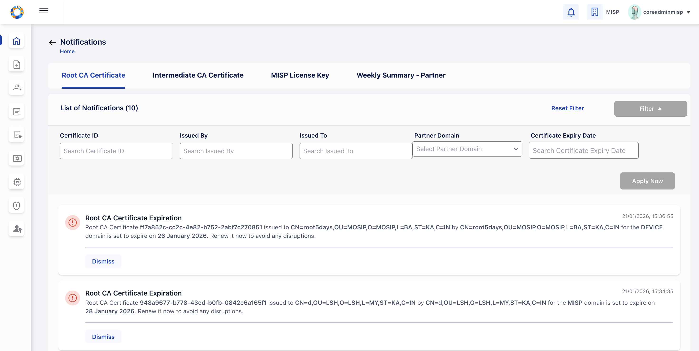<figcaption></figcaption></figure>

* **Dismiss** button to remove that specific notification (removes from both Notification panel and Notification list page)

**'Intermediate CA Certificate' tab**

<figure>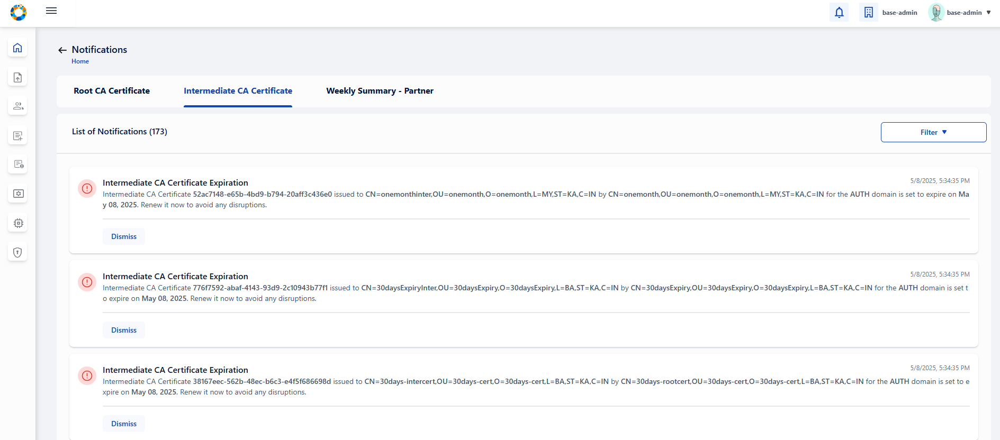<figcaption></figcaption></figure>

* To filter the certificate results, click the **Filter** button and enter one or more of the following fields: Certificate ID, Issued By, Issued To, Partner Domain, or Certificate Expiry Date to perform a targeted search.

<figure>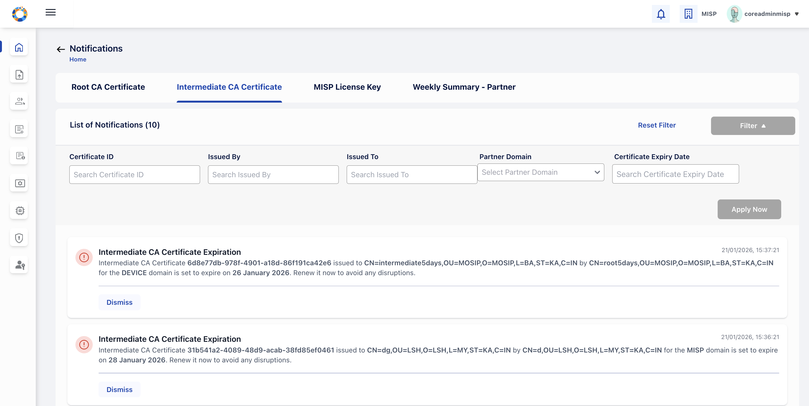<figcaption></figcaption></figure>

* **Dismiss** button to remove that specific notification (removes from both Notification panel and Notification list page)

**MISP License Key tab**

Displays the list of all the the notifications for the expiring MISP license Key

<figure>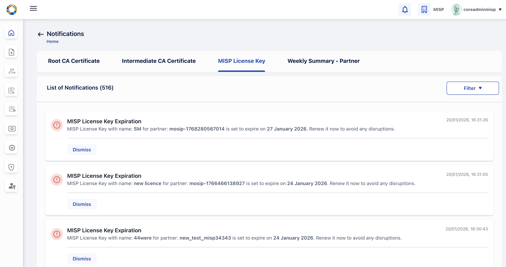<figcaption></figcaption></figure>

- To filter the certificate results, click the Filter button and enter one or more of the following fields: MISP License Key Name, Partner ID, Expiry Date to perform a targeted search.

<figure>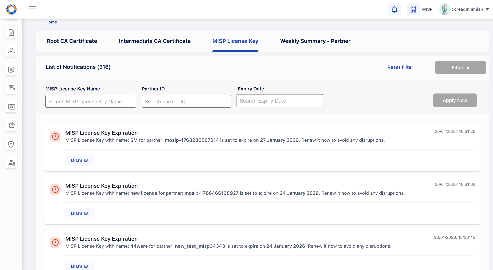<figcaption></figcaption></figure>

- Dismiss button to remove that specific notification (removes from both Notification panel and Notification list page)

<figure>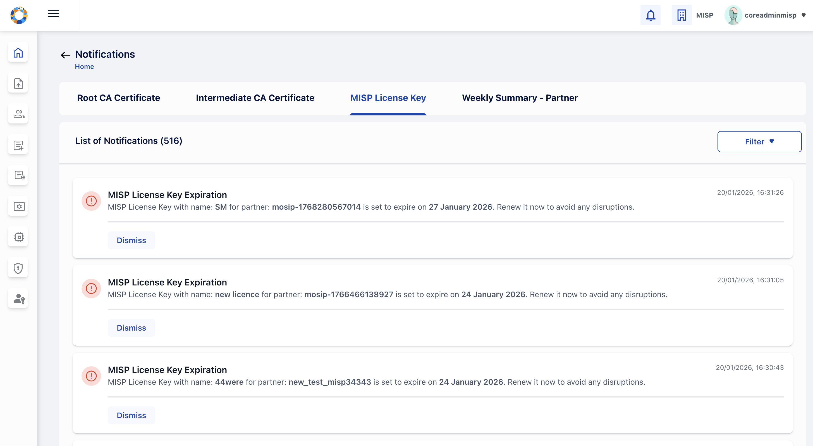<figcaption></figcaption></figure>

**'Weekly Summary - Partner' tab**

Each notification displays the total count of partner certificates, FTM Chip Certificates, API Keys, SBIsset to expire within a given week.

<figure>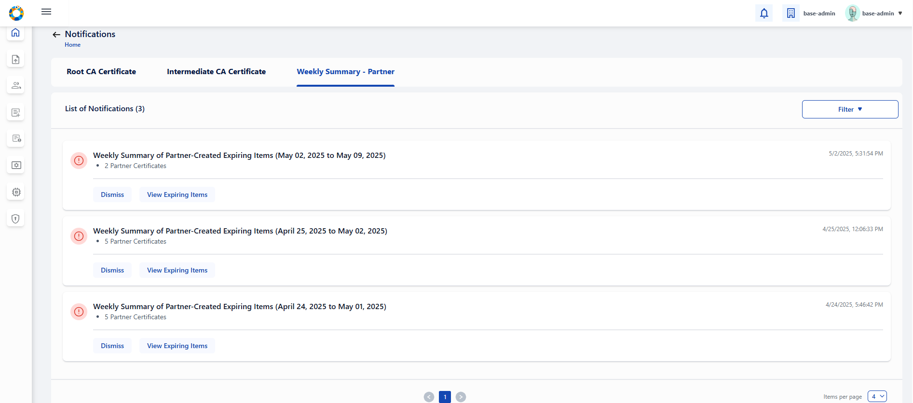<figcaption></figcaption></figure>

* To view the specific Partner IDs associated with each of the expiring items, click the ‘View Expiring Items’ button. This will display a detailed list of all Partner IDs and associated details whose certificates, API Keys, SBIs are due to expire within the next 7 days.
* Each of the expiring items details within a given weekly summary notification is split into individual sub tabs for easy categorization and readability.

<figure>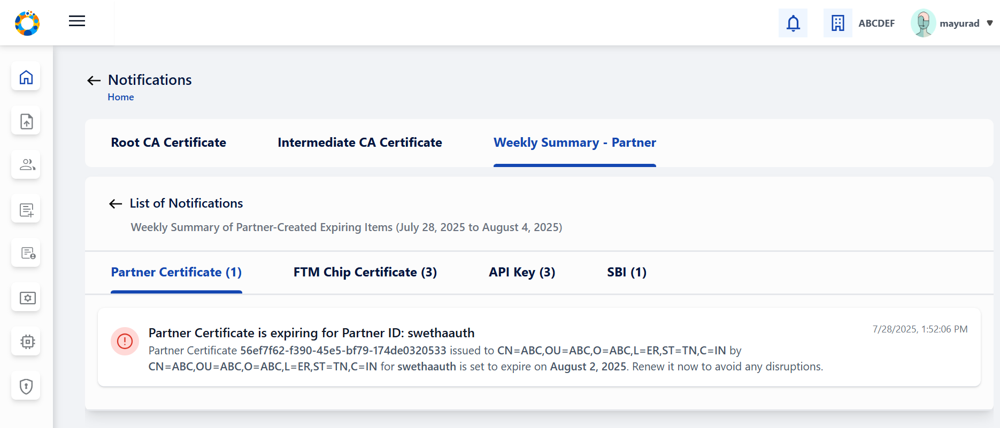<figcaption></figcaption></figure>

* To filter the weekly summary results, click the **Filter** button and enter one or more of the following fields: 'Notification Creation Date From' and 'Notification Creation Date To' to perform a targeted search.

<figure>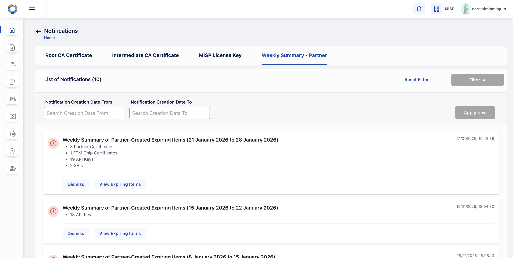<figcaption></figcaption></figure>

* **Dismiss** button to remove that specific notification (removes from both Notification panel and Notification list page)


Note: If there is no partner item expiring in a given week, the weekly summary notification will not be sent to the partner admin/ respective partner.


## Which other places you receive the notifications?

### Certificate Trust Store Badge

* The **Certificate Trust Store** card displays a **red badge** indicating the total count of Root and Intermediate CA certificates **expiring in the next 30 days**.

<figure>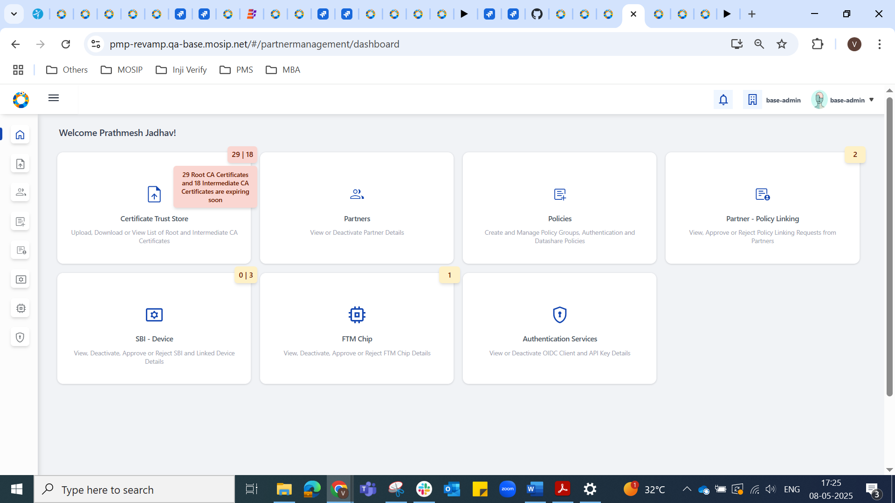<figcaption></figcaption></figure>

### Email Notifications:

Email alerts are sent to the registered email address for the following:

* Root and Intermediate CA certificates expiring within the next 30 days
* Weekly summary of partner certificates expiring within the next 7 days
* MISP License Key Expiry Date expiring within next 30 days

These notifications are delivered weekly, and the email follows the template provided below.

#### Root CA Certificate expiry email notification:

<figure>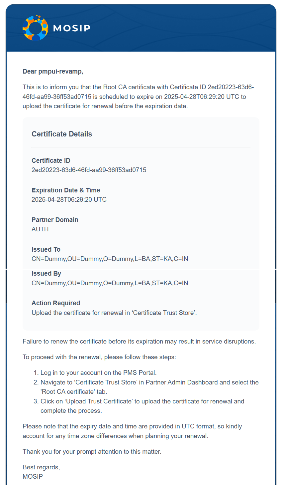<figcaption></figcaption></figure>

#### Intermediate CA Certificate expiry email notification:

<figure>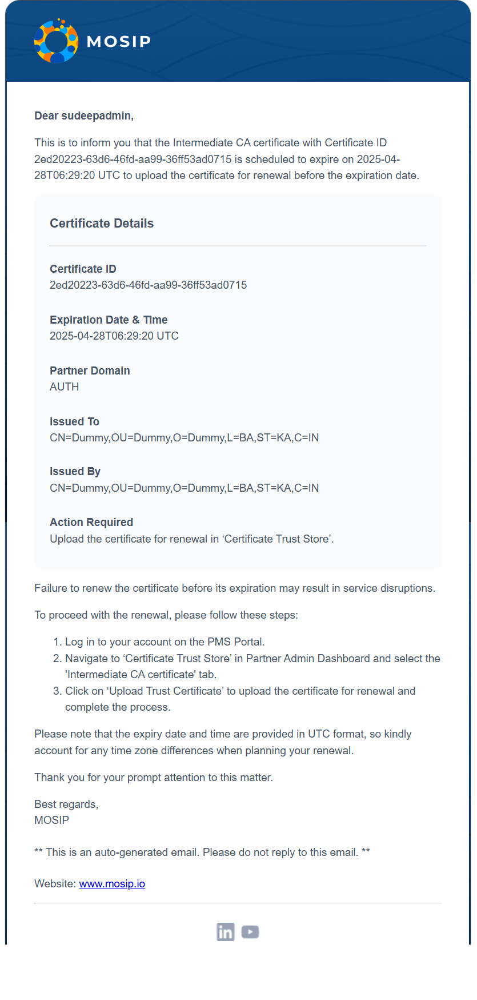<figcaption></figcaption></figure>

#### **MISP license key expiration email notification:**

<figure>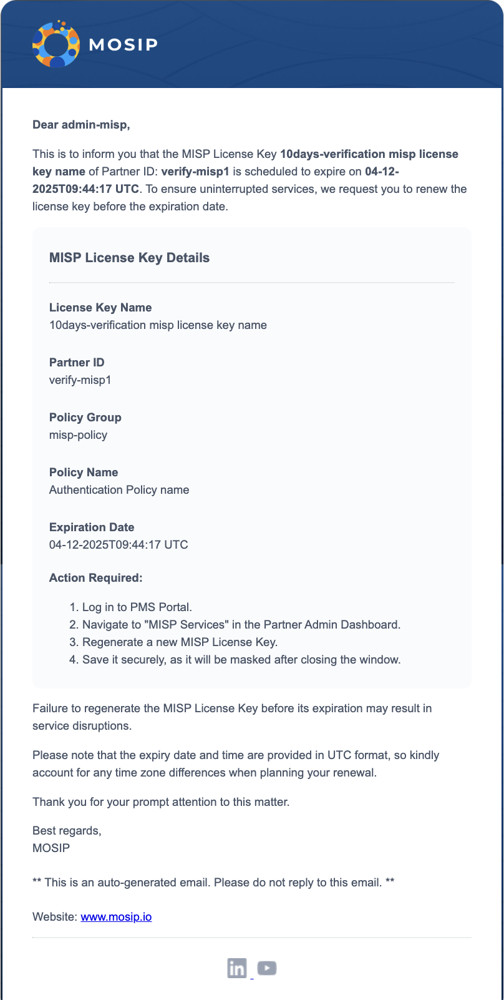<figcaption></figcaption></figure>

MISP-license-key-expiration-email-notification

#### Weekly Summary of Partner Certificate expiration email notification:

<figure>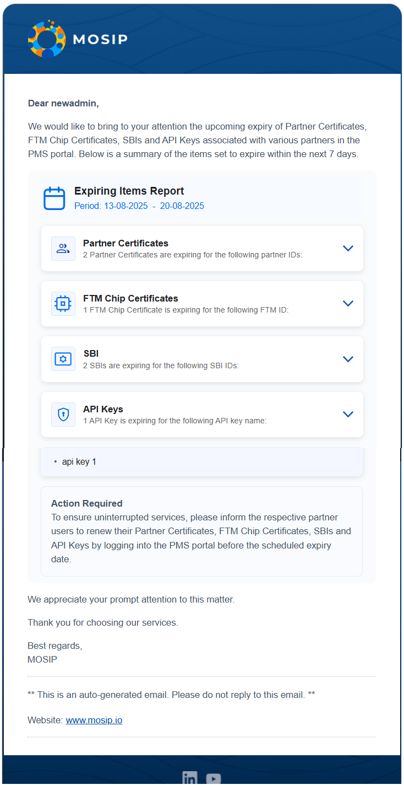<figcaption></figcaption></figure>

If one or more partner items are not due to expire in a given week’s summary, the email notification will include only the details of the items that are expiring.

### Important Notes

#### 1) Notification Schedule (PMS Portal & Email):

**a) Root & Intermediate CA Certificate expiration:**

* **First Notification** is generated **30 days prior** to expiry.
* **Follow-up Notifications** are triggered at:
  * **15 days**
  * **Daily from 10 days before expiry until the certificate expires**
* Notifications are triggered **regardless of whether the certificate is renewed**.
* All Partner Admins receive the same notification, regardless of who uploaded the certificate.
* **Newly added Partner Admins** start receiving notifications from the next scheduled batch job.

**b) MISP license key expiration:**

* **First Notification** is generated **30 days prior** to expiry.
* **Follow-up Notifications** are triggered at:
  * **15 days**
  * **Daily from 10 days before expiry until the MISP license key expires**
* All Partner Admins receive the same notification, regardless of who created the MISP license key.
* **Newly added Partner Admins** start receiving notifications from the next scheduled batch job.

**c) Weekly Summary of Partner specific items expiration:**

* A summary of all partner certificates, FTM Chip Certificates, API Keys and SBIs expiring within the next 7 days is generated and sent once every week.

#### 2) Notification Refresh Behavior

* Each time a notification is dismissed, the panel auto-fetches the **next available notification** to maintain a maximum of **4 visible notifications**.
* If no further notifications are available, a message is displayed:

**"No Notifications Yet - You have no notifications at the moment."**

<figure>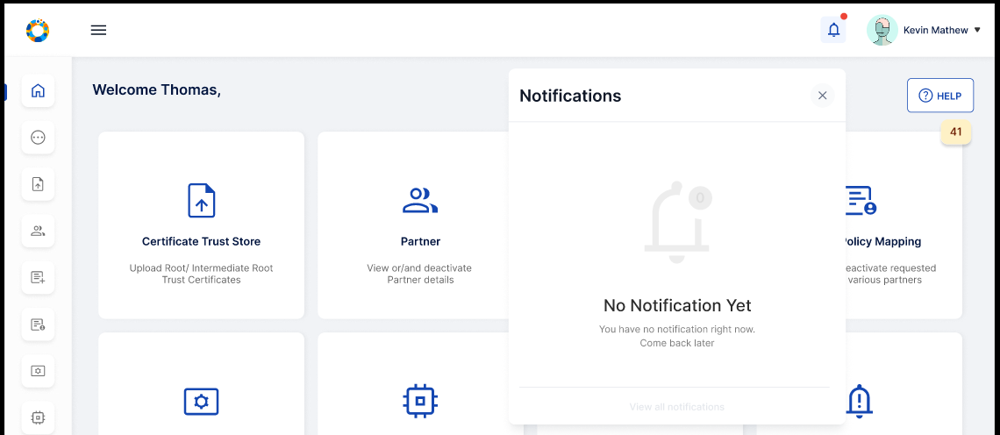<figcaption></figcaption></figure>

#### 3 Language Preference

* The **notification language on PMS portal is based on the language selected at login**, which **overrides** the default language selected at registration.
* This ensures that the notification content is always shown in the **current session language** for the user.
* On the other hand, Email notifications are sent in the language selected by the user at the time of registration.

#### 4 Notification Retention:

* Notifications from the past 60 days are retained and available on the PMS portal. Any notification older than 60 days is automatically deleted from the system.

## Partner Notifications

Every partner receives notifications for partner certificates they have uploaded, as well as the corresponding MOSIP-signed certificates which are due for expiry within the next 30 days, and is delivered both on the PMS Portal and via email.

In addition, partner-type-specific notifications are generated for the following:

* FTM Chip Certificates – for partner type: **FTM Chip Provider**
* API Keys – for partner type: **Authentication Partner**
* SBIs – for partner type: **Device Provider**

Each of these notifications is triggered when the respective item is due to expire within the next 30 days, and is sent both on the PMS Portal and via email.

These notifications are accessible to all applicable partner users via the **Notification Bell icon** in the top-right corner of the PMS portal.

<figure>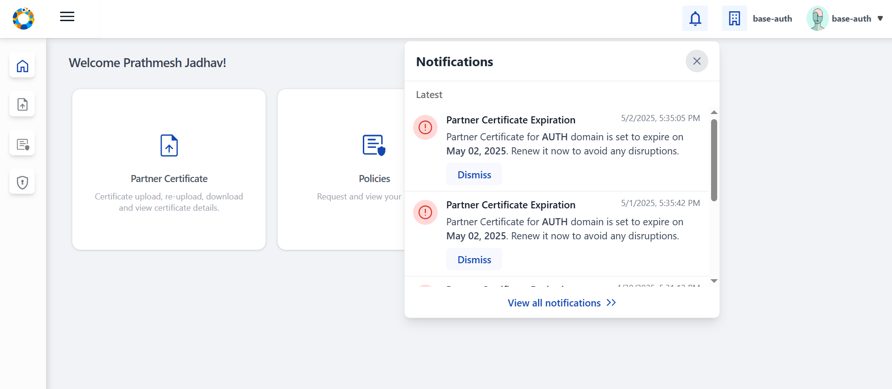<figcaption></figcaption></figure>

**FTM Chip Certificate Notification (FTM Chip Provider)**

<figure><figcaption></figcaption></figure>

**SBI Notification (Device Provider)**

<figure>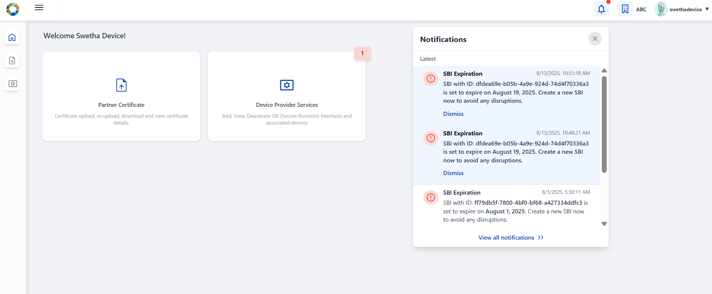<figcaption></figcaption></figure>

**API Key Notification (Authentication Partner)**

<figure>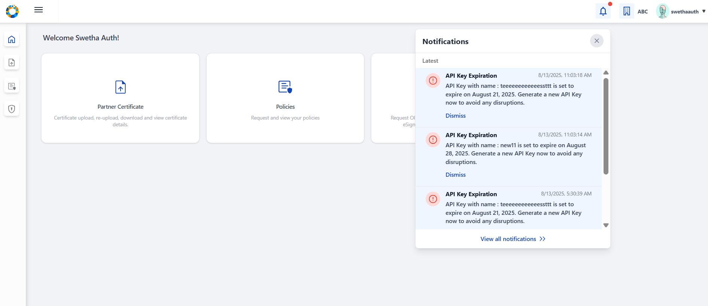<figcaption></figcaption></figure>

### Navigating through the interface to view or act on the notifications

#### Notification Panel

* A red alert on the notification bell icon indicates a new notification been triggered.
* Clicking the bell icon opens a dropdown panel showing the **latest 4 notifications**.

<figure><figcaption></figcaption></figure>

* Each Partner Certificate notification appears as a row with:
  * **Title**
  * **Timestamp of notification creation** (displayed in user's local system time based on browser settings)
  * **Description**: Includes **partner domain name**, and the **certificate's expiry date**
  * **Dismiss** button to remove that specific notification (removes from both Notification panel and Notification list page)
* Each FTM Chip Certificate notification appears as a row with:
  * **Title**
  * **Timestamp of notification creation** (displayed in user’s local system time based on browser settings)
  * **Description**: Includes **FTM ID**, and the **FTM Chip certificate’s expiry date**
  * **Dismiss** button to remove that specific notification (removes from both Notification panel and Notification list page)
* Each SBI notification appears as a row with:
  * **Title**
  * **Timestamp of notification creation** (displayed in user’s local system time based on browser settings)
  * **Description**: Includes **SBI ID**, and the **SBI’s expiry date**
  * **Dismiss** button to remove that specific notification (removes from both Notification panel and Notification list page)
* Each API Key notification appears as a row with:
  * **Title**
  * **Timestamp of notification creation** (displayed in user’s local system time based on browser settings)
  *   **Description**: Includes **API Key Name**, and the **API Key’s expiry date**

      **Dismiss** button to remove that specific notification (removes from both Notification panel and Notification list page)

### View All Notifications

* Click **"View All Notifications"** at the bottom of the panel to access the full **Notifications Page** where the 'Partner Certificate' tab displays list of partner certificates nearing expiry within the next 30 days.
* Each notification displays the expiring partner certificate details as shown below:

<figure>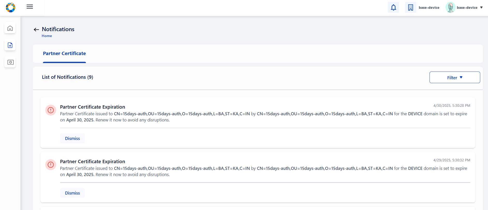<figcaption></figcaption></figure>

* To filter the certificate results, click the **Filter** button and enter one or more of the following fields: Certificate ID, Issued By, Issued To, Partner Domain, or Certificate Expiry Date to perform a targeted search.

<figure>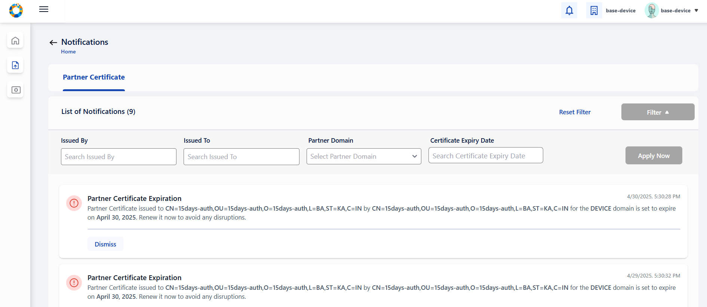<figcaption></figcaption></figure>

* **Dismiss** button to remove that specific notification (removes from both Notification panel and Notification list page)

### Which other places you receive the notifications?

#### Certificate Trust Store Badge

* The **Certificate Trust Store** card displays a **red badge** indicating the total count of Partner certificates **expiring in the next 30 days**.

### Email Notifications:

Email alerts are sent to the partner's registered email address for Partner certificates expiring within the next 30 days.

<figure>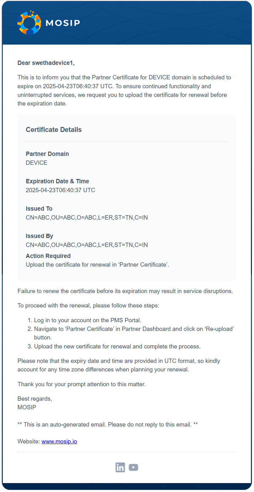<figcaption></figcaption></figure>

### Important Notes

#### 1. Notification Schedule (PMS Portal & Email)

* **First Notification** is generated **30 days prior** to expiry.
* **Follow-up Notifications** are triggered at:
  * **15 days**
  * **Daily from 10 days before expiry until the certificate expires**
* Notifications are triggered **regardless of whether the certificate is renewed**.

#### 2. Notification Refresh Behavior

* Each time a notification is dismissed, the notification panel auto-fetches the **next available notification** to maintain a maximum of **4 visible notifications**.
* If no further notifications are available, a message is displayed:

**"No Notifications Yet -- You have no notifications at the moment."**

<figure><figcaption></figcaption></figure>

#### 3. Language Preference

* The **notification language on PMS portal is based on the language selected at login**, which **overrides** the default language selected at registration.
* This ensures that the notification content is always shown in the **current session language** for the user.
* On the other hand, Email notifications are sent in the language selected by the user at the time of registration.

#### 4. Notification Retention

* Notifications from the past 60 days are retained and available on the PMS portal. Any notification older than 60 days is automatically deleted from the system.
* If a **partner certificate is renewed before its expiry date**, alls subsequent notifications related to that certificate are automatically discontinued..
