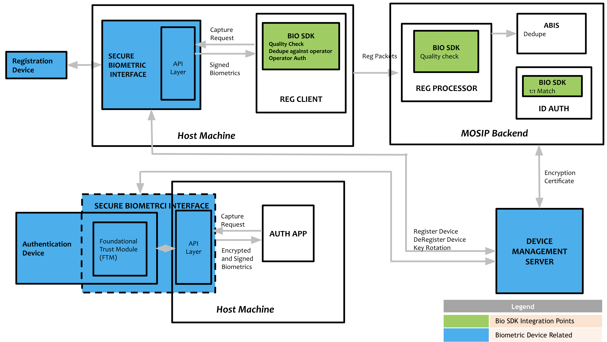

# Biometric SDK

## Biometric SDK

### Overview

The BioSDK diagram illustrates how MOSIP integrates biometric devices for registration and authentication. It shows the flow of biometric data from capture devices through the Secure Biometric Interface (SBI) to the BioSDK, which performs quality checks, deduplication, and operator authentication.

For registration, signed biometrics are sent to the MOSIP backend, where the BioSDK ensures data quality, ABIS handles deduplication, and ID Auth manages 1:1 matching. During authentication, encrypted biometrics are verified via the authentication app. Device management, including registration, deregistration, and key rotation, is handled by the Device Management Server.



### Applications

* Registration Client.
* Backend quality check.
* Biometric authentication during onboarding (internal auth).
* ID Authentications.

### Biometric SDK library

The library is used by the [Registration Client](../../identity-issuance/registration-client/) to perform 1:N match, segmentation, extraction, etc. For more information on integration with Registration Client, refer to the [Registration Client Biometric SDK Integration Guide](../../../registration-client-sdk-integration.md).

A simulation of this library is available as [Mock BioSDK](https://github.com/mosip/mosip-mock-services/tree/release-1.2.0/mock-sdk). The same is installed in the [MOSIP sandbox](../../../readme/technology/sandbox-details.md).

### Biometric SDK service

For 1:1 match and quality check of biometrics at the MOSIP backend, the BioSDK must be running as a service that can be accessed by [Registration Processor](../../identity-issuance/registration-processor/) and [IDA Internal Services](../../identity-verification/id-authentication-services/#internal-services). The service exposes REST APIs specified [here](biometric-sdk.md#api).

A [simulation (mock) service](https://github.com/mosip/biosdk-services/tree/release-1.2.0) has been provided. The mock service loads [mock BioSDK](https://github.com/mosip/mosip-mock-services/tree/release-1.2.0/mock-sdk) internally on the startup and exposes the endpoints to perform 1:N match, segmentation, and extraction as per [IBioAPI](https://github.com/mosip/commons/blob/release-1.2.0/kernel/kernel-biometrics-api/src/main/java/io/mosip/kernel/biometrics/spi/IBioApi.java).

The service may be packaged as a docker running inside the [MOSIP Kubernetes cluster](https://github.com/mosip/mosip-infra/blob/release-1.2.0/deployment/v3/cluster/README.md) or running separately on a server. The scalability of this service must be taken care of depending on the load on the system, i.e., the rate of enrolment and ID authentication.

### API

1. BioSDK library: [IBioAPIV2](https://github.com/mosip/bio-utils/blob/4a708ba24e9553dc187ecae468b07987744431c8/kernel-biometrics-api/src/main/java/io/mosip/kernel/biometrics/spi/IBioApiV2.java#L15)
2. BioSDK service: TBD.

### Testing kit

BioSDK server request/response may be tested using the [BioSDK testing kit](https://github.com/mosip/biosdk-testing-kit.git).

### Configuration

The following properties in [`application-default.properties`](biometric-sdk.md) needs to be updated to integrate the BioSDK library and service with MOSIP.

```properties
mosip.fingerprint.provider=io.mosip.kernel.bioapi.impl.BioApiImpl
mosip.face.provider=io.mosip.kernel.bioapi.impl.BioApiImpl
mosip.iris.provider=io.mosip.kernel.bioapi.impl.BioApiImpl
mosip.ida.biosdk-service.url=http://mock-biosdk-service.default:80
mosip.regproc.biosdk-service.url=http://mock-biosdk-service.default:80
mosip.idrepo.biosdk-service.url=http://mock-biosdk-service.default:80
```


## BIOSDK Scenarios & Sample Payloads

Below are various biometric capture and response scenarios, each accompanied by sample request and response JSON payloads. These examples illustrate how different modalities (such as iris, fingerprint, and face) are represented in the payloads, including normal captures, partial exceptions, and total exceptions.

For a comprehensive understanding of the structure, parameters, and field definitions used in these payloads, please refer to the [CBEFF Sample](https://docs.mosip.io/1.2.0/id-lifecycle-management/supporting-components/biometrics/cbeff-xml#cbeff-sample). The CBEFF (Common Biometric Exchange Formats Framework) standard defines the organization of biometric data blocks, metadata, and segment information, ensuring interoperability and consistency across biometric systems.

Each scenario includes:

* A brief description of the use case (e.g., both eyes captured, single finger, exception cases).
* Sample JSON payloads for both request and response, demonstrating the expected structure and key fields.
* Explanations of how to indicate exceptions or missing modalities within the payloads.

Refer to the linked CBEFF documentation for detailed definitions of fields such as `bdb`, `sb`, `quality`, `EXCEPTION`, and others.


## Both Eyes Capture

Sample payloads demonstrating a normal capture scenario where biometric data for both eyes (Left and Right) is collected. This request structure is used when capturing both eyes without any exceptions or missing modalities.


### Request and Response Samples




```json
{
	"sample": {
		"segments": [
			{
				"version": {
					"major": 1,
					"minor": 1
				},
				"cbeffversion": {
					"major": 1,
					"minor": 1
				},
				"birInfo": {
					"integrity": false
				},
				"bdbInfo": {
					"index": "d118f98b-1556-495b-9678-bd567bf3062e",
					"format": {
						"organization": "Mosip",
						"type": "9"
					},
					"creationDate": {
						"date": {
							"year": 2025,
							"month": 5,
							"day": 7
						},
						"time": {
							"hour": 11,
							"minute": 28,
							"second": 19,
							"nano": 371670900
						}
					},
					"type": [
						"IRIS"
					],
					"subtype": [
						"Left"
					],
					"level": "RAW",
					"purpose": "ENROLL",
					"quality": {
						"algorithm": {
							"organization": "HMAC",
							"type": "SHA-256"
						},
						"score": 100
					}
				},
				"bdb":[], // RklSADAyMA\..... 
				"sb": [], // ZXlKNE5XTWlP.....
				"others": {
					"SPEC_VERSION": "0.9.5",
					"RETRIES": "1",
					"FORCE_CAPTURED": "false",
					"EXCEPTION": "false",
					"PAYLOAD": "{\n    \"digitalId\": \"ewogICAgImFsZyI6ICJSUzI1NiIsCiAgICAidHlwIjogIkpXVCIsCiAgICAieDVjIjogWwogICAgICAgICJNSUlEZERDQ0FseWdBd0lCQWdJRU1vWWRPekFOQmdrcWhraUc5dzBCQVFzRkFEQmtNUXN3Q1FZRFZRUUdFd0pWVXpFUk1BOEdBMVVFQ0F3SVZtbHlaMmx1YVdFeEVEQU9CZ05WQkFjTUIwWmhhWEptWVhneEV6QVJCZ05WQkFvTUNrbHlhVlJsWTJoSmJtTXhHekFaQmdOVkJBTU1Fa2x5YVZSbFkyaEpibU1nVTNSaFoybHVaekFlRncweU5UQTFNRGN4TVRFNU16WmFGdzB5TlRBMk1EWXhNVEU1TXpaYU1GQXhDekFKQmdOVkJBWVRBbFZUTVJNd0VRWURWUVFMRXdwTllXNWhaMlZ0Wlc1ME1STXdFUVlEVlFRS0V3cEpjbWxVWldOb1NXNWpNUmN3RlFZRFZRUURFdzVKY21sVVpXTm9JRVJsZG1salpUQ0NBU0l3RFFZSktvWklodmNOQVFFQkJRQURnZ0VQQURDQ0FRb0NnZ0VCQUtkQ1R5Mm9PTm5oWEZEOGl5Y3ZxVkF4dnY2MDJ6SW1mUFJUdzVpTWxTZDZDODlCOEI4SjVVVjA2d1JEVk9hOWN4TzFvcGQ4TktHdEtMdTlRV1dCazRTRGRjQTAxV2xZZjA4bURNVFlvOVVDOG8rNzk0azdKK2RuUDZBR3pTOEhrTkxGQW5vTklpUkpSeTVGR0pjRlFJMUtpVExqRHJKbTRzU3NoeERFZXZpVmt5NWtoNkRSYjMwbUJuakZ5TnBpMHN2ZHFpSUVvZDc3NXFxZEdLVUxNOUp3ay9FamwvVGxLZ29YL3dQMmFLeEJqdjcydWhtL3F5dGp0SkhiMkFSdndjeG9VMUNMVUk4czRsNUVVL0lKYzRsSW1oejc3QUZHS0NUTzg5YW1qYlZPbFZ6SnF0UHVCZUhsTnBaSjVxTnRuOFNzSjlSK3RINmdoUVpORk53VThZOENBd0VBQWFOQ01FQXdIUVlEVlIwT0JCWUVGTi93RzExNkFLOURlb0pSU0pSYTE4TjBmRTE3TUI4R0ExVWRJd1FZTUJhQUZDRU5pcE1NNjZkVHFSVXJBNHVXbG9udnlCUk9NQTBHQ1NxR1NJYjNEUUVCQ3dVQUE0SUJBUUJwVnVpS2YydG94TzBsTU1FNVNMYWhFcGxKQlpNU2kzNHdMcUZKZi92NWtsVkNMaHl0ZDBZa2dRVlB6dytXR0VaaWxIeFkzYkFjZTZDeVQzYjBQZzZFbTJKYjZmMmxwK0ttRUdkOVcrblByYVF2L0MrOFlwV3MrWDJkSm5WTGhsOHpDcWxPV09YQ3JwM1VFZTU5NktyZkxJbFRLUWJBZy9kZ3hPQy9NYzZxTTgvZWpzTFFlaytrdkwvWmVHMjJiSFlPcUFBc3ZTL1RlZ3FOa2E4d2xIYWtOVHNDMWw5aWppeUdUWVlSRytIMStlN3hvUzc2T3paZXFlajhpc1orNk9kZGV2NEs4eTBIaE8xeE1GMUhYUGZhUFdKak5hL0lxY1NTY1lpaWZnMGVobENrNVdDYVNtUlo1R0RhWDF0S3dKbUtydWVjUmFxOFgrRXdWaEgwc1dORiIKICAgIF0KfQ.ewogICAgInNlcmlhbE5vIjogIkRGMDA1MjAwMDAxOTg2OUEiLAogICAgIm1ha2UiOiAiSXJpU2hpZWxkIiwKICAgICJtb2RlbCI6ICJCSzIxMjFVIiwKICAgICJ0eXBlIjogIklyaXMiLAogICAgImRldmljZVN1YlR5cGUiOiAiRG91YmxlIiwKICAgICJkZXZpY2VQcm92aWRlciI6ICJJcmlUZWNoIiwKICAgICJkZXZpY2VQcm92aWRlcklkIjogIklyaVRlY2giLAogICAgImRhdGVUaW1lIjogIjIwMjUtMDUtMDdUMTE6Mjc6MTVaIgp9.pP0tNusUshMxSxFWVkZrDA_T3qk0p1g5ffFjQWp83U26Rk8DDp83btLoQP3n_5Su5g_T0vvbQa4Y9M0uuul4yroe6lArK5tcB4dPNmREs4NKPUlGOyel7w6RYQZ41Uw5vNk7MLyet7zLbwNxCzDj5Nafli1y4pSJMmXpB4Nmdk4VGupSN3vTnbAIlofPhxda1Fj-943Z06Km7ddBo7fHMDsIMlkIvckwmMcxuBE1rMKT6I7s1GzFlM2Ma9IK54qUrGmRUUJzP7HXiB8ga6J1UYSjNe0lofWYaWm0j_PhpqKrIW9JV3lVIX4A_W1ugUGcaHqKidTjNHaSGW6zx11bPA\",\n    \"deviceCode\": \"DF0052000019869A\",\n    \"deviceServiceVersion\": \"0.9.5\",\n    \"bioType\": \"Iris\",\n    \"bioSubType\": \"Left\",\n    \"purpose\": \"Registration\",\n    \"env\": \"Staging\",\n    \"bioValue\": \"<bioValue>\",\n    \"transactionId\": \"61133ef7-1d97-4208-a6fa-4fedca30ac86\",\n    \"timestamp\": \"2025-05-07T11:27:13Z\",\n    \"requestedScore\": \"80\",\n    \"qualityScore\": \"100\"\n}",
					"SDK_SCORE": "100.0"
				}
			},
			{
				"version": {
					"major": 1,
					"minor": 1
				},
				"cbeffversion": {
					"major": 1,
					"minor": 1
				},
				"birInfo": {
					"integrity": false
				},
				"bdbInfo": {
					"index": "34fdeea8-3376-498a-a7ba-e3c4a206b78d",
					"format": {
						"organization": "Mosip",
						"type": "9"
					},
					"creationDate": {
						"date": {
							"year": 2025,
							"month": 5,
							"day": 7
						},
						"time": {
							"hour": 11,
							"minute": 28,
							"second": 19,
							"nano": 371670900
						}
					},
					"type": [
						"IRIS"
					],
					"subtype": [
						"Right"
					],
					"level": "RAW",
					"purpose": "ENROLL",
					"quality": {
						"algorithm": {
							"organization": "HMAC",
							"type": "SHA-256"
						},
						"score": 100
					}
				},
				"bdb": [], // ZXlKNE5XTWlP.....
				"sb": [], // ZXlKNE5XTWlP.....
				"others": {
					"SPEC_VERSION": "0.9.5",
					"RETRIES": "1",
					"FORCE_CAPTURED": "false",
					"EXCEPTION": "false",
					"PAYLOAD": "{\n    \"digitalId\": \"ewogICAgImFsZyI6ICJSUzI1NiIsCiAgICAidHlwIjogIkpXVCIsCiAgICAieDVjIjogWwogICAgICAgICJNSUlEZERDQ0FseWdBd0lCQWdJRU1vWWRPekFOQmdrcWhraUc5dzBCQVFzRkFEQmtNUXN3Q1FZRFZRUUdFd0pWVXpFUk1BOEdBMVVFQ0F3SVZtbHlaMmx1YVdFeEVEQU9CZ05WQkFjTUIwWmhhWEptWVhneEV6QVJCZ05WQkFvTUNrbHlhVlJsWTJoSmJtTXhHekFaQmdOVkJBTU1Fa2x5YVZSbFkyaEpibU1nVTNSaFoybHVaekFlRncweU5UQTFNRGN4TVRFNU16WmFGdzB5TlRBMk1EWXhNVEU1TXpaYU1GQXhDekFKQmdOVkJBWVRBbFZUTVJNd0VRWURWUVFMRXdwTllXNWhaMlZ0Wlc1ME1STXdFUVlEVlFRS0V3cEpjbWxVWldOb1NXNWpNUmN3RlFZRFZRUURFdzVKY21sVVpXTm9JRVJsZG1salpUQ0NBU0l3RFFZSktvWklodmNOQVFFQkJRQURnZ0VQQURDQ0FRb0NnZ0VCQUtkQ1R5Mm9PTm5oWEZEOGl5Y3ZxVkF4dnY2MDJ6SW1mUFJUdzVpTWxTZDZDODlCOEI4SjVVVjA2d1JEVk9hOWN4TzFvcGQ4TktHdEtMdTlRV1dCazRTRGRjQTAxV2xZZjA4bURNVFlvOVVDOG8rNzk0azdKK2RuUDZBR3pTOEhrTkxGQW5vTklpUkpSeTVGR0pjRlFJMUtpVExqRHJKbTRzU3NoeERFZXZpVmt5NWtoNkRSYjMwbUJuakZ5TnBpMHN2ZHFpSUVvZDc3NXFxZEdLVUxNOUp3ay9FamwvVGxLZ29YL3dQMmFLeEJqdjcydWhtL3F5dGp0SkhiMkFSdndjeG9VMUNMVUk4czRsNUVVL0lKYzRsSW1oejc3QUZHS0NUTzg5YW1qYlZPbFZ6SnF0UHVCZUhsTnBaSjVxTnRuOFNzSjlSK3RINmdoUVpORk53VThZOENBd0VBQWFOQ01FQXdIUVlEVlIwT0JCWUVGTi93RzExNkFLOURlb0pSU0pSYTE4TjBmRTE3TUI4R0ExVWRJd1FZTUJhQUZDRU5pcE1NNjZkVHFSVXJBNHVXbG9udnlCUk9NQTBHQ1NxR1NJYjNEUUVCQ3dVQUE0SUJBUUJwVnVpS2YydG94TzBsTU1FNVNMYWhFcGxKQlpNU2kzNHdMcUZKZi92NWtsVkNMaHl0ZDBZa2dRVlB6dytXR0VaaWxIeFkzYkFjZTZDeVQzYjBQZzZFbTJKYjZmMmxwK0ttRUdkOVcrblByYVF2L0MrOFlwV3MrWDJkSm5WTGhsOHpDcWxPV09YQ3JwM1VFZTU5NktyZkxJbFRLUWJBZy9kZ3hPQy9NYzZxTTgvZWpzTFFlaytrdkwvWmVHMjJiSFlPcUFBc3ZTL1RlZ3FOa2E4d2xIYWtOVHNDMWw5aWppeUdUWVlSRytIMStlN3hvUzc2T3paZXFlajhpc1orNk9kZGV2NEs4eTBIaE8xeE1GMUhYUGZhUFdKak5hL0lxY1NTY1lpaWZnMGVobENrNVdDYVNtUlo1R0RhWDF0S3dKbUtydWVjUmFxOFgrRXdWaEgwc1dORiIKICAgIF0KfQ.ewogICAgInNlcmlhbE5vIjogIkRGMDA1MjAwMDAxOTg2OUEiLAogICAgIm1ha2UiOiAiSXJpU2hpZWxkIiwKICAgICJtb2RlbCI6ICJCSzIxMjFVIiwKICAgICJ0eXBlIjogIklyaXMiLAogICAgImRldmljZVN1YlR5cGUiOiAiRG91YmxlIiwKICAgICJkZXZpY2VQcm92aWRlciI6ICJJcmlUZWNoIiwKICAgICJkZXZpY2VQcm92aWRlcklkIjogIklyaVRlY2giLAogICAgImRhdGVUaW1lIjogIjIwMjUtMDUtMDdUMTE6Mjc6MTVaIgp9.pP0tNusUshMxSxFWVkZrDA_T3qk0p1g5ffFjQWp83U26Rk8DDp83btLoQP3n_5Su5g_T0vvbQa4Y9M0uuul4yroe6lArK5tcB4dPNmREs4NKPUlGOyel7w6RYQZ41Uw5vNk7MLyet7zLbwNxCzDj5Nafli1y4pSJMmXpB4Nmdk4VGupSN3vTnbAIlofPhxda1Fj-943Z06Km7ddBo7fHMDsIMlkIvckwmMcxuBE1rMKT6I7s1GzFlM2Ma9IK54qUrGmRUUJzP7HXiB8ga6J1UYSjNe0lofWYaWm0j_PhpqKrIW9JV3lVIX4A_W1ugUGcaHqKidTjNHaSGW6zx11bPA\",\n    \"deviceCode\": \"DF0052000019869A\",\n    \"deviceServiceVersion\": \"0.9.5\",\n    \"bioType\": \"Iris\",\n    \"bioSubType\": \"Right\",\n    \"purpose\": \"Registration\",\n    \"env\": \"Staging\",\n    \"bioValue\": \"<bioValue>\",\n    \"transactionId\": \"61133ef7-1d97-4208-a6fa-4fedca30ac86\",\n    \"timestamp\": \"2025-05-07T11:27:13Z\",\n    \"requestedScore\": \"80\",\n    \"qualityScore\": \"100\"\n}",
					"SDK_SCORE": "100.0"
				}
			}
		],
		"others": {}
	},
	"modalitiesToExtract": [
		"IRIS"
	],
	"flags": {
		"iris.format": "Iris"
	}
}
```



```json
{
	"version": "0.9",
	"responsetime": "2025-05-07T13:28:58.379Z",
	"response": {
		"statusCode": 200,
		"statusMessage": "OK",
		"response": {
			"version": null,
			"cbeffversion": null,
			"birInfo": null,
			"segments": [
				{
					"version": {
						"major": 1,
						"minor": 1
					},
					"cbeffversion": {
						"major": 1,
						"minor": 1
					},
					"birInfo": {
						"creator": null,
						"index": null,
						"payload": null,
						"integrity": false,
						"creationDate": null,
						"notValidBefore": null,
						"notValidAfter": null
					},
					"bdbInfo": {
						"challengeResponse": null,
						"index": "d118f98b-1556-495b-9678-bd567bf3062e",
						"format": {
							"organization": "Mosip",
							"type": "9"
						},
						"encryption": null,
						"creationDate": {
							"date": {
								"year": 2025,
								"month": 5,
								"day": 7
							},
							"time": {
								"hour": 11,
								"minute": 28,
								"second": 19,
								"nano": 371670900
							}
						},
						"notValidBefore": null,
						"notValidAfter": null,
						"type": [
							"IRIS"
						],
						"subtype": [
							"Left"
						],
						"level": "PROCESSED",
						"product": null,
						"captureDevice": null,
						"featureExtractionAlgorithm": null,
						"comparisonAlgorithm": null,
						"compressionAlgorithm": null,
						"purpose": "VERIFY",
						"quality": {
							"algorithm": {
								"organization": "HMAC",
								"type": "SHA-256"
							},
							"score": 100,
							"qualityCalculationFailed": null
						}
					},
					"bdb": [], // ZXlKNE5XTWlP.....
					"sb": null,
					"birs": null,
					"sbInfo": null,
					"others": {}
				},
				{
					"version": {
						"major": 1,
						"minor": 1
					},
					"cbeffversion": {
						"major": 1,
						"minor": 1
					},
					"birInfo": {
						"creator": null,
						"index": null,
						"payload": null,
						"integrity": false,
						"creationDate": null,
						"notValidBefore": null,
						"notValidAfter": null
					},
					"bdbInfo": {
						"challengeResponse": null,
						"index": "34fdeea8-3376-498a-a7ba-e3c4a206b78d",
						"format": {
							"organization": "Mosip",
							"type": "9"
						},
						"encryption": null,
						"creationDate": {
							"date": {
								"year": 2025,
								"month": 5,
								"day": 7
							},
							"time": {
								"hour": 11,
								"minute": 28,
								"second": 19,
								"nano": 371670900
							}
						},
						"notValidBefore": null,
						"notValidAfter": null,
						"type": [
							"IRIS"
						],
						"subtype": [
							"Right"
						],
						"level": "PROCESSED",
						"product": null,
						"captureDevice": null,
						"featureExtractionAlgorithm": null,
						"comparisonAlgorithm": null,
						"compressionAlgorithm": null,
						"purpose": "VERIFY",
						"quality": {
							"algorithm": {
								"organization": "HMAC",
								"type": "SHA-256"
							},
							"score": 100,
							"qualityCalculationFailed": null
						}
					},
					"bdb": [], // Sample data for Right Iris
					"sb": null,
					"birs": null,
					"sbInfo": null,
					"others": {}
				}
			],
			"others": {}
		}
	},
	"errors": []
}
```



### Request and Response Samples

#### Request

<details>

<summary>Request</summary>

```json
{
	"sample": {
		"segments": [
			{
				"version": {
					"major": 1,
					"minor": 1
				},
				"cbeffversion": {
					"major": 1,
					"minor": 1
				},
				"birInfo": {
					"integrity": false
				},
				"bdbInfo": {
					"index": "d118f98b-1556-495b-9678-bd567bf3062e",
					"format": {
						"organization": "Mosip",
						"type": "9"
					},
					"creationDate": {
						"date": {
							"year": 2025,
							"month": 5,
							"day": 7
						},
						"time": {
							"hour": 11,
							"minute": 28,
							"second": 19,
							"nano": 371670900
						}
					},
					"type": [
						"IRIS"
					],
					"subtype": [
						"Left"
					],
					"level": "RAW",
					"purpose": "ENROLL",
					"quality": {
						"algorithm": {
							"organization": "HMAC",
							"type": "SHA-256"
						},
						"score": 100
					}
				},
				"bdb":[], // RklSADAyMA\..... 
				"sb": [], // ZXlKNE5XTWlP.....
				"others": {
					"SPEC_VERSION": "0.9.5",
					"RETRIES": "1",
					"FORCE_CAPTURED": "false",
					"EXCEPTION": "false",
					"PAYLOAD": "{\n    \"digitalId\": \"ewogICAgImFsZyI6ICJSUzI1NiIsCiAgICAidHlwIjogIkpXVCIsCiAgICAieDVjIjogWwogICAgICAgICJNSUlEZERDQ0FseWdBd0lCQWdJRU1vWWRPekFOQmdrcWhraUc5dzBCQVFzRkFEQmtNUXN3Q1FZRFZRUUdFd0pWVXpFUk1BOEdBMVVFQ0F3SVZtbHlaMmx1YVdFeEVEQU9CZ05WQkFjTUIwWmhhWEptWVhneEV6QVJCZ05WQkFvTUNrbHlhVlJsWTJoSmJtTXhHekFaQmdOVkJBTU1Fa2x5YVZSbFkyaEpibU1nVTNSaFoybHVaekFlRncweU5UQTFNRGN4TVRFNU16WmFGdzB5TlRBMk1EWXhNVEU1TXpaYU1GQXhDekFKQmdOVkJBWVRBbFZUTVJNd0VRWURWUVFMRXdwTllXNWhaMlZ0Wlc1ME1STXdFUVlEVlFRS0V3cEpjbWxVWldOb1NXNWpNUmN3RlFZRFZRUURFdzVKY21sVVpXTm9JRVJsZG1salpUQ0NBU0l3RFFZSktvWklodmNOQVFFQkJRQURnZ0VQQURDQ0FRb0NnZ0VCQUtkQ1R5Mm9PTm5oWEZEOGl5Y3ZxVkF4dnY2MDJ6SW1mUFJUdzVpTWxTZDZDODlCOEI4SjVVVjA2d1JEVk9hOWN4TzFvcGQ4TktHdEtMdTlRV1dCazRTRGRjQTAxV2xZZjA4bURNVFlvOVVDOG8rNzk0azdKK2RuUDZBR3pTOEhrTkxGQW5vTklpUkpSeTVGR0pjRlFJMUtpVExqRHJKbTRzU3NoeERFZXZpVmt5NWtoNkRSYjMwbUJuakZ5TnBpMHN2ZHFpSUVvZDc3NXFxZEdLVUxNOUp3ay9FamwvVGxLZ29YL3dQMmFLeEJqdjcydWhtL3F5dGp0SkhiMkFSdndjeG9VMUNMVUk4czRsNUVVL0lKYzRsSW1oejc3QUZHS0NUTzg5YW1qYlZPbFZ6SnF0UHVCZUhsTnBaSjVxTnRuOFNzSjlSK3RINmdoUVpORk53VThZOENBd0VBQWFOQ01FQXdIUVlEVlIwT0JCWUVGTi93RzExNkFLOURlb0pSU0pSYTE4TjBmRTE3TUI4R0ExVWRJd1FZTUJhQUZDRU5pcE1NNjZkVHFSVXJBNHVXbG9udnlCUk9NQTBHQ1NxR1NJYjNEUUVCQ3dVQUE0SUJBUUJwVnVpS2YydG94TzBsTU1FNVNMYWhFcGxKQlpNU2kzNHdMcUZKZi92NWtsVkNMaHl0ZDBZa2dRVlB6dytXR0VaaWxIeFkzYkFjZTZDeVQzYjBQZzZFbTJKYjZmMmxwK0ttRUdkOVcrblByYVF2L0MrOFlwV3MrWDJkSm5WTGhsOHpDcWxPV09YQ3JwM1VFZTU5NktyZkxJbFRLUWJBZy9kZ3hPQy9NYzZxTTgvZWpzTFFlaytrdkwvWmVHMjJiSFlPcUFBc3ZTL1RlZ3FOa2E4d2xIYWtOVHNDMWw5aWppeUdUWVlSRytIMStlN3hvUzc2T3paZXFlajhpc1orNk9kZGV2NEs4eTBIaE8xeE1GMUhYUGZhUFdKak5hL0lxY1NTY1lpaWZnMGVobENrNVdDYVNtUlo1R0RhWDF0S3dKbUtydWVjUmFxOFgrRXdWaEgwc1dORiIKICAgIF0KfQ.ewogICAgInNlcmlhbE5vIjogIkRGMDA1MjAwMDAxOTg2OUEiLAogICAgIm1ha2UiOiAiSXJpU2hpZWxkIiwKICAgICJtb2RlbCI6ICJCSzIxMjFVIiwKICAgICJ0eXBlIjogIklyaXMiLAogICAgImRldmljZVN1YlR5cGUiOiAiRG91YmxlIiwKICAgICJkZXZpY2VQcm92aWRlciI6ICJJcmlUZWNoIiwKICAgICJkZXZpY2VQcm92aWRlcklkIjogIklyaVRlY2giLAogICAgImRhdGVUaW1lIjogIjIwMjUtMDUtMDdUMTE6Mjc6MTVaIgp9.pP0tNusUshMxSxFWVkZrDA_T3qk0p1g5ffFjQWp83U26Rk8DDp83btLoQP3n_5Su5g_T0vvbQa4Y9M0uuul4yroe6lArK5tcB4dPNmREs4NKPUlGOyel7w6RYQZ41Uw5vNk7MLyet7zLbwNxCzDj5Nafli1y4pSJMmXpB4Nmdk4VGupSN3vTnbAIlofPhxda1Fj-943Z06Km7ddBo7fHMDsIMlkIvckwmMcxuBE1rMKT6I7s1GzFlM2Ma9IK54qUrGmRUUJzP7HXiB8ga6J1UYSjNe0lofWYaWm0j_PhpqKrIW9JV3lVIX4A_W1ugUGcaHqKidTjNHaSGW6zx11bPA\",\n    \"deviceCode\": \"DF0052000019869A\",\n    \"deviceServiceVersion\": \"0.9.5\",\n    \"bioType\": \"Iris\",\n    \"bioSubType\": \"Left\",\n    \"purpose\": \"Registration\",\n    \"env\": \"Staging\",\n    \"bioValue\": \"<bioValue>\",\n    \"transactionId\": \"61133ef7-1d97-4208-a6fa-4fedca30ac86\",\n    \"timestamp\": \"2025-05-07T11:27:13Z\",\n    \"requestedScore\": \"80\",\n    \"qualityScore\": \"100\"\n}",
					"SDK_SCORE": "100.0"
				}
			},
			{
				"version": {
					"major": 1,
					"minor": 1
				},
				"cbeffversion": {
					"major": 1,
					"minor": 1
				},
				"birInfo": {
					"integrity": false
				},
				"bdbInfo": {
					"index": "34fdeea8-3376-498a-a7ba-e3c4a206b78d",
					"format": {
						"organization": "Mosip",
						"type": "9"
					},
					"creationDate": {
						"date": {
							"year": 2025,
							"month": 5,
							"day": 7
						},
						"time": {
							"hour": 11,
							"minute": 28,
							"second": 19,
							"nano": 371670900
						}
					},
					"type": [
						"IRIS"
					],
					"subtype": [
						"Right"
					],
					"level": "RAW",
					"purpose": "ENROLL",
					"quality": {
						"algorithm": {
							"organization": "HMAC",
							"type": "SHA-256"
						},
						"score": 100
					}
				},
				"bdb": [], // ZXlKNE5XTWlP.....
				"sb": [], // ZXlKNE5XTWlP.....
				"others": {
					"SPEC_VERSION": "0.9.5",
					"RETRIES": "1",
					"FORCE_CAPTURED": "false",
					"EXCEPTION": "false",
					"PAYLOAD": "{\n    \"digitalId\": \"ewogICAgImFsZyI6ICJSUzI1NiIsCiAgICAidHlwIjogIkpXVCIsCiAgICAieDVjIjogWwogICAgICAgICJNSUlEZERDQ0FseWdBd0lCQWdJRU1vWWRPekFOQmdrcWhraUc5dzBCQVFzRkFEQmtNUXN3Q1FZRFZRUUdFd0pWVXpFUk1BOEdBMVVFQ0F3SVZtbHlaMmx1YVdFeEVEQU9CZ05WQkFjTUIwWmhhWEptWVhneEV6QVJCZ05WQkFvTUNrbHlhVlJsWTJoSmJtTXhHekFaQmdOVkJBTU1Fa2x5YVZSbFkyaEpibU1nVTNSaFoybHVaekFlRncweU5UQTFNRGN4TVRFNU16WmFGdzB5TlRBMk1EWXhNVEU1TXpaYU1GQXhDekFKQmdOVkJBWVRBbFZUTVJNd0VRWURWUVFMRXdwTllXNWhaMlZ0Wlc1ME1STXdFUVlEVlFRS0V3cEpjbWxVWldOb1NXNWpNUmN3RlFZRFZRUURFdzVKY21sVVpXTm9JRVJsZG1salpUQ0NBU0l3RFFZSktvWklodmNOQVFFQkJRQURnZ0VQQURDQ0FRb0NnZ0VCQUtkQ1R5Mm9PTm5oWEZEOGl5Y3ZxVkF4dnY2MDJ6SW1mUFJUdzVpTWxTZDZDODlCOEI4SjVVVjA2d1JEVk9hOWN4TzFvcGQ4TktHdEtMdTlRV1dCazRTRGRjQTAxV2xZZjA4bURNVFlvOVVDOG8rNzk0azdKK2RuUDZBR3pTOEhrTkxGQW5vTklpUkpSeTVGR0pjRlFJMUtpVExqRHJKbTRzU3NoeERFZXZpVmt5NWtoNkRSYjMwbUJuakZ5TnBpMHN2ZHFpSUVvZDc3NXFxZEdLVUxNOUp3ay9FamwvVGxLZ29YL3dQMmFLeEJqdjcydWhtL3F5dGp0SkhiMkFSdndjeG9VMUNMVUk4czRsNUVVL0lKYzRsSW1oejc3QUZHS0NUTzg5YW1qYlZPbFZ6SnF0UHVCZUhsTnBaSjVxTnRuOFNzSjlSK3RINmdoUVpORk53VThZOENBd0VBQWFOQ01FQXdIUVlEVlIwT0JCWUVGTi93RzExNkFLOURlb0pSU0pSYTE4TjBmRTE3TUI4R0ExVWRJd1FZTUJhQUZDRU5pcE1NNjZkVHFSVXJBNHVXbG9udnlCUk9NQTBHQ1NxR1NJYjNEUUVCQ3dVQUE0SUJBUUJwVnVpS2YydG94TzBsTU1FNVNMYWhFcGxKQlpNU2kzNHdMcUZKZi92NWtsVkNMaHl0ZDBZa2dRVlB6dytXR0VaaWxIeFkzYkFjZTZDeVQzYjBQZzZFbTJKYjZmMmxwK0ttRUdkOVcrblByYVF2L0MrOFlwV3MrWDJkSm5WTGhsOHpDcWxPV09YQ3JwM1VFZTU5NktyZkxJbFRLUWJBZy9kZ3hPQy9NYzZxTTgvZWpzTFFlaytrdkwvWmVHMjJiSFlPcUFBc3ZTL1RlZ3FOa2E4d2xIYWtOVHNDMWw5aWppeUdUWVlSRytIMStlN3hvUzc2T3paZXFlajhpc1orNk9kZGV2NEs4eTBIaE8xeE1GMUhYUGZhUFdKak5hL0lxY1NTY1lpaWZnMGVobENrNVdDYVNtUlo1R0RhWDF0S3dKbUtydWVjUmFxOFgrRXdWaEgwc1dORiIKICAgIF0KfQ.ewogICAgInNlcmlhbE5vIjogIkRGMDA1MjAwMDAxOTg2OUEiLAogICAgIm1ha2UiOiAiSXJpU2hpZWxkIiwKICAgICJtb2RlbCI6ICJCSzIxMjFVIiwKICAgICJ0eXBlIjogIklyaXMiLAogICAgImRldmljZVN1YlR5cGUiOiAiRG91YmxlIiwKICAgICJkZXZpY2VQcm92aWRlciI6ICJJcmlUZWNoIiwKICAgICJkZXZpY2VQcm92aWRlcklkIjogIklyaVRlY2giLAogICAgImRhdGVUaW1lIjogIjIwMjUtMDUtMDdUMTE6Mjc6MTVaIgp9.pP0tNusUshMxSxFWVkZrDA_T3qk0p1g5ffFjQWp83U26Rk8DDp83btLoQP3n_5Su5g_T0vvbQa4Y9M0uuul4yroe6lArK5tcB4dPNmREs4NKPUlGOyel7w6RYQZ41Uw5vNk7MLyet7zLbwNxCzDj5Nafli1y4pSJMmXpB4Nmdk4VGupSN3vTnbAIlofPhxda1Fj-943Z06Km7ddBo7fHMDsIMlkIvckwmMcxuBE1rMKT6I7s1GzFlM2Ma9IK54qUrGmRUUJzP7HXiB8ga6J1UYSjNe0lofWYaWm0j_PhpqKrIW9JV3lVIX4A_W1ugUGcaHqKidTjNHaSGW6zx11bPA\",\n    \"deviceCode\": \"DF0052000019869A\",\n    \"deviceServiceVersion\": \"0.9.5\",\n    \"bioType\": \"Iris\",\n    \"bioSubType\": \"Right\",\n    \"purpose\": \"Registration\",\n    \"env\": \"Staging\",\n    \"bioValue\": \"<bioValue>\",\n    \"transactionId\": \"61133ef7-1d97-4208-a6fa-4fedca30ac86\",\n    \"timestamp\": \"2025-05-07T11:27:13Z\",\n    \"requestedScore\": \"80\",\n    \"qualityScore\": \"100\"\n}",
					"SDK_SCORE": "100.0"
				}
			}
		],
		"others": {}
	},
	"modalitiesToExtract": [
		"IRIS"
	],
	"flags": {
		"iris.format": "Iris"
	}
}
```

</details>

#### Response

<details>

<summary>Response</summary>

```json
{
	"version": "0.9",
	"responsetime": "2025-05-07T13:28:58.379Z",
	"response": {
		"statusCode": 200,
		"statusMessage": "OK",
		"response": {
			"version": null,
			"cbeffversion": null,
			"birInfo": null,
			"segments": [
				{
					"version": {
						"major": 1,
						"minor": 1
					},
					"cbeffversion": {
						"major": 1,
						"minor": 1
					},
					"birInfo": {
						"creator": null,
						"index": null,
						"payload": null,
						"integrity": false,
						"creationDate": null,
						"notValidBefore": null,
						"notValidAfter": null
					},
					"bdbInfo": {
						"challengeResponse": null,
						"index": "d118f98b-1556-495b-9678-bd567bf3062e",
						"format": {
							"organization": "Mosip",
							"type": "9"
						},
						"encryption": null,
						"creationDate": {
							"date": {
								"year": 2025,
								"month": 5,
								"day": 7
							},
							"time": {
								"hour": 11,
								"minute": 28,
								"second": 19,
								"nano": 371670900
							}
						},
						"notValidBefore": null,
						"notValidAfter": null,
						"type": [
							"IRIS"
						],
						"subtype": [
							"Left"
						],
						"level": "PROCESSED",
						"product": null,
						"captureDevice": null,
						"featureExtractionAlgorithm": null,
						"comparisonAlgorithm": null,
						"compressionAlgorithm": null,
						"purpose": "VERIFY",
						"quality": {
							"algorithm": {
								"organization": "HMAC",
								"type": "SHA-256"
							},
							"score": 100,
							"qualityCalculationFailed": null
						}
					},
					"bdb": [], // ZXlKNE5XTWlP.....
					"sb": null,
					"birs": null,
					"sbInfo": null,
					"others": {}
				},
				{
					"version": {
						"major": 1,
						"minor": 1
					},
					"cbeffversion": {
						"major": 1,
						"minor": 1
					},
					"birInfo": {
						"creator": null,
						"index": null,
						"payload": null,
						"integrity": false,
						"creationDate": null,
						"notValidBefore": null,
						"notValidAfter": null
					},
					"bdbInfo": {
						"challengeResponse": null,
						"index": "34fdeea8-3376-498a-a7ba-e3c4a206b78d",
						"format": {
							"organization": "Mosip",
							"type": "9"
						},
						"encryption": null,
						"creationDate": {
							"date": {
								"year": 2025,
								"month": 5,
								"day": 7
							},
							"time": {
								"hour": 11,
								"minute": 28,
								"second": 19,
								"nano": 371670900
							}
						},
						"notValidBefore": null,
						"notValidAfter": null,
						"type": [
							"IRIS"
						],
						"subtype": [
							"Right"
						],
						"level": "PROCESSED",
						"product": null,
						"captureDevice": null,
						"featureExtractionAlgorithm": null,
						"comparisonAlgorithm": null,
						"compressionAlgorithm": null,
						"purpose": "VERIFY",
						"quality": {
							"algorithm": {
								"organization": "HMAC",
								"type": "SHA-256"
							},
							"score": 100,
							"qualityCalculationFailed": null
						}
					},
					"bdb": [], // Sample data for Right Iris
					"sb": null,
					"birs": null,
					"sbInfo": null,
					"others": {}
				}
			],
			"others": {}
		}
	},
	"errors": []
}
```

</details>
