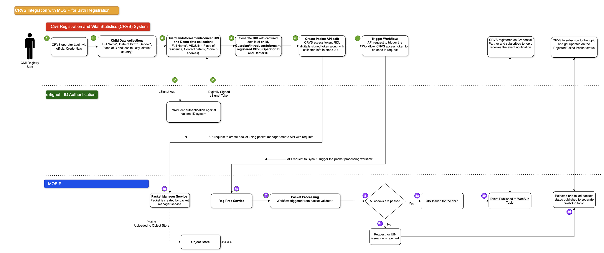

# Birth Registration & ID Issuance

## When Does It Happen?

Birth registration occurs when a **parent, guardian, relative, or any other authorized individual** reports and notifies the occurrence of birth to the concerned Civil Registration Authority (CRA). The default CRVS–MOSIP integration supports **birth registration for infants** and is initiated from the CRVS system after the CRA completes identity proofing and informant authentication. Upon completion, a request is submitted to MOSIP to create a new identity for the infant.


Note: The default MOSIP–CRVS integration supports identity creation through CRVS only for **infant birth registrations**. MOSIP ID generation for adults through CRVS is not supported. Please refer [integration boundaries](../../integration-overview-and-context/integration-boundaries-and-real-world-implications.md).


A high-level workflow diagram for this process is provided below.

## **High-Level Workflow**

<figure><figcaption>
Infant Birth Registration
</figcaption></figure>

Steps and required information are provided below:

## What Does MOSIP Do?

When MOSIP receives a birth registration request for an infant, it performs technical validations to ensure that all mandatory attributes are present and correctly formatted. Upon successful validation, MOSIP processes the request, stores the identity information, and generates a Unique Identification Number (UIN) for the infant, which is added to the MOSIP identity repository.

## Birth Registration: **Notifications to CRVS**

The creation of a MOSIP ID (UIN) does **not automatically result in identity credentials being shared with CRVS**. Credential sharing is **optional and requirement-driven**. If credential sharing is required, CRVS must first be onboarded as a **credential partner** in MOSIP.

Once onboarded, CRVS may subscribe to **WebSub** notifications to receive credential-related information for newly created identities. By default, MOSIP recommends sharing the **PSUT (Partner-Specific User Info Token)** via WebSub. The PSUT serves as a partner-specific reference to the identity and helps limit unnecessary exposure of sensitive identity information.

Although it is technically possible to share credentials such as the UIN or VID based on country-specific requirements, MOSIP does not recommend sharing these identifiers unless explicitly required, as doing so increases the risk of overexposure of sensitive identity data. Please refer to [integration boundaries](../../integration-overview-and-context/integration-boundaries-and-real-world-implications.md) for more information on this.


**Note:** In cases where a country requires the MOSIP ID to be printed on the birth certificate, CRVS can be onboarded as a **credential partner** to securely receive the required identifier, as described above.


## What Is the Workflow?

For new-borns who do not yet possess a national ID, the CRVS system can initiate a national ID registration request on their behalf. This request is initiated by an **Introducer**. The Introducer must already be registered in MOSIP and hold a valid MOSIP ID, which is authenticated through **eSignet** during the birth registration process. This authentication ensures the legitimacy of the registration request, helps prevent fraudulent registrations, and strengthens overall data accuracy and system integrity.


**Note:** MOSIP typically defines infants as 0–5 years old. This is configurable as per country requirements or policy, and anyone above the set threshold is treated as a minor or adult.


#### **Step 1: Birth Reported to CRVS**

1. The **Introducer** visits the CRVS center.
2. The Introducer provides the required details for the newborn.
3. The Introducer submits their own MOSIP ID for verification.
4. The Introducer’s MOSIP ID is **authenticated via eSignet**.
5. Upon successful authentication, the registration request is **ready to be submitted to MOSIP for processing**, along with the details listed below.

**Information Required for MOSIP Processing:**

* **Newborn Information** _(Additional fields can be included based on country requirements)_:
  * Name
  * Gender
  * Date of Birth (DOB)
* **Introducer Information** _(Additional fields can be included based on country requirements)_:
  * eSignet User Info Token - received as a response from eSignet upon successful authentication of introducer


**Note:** Updating the MOSIP ID schema is a prerequisite for supporting these workflows. Each workflow requires specific attributes to be added to the ID schema to enable successful data exchange and request submission from CRVS to MOSIP. Please [refer here](../../prerequisites-configurations-and-operations/prerequisites/configurations-details.md#id-schema-update-for-initiating-infant-birth-requests) for details.


#### **Step 2: Submission of Request to MOSIP**

In MOSIP, every request is encapsulated within a **registration packet**, which serves as a standardized container for all the information required to process the request. This design ensures that requests, such as new identity creation, are **handled consistently, auditable, and technically validated** before a MOSIP ID (UIN) is generated.

To submit a request, the CRVS system must first **create a registration packet** using the **Packet Manager Create Packet API**. Once the packet is created, it can **pushed to MOSIP for processing**. This approach ensures that all required details are included and that the request is formally registered within MOSIP’s workflow for identity creation.


**Note:** Obtaining an access token is a pre-requisite for submitting requests to MOSIP using the [Create packet API](../../api-reference-and-data-models.md#create-packet-api-packet-manager-module). Please refer to the [referenced guide](../../prerequisites-configurations-and-operations/prerequisites/#pre-requisites) for a complete list of pre-requisites and [detailed instructions](../../prerequisites-configurations-and-operations/operational-considerations/#configuring-pre-requisite-steps) on how to complete each one.


#### Step 3: Packet Processing

After the registration packet is created and uploaded to MOSIP’s object store using the **Packet Manager Create API**, the CRVS system must **initiate processing** by calling the **Sync and Trigger APIs** of the Packet Manager.

Once initiated, the packet moves through **several processing stages within MOSIP**, including technical validation and identity creation, until the processing is completed.

#### Step 4: Identity Creation

Once the packet processing is **successfully completed**, a **new MOSIP ID (UIN)** is generated for the infant and stored in MOSIP.

A notification is sent to the registered **email or phone number** to inform the resident about the successful creation of the MOSIP ID.

**Optional:** If CRVS is onboarded as a credential partner and has subscribed to the WebSub topic, the identity credentials can be shared with CRVS. This is **not part of the default integration**. Refer to the relevant guide for the approach to credential sharing.

#### Duplicate Infant Birth Registration Requests

Duplicate and/or repeated requests may arise under the following conditions:

1. **Repeated Requests - Same AID Used In Multiple Requests:**
   1. When multiple requests are made using the same AID ([Application ID](../../prerequisites-configurations-and-operations/operational-considerations/#id-7.-create-the-rid)) for the birth registration of the same infant (with the same or different data).
   2. Currently, the request will be processed even if the same AID is used in multiple requests.
   3. MOSIP will overwrite the existing data with the **most recent values** provided in the latest request.
2. **Duplicate Requests - Same Infant Demographic Data with Different AIDs:**
   1. Multiple requests are made using identical infant demographic data but with different AIDs.
   2. Currently, the request will be processed, and an additional UIN will be issued for the infant for the additional AID.


**Note**: MOSIP relies on CRVS to perform deduplication and treats CRVS as the source of truth. [Refer here](../../integration-overview-and-context/core-integration-principles.md#crvs-as-source-of-truth) for more details.


#### Failure Handling in this Scenario

**Technical Failures:**

1. There is a possibility that some requests may fail due to failure caused by **internal MOSIP** technical problems during processing.
2. In case of internal processing issues within MOSIP, a **retry mechanism** automatically attempts reprocessing of failed requests.

**Validation Failures:**

1. This includes requests failing due to:
   * Missing mandatory fields
   * Schema validation errors

| Scenario                      | Existing Handling / Mechanism                                                                                                                                           |
| ----------------------------- | ----------------------------------------------------------------------------------------------------------------------------------------------------------------------- |
| Duplicate Birth Registrations | Currently, MOSIP does not reject duplicate birth registration requests from CRVS since CRVS is considered the source of truth.                                          |
| Failed eSignet Authentication | Authentication failures are managed by eSignet. The user token is not generated if authentication fails.                                                                |
| Validation Failures           | MOSIP validates the packet structure and rejects invalid packets.                                                                                                       |
| Packet Processing Failures    | Internal MOSIP processing failures are logged and tracked.R**etry mechanism** automatically attempts reprocessing until the packet is marked as Successful or Rejected. |

***

## Learn More

* [**Packet Manager**](../../../../../id-lifecycle-management/supporting-components/packet-manager/) - Understand packet structure, validation, encryption/decryption, and how registration packets are stored and retrieved from object storage for processing.
* [**Registration Processor**](../../../../../id-lifecycle-management/identity-issuance/registration-processor/overview/) - Explore the workflow engine that validates packets, performs deduplication, generates UINs, and orchestrates the complete packet processing lifecycle.
* [**WebSub Event System**](../../../../../id-lifecycle-management/supporting-services/websub/) - Learn about MOSIP's publish-subscribe mechanism for real-time event notifications, topic registration, and credential delivery to subscribed partners.
* [**Notifications & Event Handling**](../../notifications-and-event-handling.md) - Detailed guide on credential issuance notifications, packet status updates, WebSub subscription configuration, and error notification handling for CRVS integration.
