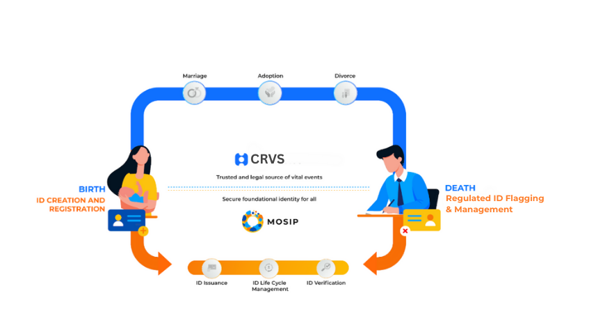

# Scope

#### **Overview** 

This section defines the scope of integration between Civil Registration and Vital Statistics (CRVS) systems and the Modular Open-Source Identity Platform (MOSIP). The integration is designed to support a comprehensive set of use cases, including birth and death registrations, demographic updates, and other vital events such as marriage and divorce. Continue reading to explore the use cases enabled through this integration.

<figure><figcaption>
Birth and Death Registration
</figcaption></figure>

#### **1. Birth registration:** 

#### **1.1 New Infant Birth Registration Initiated from CRVS**

MOSIP generally recommends considering individuals between the ages of 0 to 5 years as infants. However, this is not a strict rule. The age limit for defining an infant can be configured according to the country’s specific requirements, allowing flexibility based on local discretion. Anyone above the configured age limit is categorized as either a minor or an adult.

For infants who do not yet have a national ID, if CRVS initiates a request to MOSIP to create a national ID for the newborn, the registration request can be made by a guardian, parent, or informant. In MOSIP, the individual registering the birth is referred to as the "introducer." To complete the process, the introducer must be registered in MOSIP with a valid national ID. This ID is used for authentication via eSignet to verify the introducer's identity. This registration process mirrors the standard new registration flow in MOSIP, with the primary distinction being that the request originates from CRVS. High-level workflow for the same is added below:

**High level workflow**

<figure><figcaption>
Infant Birth Registration
</figcaption></figure>

Steps and required info is listed below:

1.  **Operator Login & Authentication**\
    The operator logs into the CRVS portal, inputs the required details for the child and parents/introducer, and CRVS verifies the introducer’s identity(national ID) through the eSignet. Upon successful authentication, the request is approved for processing.

    **Required Information for MOSIP to Process the Request:**

    * **Newborn Information** (Additional fields can be added as per country requirements):
      * Name
      * Gender
      * Date of Birth (DOB)
    * **Parents/Introducer Information** (Additional fields can be added as per country requirements):
      * Introducers’s VID/UIN
      * eSignet user info token
2. **Packet Creation**\
   The CRVS system creates the registration packet by sending a request to the Packet Manager API using the access token, client ID, ID schema version, and RID. The packet is stored in the Object Store.
3. **Workflow Trigger & Notification**\
   CRVS triggers the registration workflow by calling the "New API" (sync & trigger) with the access token, initiating packet processing. Once the packet reaches the "Completed" state, a notification event is published to the WebSub topic.
4. **UIN Sharing**\
   Once the packet is processed and approved, the demo data of the child is updated in MOSIP, a notification is sent to the registered email and phone number regarding the update. The update status is also shared with CRVS by publishing the event to the web sub topic.

**1.2 Duplicate request initiated by CRVS**

A request is considered a duplicate under the following conditions:

1. **Same RID Used for Multiple Requests:**\
   Two separate requests are made using the same RID (Request ID) for the birth of the same infant.
2. **Same Infant Demographic Data with Different RIDs:**\
   Two separate requests are made using identical infant demographic data but with different RIDs.

In these cases, MOSIP relies on the CRVS to perform its own deduplication process. MOSIP treats CRVS as the source of truth for the data and expects CRVS to handle the identification of duplicates.

If any such duplicate requests are submitted for processing, MOSIP will have its own de duplication process to reject them.

**1.3 New Adult Birth Registration:**

1. In cases where an adult does not possess either a national ID or a birth certificate and requests a new national ID through CRVS, MOSIP does not support new adult registrations when the request is initiated by CRVS.
2. There is a configurable age limit in MOSIP for accepting incoming requests, which is determined by the country to define the age threshold for considering an individual as a child.
3. MOSIP will validate the individual's age based on the submitted details.
4. If the age submitted in the request exceeds the configured age limit, MOSIP will reject the packet.

**1.4 No UIN Issued on MOSIP due to Technical Issues or Validation Failures**

1. **Technical Failures**

There is a possibility that some requests may fail due to failure caused by **internal MOSIP** technical problems during processing. For such requests, MOSIP has a **retry mechanism** in place to automatically reprocess requests that have failed due to technical issues.

2. **Validation Failures**

In cases of failures due to **data validation errors** or **uniqueness conflicts**, MOSIP will return a **failure response**. If the data shared by CRVS is missing or incomplete for the fields required, it may lead to validation failures in MOSIP, resulting in the **rejection of the request**.

For such validation failures, MOSIP will publish an event to a **WebSub topic**, providing details of the rejection reason for the request. CRVS must subscribe to the WebSub topic to receive updates on the rejected request and the specific rejection reason.

#### 2. Death Registration 

**2.1 New death registration initiated from CRVS:**

A death(infant or adult) is informed to CRVS, and a death registration request is initiated by CRVS based on the person reporting the death of the deceased. For MOSIP, the individual reporting the death is considered the "informant" and must have a valid national ID registered in the system. This national ID is used for authentication via eSignet to verify the informant's identity. As part of the death registration process, MOSIP will mark the individual as deceased by adding a flag indicating their status. The national ID is not deactivated, but the date of death declaration is recorded.

To facilitate this process, two additional fields are added to the ID schema:

* declaredAsDeceased
* deceasedDeclarationDate
* typeOfDeath

These fields must be updated by CRVS with the appropriate information for the death update to be processed in MOSIP. Only after these fields are populated, MOSIP can process the death registration request.

**High level workflow**

<figure><figcaption>
Death Registration
</figcaption></figure>

The steps and required info are listed below:

1. **Registration Initiation & Authentication:**\
   The informant visits the CRVS Registration Centre and provides the necessary details for the death registration. The informant can be anyone CRVS then verifies the informant’s identity(national ID) via the eSignet system. Upon successful authentication, the request is approved for further processing. The eSignet user info token is added to the ID schema.

**Required Information for MOSIP to Process the Request:**

* **Deceased Information (Additional fields can be added as per country requirements):**
  * Name
  * Date & Time of Death
  * VID/UIN
* **Informant Information (Additional fields can be added as per country requirements):**
  * Informants UIN/VID
  * eSignet user info token

2. **Packet Creation:**\
   CRVS sends a request to the Packet Manager's API using the access token, client ID, ID schema version, and RID to create the registration packet. The packet is stored in the object store.
3. **Workflow Trigger:**\
   CRVS triggers the registration workflow by calling the "sync & trigger" API using the access token. This ensures the death registration is processed within the MOSIP.
4. **Validation:**\
   MOSIP checks the UIN’s current status to determine if it was previously marked as deceased. If not, MOSIP updates the death declaration flag to "Y - YES."
5. **Notifications:**\
   Once the packet is processed and approved, a notification is sent to the registered email and phone number regarding the update of the individual's death. The death registration update is also shared with CRVS by publishing the event to the web sub topic.

2.2 **Duplicate request for the death registration for the same deceased:**

1.  A request is considered a duplicate under the following conditions:

    1. **Same RID Used for Multiple Requests:**\
       Two separate requests are made using the same RID (Request ID) for the death of the same deceased.
    2. **Same Infant Demographic Data with Different RIDs:**\
       Two separate requests are made using identical infant demographic data but with different RIDs.

    In these cases, MOSIP relies on the CRVS to perform its deduplication process. MOSIP treats CRVS as the source of truth for the data and expects CRVS to handle the identification of duplicates.

    If any such duplicate requests are submitted for processing, MOSIP will have its own de-duplication process to reject them.

2.3 **Failure to update deceased Record for death registration**

1. **Technical Failures**

There is a possibility that some requests may fail due to failure caused by **internal MOSIP** technical problems during processing. For such requests, MOSIP has a **retry mechanism** in place to automatically reprocess requests that have failed due to technical issues.

2. **Validation Failures**

In cases of failures due to **data validation errors** or **uniqueness conflicts**, MOSIP will return a **failure response**. If the data shared by CRVS is missing or incomplete for the fields required, it may lead to validation failures in MOSIP, resulting in the **rejection of the request**.

For such validation failures, MOSIP will publish an event to a **WebSub topic**, providing details of the rejection reason for the request. CRVS must subscribe to the WebSub topic to receive updates on the rejected request and the specific rejection reason.

#### 3. Demo data Update initiated from CRVS 

Any adult can visit CRVS to update the mentioned demographic fields, and such changes can result from life events like marriage, divorce, or a change in religion. Similarly, any introducer can visit CRVS to update the demographic data of a child, such as in cases of adoption into a family, which may lead to a change in guardianship. Regardless of the specific scenario, these cases are considered to follow the update flow. The integration supports the update of the following fields:

* Name
* Date of Birth (DOB)
* Gender
* Address

Any other data changes, such as biometrics, are not supported when the request comes from CRVS. For updates to other data, the citizen must visit the MOSIP platform.

**High Level Workflow**

<figure><figcaption>
Infant Demo Data Update
</figcaption></figure>

The different scenarios for the update are listed with the basic flow and expected behavior from MOSIP.

**3.1 Infant demo data update request initiated from CRVS**

This includes cases if the wrong information was submitted to CRVS at the time of birth which needs to be corrected, or for scenarios like the adoption of a child into a new family resulting in an update for name address, etc. Below is a high level flow to achieve the same.

1. **Update demo data request initiation & authentication:**\
   The parent/guardian/introducer visits the CRVS Registration Centre and provides the updated values for the fields where the update is required. CRVS then verifies the identity(national ID) of the parent/guardian/introducer via the eSignet system. Upon successful authentication, the request is approved for further processing. The request is sent to MOSIP with the eSignet user info token is added.

**Required Information for MOSIP to process the update request:**

* **Updated Information (Any or all of the following fields):**
  * Name
  * DOB
  * Gender
  * Address
* **Introducer Information (Additional fields can be added as per country requirements):**
  * eSignet user info token

2. **Packet Creation:**\
   CRVS sends a request to the Packet Manager's API using the access token, client ID, ID schema version, and RID to create the update packet. The packet is stored in the object store.
3. **Workflow Trigger:**\
   CRVS triggers the registration workflow by calling the "sync & trigger" API using the access token. This ensures the update packet is processed within the MOSIP.
4. **Update & Notification:**\
   Once the packet is processed and approved, the demo data of the child is updated in MOSIP, a notification is sent to the registered email and phone number regarding the update. The update status is also shared with CRVS by publishing the event to the web sub topic.

**3.2 Duplicate infant update demo data request initiated from CRVS**

Any update request is considered a duplicate under the following conditions:

1. **Same RID Used for Multiple Requests:**\
   Two separate requests are made using the same RID (Request ID) for the death of the same deceased.

In these cases, MOSIP relies on the CRVS to perform its deduplication process. MOSIP treats CRVS as the source of truth for the data and expects CRVS to handle the identification of duplicates.

For the cases where the same RID Is used multiple times for updating the demo data of the infant will result in the rejection of such a request.

2. **Multiple update requests for the same infant with the  same or different demo data:**\
   In cases where MOSIP receives multiple requests for the same infant with updated/same values for the fields mentioned above, MOSIP will treat these as new requests and will update the field values with the most recent ones provided.

**3.3** **Adult Demo data update request initiated from CRVS**

This includes scenarios involving adults where life events such as marriage, divorce, or other circumstances result in changes to name, address, etc. Below is a high-level flow to achieve the same.

1. MOSIP does not support the demo data update for the adults when the request is sent from CRVS
2. For any updates required by adults, it is recommended to visit the MOSIP platform separately

#### **Limitations** 

Although the integration scope includes scenarios for birth, death, and updates, there are still some cases where limitations exist. While some of these limitations have been outlined above as part of the scope, this section will cover all current limitations of the integration.

1. **No Support for New Adult Birth Registrations**:\
   MOSIP does not support new adult birth registrations when the request comes from CRVS.
2. **Integration for Birth and Death Registrations**:\
   The integration works seamlessly for birth and death registrations. However, updates to demographic data are still a work in progress.
3. **Duplicate Request Rejection**:\
   MOSIP does not handle duplicate request rejections at this point. As CRVS is considered the source of truth for duplicate registration requests, situations such as multiple birth requests for the same infant may result in multiple UINs being generated.
4. **No Support for Rejected Packets Status and Reason**\
   The integration does not support updates to CRVS regarding the status and reason for a request that fails in MOSIP and gets rejected.
5. **No support for offline integration**:\
   This integration is designed to function only in scenarios where online connectivity is available. The work is in progress to include the support for the offline/mo connectivity scenarios.
6. **Use of VID/UIN for Death Registration**:\
   Any informant registering a death must provide either the VID or UIN of the deceased to complete the request. MOSIP does not support death updates with any other unique identity at this time.
