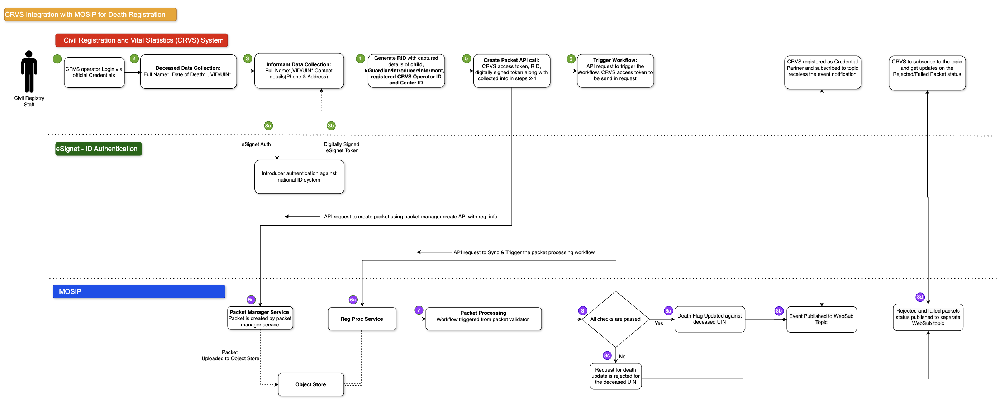

# Death Registration & Identity Status Update

#### When Does It Happen?

Death registration is initiated by the next of kin or an informant through the CRVS system. The registrar collects necessary details and submits a death registration request to MOSIP.

**High-Level Workflow:**

<figure><figcaption>
Death Registration
</figcaption></figure>

Steps and required information are provided below:

#### What Does MOSIP Do?

MOSIP receives the death registration request (including the UIN/VID of the deceased), validates the request, and updates the identity status to mark the individual as deceased. The UIN itself is NOT deactivated; instead, a "deceased" flag is set.

#### What does CRVS Receive?

MOSIP sends a status update notification via WebSub confirming the successful update of the deceased flag. This allows CRVS to complete the death registration process and issue the death certificate.

#### What Is the Workflow?

A death registration request is initiated by the CRVS system based on the informant reporting the deceased. For MOSIP, the informant must be a registered user with a valid national ID. This ID is authenticated using eSignet. During the death registration, MOSIP marks the individual as deceased using a status flag, without deactivating the ID. The date of death declaration is recorded in the system.

To facilitate this process, the following fields can be added to the ID schema:

1. declaredAsDeceased
2. deceasedDeclarationDate
3. typeOfDeath
4. deceasedInformer

It is up to each country to determine which fields should be included in the ID schema, based on their specific use case.

**Step 1: Registration Initiation & Authentication**

1. The informant visits the CRVS Registration Centre.
2. Provides necessary details.
3. The CRVS system verifies the informant's identity via eSignet.
4. On successful authentication, CRVS adds the eSignet user info token to the ID schema and proceeds.

**Required Information for MOSIP to Process the Request:**

1. **Deceased Information** (Extendable as per country needs):
   1. Name
   2. Date of Death
   3. UIN/VID
2. **Informant Information** (Extendable as per country needs):
   1. Informant's UIN/VID
   2. eSignet User Info Token

**Step 2: Packet Creation**

1. CRVS sends a request to the Packet Manager API.
2. Includes access token, client ID, ID schema version, and RID/AID.
3. The packet is stored in the object store.

**Step 3: Workflow Trigger**

1. CRVS triggers the registration workflow by calling the "trigger" API using the access token.
2. This ensures the death registration is processed within MOSIP.

**Step 4: Validation**

1. MOSIP checks the UINs/VIDs' current status to determine if it was previously marked as deceased.
2. If not, MOSIP updates the death declaration flag to "Y - YES".

**Step 5: Notifications**

1. Once the packet is processed and approved, a notification is sent to the registered email and phone number regarding the update.
2. Update is also shared with CRVS through a WebSub event.

#### Duplicate and/or Repeated Requests for Death Registration

A request is considered a duplicate under the following conditions:

1. **Repeated Requests - Same AID Used for Multiple Requests:**
   * When multiple death registration requests are made using the same AID for the same individual.
   * Currently, the request will be processed and the deceased flag will be updated each time.
   * MOSIP does not reject repeated requests since CRVS is considered the source of truth.

> **Note**: MOSIP relies on CRVS to perform deduplication and treats CRVS as the source of truth. While MOSIP has its internal deduplication mechanism to detect and reject duplicate packets, the above scenarios are not currently handled for rejection of duplicate and/or repeated requests.

#### Failure Handling in this Scenario

**Technical Failures:**

1. Failures due to internal MOSIP issues.
2. MOSIP includes a retry mechanism to reprocess such requests.

**Validation Failures:**

1. Failures due to data validation errors or uniqueness conflicts.
2. Invalid UIN/VID provided.
3. Missing mandatory fields.
4. CRVS must subscribe to the WebSub topic to receive and act on such notifications.

| **Scenario**                     | **Existing Handling / Mechanism**                                | **Improvement Required?**                                                     |
| -------------------------------- | ---------------------------------------------------------------- | ----------------------------------------------------------------------------- |
| **Invalid UIN/VID**              | MOSIP rejects requests with invalid or non-existent identifiers. | Enhancement: Provide specific error codes for different validation failures.  |
| **Duplicate Death Registration** | Currently not rejected if submitted multiple times from CRVS.    | Should MOSIP prevent multiple death registrations for the same UIN?           |
| **Status Update Failures**       | Internal failures are logged.                                    | Enhancement: Send failure notifications to CRVS with detailed error messages. |
