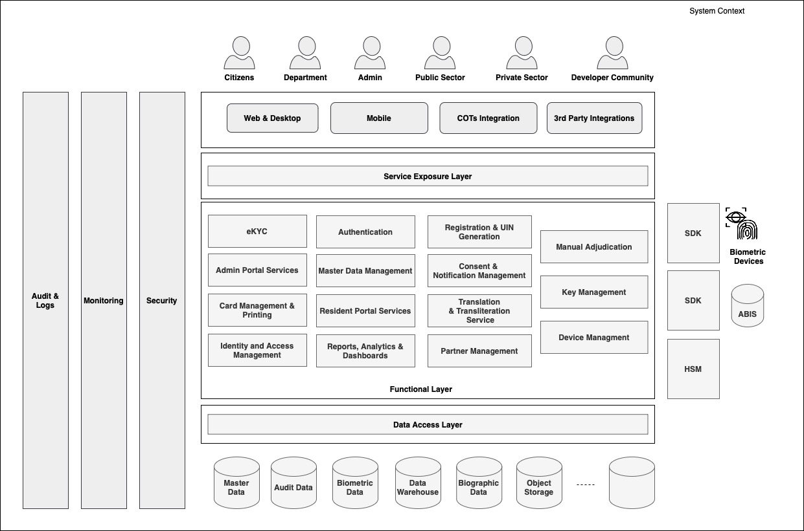

# High Level Functional Architecture

The High Level Reference Functional Architecture serves as a blueprint outlining the system's high-level functioning and interactions, providing a structured framework.

<figure><figcaption>
Functional Architecture
</figcaption></figure>
