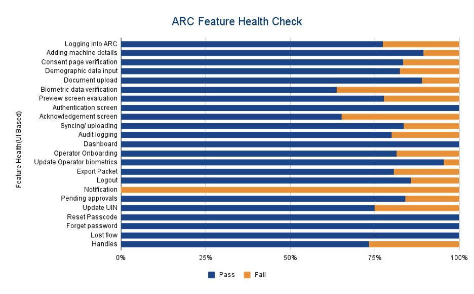

# Test Report

## Test Approach

Persona based approach has been adopted to perform the IV\&V, by simulating test scenarios that resemble a real-time implementation.

A Persona is a fictional character/user profile created to represent a user type that might use a product/or a service in a similar way. Persona based testing is a software testing technique that puts software testers in the customer's shoes, assesses their needs from the software and thereby determines use cases/scenarios that the customers will execute. The persona needs may be addressed through any of the following.

* Functionality
* Deployability
* Configurability
* Customizability

&#x20;The verification methods may differ based on how the need was addressed.

## Verified configuration

Verification is performed on various configurations as mentioned below.

* Configuration with 3 Lang (Eng, Ara, and Fra)

## Limitations/Out of Scope

* Handles feature with Update UIN
* Real biometric device
* Automation testing

## Feature Health

<figure><figcaption></figcaption></figure>

## Test execution statistics

### Functional test results by modules

Below are the test metrics by performing functional testing using mock SBI and mock ABIS. The process followed was black box testing which based its test cases on the specifications of the software component under test. The functional test was performed in combination of individual module testing as well as integration testing. Test data were prepared in line with the user stories. Expected results were monitored by examining the user interface. The coverage includes GUI testing, System testing, End-To-End flows across multiple languages and configurations. The testing cycle included simulation of multiple identity schema and respective UI schema configurations.

<table><thead><tr><th width="400.19140625" valign="top">Total</th><th valign="top">Passed</th><th valign="top">Failed</th><th valign="top">Skipped (N/A)</th></tr></thead><tbody><tr><td valign="top">770</td><td valign="top">633</td><td valign="top">137</td><td valign="top">0</td></tr><tr><td valign="top">Test Rate: 100% With Pass Rate: 82%</td><td valign="top"></td><td valign="top"></td><td valign="top"></td></tr></tbody></table>

&#x20;UI Automation Reports (Locally Run):

<table><thead><tr><th width="345.1953125" valign="top">Total</th><th valign="top">Passed</th><th valign="top">Failed</th><th valign="top">Skipped (N/A)</th></tr></thead><tbody><tr><td valign="top">12</td><td valign="top">9</td><td valign="top">3</td><td valign="top">0</td></tr><tr><td valign="top">Test Rate: 100% With Pass Rate: 75%</td><td valign="top"></td><td valign="top"></td><td valign="top"></td></tr></tbody></table>

&#x20;

ARC APK Git Commit ID: e3dd749f5942bccb0f7906b02815d6fb51e8f0e3

Client Version: 1.2.1.1

### Detailed Test metrics

Below are the detailed test metrics by performing manual/automation testing. The project metrics are derived from Defect density, Test coverage, Test execution coverage, test tracking and efficiency.

The various metrics that assist in test tracking and efficiency are as follows:

* Passed Test Cases Coverage: It measures the percentage of passed test cases. (Number of passed tests / Total number of tests executed) x 100
* Failed Test Case Coverage: It measures the percentage of all failed test cases. (Number of failed tests / Total number of test cases executed) x 10

For more details on the test results, refer [here](https://github.com/mosip/test-management/tree/master/ARC/ARC%200.12.0).
