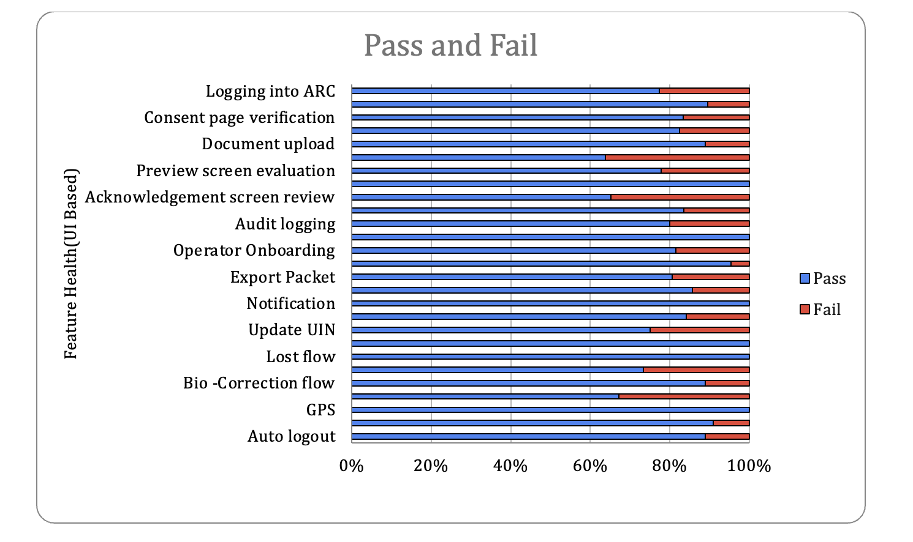

# Test Report

## Testing Scope

The scope of testing is to verify fitment to the specification from the perspective of&#x20;

* Functionality
* Deployability
* Configurability
* Customizability

Verification is performed not only from the end user perspective but also from the System Integrator (SI) point of view. Hence Configurability and Extensibility of the software is also assessed. This ensures the readiness of software for use in multiple countries.

The ARC (Android Reg-Client) testing scope revolves around the following flows:

* Logging and Logout into ARC
* Adding machine details
* Consent page verification
* Demographic data input
* Document upload
* Biometric data verification
* Preview screen evaluation
* Authentication screen
* Acknowledgement screen review
* Syncing and uploading
* Audit logging
* Dashboard
* Operator Onboarding
* Update Operator biometrics
* Installation from adb
* Export Packet
* Notification
* Pending approvals
* ARC packets processing in Regproc
* Handles Email Id/Phone NumberNew, Update and Lost flows
* Forgot and Reset Password
* Settings (Global, Scheduled Jobs, and Device)
* Biometric Correction flow
* GPS and Auto logout
* ARC on Mobile with land scope support

## Test Approach

Persona based approach has been adopted to perform the IV\&V, by simulating test scenarios that resemble a real-time implementation.

A Persona is a fictional character/user profile created to represent a user type that might use a product/or a service in a similar way. Persona based testing is a software testing technique that puts software testers in the customer's shoes, assesses their needs from the software and thereby determines use cases/scenarios that the customers will execute. The persona needs may be addressed through any of the following.

* Functionality
* Deployability
* Configurability
* Customizability

The verification methods may differ based on how the need was addressed.

## Verified configuration

Verification is performed on various configurations as mentioned below

* Configuration with 3 Lang (Eng, Ara, and Fra)

## Limitations/Out of Scope

* Handles feature with Update UIN
* Real biometric device
* UI Automation testing
* Deployment and docker compose testing

## Feature Health&#x20;

<figure><figcaption></figcaption></figure>

## Test execution statistics

### Functional test results by modules

Below are the test metrics by performing functional testing using mock SBI and mock ABIS. The process followed was black box testing which based its test cases on the specifications of the software component under test. The functional test was performed in combination of individual module testing as well as integration testing. Test data were prepared in line with the user stories. Expected results were monitored by examining the user interface. The coverage includes GUI testing, System testing, End-To-End flows across multiple languages and configurations. The testing cycle included simulation of multiple identity schema and respective UI schema configurations.

<table><thead><tr><th width="301.40234375" valign="top">Total</th><th valign="top">Passed</th><th valign="top">Failed</th><th valign="top">Skipped (N/A)</th></tr></thead><tbody><tr><td valign="top">922</td><td valign="top">758</td><td valign="top">164</td><td valign="top">0</td></tr><tr><td valign="top">Test Rate: 100% With Pass Rate: 82%</td><td valign="top"></td><td valign="top"></td><td valign="top"></td></tr></tbody></table>

**UI Automation Reports (Locally Run)**:

<table><thead><tr><th width="297" valign="top">Total</th><th valign="top">Passed</th><th valign="top">Failed</th><th valign="top">Skipped (N/A)</th></tr></thead><tbody><tr><td valign="top">12</td><td valign="top">12</td><td valign="top">0</td><td valign="top">0</td></tr><tr><td valign="top">Test Rate: 100% With Pass Rate: %</td><td valign="top"></td><td valign="top"></td><td valign="top"></td></tr></tbody></table>

ARC APK Git Commit ID: 4ab65435ea076cc424a3347de6ddfbf6057fd45b

Client Version: 1.2.1.4- SNAPSHOT

Master Data API UI Automation Reports in qa-base env:

<table><thead><tr><th valign="top">Module</th><th valign="top">Total</th><th valign="top">Passed</th><th valign="top">Failed</th><th valign="top">Ignore</th><th valign="top">Known Issues</th></tr></thead><tbody><tr><td valign="top">Master Data- Eng</td><td valign="top">945</td><td valign="top">923</td><td valign="top">0</td><td valign="top">0</td><td valign="top">22</td></tr><tr><td valign="top">Master Data- Ara</td><td valign="top">945</td><td valign="top">895</td><td valign="top">1</td><td valign="top">15</td><td valign="top">34</td></tr><tr><td valign="top">Master Data- Fra</td><td valign="top">945</td><td valign="top">907</td><td valign="top">0</td><td valign="top">15</td><td valign="top">23</td></tr></tbody></table>

### Detailed Test metrics

Below are the detailed test metrics by performing manual/automation testing. The project metrics are derived from Defect density, Test coverage, Test execution coverage, test tracking and efficiency.

The various metrics that assist in test tracking and efficiency are as follows:

* Passed Test Cases Coverage: It measures the percentage of passed test cases. (Number of passed tests / Total number of tests executed) x 100

Failed Test Case Coverage: It measures the percentage of all failed test cases. (Number of failed tests / Total number of test cases executed) x 100

Please find the Git hub link for the xls file [**here**](https://github.com/mosip/test-management/tree/master/ARC/ARC%201.0.0%20GA).

