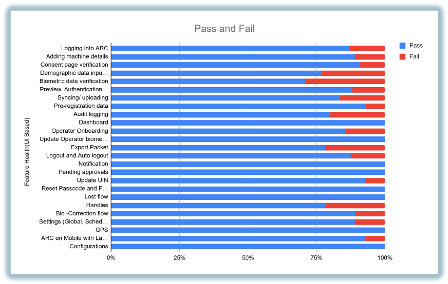

# Page 1

## Introduction

The scope of testing is to verify fitment to the specification from the perspective of&#x20;

* Functionality
* Configurability
* Customizability

### Overview and Scope

Verification is performed not only from the end user perspective but also from the System Integrator (SI) point of view. Hence Configurability and Extensibility of the software is also assessed. This ensures readiness of software for use in multiple countries.

## Main Features Verified

The ARC (Android Registration Client) testing scope covers the following flows and features:

* Logging and Logout into ARC
* Adding machine details
* Consent page verification
* Demographic data input
* Document upload
* Biometric data verification
* Preview screen evaluation
* Authentication and Acknowledgement Screens
* Syncing and uploading
* Audit logging
* Dashboard
* Operator Onboarding and Update Operator biometrics
* Export Packet
* Notification
* Pending approvals
* ARC packets processing in Registration process
* Handles Email Id/Phone Number
* New, Update, Biometric Correction flow and Lost flows
* Forgot and Reset Password
* Settings (Global, Scheduled Jobs, and Device)
* GPS and Auto logout
* ARC on Mobile with landscape support
* Configuration scenarios

## Test Approach

The Persona based approach has been adopted to perform the IV\&V, by simulating test scenarios that resemble a real-time implementation.

A Persona is a fictional character/user profile created to represent a user type that might use a product/or a service in a similar way. Persona based testing is a software testing technique that puts software testers in the customer's shoes, assesses their needs from the software and thereby determines use cases/scenarios that the customers will execute. The persona needs may be addressed through any of the following.

* Functionality
* Combination
* UI Automation

## Verified configuration 

Verification is performed on various configurations as mentioned below

* Configuration with 3 Language (Eng, Ara, and Fra)

## Limitations/Out of Scope 

* Handles feature with Update UIN
* Real biometric device, ABIS and BioSDK
* UI Automation testing
* Deployment and docker compose testing
* Compatible with MOSIP version 1.2.0, but not compatible with MOSIP version 1.3.0.

## Feature Health 

ARC APK Git Commit ID: 07985cb787423d70cf556e53fd028231b59bad6f

Client Version: 1.2.1.4-SNAPSHOT

## Test Organisation

This part lists the team members involved in the testing process and their responsibilities. It clarifies who is accountable for which roles.

Table: Test Organization

<table><thead><tr><th width="190.140625" valign="top">Name</th><th width="184.6015625" valign="top">Functional Role</th><th valign="top">Responsibilities</th></tr></thead><tbody><tr><td valign="top">Ragini Krishna</td><td valign="top">Manager</td><td valign="top">Defining test strategy, managing QA activities, and ensuring overall product quality.</td></tr><tr><td valign="top">Chandra Sekhar</td><td valign="top">Lead</td><td valign="top">Leading the test team, planning and executing tests, and ensuring timely delivery of quality results.</td></tr><tr><td valign="top">G Famuda Mubashira</td><td valign="top">Test engineer</td><td valign="top">Developing and executing test cases, logging defects, and verifying software quality.</td></tr><tr><td valign="top">Damodar Guru</td><td valign="top">Automation Test engineer</td><td valign="top">Developing and executing test cases, logging defects, and verifying software quality.</td></tr></tbody></table>

### &#x20;Test Planning

### Functional test results

Below are the test metrics by performing functional testing using mock MDS, mock Auth and mock ABIS. The process followed was black box testing which based on its test cases on the specifications of the software component under test. Functional test was performed in combination of individual module testing as well as integration testing. Test data were prepared in line with the user stories. Expected results were monitored by examining the user interface. The coverage includes GUI testing, System testing, End-To-End flows across multiple languages and configurations. The testing cycle included simulation of multiple identity schema and respective UI schema configurations.

The Test Planning section outlines the strategy and activities planned for executing the testing process to ensure comprehensive coverage.

<table><thead><tr><th width="340.55078125" valign="top">Total</th><th valign="top">Passed</th><th valign="top">Failed</th><th valign="top">Skipped (N/A)</th></tr></thead><tbody><tr><td valign="top">1039</td><td valign="top">914</td><td valign="top">122</td><td valign="top">3</td></tr><tr><td valign="top">Test Rate: 99% With Pass Rate: 88%</td><td valign="top"></td><td valign="top"></td><td valign="top"></td></tr></tbody></table>

### UI Automation Reports (Locally Run):

<table><thead><tr><th width="339.24609375" valign="top">Total</th><th valign="top">Passed</th><th valign="top">Failed</th><th valign="top">Skipped (N/A)</th></tr></thead><tbody><tr><td valign="top">24</td><td valign="top">24</td><td valign="top">0</td><td valign="top">0</td></tr><tr><td valign="top">Test Rate: 100% With Pass Rate: 100%</td><td valign="top"></td><td valign="top"></td><td valign="top"></td></tr></tbody></table>

### Detailed Test metrics 

Below are the detailed test metrics by performing manual/automation testing. The project metrics are derived from Defect density, Test coverage, Test execution coverage, test tracking and efficiency.

The various metrics that assist in test tracking and efficiency are as follows:

* Passed Test Cases Coverage: It measures the percentage of passed test cases. (Number of passed tests / Total number of tests executed) x 100
* Failed Test Case Coverage: It measures the percentage of all failed test cases. (Number of failed tests / Total number of test cases executed) x 100

### Test Environment

* ARC version 1.0.1 testing was conducted in the QA (qa-base.mosip.net) environment.

### Observations

* ARC (Android Registration Client) was tested with mock MDS and ABIS across all supported languages - English, French, and Arabic.
* The application behavior was consistent and functioned as expected in all three languages, with no functional deviations observed.
* Multilingual support, including UI rendering and flow execution, worked seamlessly during testing.

## Conclusion

The ARC (Android Registration Client) testing was successfully executed using mock MDS and ABIS across all supported languages (English, French, and Arabic). All critical functionalities and flows were validated, and the application performed as expected without any critical/blocker functional issues.

* Test execution has been completed for the planned scope, and all key flows have been verified successfully
* No critical or high-severity defects impacting the core functionality were identified
* Multilingual support is working as expected across all tested languages
* Compatible with MOSIP version 1.2.0, but not compatible with MOSIP version 1.3.0
* Testing was conducted using mock integrations; hence, end-to-end validation with actual MDS, BioSDK and ABIS is recommended.

### QA Recommendation:

* Based on the current test results, the build is QA approved for release, with a note to perform validation with real MDS and ABIS in subsequent phases.

### QA Approval

* The build has met the defined exit criteria and is recommended for release based on the following:
* Test Case Execution Completion: All planned test cases have been executed successfully within the defined scope
* Defect Status Closure: All critical and high-severity defects have been resolved or addressed appropriately
* Automation Reports – UI: UI automation execution has been completed, and results are within acceptable limits
* Documentation Sign-off: All relevant QA documents, including test cases and reports, have been reviewed and signed off
* Test Environment Stability: The test environment remained stable throughout the execution, with no major environment-related blockers

### Final Status:

* The build is QA approved and recommended for release.

&#x20;Table: Report is signed off details

<table><thead><tr><th width="198.98046875" valign="top">Name</th><th width="153.96875" valign="top">Functional Role</th><th valign="top">Responsibilities</th></tr></thead><tbody><tr><td valign="top">Ragini Krishna</td><td valign="top">Manager</td><td valign="top">Defining test strategy, managing QA activities, and ensuring overall product quality.</td></tr><tr><td valign="top">Chandra Sekhar</td><td valign="top">Lead</td><td valign="top">Leading the test team, planning and executing tests, and ensuring timely delivery of quality results.</td></tr></tbody></table>

## Appendix

This includes additional reference information for the report. It contains a history of document versions and a list of acronyms and their meanings.

### Appendix A: Versions

<table><thead><tr><th>Version</th><th>Date</th><th>Author</th><th valign="top">Reviewers</th></tr></thead><tbody><tr><td>V1.0</td><td>02/09/2025</td><td>G Famuda Mubashira</td><td valign="top">
N. Chandra Sekhar

Ragini Krishna
</td></tr></tbody></table>

### Appendix B: Acronyms

<table><thead><tr><th width="293.55859375" valign="top">Acronym</th><th valign="top">Literal Translation</th></tr></thead><tbody><tr><td valign="top">
ARC

ABIS
</td><td valign="top">
Android Registration Client

Automated Biometric Identification System
</td></tr></tbody></table>
