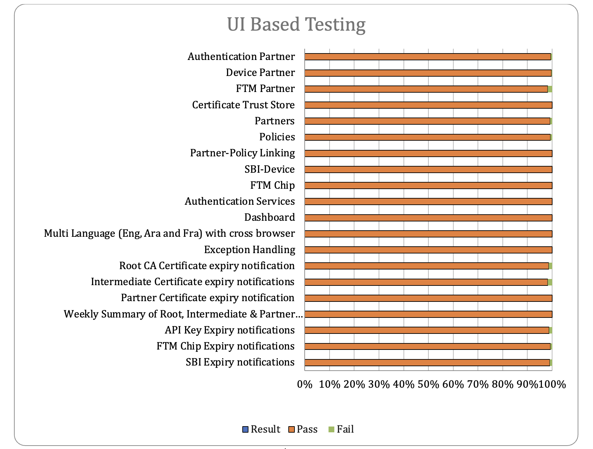
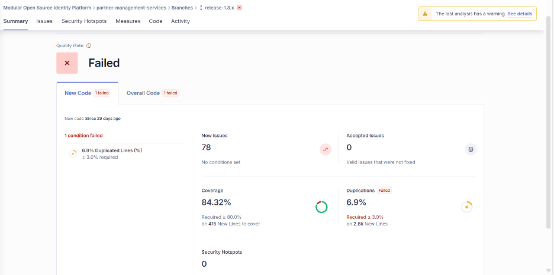
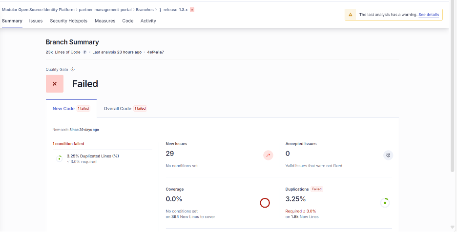

# Test Report

## Testing Scope

The testing scope covers verification against specifications from the perspectives of:

* Functionality
* Deployability
* Configurability
* Customizability

Verification is performed for both end users and System Integrators (SI), assessing configurability and extensibility to ensure readiness for multi-country deployments. As MOSIP is an “API First” platform, comprehensive automation testing for all MOSIP APIs is included, using an automation Test Rig.

Partner Management System Revamp testing scope includes:

* Features: Authentication Partner, Device Partner, FTM Partner, Partner Admin Certificate Trust Store, Partners, Policies, Partner-Policy Linking, SBI-Device, FTM Chip, Authentication Services, User Profile, User Dashboard, Root CA Certificate expiry notification, Intermediate certificate expiry notifications, Partner Certificate Notification expiry notification, API Key expiry, FTM Chip expiry, SBI ID expiry notifications, Weekly Summary notifications for Partner certificate expiry, API Key expiry, FTM Chip expiry, SBI ID.
* Multilingual support (English/Arabic/French)
* Multi-browser testing: Edge, Firefox, Chrome (Windows/Mac, Tablet, Extra-large screen)
* Regression Testing
* Integration Testing

## Test Approach

A persona-based approach is used for IV\&V, simulating real-world scenarios. Personas represent user types and help determine relevant use cases. Testing addresses:

* Functionality
* Deployability
* Configurability
* Customizability

Regression checks are performed using the “MOSIP Test Rig” automation suite, covering end-to-end test execution and reporting. Functional scenarios include packet creation, processing, UIN generation, and identity authentication via IDA. MOSIP Test Rig is open-source and can be enhanced by countries for SI validation. Persona classes include positive personas.

## Verified Configuration

Verification is performed on:

* Default configuration with verified settings for 3 languages (English/Arabic/French)

## Browser Compatibility Evaluations

**Desktop/Laptop:**

| Sl.No | Browser | Versions                      |
| ----- | ------- | ----------------------------- |
| 1     | Chrome  | Version 138.0.7204.185        |
| 2     | Firefox | Version 142.0                 |
| 3     | Edge    | Version 138.0.3351.121        |
| 4     | Safari  | Version 18.6 (20621.3.11.11.3 |

**Tablet:**

| Sl.No | Browser | Versions              |
| ----- | ------- | --------------------- |
| 1     | Chrome  | Version 139.0.7258.62 |
| 2     | Firefox | Version 141.0.3       |
| 3     | Edge    | Version 139.0.3405.86 |

**Extra-large screens:**

| Sl.No | Browser | Versions                       |
| ----- | ------- | ------------------------------ |
| 1     | Chrome  | Version 138.0.7204.185         |
| 2     | Firefox | Version 142.0                  |
| 3     | Edge    | Version 138.0.3351.121         |
| 4     | Safari  | Version 18.6 (20621.3.11.11.3) |

## Screen Sizes Used for UI Responsiveness Validation

* Laptop/Desktop: 1920x1080
* Tablet: 1280x800
* Extra-large screens: 3840x2160
* MacBook: 2560x1664

## Feature Health

<figure><figcaption></figcaption></figure>

## Test Execution Statistics

### Functional Test Results by Modules

Functional testing was performed using black box methods based on specifications. Testing included GUI, system, end-to-end flows across languages and configurations, simulating multiple identity and UI schema configurations.

**Manual Verification (UI):**

| Total | Passed | Failed | Skipped (N/A) |
| ----- | ------ | ------ | ------------- |
| 5945  | 5890   | 32     | 23            |

Test Rate: 99% with Pass Rate: 99%

_Note: 23 test cases are descoped/not developed features._

**Manual Verification (API):**

| Total | Passed | Failed | Skipped (N/A) |
| ----- | ------ | ------ | ------------- |
| 742   | 741    | 0      | 1             |

Test Rate: 99% with Pass Rate: 99%

_Note: 1 test case is descoped/not developed feature._

**API Test Rig:**

| Total | Passed | Failed | Skipped (N/A) | Ignored | Known Issues |
| ----- | ------ | ------ | ------------- | ------- | ------------ |
| 1068  | 1068   | 0      | 0             | 0       | 0            |

Test Rate: 100% with Pass Rate: 100%

_Note: API flows are tested via automation for both positive and negative scenarios; non-automated cases are tested manually._

### Detailed Test Metrics

Metrics include defect density, test coverage, execution coverage, tracking, and efficiency:

* **Passed Test Cases Coverage:** (Passed tests / Total executed) x 100
* **Failed Test Case Coverage:** (Failed tests / Total executed) x 100

### Tested Components

<table><thead><tr><th width="241.48046875">Module/Repo</th><th width="316.41796875">Compatible Version</th><th>Comments</th></tr></thead><tbody><tr><td>partner-management-portal</td><td>mosipqa/pmp-ui-v2:1.3.x</td><td></td></tr><tr><td>partner-management-services</td><td>mosipqa/partner-management-service:1.3.x</td><td></td></tr><tr><td>Policy Management service</td><td>mosipqa/policy-management-service:1.3.x</td><td></td></tr><tr><td>Key-manager</td><td>mosipid/kernel-keymanager-service:1.3.0-beta.3</td><td></td></tr><tr><td>IDA Auth</td><td>mosipid/authentication-internal-service:1.2.1.0</td><td></td></tr><tr><td>Artifactory</td><td>mosipid/artifactory-server:1.2.0.2</td><td></td></tr><tr><td>eSignet</td><td>mosipid/esignet:1.4.1</td><td></td></tr><tr><td>Notifier (Kernel)</td><td>mosipid/kernel-notification-service:1.2.0.1</td><td></td></tr><tr><td>Audit manager</td><td>mosipid/kernel-auditmanager-service:1.2.0.1</td><td></td></tr><tr><td>ID Repro</td><td>mosipid/id-repository-identity-service:1.2.2.0</td><td></td></tr><tr><td>datashare</td><td>mosipid/data-share-service:1.2.0.1</td><td></td></tr><tr><td>Keycloak</td><td>1.2.0.1</td><td></td></tr><tr><td>config-server</td><td>mosipqa/kernel-keymanager-service:1.3.x</td><td></td></tr><tr><td>Websub</td><td>mosipid/websub-service:1.2.0.1</td><td></td></tr><tr><td>postgres</td><td>mosipid/artifactory-server:1.2.0.2</td><td></td></tr></tbody></table>

## Sonar Report

**Partner-Management-Service**

<figure><figcaption></figcaption></figure>

**Partner-Management-Portal**

<figure><figcaption></figcaption></figure>
