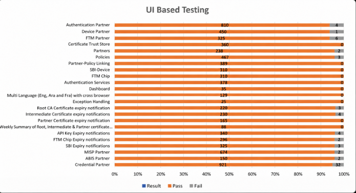
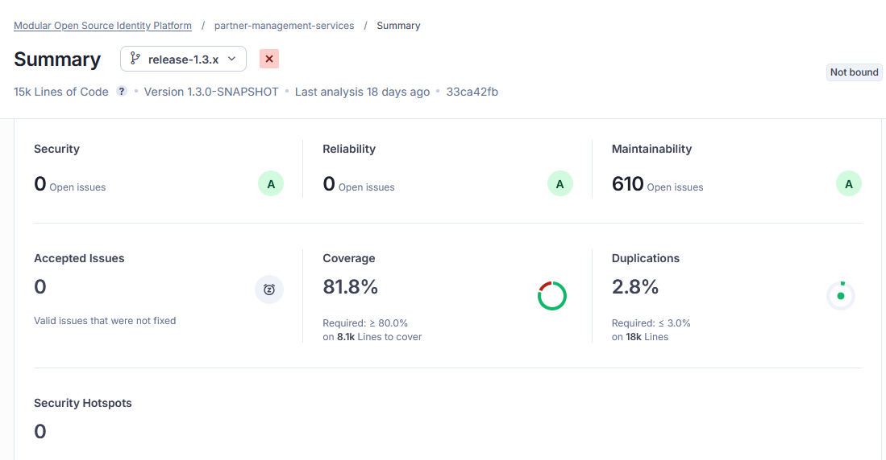
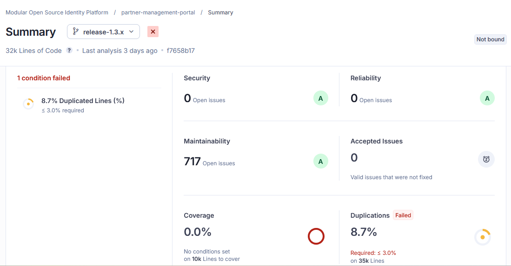

# Test Report

## Introduction <a href="#anchor" id="anchor"></a>

The Partner Management System Revamp testing scope includes the following: Features: MISP Partner, ABIS Partner, Authentication Partner, Device Partner, FTM Partner, Credential Partner, MISP Partner, ABIS Partner, Partner Admin, Certificate Trust Store, Partners, Policies, Partner-Policy Linking, SBI-Device, FTM Chip, Authentication Services, User Profile, User Dashboard, Root CA Certificate expiry notifications, Intermediate Certificate expiry notifications, Partner Certificate expiry notifications, API Key expiry notifications, FTM Chip expiry notifications, SBI ID expiry notifications, and Weekly Summary notifications for Partner Certificate, API Key, FTM Chip, and SBI ID expiry.

## Overview and Scope <a href="#anchor-1" id="anchor-1"></a>

The scope of testing defines the boundaries, functionalities, and features that will be tested for the Partner Management System (PMS) Revamp. This ensures comprehensive validation of critical workflows while clearly identifying what is included and excluded from testing.

Functional Features: MISP Partner, ABIS Partner, Authentication Partner, Device Partner, FTM Partner, Credential Partner, Partner Admin, Certificate Trust Store, Partners, Policies, Partner--Policy Linking, SBI--Device Mapping, FTM Chip, Authentication Services, User Profile, and User Dashboard.

### Cross-Platform Support

* Multilingual: English, Arabic, French
* Multi-Browser: Edge, Firefox, Chrome
* Devices: Windows, Mac, Tablet, Extra-large screens
* Testing Types: Sanity, Regression Testing and Integration Testing
* Cross-browser and cross-device compatibility testing.

## Test Approach <a href="#anchor-2" id="anchor-2"></a>

The scope of testing is to verify fitment to the specification from the perspective of:

* Functionality
* Combination
* UI Automation
* API automation
* Library verification

## Test Organization <a href="#anchor-3" id="anchor-3"></a>

**Table 1**: Test Organization

<table><thead><tr><th width="194.234375">Name</th><th width="184.56640625">Functional Role</th><th>Responsibilities</th></tr></thead><tbody><tr><td>Ragini Krishnamurthy</td><td>Manager</td><td>Defining test strategy, managing QA activities, and ensuring overall product quality.</td></tr><tr><td>Chandra Sekhar</td><td>Lead</td><td>Leading the test team, planning and executing tests, and ensuring timely delivery of quality results.</td></tr><tr><td>Swetha N</td><td>Test engineers</td><td>Designing and executing test cases, performing functional and regression testing, verifying PMS module functionality, logging and tracking defects, and validating fixes to ensure quality standards.</td></tr></tbody></table>

## Test Planning <a href="#anchor-6" id="anchor-6"></a>

This Test Plan outlines the testing approach, scope, resources, and schedule for the Partner Management System (PMS) Revamp. The objective is to ensure that all functional, integration, and non-functional requirements are met with high quality before release.

* Validate end-to-end functionality of the Partner Management System Revamp.
* Ensure system stability across supported browsers, devices, and languages.
* Verify integrations with dependent systems and services.
* Identify and mitigate risks early through regression and integration testing.

## Sanity Scenarios Verified <a href="#anchor-8" id="anchor-8"></a>

Sanity testing will be performed to ensure basic application stability before detailed test execution. The following high-level sanity scenarios will be verified:

* Application accessibility and successful login for different partner roles.
* Core partner creation and management flows (MISP, Device, Auth, Credential, FTM and ABIS Partner).
* Partner--Policy linking.
* Authentication services basic validation.
* Certificate upload and validation.
* Notification triggers for certificate/API key expiry (basic check).
* User profile and dashboard accessibility.

Only upon successful completion of sanity testing will the build be accepted for full regression and integration testing.

## Test Environment <a href="#anchor-9" id="anchor-9"></a>

https://qa21.mosip.net/

**Table 2**: Test Environment Images

```
---------------------------------------------------------------------------------------
Tested on qa21 env with components
docker.io/mosipid/activemq-artemis:2.39.0
docker.io/mosipid/admin-service:1.3.0
docker.io/mosipid/admin-ui:1.3.0
docker.io/mosipid/apitest-auth:1.3.0
docker.io/mosipid/apitest-esignet:1.6.2
docker.io/mosipid/apitest-idrepo:1.3.0
docker.io/mosipid/apitest-masterdata:1.3.0
docker.io/mosipid/apitest-prereg:1.3.0
docker.io/mosipid/apitest-resident:1.3.0
docker.io/mosipid/artifactory-server:1.2.0.2
docker.io/mosipid/artifactory-server:1.3.0
docker.io/mosipid/authentication-internal-service:1.3.0
docker.io/mosipid/authentication-otp-service:1.3.0
docker.io/mosipid/authentication-service:1.3.0
docker.io/mosipid/biosdk-server:1.3.0
docker.io/mosipid/captcha-validation-service:0.1.0
docker.io/mosipid/clamav:1.3.0_base
docker.io/mosipid/commons-packet-service:1.3.0
docker.io/mosipid/consolidator-websub-service:1.3.0
docker.io/mosipid/data-share-service:1.3.0
docker.io/mosipid/digital-card-service:1.3.0
docker.io/mosipid/dsl-orchestrator:1.3.0
docker.io/mosipid/dsl-orchestrator:1.4.0
docker.io/mosipid/dsl-packetcreator:1.3.0
docker.io/mosipid/esignet-with-plugins:1.6.2
docker.io/mosipid/esignet:1.4.1
docker.io/mosipid/hotlist-service:1.3.0
docker.io/mosipid/kafka:3.2.1-debian-11-r9
docker.io/mosipid/kernel-auditmanager-service:1.3.0
docker.io/mosipid/kernel-auth-service:1.3.0
docker.io/mosipid/kernel-config-server:1.3.0
docker.io/mosipid/kernel-idgenerator-service:1.3.0
docker.io/mosipid/kernel-keymanager-service:1.3.0
docker.io/mosipid/kernel-masterdata-service:1.3.0
docker.io/mosipid/kernel-notification-service:1.3.0
docker.io/mosipid/kernel-otpmanager-service:1.3.0
docker.io/mosipid/kernel-pridgenerator-service:1.3.0
docker.io/mosipid/kernel-ridgenerator-service:1.3.0
docker.io/mosipid/kernel-syncdata-service:1.3.0
docker.io/mosipid/keycloak-init:1.2.0.1
docker.io/mosipid/keys-generator:1.2.1.0
docker.io/mosipid/keys-generator:1.3.0
docker.io/mosipid/kibana:7.17.2-debian-10-r0
docker.io/mosipid/minio-client-util
docker.io/mosipid/minio-client-util:latest
docker.io/mosipid/minio:2025.2.28-debian-12-r1
docker.io/mosipid/mock-abis:1.3.0
docker.io/mosipid/mock-identity-system:0.9.3
docker.io/mosipid/mock-mv:1.3.0
docker.io/mosipid/mock-relying-party-service:0.11.2
docker.io/mosipid/mock-relying-party-service:0.9.3
docker.io/mosipid/mock-relying-party-ui:0.11.2
docker.io/mosipid/mock-relying-party-ui:0.9.3
docker.io/mosipid/mock-smtp:1.0.0
docker.io/mosipid/mosip-artemis-keycloak:1.3.0
docker.io/mosipid/mosip-file-server:1.3.0
docker.io/mosipid/oidc-ui:1.4.1
docker.io/mosipid/oidc-ui:1.6.2
docker.io/mosipid/os-shell:12-debian-12-r46
docker.io/mosipid/partner-onboarder:1.2.0.1
docker.io/mosipid/partner-onboarder:1.3.0
docker.io/mosipid/postgres-init:1.3.0
docker.io/mosipid/postgresql:14.2.0-debian-10-r70
docker.io/mosipid/pre-registration-batchjob:1.3.0
docker.io/mosipid/pre-registration-booking-service:1.3.0
docker.io/mosipid/pre-registration-datasync-service:1.3.0
docker.io/mosipid/pre-registration-ui:1.3.0
docker.io/mosipid/print:1.3.0
docker.io/mosipid/regclient-keystore:1.0.0
docker.io/mosipid/registration-client:1.2.0.2
docker.io/mosipid/resident-service:1.3.0
docker.io/mosipid/resident-ui:0.9.1
docker.io/mosipid/softhsm:v2
docker.io/mosipid/websub-service:1.3.0
docker.io/mosipid/zookeeper:3.8.0-debian-11-r30
docker.io/mosipint/elasticsearch:7.17.2-debian-10-r4
docker.io/mosipint/redis:7.0.5-debian-11-r25
docker.io/mosipqa/credential-request-generator:1.3.x
docker.io/mosipqa/credential-service:1.3.x
docker.io/mosipqa/dsl-orchestrator:1.3.x
docker.io/mosipqa/dsl-orchestrator:develop
docker.io/mosipqa/dsl-packetcreator:develop
docker.io/mosipqa/id-repository-identity-service:1.3.x
docker.io/mosipqa/id-repository-vid-service:1.3.x
docker.io/mosipqa/partner-management-service:1.3.x
docker.io/mosipqa/pmp-ui-v2:1.3.x
docker.io/mosipqa/policy-management-service:1.3.x
docker.io/mosipqa/pre-registration-application-service:1.3.x
docker.io/mosipqa/registration-processor-common-camel-bridge:1.3.x
docker.io/mosipqa/registration-processor-dmz-packet-server:1.3.x
docker.io/mosipqa/registration-processor-landing-zone:1.3.x
docker.io/mosipqa/registration-processor-notification-service:1.3.x
docker.io/mosipqa/registration-processor-registration-status-service:1.3.x
docker.io/mosipqa/registration-processor-registration-transaction-service:1.3.x
docker.io/mosipqa/registration-processor-reprocessor:1.3.x
docker.io/mosipqa/registration-processor-stage-group-1:1.3.x
docker.io/mosipqa/registration-processor-stage-group-2:1.3.x
docker.io/mosipqa/registration-processor-stage-group-3:1.3.x
docker.io/mosipqa/registration-processor-stage-group-4:1.3.x
docker.io/mosipqa/registration-processor-stage-group-5:1.3.x
docker.io/mosipqa/registration-processor-stage-group-6:1.3.x
docker.io/mosipqa/registration-processor-stage-group-7:1.3.x
docker.io/mosipqa/registration-processor-workflow-manager-service:1.3.x
mosipid/clamav:1.3.0_base
mosipid/kernel-config-server:1.3.0
mosipid/keycloak-init:1.2.0.1
mosipid/postgres-init:1.3.0
mosipid/regclient-keystore:1.0.0
mosipid/softhsm:v2
mosipqa/apitest-pms:1.3.x
mosipqa/uitest-pmp-v2:1.3.x
---------------------------------------------------------------------------------------
```

## Test Execution Report <a href="#anchor-10" id="anchor-10"></a>

Below are the test metrics by performing functional testing. The process followed was black box testing which based its test cases on the specifications of the software component under test. The functional test was performed in combination with individual module testing as well as integration testing. Test data were prepared in line with the user stories. Expected results were monitored by examining the user interface. The coverage includes GUI testing, System testing, End-To-End flows across multiple languages and configurations.

### Test case execution summary <a href="#anchor-11" id="anchor-11"></a>

The Test Case Execution Summary section provides a detailed overview of the total test cases executed across platforms, including pass, fail, and skip counts. It includes a table summarizing results and observations on execution pass rates.

**Table 3: Test Case - Manual Verification (UI)**

| **Total** | **Passed** | **Failed** | **Skipped (N/A)** |
| --------- | ---------- | ---------- | ----------------- |
| 7989      | 7900       | 54         | 33                |

Test Rate: 99% with Pass Rate: 99%

**Note**: NA - 33 Test Cases which are descoped scenarios/not developed feature.

**Table 4: Test Case - Manual Verification (API)**

| **Total** | **Passed** | **Failed** | **Skipped (N/A)** |
| --------- | ---------- | ---------- | ----------------- |
| 1455      | 1425       | 20         | 10                |

Test Rate: 99% with Pass Rate: 98%

**Note**: NA - 10 Test Cases which are descoped scenarios/not developed feature.

## Automation Results <a href="#anchor-12" id="anchor-12"></a>

This section provides a summary of the automated test execution. It shows the pass, fail, and known issues from the automated test suite.

### Automation Execution Result - API Testrig

| **Total** | **Passed** | **Failed** | **Skipped (N/A)** | **Ignored** | **Known issues** |
| --------- | ---------- | ---------- | ----------------- | ----------- | ---------------- |
| 1734      | 1734       | 0          | 0                 | 0           | 0                |

Test Rate: 100% with Pass Rate: 100%

**Note:** API flow is tested through automation for both positive and negative scenarios, while test cases that are not automated are tested manually.

### Automation Execution Result - UI Automation

| **Total** | **Passed** | **Failed** | **Skipped (N/A)** | **Ignored** | **Known issues** |
| --------- | ---------- | ---------- | ----------------- | ----------- | ---------------- |
| 91        | 91         | 0          | 0                 | 0           | 0                |

Test Rate: 100% with Pass Rate: 100%

## Detailed Test metrics <a href="#anchor-13" id="anchor-13"></a>

Below are the detailed test metrics by performing Manual/automation testing. The project metrics are derived from Defect density, Test coverage, Test execution coverage, test tracking and efficiency.

The various metrics that assist in test tracking and efficiency are as follows:

* Passed Test Cases Coverage: It measures the percentage of passed test cases. (Number of passed tests / Total number of tests executed) x 100.
* Failed Test Case Coverage: It measures the percentage of all failed test cases. (Number of failed tests / Total number of test cases executed) x 100.

### Test Execution Report <a href="#anchor-15" id="anchor-15"></a>

Verification is performed on various configurations as mentioned below.

* Default configuration with verified configuration for 3 Lang (English/Arabic/French).

## Browser compatibility evaluations <a href="#anchor-17" id="anchor-17"></a>

**Table 7:** Browser versions tested on desktop/laptop

<table><thead><tr><th width="99.16015625">Sl.No</th><th width="300.453125">Browser</th><th>Versions</th></tr></thead><tbody><tr><td>1</td><td>Chrome</td><td>Version 147.0.7727.138</td></tr><tr><td>2</td><td>Firefox</td><td>Version 147.0.2</td></tr><tr><td>3</td><td>Edge</td><td>Version 147.0.3912.98</td></tr></tbody></table>

**Table 8:** Browser versions tested on tablet device

<table><thead><tr><th width="104.875">Sl.No</th><th>Browser</th><th>Versions</th></tr></thead><tbody><tr><td>1</td><td>Chrome</td><td>Version 148.0.7778.167</td></tr><tr><td>2</td><td>Firefox</td><td>Version 150.0.3</td></tr><tr><td>3</td><td>Edge</td><td>Version 148.0.3967.55</td></tr></tbody></table>

**Table 9:** Browser versions tested on extra-large screens

<table><thead><tr><th width="107.60546875">Sl.No</th><th>Browser</th><th>Versions</th></tr></thead><tbody><tr><td>1</td><td>Chrome</td><td>Version 146.0.7680.154</td></tr><tr><td>2</td><td>Firefox</td><td>Version 148.0.3967.54</td></tr><tr><td>3</td><td>Edge</td><td>Version 148.0.3967.54</td></tr><tr><td>4</td><td>Safari</td><td>Version 21623.2.7.11.7</td></tr></tbody></table>

## 5.2 Screen sizes used for UI responsiveness validation <a href="#anchor-19" id="anchor-19"></a>

* Laptop/Desktop: 1920x1080
* Tablet: 1280X800
* Extra-large screens: 3840x2160
* Mac book: 2560 x 1664

## Feature Health <a href="#anchor-20" id="anchor-20"></a>

<figure><figcaption></figcaption></figure>

## Known Issues Metrics <a href="#anchor-21" id="anchor-21"></a>

This section focuses on a separate category of issues that are known but not addressed in the current release. It provides a count and severity distribution for these defects across releases.

**Table 10: Defect Metrics for the known issues**

| Blocker | Critical | Major | Minor | Total |
| ------- | -------- | ----- | ----- | ----- |
| 0       | 1        | 25    | 28    | 54    |

## Sonar Report <a href="#anchor-22" id="anchor-22"></a>

* **Partner-Management-Service**

<figure><figcaption></figcaption></figure>

* **Partner-Management-Portal**

<figure><figcaption></figcaption></figure>

## Conclusion <a href="#anchor-23" id="anchor-23"></a>

The Partner Management System (PMS) Revamp version 1.3.0-beta.5 has been successfully validated in the qa21 environment, with all critical functionalities performing as expected.

Sanity, regression, and integration testing were completed within the defined scope.

* No critical or high-severity defects remain open.
* Based on the successful test execution and results, QA approves the build for release.

## QA Approval <a href="#anchor-24" id="anchor-24"></a>

The build has met all the defined exit criteria and is recommended for release based on the following:

* Test Case Execution: All planned test cases have been executed successfully.
* Story and Defect Closure: All user stories are completed, and no critical or high-severity defects remain open.
* Automation Reports: API-Testrig and UI automation execution reports have been reviewed and approved.
* Documentation Sign-off: All required test and release documentation has been reviewed and signed off.
* Test Environment Stability: The test environment remained stable throughout the testing cycle.

**Table 11: Report is signed off details**

<table><thead><tr><th width="184.65234375">Name</th><th width="170.49609375">Functional Role</th><th>Responsibilities</th></tr></thead><tbody><tr><td>Ragini Krishna</td><td>Manager</td><td>Defining test strategy, managing QA activities, and ensuring overall product quality.</td></tr><tr><td>Chandra Sekhar N</td><td>Lead</td><td>Leading the test team, planning and executing tests, and ensuring timely delivery of quality results.</td></tr></tbody></table>

## Appendix <a href="#anchor-25" id="anchor-25"></a>

This includes additional reference information for the report. It contains a history of document versions and a list of acronyms and their meanings.

### Appendix A: Versions <a href="#anchor-26" id="anchor-26"></a>

| Version | Date       | Author   | Reviewers      |
| ------- | ---------- | -------- | -------------- |
| V1.0    | 15/05/2026 | Swetha N | Ragini Krishna |

### Appendix B: Acronyms <a href="#anchor-27" id="anchor-27"></a>

| Acronym | Literal Translation                       |
| ------- | ----------------------------------------- |
| SBI     | Secure Biometric Interface                |
| FTM     | Foundational Trust Module                 |
| ABIS    | Automated Biometric Identification System |

## Document History

It outlines the strategy used to ensure a comprehensive evaluation.

| Version | Author   | Date       | Review               | Affected Sections |
| ------- | -------- | ---------- | -------------------- | ----------------- |
| V1.0    | Swetha N | 15/05/2026 | Ragini Krishnamurthy |                   |
