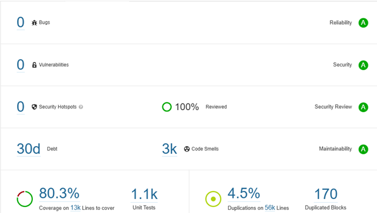

# Test Report

## Testing Scope

The scope of testing is to verify fitment to the specification from the perspective of&#x20;

●     Functionality&#x20;

●     Configurability&#x20;

●     Customizability

Verification is performed not only from the end user perspective but also from the System Integrator (SI) point of view. Hence Configurability and Extensibility of the software are also assessed. This ensures the readiness of the software for use in multiple countries. Since MOSIP is an “API First” product platform, the Verification scope required comprehensive automation testing for all the MOSIP APIs. An automation Test Rig is created for the same.

## Test Approach

A persona-based approach has been adopted to perform the IV\&V by simulating test scenarios that resemble a real-time implementation.

A Persona is a fictional character/user profile created to represent a user type that might use a product/or a service in a similar way. Persona-based testing is a software testing technique that puts software testers in the customer's shoes, assesses their needs from the software and thereby determines use cases/scenarios that the customers will execute. The persona's needs may be addressed through any of the following.

●     Functionality&#x20;

●     Deployability&#x20;

●     Configurability&#x20;

●     Customizability

The verification methods may differ based on how the need was addressed.

For regression check, “MOSIP Test Rig” - an automation testing suite, which is indigenously designed and developed for supporting persona-based testing. MOSIP Test Rig covers the end-to-end test execution and reporting. The end-to-end functional test scenarios are written starting from pre-registration, to creation of a packet in the registration center, processing the packet through the registration processor, generating a UIN, and authenticating identity using IDA through various permutations and combinations of cases being covered. MOSIP Test Rig will be an open-source artifact that can also be enhanced and used by countries to validate the SI deliveries before going live. Persona classes include both negative and positive personas. Negative persona classes include users like Bribed Registration Office, Malicious Insider, etc. The needs of positive persona classes must be met, whereas the needs of negative persona classes must be effectively restricted by the software.

Main feature tested:

●     New Infant/Birth Registration flow

●     Update/Death Registration flow

●     Notification emails

●     Reg.Client’s packet processing

Not in scope for QA testing:

●   Upgrade and Real Device testing

●   Deployment and Docker compose testing.

●   Bugs: MOSIP-40982 and MOSIP-40984

## Test execution statistics

### Functional test results

Below are the test metrics by performing functional testing using mock MDS, mock Auth, and mock ABIS. The process followed was black box testing, which based its test cases on the specifications of the software component under test. A functional test was performed in combination with individual module testing as well as integration testing. Test data were prepared in line with the user stories. Expected results were monitored by examining the user interface. The coverage includes System testing, End-To-End flows across multiple languages and configurations. The testing cycle included the simulation of multiple identity schemas and respective UI schema configurations.

#### DSL - End-to-end scenarios results:

**End-to-end scenarios:**

| Total | Pass | Fail | Skip |
| ----- | ---- | ---- | ---- |
| 177   | 137  | 39   | 1    |

#### Detailed Test metrics

Below are the detailed test metrics by performing manual/automation testing. The project metrics are derived from Defect density, Test coverage, Test execution coverage, test tracking, and efficiency.

The various metrics that assist in test tracking and efficiency are as follows:

●   Passed Test Cases Coverage: It measures the percentage of passed test cases. (Number of passed tests / Total number of tests executed) x 100.

●    Failed Test Case Coverage: It measures the percentage of all the failed test cases. (Number of failed tests / Total number of test cases executed) x 100.

#### Sonar Report

<figure><figcaption></figcaption></figure>

#### Docker versions in QA-base environment

<table data-header-hidden><thead><tr><th width="94"></th><th></th><th></th></tr></thead><tbody><tr><td><strong>Sl. No.</strong></td><td><strong>Docker Image</strong></td><td><strong>Version/Tag</strong></td></tr><tr><td>1</td><td>mosipid/mock-mv</td><td>1.2.0.1</td></tr><tr><td>2</td><td>mosipid/mock-abis</td><td>1.2.0.1</td></tr><tr><td>3</td><td>mosipqa/activemq-artemis</td><td>1.1.5</td></tr><tr><td>4</td><td>mosipid/hotlist-service</td><td>1.2.0.1</td></tr><tr><td>5</td><td>mosipid/admin-service</td><td>1.2.0.1</td></tr><tr><td>6</td><td>mosipid/admin-ui</td><td>1.2.0.1</td></tr><tr><td>7</td><td>mosipid/artifactory-server</td><td>1.2.0.2</td></tr><tr><td>8</td><td>mosipid/artifactory-server</td><td>1.3.0-beta.1</td></tr><tr><td>9</td><td>mosipid/biosdk-server</td><td>1.2.0.1</td></tr><tr><td>10</td><td>clamav/clamav</td><td>1.3.0_base</td></tr><tr><td>11</td><td>mosipid/partner-onboarder</td><td>1.2.0.1</td></tr><tr><td>12</td><td>mosipid/mock-smtp</td><td>1.0.0</td></tr><tr><td>13</td><td>mosipid/mosip-file-server</td><td>1.2.0.1</td></tr><tr><td>14</td><td>mosipid/config-server</td><td>1.1.2</td></tr><tr><td>15</td><td>mosipid/data-share-service</td><td>1.2.0.1</td></tr><tr><td>16</td><td>mosipid/postgres-init</td><td>1.2.0.2</td></tr><tr><td>17</td><td>mosipid/digital-card-service</td><td>1.2.0.1</td></tr><tr><td>18</td><td>mosipid/dsl-orchestrator</td><td>1.2.0.1</td></tr><tr><td>19</td><td>mosipid/authentication-service</td><td>1.2.0.1</td></tr><tr><td>20</td><td>mosipid/mosip-artemis-keycloak</td><td>1.2.0.1</td></tr><tr><td>21</td><td>mosipid/keycloak-init</td><td>1.2.0.1</td></tr><tr><td>22</td><td>bitnami/postgresql</td><td>14.2.0-debian-10-r70</td></tr><tr><td>23</td><td>mosipid/keys-generator</td><td>1.2.0.1</td></tr><tr><td>24</td><td>mosipqa/kernel-keymanager-service</td><td>develop</td></tr><tr><td>25</td><td>mosipid/masterdata-loader</td><td>1.2.0.1</td></tr><tr><td>26</td><td>mosipid/authentication-internal-service</td><td>1.2.0.1</td></tr><tr><td>27</td><td>mosipid/authentication-otp-service</td><td>1.2.0.1</td></tr><tr><td>28</td><td>mosipid/credential-request-generator</td><td>1.2.1.0</td></tr><tr><td>29</td><td>mosipid/credential-service</td><td>1.2.1.0</td></tr><tr><td>30</td><td>mosipqa/id-repository-identity-service</td><td>MOSIP-34070-v1210</td></tr><tr><td>31</td><td>mosipid/id-repository-vid-service</td><td>1.2.1.0</td></tr><tr><td>32</td><td>mosipid/mimoto</td><td>0.13.0</td></tr><tr><td>33</td><td>mosipid/kernel-auditmanager-service</td><td>1.2.0.1</td></tr><tr><td>34</td><td>mosipid/kernel-auth-service</td><td>1.2.0.1</td></tr><tr><td>35</td><td>mosipid/kernel-idgenerator-service</td><td>1.2.0.1</td></tr><tr><td>36</td><td>mosipid/kernel-masterdata-service</td><td>1.2.1.1</td></tr><tr><td>37</td><td>mosipid/kernel-notification-service</td><td>1.2.0.1</td></tr><tr><td>38</td><td>mosipid/kernel-otpmanager-service</td><td>1.2.0.1</td></tr><tr><td>39</td><td>mosipid/kernel-pridgenerator-service</td><td>1.2.0.1</td></tr><tr><td>40</td><td>mosipid/kernel-ridgenerator-service</td><td>1.2.0.1</td></tr><tr><td>41</td><td>mosipid/kernel-syncdata-service</td><td>1.2.0.1</td></tr><tr><td>42</td><td>mosipid/dsl-packetcreator</td><td>1.2.0.1</td></tr><tr><td>43</td><td>mosipid/commons-packet-service</td><td>1.2.0.1</td></tr><tr><td>44</td><td>mosipqa/pmp-revamp-ui</td><td>develop</td></tr><tr><td>45</td><td>mosipqa/partner-management-batch-job</td><td>develop</td></tr><tr><td>46</td><td>mosipqa/partner-management-service</td><td>develop</td></tr><tr><td>47</td><td>mosipqa/policy-management-service</td><td>develop</td></tr><tr><td>48</td><td>mosipid/postgres-init</td><td>1.2.0.1</td></tr><tr><td>49</td><td>mosipid/pre-registration-application-service</td><td>1.2.0.1</td></tr><tr><td>50</td><td>mosipid/pre-registration-batchjob</td><td>1.2.0.1</td></tr><tr><td>51</td><td>mosipid/pre-registration-booking-service</td><td>1.2.0.1</td></tr><tr><td>52</td><td>mosipid/pre-registration-captcha-service</td><td>1.2.0.1</td></tr><tr><td>53</td><td>mosipid/pre-registration-datasync-service</td><td>1.2.0.1</td></tr><tr><td>54</td><td>mosipid/pre-registration-ui</td><td>1.2.0.1</td></tr><tr><td>55</td><td>mosipid/print</td><td>1.2.0.1</td></tr><tr><td>56</td><td>bitnami/redis</td><td>7.0.5-debian-11-r25</td></tr><tr><td>57</td><td>mosipid/registration-client</td><td>1.2.0.2</td></tr><tr><td>58</td><td>mosipqa/registration-processor-common-camel-bridge</td><td>release-1.2.1.x</td></tr><tr><td>59</td><td>mosipqa/registration-processor-stage-group-1</td><td>release-1.2.1.x</td></tr><tr><td>60</td><td>mosipqa/registration-processor-stage-group-2</td><td>release-1.2.1.x</td></tr><tr><td>61</td><td>mosipqa/registration-processor-stage-group-3</td><td>release-1.2.1.x</td></tr><tr><td>62</td><td>mosipqa/registration-processor-stage-group-4</td><td>release-1.2.1.x</td></tr><tr><td>63</td><td>mosipqa/registration-processor-stage-group-5</td><td>release-1.2.1.x</td></tr><tr><td>64</td><td>mosipqa/registration-processor-stage-group-6</td><td>release-1.2.1.x</td></tr><tr><td>65</td><td>mosipqa/registration-processor-stage-group-7</td><td>release-1.2.1.x</td></tr><tr><td>66</td><td>mosipqa/registration-processor-notification-service</td><td>release-1.2.1.x</td></tr><tr><td>67</td><td>mosipqa/registration-processor-dmz-packet-server</td><td>release-1.2.1.x</td></tr><tr><td>68</td><td>mosipqa/registration-processor-reprocessor</td><td>release-1.2.1.x</td></tr><tr><td>69</td><td>mosipid/kernel-salt-generator</td><td>1.2.0.1</td></tr><tr><td>70</td><td>mosipqa/registration-processor-registration-status-service</td><td>release-1.2.1.x</td></tr><tr><td>71</td><td>mosipqa/registration-processor-registration-transaction-service</td><td>release-1.2.1.x</td></tr><tr><td>72</td><td>mosipqa/registration-processor-workflow-manager-service</td><td>release-1.2.1.x</td></tr><tr><td>73</td><td>mosipid/resident-service</td><td>1.2.1.1</td></tr><tr><td>74</td><td>mosipid/resident-ui</td><td>0.9.1</td></tr><tr><td>75</td><td>mosipid/softhsm</td><td>v2</td></tr><tr><td>76</td><td>mosipid/websub-service</td><td>1.2.0.1</td></tr><tr><td>77</td><td>mosipid/consolidator-websub-service</td><td>1.2.0.1</td></tr><tr><td>78</td><td>mosipqa/dsl-orchestrator</td><td>sha256:8b1863cf274cb8d5a6322ef0e153f46f1e554f8b6f35de2135f5b06c296c0770</td></tr></tbody></table>

Please find the Git hub link for the xls file [here](https://github.com/mosip/test-management/tree/master/Platform%20release/RegProc%201.2.1.0-CRVS).
