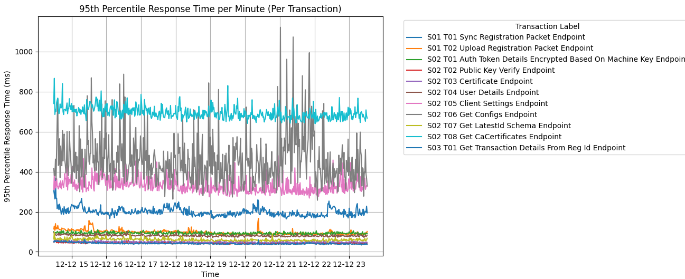
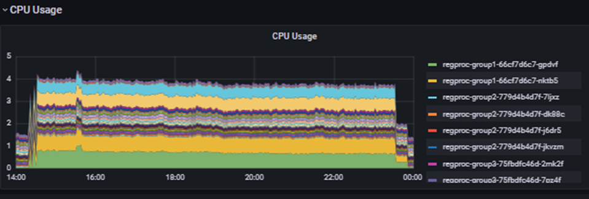
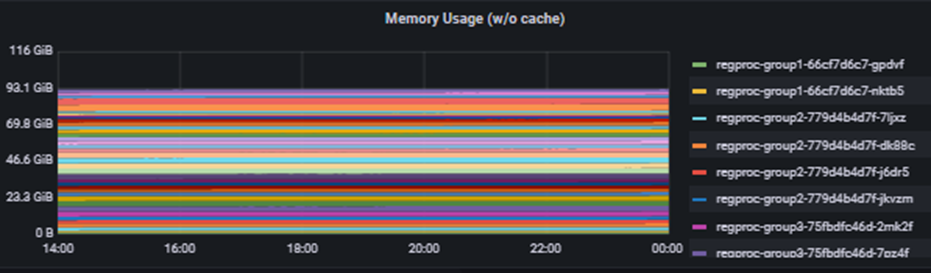
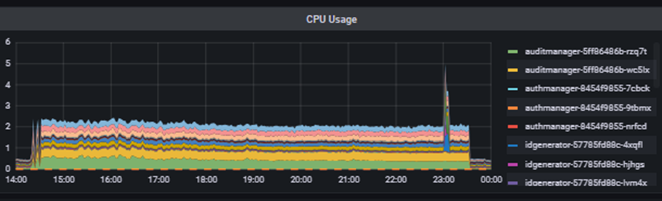
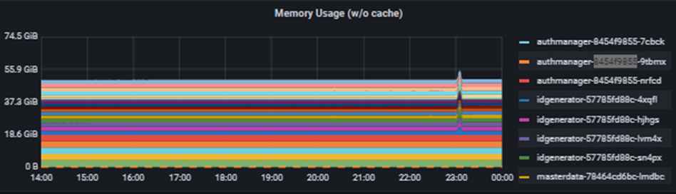
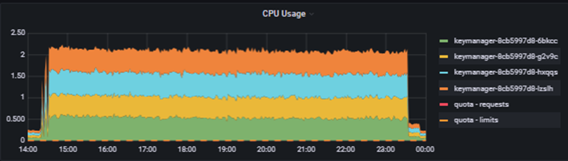
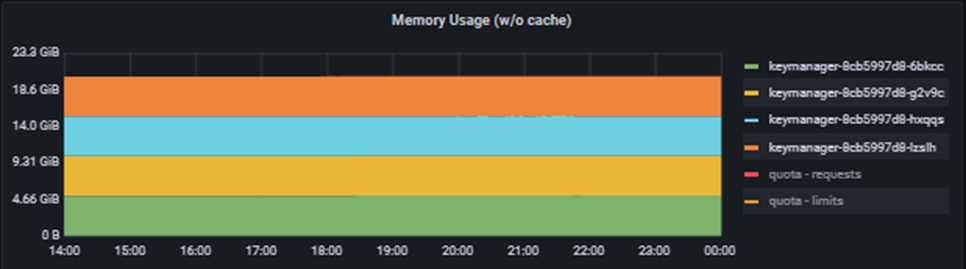
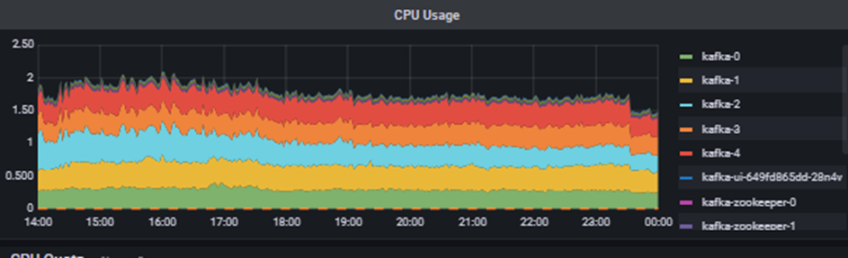
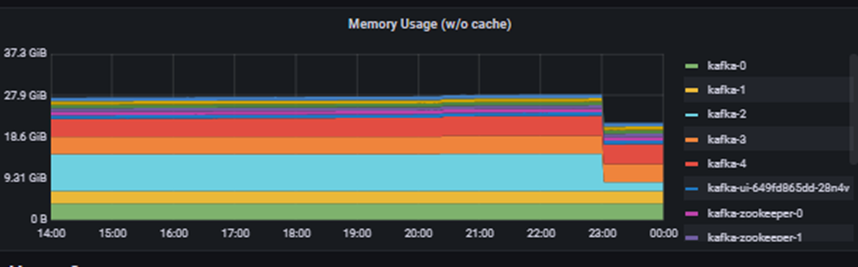

# Reg Proc and SyncData Performance Report

## Overview

Identity life-cycle workflow underwent performance tuning in this release. Identity life-cycle consists of Registrations, Credential Processing and ID Authentication.

This report will cover only APIs for Registration Packet Upload & Sync Data from registration client.

This Performance Report provides a comprehensive analysis of the system’s responsiveness, reliability, and scalability for Registration client sync. It captures key performance metrics such as latency, throughput, resource utilization and memory consumption. This report is designed to help stakeholders understand how MOSIP v1.2.1.0 performs in real-world scenarios, its potential bottlenecks and recommendation for improvements.

**For additional details on functional enhancements, refer to**: [Release Notes 1.2.1.0](./)

## **Summary**

A load test was executed to validate the performance and stability of the Registration Packet Upload and Sync Data APIs.

During the 9‑hour test window, the system successfully uploaded 700K+ registration packets, maintaining consistent throughput and keeping all API response times well below the 1‑second SLA target.

Resource Calculator is provided to help client countries estimate their hardware requirement to achieve similar performance at a larger scale.

No performance degradation or bottlenecks were observed throughout the test duration. Based on the results, this module is assessed to be stable, performant, and ready for release.

## **Test Environment**

### **Deviation from the default**

* Camel and Reprocesser services were disabled to allow Registration Upload to be tested in isolation and not be hindered by packet and credential processing.

### **Software (Under Test)**

Following ‘Images’ were under the scope of ‘Performance Testing’:

#### **Modules Segregation**

| **Image ID**                                                          | **Branch Name** | **Comments** |
| --------------------------------------------------------------------- | --------------- | ------------ |
| mosipqa/registration-processor-stage-group-1:1.3.x                    | release-1.3.x   |              |
| mosipqa/registration-processor-registration-status-service:1.3.x      | release-1.3.x   |              |
| mosipqa/registration-processor-registration-transaction-service:1.3.x | release-1.3.x   |              |
| mosipqa/kernel-syncdata-service:1.3.x                                 | release-1.3.x   |              |
| mosipqa/kernel-keymanager-service:1.3.x                               | release-1.3.x   |              |
| mosipqa/kernel-masterdata-service:1.3.x                               | release-1.3.x   |              |
| mosipqa/kernel-auditmanager-service:1.3.x                             | release-1.3.x   |              |
| mosipqa/kernel-auth-service:1.3.x                                     | release-1.3.x   |              |
| mosipid/kafka:3.2.1-debian-11-r9                                      |                 |              |

#### **Test Data**

Performance data load has been populated before the run to ensure realistic results.

| **DB**         | **Table Name**       | 
<strong>Number Of Records</strong> <strong>(Target)</strong>
 | 
<strong>Number Of Records</strong> <strong>(Tested with)</strong>
 |
| -------------- | -------------------- | ---------------------------------------------------------------------- | --------------------------------------------------------------------------- |
| mosip\_regproc | registration         | 1,000,000                                                              | 610,765                                                                     |
| mosip\_master  | registration\_center | 2,000                                                                  | 4,605                                                                       |
| mosip\_master  | machine\_master      | 5,000                                                                  | 5,035                                                                       |

### **Test Design**

&#x20;

* **Test Duration**: 9-Hours
* **Test Type**: Load
* **Ramp Up**: 2 mins
* **Total VUser Load**: 30
* **Packets Uploaded**: 730,000
* **Packet size**: 0.4MB
* **Tools Used**:
  * JMeter for user load simulation.
  * MOSIP Packet Creator for registration packet generation.

#### **Workload Model**

| **Scenario Name**                       | **Module Name**        | **API Endpoint**                                                        | **SLA (ms)** | **Weightage/Load Distribution** | **Users** | **Throughput (TPS)** | **Target Volume** |
| --------------------------------------- | ---------------------- | ----------------------------------------------------------------------- | ------------ | ------------------------------- | --------- | -------------------- | ----------------- |
| Sync And Upload New Registration Packet | Registration processor | registrationprocessor/v1/registrationstatus/syncV2                      | 1000         | 90%                             | 20        | 22.5                 | 7,29,000          |
|                                         |                        | registrationprocessor/v1/packetreceiver/registrationpackets             | 1000         |                                 |           |                      | 7,29,000          |
| Sync Data From Server                   | Sync Data              | v1/syncdata/authenticate/useridpwd                                      | 1000         | 5%                              | 8         | 1.25                 | 40,500            |
|                                         |                        | v1/syncdata/tpm/publickey/verify                                        | 1000         |                                 |           |                      | 40,500            |
|                                         |                        | v1/syncdata/getCertificate?applicationId=${appId}\&referenceId=${refId} | 1000         |                                 |           |                      | 40,500            |
|                                         |                        | v1/syncdata/userdetails?keyindex=${keyIndex}                            | 1000         |                                 |           |                      | 40,500            |
|                                         |                        | v1/syncdata/clientsettings?keyindex=${keyIndex}                         | 1000         |                                 |           |                      | 40,500            |
|                                         |                        | v1/syncdata/configs/${keyIndex}                                         | 1000         |                                 |           |                      | 40,500            |
|                                         |                        | v1/syncdata/latestidschema?schemaVersion=${schemaVersion}               | 1000         |                                 |           |                      | 40,500            |
|                                         |                        | v1/syncdata/getcacertificates                                           | 1000         |                                 |           |                      | 40,500            |
| Get Transaction Details From Reg Id     | Registration processor | /registrationprocessor/v1/registrationtransaction/search/${regId}       | 1000         | 5%                              | 2         | 1.25                 | 40,500            |

## **Test Result**

#### **Performance test execution results**

| **Application Name** | Registration Processor & Sync Data           |
| -------------------- | -------------------------------------------- |
| **Test Duration**    | 12/12/24 20:00PM - 13/12/24 5:00AM (9-Hours) |
| **Number of users**  | 30                                           |
| **Status**           | GREEN                                        |

### &#x20;**Test Report**

The 95th Line will be considered the primary Response Time metric while comparing with SLA.

| Scenario Name                               | Transaction Name                                                   | API Endpoint                                                            | 25 TPS & 30 VUsers |          |              |              |          |         |
| ------------------------------------------- | ------------------------------------------------------------------ | ----------------------------------------------------------------------- | ------------------ | -------- | ------------ | ------------ | -------- | ------- |
| Date: 2025/12/12 (9 Hours)                  |                                                                    |                                                                         |                    |          |              |              |          |         |
|                                             |                                                                    |                                                                         | # Samples          | Min (ms) | Average (ms) | 95% Line(ms) | Max (ms) | Error % |
| S01 Sync and Upload New Registration Packet | S01 T01 Sync Registration Packet Endpoint                          | registrationprocessor/v1/registrationstatus/syncV2                      | 7,31,342           | 99.0     | 139.0        | 196.0        | 1155.0   | 0.1%    |
| S01 T02 Upload Registration Packet Endpoint | registrationprocessor/v1/packetreceiver/registrationpackets        | 7,31,330                                                                | 46.0               | 74.0     | 90.0         | 1139.0       | 0.0%     |         |
| S02 Sync Data from Server                   | S02 T01 Auth Token Details Encrypted Based on Machine Key Endpoint | v1/syncdata/authenticate/useridpwd                                      | 39,358             | 60.0     | 76.9         | 93.0         | 201.0    | 0.0%    |
|                                             | S02 T02 Public Key Verify Endpoint                                 | v1/syncdata/tpm/publickey/verify                                        | 39,357             | 24.0     | 34.5         | 43.0         | 129.0    | 0.0%    |
|                                             | S02 T03 Certificate Endpoint                                       | v1/syncdata/getCertificate?applicationId=${appId}\&referenceId=${refId} | 39,357             | 24.0     | 37.8         | 48.0         | 107.0    | 0.0%    |
|                                             | S02 T04 User Details Endpoint                                      | v1/syncdata/userdetails?keyindex=${keyIndex}                            | 39,356             | 50.0     | 66.3         | 80.0         | 200.0    | 0.0%    |
|                                             | S02 T05 Client Settings Endpoint                                   | v1/syncdata/clientsettings?keyindex=${keyIndex}                         | 39,356             | 173.0    | 263.3        | 320.0        | 1006.0   | 0.0%    |
|                                             | S02 T06 Get Configs Endpoint                                       | v1/syncdata/configs/${keyIndex}                                         | 39,356             | 75.0     | 249.2        | 467.0        | 3057.0   | 0.0%    |
|                                             | S02 T07 Get LatestId Schema Endpoint                               | v1/syncdata/latestidschema?schemaVersion=${schemaVersion}               | 39,355             | 31.0     | 46.6         | 58.0         | 233.0    | 0.0%    |
|                                             | S02 T08 Get CaCertificates Endpoint                                | v1/syncdata/getcacertificates                                           | 39,354             | 518.0    | 613.0        | 688.0        | 1148.0   | 0.0%    |
| S03 Get Transaction Details From Reg Id     | S03 T01 Get Transaction Details From Reg Id Endpoint               | /registrationprocessor/v1/registrationtransaction/search/${regId}       | 65,068             | 21.0     | 31.5         | 40.0         | 1042.0   | 0.0%    |

#### **High Level Observations:**

* The response time was well under the 1 second target for all APIs.
* We were able to perform 700K packets in 9 hours at the rate of 22 packets uploaded per second.
* No degradation in response time was observed throughout the long test run.

### **Metrics**

#### **Response Time over Time**

<figure><figcaption></figcaption></figure>

#### &#x20;**Observations:**

* Response time was consistent throughout the test with negligible variance.

#### &#x20;**Resource Utilization**

For sake of brevity of the report, resource metrics are grouped by Namespace and all services in Namespace is displayed even if they did not actively participate in the test.

**REGPROC**

<figure><figcaption></figcaption></figure>

<figure><figcaption></figcaption></figure>

**KERNEL**&#x20;

<figure><figcaption></figcaption></figure>

<figure><figcaption></figcaption></figure>

**Observations:**

* Idgenerator service within Kernel namespace showed a brief spike (<8mins). This module is out of scope for this test. There was no measurable impact on overall system performance and throughput. &#x20;

&#x20;

**KEYMANAGER**&#x20;

<figure><figcaption></figcaption></figure>

<figure><figcaption></figcaption></figure>

**Kafka**&#x20;

<figure><figcaption></figcaption></figure>

<figure><figcaption></figcaption></figure>

**Observations:**

* One pod (out of 5) of Kafka service showed significantly noticeable dip in memory usage in the last 30 minutes of the test. But there was no measurable impact on overall system performance and throughput. The behaviour appears consistent with normal page‑cache activity, however reviewing memory allocation patterns may help refine resource sizing.

&#x20;&#x20;

### **Resource Calculator**

Find the '**Resource Calculator**' here on this [**page**](../../../setup/deploymentnew/getting-started/production/server-hardware-requirements/).

### **Resource level configuration**

Following configuration was used for the performance test.

| **NameSpace**                          | **Deployment**                           |            |                | **Resources** |                | **Java Option** |         | **No.of Pods** |
| -------------------------------------- | ---------------------------------------- | ---------- | -------------- | ------------- | -------------- | --------------- | ------- | -------------- |
| 
<strong>Limits</strong>

 
 | 
<strong>Requests</strong>

 
 |            |                |               |                | **Min**         | **Max** |                |
|                                        |                                          | **CPU(m)** | **Memory(Mi)** | **CPU(m)**    | **Memory(Mi)** |                 |         |                |
| REGPROC                                | REGPROC-GROUP1                           | 1000       | 1000           | 1000          | 1000           | 500             | 500     | 2              |
| REGPROC                                | REGPROC-STATUS                           | 700        | 1500           | 700           | 1500           | 950             | 950     | 2              |
| REGPROC                                | REGPROC-TRANS                            | 1000       | 5000           | 1000          | 5000           | 3750            | 3750    | 2              |
| KERNEL                                 | SYNCDATA                                 | 2000       | 2500           | 2000          | 2500           | 1750            | 1750    | 3              |
| KEYMANAGER                             | KEYMANAGER                               | 2000       | 6000           | 2000          | 6000           | 4250            | 4250    | 4              |
| KERNEL                                 | MASTERDATA                               | 500        | 2250           | 500           | 2250           | 1500            | 1500    | 2              |
| KERNEL                                 | AUDITMANAGER                             | 2000       | 5000           | 2000          | 5000           | 3250            | 3250    | 2              |
| KERNEL                                 | AUTHMANAGER                              | 1000       | 5000           | 1000          | 5000           | 3150            | 3150    | 3              |
| kafka                                  | kafka                                    | 2000       | 5000           | 2000          | 5000           |                 |         | 5              |

## **Performance Analysis**

### **KPI**

* The performance test was conducted to ensure large amount of identity packets could be uploaded at a time. 700K+ packets were upload during 9-hour test run.
* Sync Data activity was also simulated while concurrently while Registrations Upload was running. ‘Sync Data’ made up 5% of the traffic, Get Transaction Detail’ made another 5% and the remaining 90% was Registrations Upload.
* Additionally, the hardware resources used to achieve this rate of transaction per second (TPS) has been shared via Resource Calculator document. It can be used to estimate resources required for higher processing as per specific needs of client countries.

### **Bottlenecks**

Based on the defined scope and the results of this performance test, no major bottlenecks or performance‑limiting issues were observed. All services operated within acceptable resource boundaries, and all API response times remained well below the 1‑second SLA target.

### **Recommendation**

* The system demonstrated stable performance throughout the 9‑hour run, successfully processing 700K packets without any degradation. This confirms readiness for production‑scale workloads.
* For capacity planning, it is recommended to use the Resource Calculator to estimate infrastructure requirements for higher throughput or larger population sizes.
* Any deviations between the performance test environment, workload model and the default production configuration should be considered when planning resource allocation for real‑world deployments

.

## **Conclusion**

MOSIP v1.2.1.0 is able to reliably upload 700,000+ registration packets in 9-hours. The Resource Calculator can be used to estimate the hardware requirements for higher upload capacity for larger population. No major performance degradation or bottlenecks were observed throughout the test duration, and this module is ready for release.
