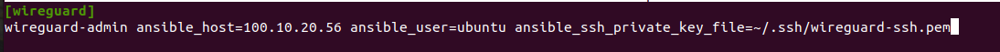
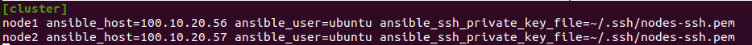

# On-Premises Deployment

## 1. Wireguard

* Wireguard bastian server provides secure private channel to access MOSIP cluster.
* Bastian server restricts public access, and enables access to only those clients who have their public key listed in Wireguard server.
* Bastion server listens on UDP port 51820.
* In case you already have VPN configured to access nodes privately please skip Wireguard installation and continue to use the same VPN.

**Setup Wireguard VM and wireguard bastion server**

* Create a Wireguard server VM with mentioned '[**Hardware and Network Requirements**'](pre-requisites.md).
* Open required ports in the Bastian server VM.
  * `cd $K8_ROOT/wireguard/`
  * Create copy of `hosts.ini.sample` as `hosts.ini` and update the required details for wireguard VM
  * `cp hosts.ini.sample hosts.ini`
  > Note :
  > * Remove `[Cluster]` complete section from copied `hosts.ini` file.
  > * Add below mentioned details:
  >   * ansible_host : public IP of Wireguard Bastion server. eg. 100.10.20.56
  >   * ansible_user : user to be used for installation. In this ref-impl we use Ubuntu user.
  >   * ansible_ssh_private_key_file : path to pem key for ssh to wireguard server. eg. `~/.ssh/wireguard-ssh.pem`
  >   
  * Execute ports.yml to enable ports on VM level using ufw:`ansible-playbook -i hosts.ini ports.yaml`

> Note:
> * Permission of the pem files to access nodes should have 400 permission. `sudo chmod 400 ~/.ssh/privkey.pem`
> * These ports are only needed to be opened for sharing packets over UDP.
> * Take necessary measure on firewall level so that the Wireguard server can be reachable on 51820/udp.

* Install docker
  *   execute docker.yml to install docker and add user to docker group:

      ```
      ansible-playbook -i hosts.ini docker.yaml
      ```
* Setup Wireguard server
  * SSH to wireguard VM
  * `ssh -i <path to .pem> ubuntu@<Wireguard server public ip>`
  * Create directory for storing wireguard config files.
    `mkdir -p wireguard/config`
  *   Install and start wireguard server using docker as given below:

      ```
      sudo docker run -d \
      --name=wireguard \
      --cap-add=NET_ADMIN \
      --cap-add=SYS_MODULE \
      -e PUID=1000 \
      -e PGID=1000 \
      -e TZ=Asia/Calcutta \
      -e PEERS=30 \
      -p 51820:51820/udp \
      -v /home/ubuntu/wireguard/config:/config \
      -v /lib/modules:/lib/modules \
      --sysctl="net.ipv4.conf.all.src_valid_mark=1" \
      --restart unless-stopped \
      ghcr.io/linuxserver/wireguard
      ```

> Note:
>
> * Increase the no. of peers above in case more than 30 wireguard client confs (-e PEERS=30) are needed.
> * Change the directory to be mounted to wireguard docker as per need. All your wireguard confs will be generated in the mounted directory (`-v /home/ubuntu/wireguard/config:/config`).

**Setup Wireguard Client in your PC**

* Install Wireguard client in your PC using [steps](https://www.wireguard.com/install/).
*   Assign `wireguard.conf`:

    * SSH to the wireguard server VM.
    * `cd /home/ubuntu/wireguard/config`
    *   assign one of the PR for yourself and use the same from the PC to connect to the server.

        * create `assigned.txt` file to assign the keep track of peer files allocated and update everytime some peer is allocated to someone.

        ```
        peer1 :   peername
        peer2 :   xyz
        ```

        * use `ls` cmd to see the list of peers.
        * get inside your selected peer directory, and add mentioned changes in `peer.conf`:
          * `cd peer1`
          * `nano peer1.conf`
            * Delete the DNS IP.
            * Update the allowed IP's to subnets CIDR ip . e.g. 10.10.20.0/23
            > Note:
            > * CIDR Range will be shared by the Infra provider.
            > * Make sure all the nodes are covered in the provided CIDR range. (nginx server, K8 cluster nodes for observation as well as mosip).
          * Share the updated `peer.conf` with respective peer to connect to wireguard server from Personel PC.
    * Add `peer.conf` in your PC’s `/etc/wireguard` directory as `wg0.conf`.
    * Start the wireguard client and check the status:

    ```
    sudo systemctl start wg-quick@wg0
    sudo systemctl status wg-quick@wg0
    ```
* Once connected to wireguard, you should be now able to login using private IP’s.

## 2. Observation K8s Cluster setup and configuration

* Install all the required tools mentioned in '[Personel Computer Setup](pre-requisites.md#personal-computer-requirements)' section.
* Setup Observation Cluster node VM’s hardware and network configuration as per ([requirements](pre-requisites.md#hardware-requirements)).
* Setup passwordless SSH into the cluster nodes via pem keys. (Ignore if VM’s are accessible via pem’s).
  * Generate keys on your PC`ssh-keygen -t rsa`
  * Copy the keys to remote observation node VM’s`ssh-copy-id <remote-user>@<remote-ip>`
  * SSH into the node to check password-less SSH`ssh -i ~/.ssh/<your private key> <remote-user>@<remote-ip>`

> Note:
>
> * Make sure the permission for `privkey.pem` for ssh is set to 400.

* Open ports and install docker on Observation K8 Cluster node VM’s.
  * `cd $K8_ROOT/rancher/on-prem`
  * Copy `hosts.ini.sample` to `hosts.ini` and update required details.
  * `cp hosts.ini.sample hosts.ini`
  > Note:
  > * Ensure you are inside `on-prem` directory as mentioned above.
  > * ansible_host : internal IP of nodes. eg. 100.10.20.56, 100.10.20.57 ...
  > * ansible_user : user to be used for installation. In this ref-implementation we use Ubuntu user.
  > * ansible_ssh_private_key_file : path to pem key for ssh to wireguard server. eg. `~/.ssh/nodes-ssh.pem`
  > 
  * Update `vpc_ip` variable in `ports.yaml` with vpc CIDR ip to allow access only from machines inside same vpc.
    > Note:
    > * CIDR Range will be shared by the Infra provider.
    > * Make sure all the nodes are covered in the provided CIDR range. (nginx server, K8 cluster nodes for observation as well as mosip).
  * Execute `ports.yml` to enable ports on VM level using ufw:`ansible-playbook -i hosts.ini ports.yaml`
  * Disable swap in cluster nodes. (Ignore if swap is already disabled)
    * `ansible-playbook -i hosts.ini swap.yaml`
    > Caution: Always verify swap status with `swapon --show` before running the playbook to avoid unnecessary operations.
  * execute `docker.yml` to install docker and add user to docker group:`ansible-playbook -i hosts.ini docker.yaml`
* Creating RKE Cluster Configuration file
  * `rke config`
  *   Command will prompt for nodal details related to cluster, provide inputs w.r.t below mentioned points:

      * `SSH Private Key Path` :
      * `Number of Hosts`:
      * `SSH Address of host` :
      * `SSH User of host` :

      ```
      Is host (<node1-ip>) a Control Plane host (y/n)? [y]: y
      Is host (<node1-ip>) a Worker host (y/n)? [n]: y
      Is host (<node1-ip>) an etcd host (y/n)? [n]: y
      ```

      * Make all the nodes `Worker host` by default.
      * To create an HA cluster, specify more than one host with role `Control Plane` and `etcd host`.
  * `Network Plugin Type` : Continue with canal as default network plugin.
  * For rest of other configurations, opt the required or default value.
* As result of `rke config` command `cluster.yml` file will be generated inside same directory, update the below mentioned fields:
  *   `nano cluster.yml`

      * Remove the default Ingress install

      ```
      ingress:
      provider: none
      ```
  * Update the name of the kubernetes cluster in `cluster.yml`.
    * `cluster_name: observation-cluster`
* For production deplopyments edit the `cluster.yml`, according to this [RKE Cluster Hardening Guide](https://github.com/mosip/k8s-infra/blob/v1.2.0.1-B1/docs/rke-cluster-hardening.md).
*   Setup up the cluster:

    *   Once `cluster.yml` is ready, you can bring up the kubernetes cluster using simple command.

        * This command assumes the `cluster.yml` file is in the same directory as where you are running the command.
        * `rke up`

        ````
        INFO[0000] Building Kubernetes cluster
        INFO[0000] [dialer] Setup tunnel for host [10.0.0.1]
        INFO[0000] [network] Deploying port listener containers   
        INFO[0000] [network] Pulling image [alpine:latest] on host [10.0.0.1]
        ...
        INFO[0101] Finished building Kubernetes cluster successfully
        ```
        ````
        * The last line should read `Finished building Kubernetes cluster` successfully to indicate that your cluster is ready to use.
        > Note:
        > * Incase `rke up` command is unsucessfull due to any underline error then we need to fix the same by checking the logs.
        > * Once the issue is fixed we need to remove the cluster using `rke remove`.
        > * Once `rke remove` is executed sucessfully need to delete cluster related incomplete configuration using :
        >   ```
        >   ansible-playbook -i hosts.ini ../../utils/rke-components-delete.yaml
        >   ```
    * As part of the Kubernetes creation process, a `kubeconfig` file has been created and written at `kube_config_cluster.yml`, which can be used to start interacting with your Kubernetes cluster.
    * Copy the kubeconfig files

    ```
    cp kube_config_cluster.yml $HOME/.kube/<cluster_name>_config
    chmod 400 $HOME/.kube/<cluster_name>_config
    ```

    * To access the cluster using `kubeconfig` file use any one of the below method:
      * `cp $HOME/.kube/<cluster_name>_config $HOME/.kube/config`\
        **Alternatively**
      * `export KUBECONFIG="$HOME/.kube/<cluster_name>_config`
    * Test cluster access:
      * `kubectl get nodes`
        * Command will result in details of the nodes of the Observation cluster.
    * Save your files
      * Save a copy of the following files in a secure location, they are needed to maintain, troubleshoot and upgrade your cluster.
        * `cluster.yml`: The RKE cluster configuration file.
        * `kube_config_cluster.yml`: The [Kubeconfig file](https://rancher.com/docs/rke/latest/en/kubeconfig/) for the cluster, this file contains credentials for full access to the cluster.
        * `cluster.rkestate`: The [Kubernetes Cluster State file](https://rancher.com/docs/rke/latest/en/installation/#kubernetes-cluster-state), this file contains credentials for full access to the cluster.

## 3. Observation K8s Cluster Ingress, Storageclass setup

Once the rancher cluster is ready, we need ingress and storage class to be set for other applications to be installed.

### 3.a.[Nginx Ingress Controller](https://kubernetes.github.io/ingress-nginx/deploy/): used for ingress in rancher cluster.

```
cd $K8_ROOT/mosip/on-prem
helm repo add ingress-nginx https://kubernetes.github.io/ingress-nginx
helm repo update
helm install \                                                                                                             
  ingress-nginx ingress-nginx/ingress-nginx \
  --namespace ingress-nginx \
  --version 4.0.18 \
  --create-namespace  \
  -f ingress-nginx.values.yaml
```

> Note:
>
> * This will install ingress in namespace `ingress-nginx` of Observation cluster.
> * Crosscheck using below mentioned command:
> * `kubectl get all -n ingress-nginx`
> * Command should result with list of all the pods, deployments etc in ingress nginx namespace.

### 3.b. Storage classes setup

* Multiple storage classes options are available for onprem K8's cluster.
* In MOSIP's this reference deployment will continue to use NFS as a staorage class.
  * [NFS client provisioner storage class](https://github.com/mosip/k8s-infra/blob/v1.2.0.1/mosip/nfs/README.md).
* Other available options are as follows:
  * [Vsphere storage class](https://github.com/vmware-archive/vsphere-storage-for-kubernetes): If you are already using VMware virtual machines, you can proceed with the vSphere storage class.
  * [ceph-csi](https://github.com/mosip/k8s-infra/blob/main/ceph/README.md)
  * [Longhorn](https://github.com/mosip/k8s-infra/blob/v1.2.0.1/longhorn/README.md)

## 4. Setting up nginx server for Observation K8s Cluster

### 4.a. SSL Certificate setup for TLS termination

* For Nginx server setup we need ssl certificate, add the same into Nginx server.
*   Incase valid ssl certificate is not there generate one using letsencrypt:

    * SSH into the nginx server
    * Install Pre-requisites

    ```
    sudo apt update -y
    sudo apt-get install software-properties-common -y
    sudo add-apt-repository ppa:deadsnakes/ppa
    sudo apt-get update -y
    sudo apt-get install python3.8 -y
    sudo apt install letsencrypt -y
    sudo apt install certbot python3-certbot-nginx -y
    ```
* Generate wildcard SSL certificates for your domain name.
  * `sudo certbot certonly --agree-tos --manual --preferred-challenges=dns -d *.org.net`
    * replace `org.net` with your domain.
    * The default challenge HTTP is changed to DNS challenge, as we require wildcard certificates.
    * Create a DNS record in your DNS service of type TXT with host `_acme-challenge.org.net`, with the string prompted by the script.
    * Wait for a few minutes for the above entry to get into effect.**Verify**:`host -t TXT _acme-challenge.org.net`
    * Press enter in the `certbot` prompt to proceed.
    * Certificates are created in `/etc/letsencrypt` on your machine.
    * Certificates created are valid for 3 months only.
  * Wildcard SSL certificate [renewal](https://github.com/mosip/k8s-infra/blob/v1.2.0.1/docs/wildcard-ssl-certs-letsencrypt.md#ssl-certificate-renewal). This will increase the validity of the certificate for next 3 months.

### 4.b. Install Nginx :

  * Login to nginx server node.
  *   Clone [k8s-infra](https://github.com/mosip/k8s-infra)

      ```
      cd $K8_ROOT/rancher/on-prem/nginx
      sudo ./install.sh
      ```
* Provide below mentioned inputs as and when promted
  * Rancher nginx ip : internal ip of the nginx server VM.
  * SSL cert path : path of the ssl certificate to be used for ssl termination.
  * SSL key path : path of the ssl key to be used for ssl termination.
  * Cluster node ip's : ip’s of the rancher cluster node
* Post installation check:
  * `sudo systemctl status nginx`
  * Steps to Uninstall nginx (in case required)`sudo apt purge nginx nginx-common`\
    DNS mapping: Once nginx server is installed sucessfully, create DNS mapping for rancher cluster related domains as mentioned in DNS requirement section. (rancher.org.net, keycloak.org.net)

## 5. Observation K8's Cluster Apps Installation

### 5.a. Rancher UI

* Rancher provides full CRUD capability of creating and managing kubernetes cluster.
*   Install rancher using Helm, update `hostname` in `rancher-values.yaml` and run the following command to install.

    ```
    cd $K8_ROOT/rancher/rancher-ui
    helm repo add rancher-latest https://releases.rancher.com/server-charts/latest
    helm repo update
    helm install rancher rancher-latest/rancher \
    --namespace cattle-system \
    --create-namespace \
    -f rancher-values.yaml
    ```
*   Login:

    * Open [Rancher](https://rancher.org.net) page.
    * Get Bootstrap password using

    ```
    kubectl get secret --namespace cattle-system bootstrap-secret -o go-template='{{ .data.bootstrapPassword|base64decode}}{{ "\n" }}'
    ```

> Note: Assign a password. IMPORTANT: makes sure this password is securely saved and retrievable by Admin.

### 5.b. Keycloak

*   [Keycloak](../../\(https:/www.keycloak.org/\)/) is an OAuth 2.0 compliant Identity Access Management (IAM) system used to manage the access to Rancher for cluster controls.

    ```
    cd $K8_ROOT/rancher/keycloak
    ./install.sh <iam.host.name>
    ```
* `keycloak_client.json`: Used to create SAML client on Keycloak for Rancher integration.

### 5.c. Keycloak - Rancher UI Integration

* Login as `admin` user in Keycloak and make sure an email id, and first name field is populated for admin user. This is important for Rancher authentication as given below.
* Enable authentication with Keycloak using the steps given [here](https://ranchermanager.docs.rancher.com/v2.6/how-to-guides/new-user-guides/authentication-permissions-and-global-configuration/authentication-config/configure-keycloak-saml).
* In Keycloak add another Mapper for the rancher client (in Master realm) with following fields:
  * Protocol: saml
  * Name: username
  * Mapper Type: User Property
  * Property: username
  * Friendly Name: username
  * SAML Attribute Name: username
  * SAML Attribute NameFormat: Basic
  * Specify the following mappings in Rancher's Authentication Keycloak form:
    * Display Name Field: givenName
    * User Name Field: email
    * UID Field: username
    * Entity ID Field: https://your-rancher-domain/v1-saml/keycloak/saml/metadata
    * Rancher API Host: https://your-rancher-domain
    * Groups Field: member

### 5.d. RBAC for Rancher using Keycloak

* For users in Keycloak assign roles in Rancher - **cluster** and **project** roles. Under `default` project add all the namespaces. Then, to a non-admin user you may provide Read-Only role (under projects).
* If you want to create custom roles, you can follow the steps given [here](https://github.com/mosip/k8s-infra/blob/v1.2.0.1/docs/create-custom-role.md).
* Add a member to cluster/project in Rancher:
  * Navigate to RBAC cluster members
  * Add member name exactly as `username` in Keycloak
  * Assign appropriate role like Cluster Owner, Cluster Viewer etc.
  * You may create new role with fine grained acccess control.
* Add group to to cluster/project in Rancher:
  * Navigate to RBAC cluster members
  * Click on `Add` and select a group from the displayed drop-down.
  * Assign appropriate role like Cluster Owner, Cluster Viewer etc.
  * To add groups, the user must be a member of the group.
* Creating a Keycloak group involves the following steps:
  * Go to the "Groups" section in Keycloak and create groups with default roles.
  * Navigate to the "Users" section in Keycloak, select a user, and then go to the "Groups" tab. From the list of groups, add the user to the required group.

## 6. MOSIP K8s Cluster setup

* Pre-requisites:
  * Install all the required tools mentioned in Pre-requisites for PC.
    * kubectl
    * helm

    ```
    helm repo add bitnami https://charts.bitnami.com/bitnami
    helm repo add mosip https://mosip.github.io/mosip-helm
    ```
  * ansible
  * rke (version 1.3.10)
  * Setup MOSIP K8 Cluster node VM’s as per '[**Hardware and Network Requirements**'](pre-requisites.md).
* Run `env-check-setup.yaml` to check if cluster nodes are fine and dont have known issues in it.
  * `cd $K8_ROOT/rancher/on-prem`
  * Create copy of `hosts.ini.sample` as `hosts.ini` and update the required details for MOSIP k8 cluster nodes.
    * `cp hosts.ini.sample hosts.ini`
    > Note:
    > * Ensure you are inside `on-prem` directory as mentioned above.
    > * ansible_host : internal IP of nodes. eg. 100.10.20.56, 100.10.20.57 ...
    > * ansible_user : user to be used for installation. In this ref-implementation we use Ubuntu user.
    > * ansible_ssh_private_key_file : path to pem key for ssh to wireguard server. eg. `~/.ssh/nodes-ssh.pem`
    > 
  * `ansible-playbook -i hosts.ini env-check-setup.yaml`
  * This ansible checks if localhost mapping ia already present in `/etc/hosts` file in all cluster nodes, if not it adds the same.
* Setup passwordless ssh into the cluster nodes via pem keys. (Ignore if VM’s are accessible via pem’s).
  * Generate keys on your PC
    * `ssh-keygen -t rsa`
  * Copy the keys to remote rancher node VM’s:
    * `ssh-copy-id <remote-user>@<remote-ip>`
  * SSH into the node to check password-less SSH
    * `ssh -i ~/.ssh/<your private key> <remote-user>@<remote-ip>`
  * Rancher UI : (deployed in Observation K8 cluster)
* Open ports and Install docker on MOSIP K8 Cluster node VM’s.
  * `cd $K8_ROOT/mosip/on-prem`
  * create copy of `hosts.ini.sample` as `hosts.ini` and update the required details for wireguard VM.
    * `cp hosts.ini.sample hosts.ini`
  * Update `vpc_ip` variable in `ports.yaml` with `vpc CIDR ip` to allow access only from machines inside same vpc.
    > Note:
    > * CIDR Range will be shared by the Infra provider.
    > * Make sure all the nodes are covered in the provided CIDR range. (nginx server, K8 cluster nodes for observation as well as mosip).
  * execute `ports.yml` to enable ports on VM level using ufw:`ansible-playbook -i hosts.ini ports.yaml`
  * Disable swap in cluster nodes. (Ignore if swap is already disabled)
    * `ansible-playbook -i hosts.ini swap.yaml`
    > Caution: Always verify swap status with `swapon --show` before running the playbook to avoid unnecessary operations.
  * execute `docker.yml` to install docker and add user to docker group:`ansible-playbook -i hosts.ini docker.yaml`
* Creating RKE Cluster Configuration file
  * rke config
  *   Command will prompt for nodal details related to cluster, provide inputs w.r.t below mentioned points:

      * `SSH Private Key Path` :
      * `Number of Hosts`:
      * `SSH Address of host` :
      * `SSH User of host` :

      ```
      Is host (<node1-ip>) a Control Plane host (y/n)? [y]: y
      Is host (<node1-ip>) a Worker host (y/n)? [n]: y
      Is host (<node1-ip>) an etcd host (y/n)? [n]: y
      ```

      * Make all the nodes Worker `host` by default.
      * To create an HA cluster, specify more than one host with role `Control Plane` and `etcd host`.
  * `Network Plugin Type` : Continue with canal as default network plugin.
  * For rest for other configuration opt the required or default value.
* As result of rke config command `cluster.ymlfile` will be generated inside same directory, update the below mentioned fields:
  * `nano cluster.yml`
  *   Remove the default Ingress install

      ```
      ingress:
      provider: none
      ```
  *   Update the name of the kubernetes cluster in `cluster.yaml`

      ```
      `cluster_name: sandbox-name`
      ```
  * For production deplopyments edit the `cluster.yml`, according to this [RKE Cluster Hardening Guide](https://github.com/mosip/k8s-infra/blob/v1.2.0.1-B1/docs/rke-cluster-hardening.md).
*   Setup up the cluster:

    * Once `cluster.yml` is ready, you can bring up the kubernetes cluster using simple command.
      *   This command assumes the `cluster.yml` file is in the same directory as where you are running the command.

          * `rke up`

          ```
          INFO[0000] Building Kubernetes cluster
          INFO[0000] [dialer] Setup tunnel for host [10.0.0.1]
          INFO[0000] [network] Deploying port listener containers
          INFO[0000] [network] Pulling image [alpine:latest] on host [10.0.0.1]
          ...
          INFO[0101] Finished building Kubernetes cluster successfully
          ```
      * The last line should read `Finished building Kubernetes cluster successfully` to indicate that your cluster is ready to use.
      *   Copy the kubeconfig files

          ```
          cp kube_config_cluster.yml $HOME/.kube/<cluster_name>_config
          chmod 400 $HOME/.kube/<cluster_name>_config
          ```
    * To access the cluster using kubeconfig filr use any one of the below method:
    * `cp $HOME/.kube/<cluster_name>_config $HOME/.kube/config`**Alternatively**

    ```
    * `export KUBECONFIG="$HOME/.kube/<cluster_name>_config`
    ```
* Test cluster access:
  * `kubect get nodes`
  * Command will result in details of the nodes of the rancher cluster.
* Save Your files
  * Save a copy of the following files in a secure location, they are needed to maintain, troubleshoot and upgrade your cluster.:
    * `cluster.yml`: The RKE cluster configuration file.
    * `kube_config_cluster.yml`: The [Kubeconfig file](https://rke.docs.rancher.com/kubeconfig) for the cluster, this file contains credentials for full access to the cluster.
    * `cluster.rkestate`: The [Kubernetes Cluster State file](https://rke.docs.rancher.com/installation#kubernetes-cluster-state), this file contains credentials for full access to the cluster.

## 7. MOSIP K8 Cluster Global configmap, Ingress and Storage Class setup

### 7.a. Global configmap:

* Global configmap contains the list of neccesary details to be used throughout the namespaces of the cluster for common details.
* `cd $K8_ROOT/mosip`
* Copy `global_configmap.yaml.sample` to `global_configmap.yaml`.
* Update the domain names in `global_configmap.yaml` and run.
* `kubectl apply -f global_configmap.yaml`

### 7.b. [Istio](https://istio.io/) Ingress setup:

* It is a service mesh for the MOSIP K8 cluster which provides transparent layers on top of existing microservices along with powerful features enabling a uniform and more efficient way to secure, connect, and monitor services.
  * `cd $K8_ROOT/mosip/on-prem/istio`
  * `./install.sh`
  * This will bring up all the Istio components and the Ingress Gateways.
  * Check Ingress Gateway services:
    * `kubectl get svc -n istio-system`
      * `istio-ingressgateway`: external facing istio service.
      * `istio-ingressgateway-internal`: internal facing istio service.
      * `istiod`: Istio daemon for replicating the changes to all envoy filters.

### 7.c. Storage classes

* Multiple storage classes options are available for onprem K8's cluster.
* In MOSIP's this reference deployment will continue to use NFS as a staorage class.
  * [NFS client provisioner storage class](https://github.com/mosip/k8s-infra/blob/v1.2.0.1/mosip/nfs/README.md).
* Other available options are as follows:
  * [Vsphere storage class](https://github.com/vmware-archive/vsphere-storage-for-kubernetes): If you are already using VMware virtual machines, you can proceed with the vSphere storage class.
  * [ceph-csi](https://github.com/mosip/k8s-infra/blob/main/ceph/README.md)
  * [Longhorn](https://github.com/mosip/k8s-infra/blob/v1.2.0.1/longhorn/README.md)

## 8. Import MOSIP Cluster into Rancher UI

* Login as admin in Rancher console
* Select `Import` Existing for cluster addition.
* Select `Generic` as cluster type to add.
* Fill the `Cluster Name` field with unique cluster name and select `Create`.
* You will get the kubectl commands to be executed in the kubernetes cluster. Copy the command and execute from your PC (make sure your `kube-config` file is correctly set to MOSIP cluster).
```
e.g.:
kubectl apply -f https://rancher.e2e.mosip.net/v3/import/pdmkx6b4xxtpcd699gzwdtt5bckwf4ctdgr7xkmmtwg8dfjk4hmbpk_c-m-db8kcj4r.yaml
```
* Wait for few seconds after executing the command for the cluster to get verified.
* Your cluster is now added to the rancher management server.

## 9. MOSIP K8 cluster Nginx server setup

### 9.a. SSL certificates creation

* For Nginx server setup, we need ssl certificate, add the same into Nginx server.
* Incase valid ssl certificate is not there generate one using letsencrypt:
  * SSH into the nginx server
  *   Install Pre-requisites:

      ```
      sudo apt update -y
      sudo apt-get install software-properties-common -y
      sudo add-apt-repository ppa:deadsnakes/ppa
      sudo apt-get update -y
      sudo apt-get install python3.8 -y
      sudo apt install letsencrypt -y
      sudo apt install certbot python3-certbot-nginx -y
      ```
  * Generate wildcard SSL certificates for your domain name.
    * `sudo certbot certonly --agree-tos --manual --preferred-challenges=dns -d *.sandbox.mosip.net -d sandbox.mosip.net`
      * replace `sanbox.mosip.net` with your domain.
      * The default challenge HTTP is changed to DNS challenge, as we require wildcard certificates.
      * Create a DNS record in your DNS service of type TXT with host `_acme-challenge.sandbox.xyz.net`, with the string prompted by the script.
      * Wait for a few minutes for the above entry to get into effect.\
        \*\* Verify\*\*: `host -t TXT _acme-challenge.sandbox.mosip.net`
      * Press enter in the `certbot` prompt to proceed.
      * Certificates are created in `/etc/letsencrypt` on your machine.
      * Certificates created are valid for 3 months only.
  * `Wildcard SSL certificate` [renewal](https://github.com/mosip/k8s-infra/blob/v1.2.0.1/docs/wildcard-ssl-certs-letsencrypt.md#ssl-certificate-renewal). This will increase the validity of the certificate for next 3 months.

### 9.b. Nginx server setup for MOSIP K8's cluster

* Login to the nginx server node.
* Clone k8s-infra
  ```
  cd $K8_ROOT/mosip/on-prem/nginx
  sudo ./install.sh
  ```
* Provide below mentioned inputs as and when prompted
  * MOSIP nginx server internal ip
  * MOSIP nginx server public ip
  * Publically accessible domains (comma seperated with no whitespaces)
  * SSL cert path
  * SSL key path
  * Cluster node ip's (comma seperated no whitespace)
* Post installation check
  * `sudo systemctl status nginx`
  * Steps to uninstall nginx (incase it is required)\
    `sudo apt purge nginx nginx-common`
  * **DNS mapping**: Once nginx server is installed sucessfully, create DNS mapping for observation cluster related domains as mentioned in DNS requirement section.

### 9.c. Check Overall nginx and istio wiring

* Install `httpbin`: This utility docker returns http headers received inside the cluster.
*   `httpbin` can be used for general debugging - to check ingress, headers etc.

    ```
    cd $K8_ROOT/utils/httpbin
    ./install.sh
    ```

    * To see what is reaching the httpbin (example, replace with your domain name):

    ```
    curl https://api.sandbox.xyz.net/httpbin/get?show_env=true
    curl https://api-internal.sandbox.xyz.net/httpbin/get?show_env=true
    ```

## 10. Monitoring module deployment

* Prometheus and Grafana and Alertmanager tools are used for cluster monitoring.
> Note : This is optional for sandbox to be deployed in case monitoring is necesary and for production they can always go with alternate tools option.
* Select 'Monitoring' App from Rancher console -> `Apps & Marketplaces`.
*   In Helm options, open the YAML file and disable Nginx Ingress.

    ```
     ingressNginx:
     enabled: false
    ```
* Click on `Install`.

## 11. Alerting setup

* Alerting is part of cluster monitoring, where alert notifications are sent to the configured email or slack channel.
* Monitoring should be deployed which includes deployment of prometheus, grafana and alertmanager.
* Create [slack incoming webhook](https://api.slack.com/messaging/webhooks).
*   After setting slack incoming webhook update `slack_api_url` and `slack_channel_name` in `alertmanager.yml`.

    * `cd $K8_ROOT/monitoring/alerting/`
    * `nano alertmanager.yml`
    * Update:

    ```
    global:
    resolve_timeout: 5m
    slack_api_url: <YOUR-SLACK-API-URL>
    ...
    slack_configs:
    - channel: '<YOUR-CHANNEL-HERE>'
    send_resolved: true
    ```
* Update `Cluster_name` in `patch-cluster-name.yaml`.
* `cd $K8_ROOT/monitoring/alerting/`
* `nano patch-cluster-name.yaml`
* Update:

```
spec:
externalLabels:
cluster: <YOUR-CLUSTER-NAME-HERE>
```

* Install Default alerts along some of the defined custom alerts:

```
cd $K8_ROOT/monitoring/alerting/
./install.sh
```

* Alerting is installed.

## 12. Logging module setup and installation

MOSIP uses [Rancher Fluentd](https://ranchermanager.docs.rancher.com/v2.0-v2.4/explanations/integrations-in-rancher/cluster-logging/fluentd) and elasticsearch to collect logs from all services and reflect the same in Kibana Dashboard.

* Install Rancher FluentD system : Required for screpping logs outs of all the microservices from MOSIP k8 cluster.
  * Install Logging from Apps and marketplace within the Rancher UI.
  * Select Chart Version `100.1.3+up3.17.7` from Rancher console -> Apps & Marketplaces.
* Configure Rancher FluentD
  * Create `clusteroutput`
    * `kubectl apply -f clusteroutput-elasticsearch.yaml`
  * Start `clusterFlow`
    * `kubectl apply -f clusterflow-elasticsearch.yaml`
  *   Install elasticsearch, kibana and Istio addons\\

      ```
      cd $K8_ROOT/logging
      ./intall.sh
      ```
  * set `min_age` in `elasticsearch-ilm-script.sh` and execute the same.
  *   `min_age` : is the minimum no. of days for which indices will be stored in elasticsearch.

      ```
       cd $K8_ROOT/logging

      ./elasticsearch-ilm-script.sh
      ```
  * MOSIP provides set of Kibana Dashboards for checking logs and throughputs.
    * Brief description of these dashboards are as follows:
      * [01-logstash.ndjson](https://github.com/mosip/k8s-infra/blob/v1.2.0.1/logging/dashboards/01-logstash.ndjson) contains the logstash _Index_ Pattern required by the rest of the dashboards.
      * [02-error-only-logs.ndjson](https://github.com/mosip/k8s-infra/blob/v1.2.0.1/logging/dashboards/03-service-logs.ndjson) contains a Search dashboard which shows only the error logs of the services, called `MOSIP Error Logs` dashboard.
      * [03-service-logs.ndjson](https://github.com/mosip/k8s-infra/blob/v1.2.0.1/logging/dashboards/03-service-logs.ndjson) contains a Search dashboard which show all logs of a particular service, called MOSIP Service Logs dashboard.
      * [04-insight.ndjson](https://github.com/mosip/k8s-infra/blob/v1.2.0.1/logging/dashboards/04-insight.ndjson) contains dashboards which show insights into MOSIP processes, like the number of UINs generated (total and per hr), the number of Biometric deduplications processed, number of packets uploaded etc, called `MOSIP Insight` dashboard.
      * [05-response-time.ndjson](on-prem-installation-guidelines.md) contains dashboards which show how quickly different MOSIP Services are responding to different APIs, over time, called `Response Time` dashboard.
* Import dashboards:
  * `cd K8_ROOT/logging`
  * `./load_kibana_dashboards.sh ./dashboards <cluster-kube-config-file>`
* View dashboards

Open kibana dashboard from `https://kibana.sandbox.xyz.net`.

Kibana --> Menu (on top left) --> Dashboard --> Select the dashboard.

## 13. MOSIP External Dependencies setup

External Dependencies are set of external requirements that are needed for functioning of MOSIP’s core services like DB, Object Store, HSM etc.

```
cd $INFRA_ROOT/deployment/v3/external/all
./install-all.sh
```

Click [here](https://docs.mosip.io/1.2.0/deploymentnew/v3-installation/mosip-external-dependencies) to check the detailed installation instructions of all the external components.

## 14. MOSIP Modules Deployment

Now that all the Kubernetes cluster and external dependencies are already installed, will continue with MOSIP service deployment.

```
cd $INFRA_ROOT/deployment/v3/mosip/all
./install-all.sh
```

Check detailed [MOSIP Modules Deployment](https://docs.mosip.io/1.2.0/deploymentnew/v3-installation/mosip-modules-deployment) installation steps.

## 15. API Testrig

* MOSIP’s successfull deployment can be verified by comparing the results of api testrig with testrig benchmark.
  * ```sh
    cd $INFRA_ROOT/deployment/v3/apitestrig
    ./install.sh
    ```
    * When prompted input the hour of the day to execute the api-testrig.
    * Daily api testrig cron jon will be executed at the very opted hour of the day.
