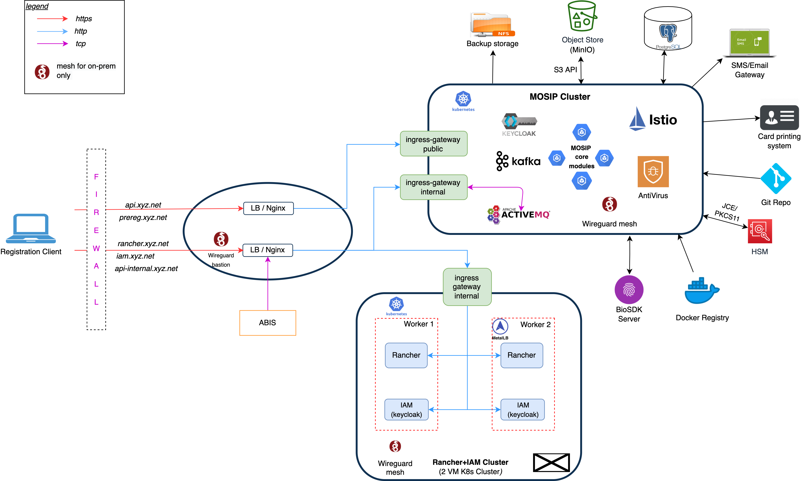
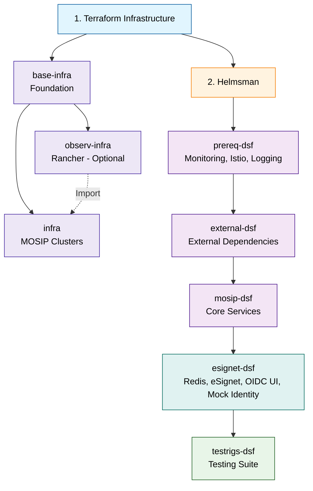

# 1.2.0.3

### Overview

MOSIP Rapid Deployment Infrastructure is a **unified, cloud-native deployment platform** that transforms complex, time-consuming MOSIP deployments into **automated, 3-step processes** that completes fast and takes much lesser time than earlier deployments. It replaces fragmented, manual infrastructure setup with a single repository containing everything needed for production-ready MOSIP deployment.

With MOSIP RDI (Rapid Deployment Infrastructure), you can deploy complete MOSIP identity platforms with enterprise-grade security, monitoring, and automation through a streamlined CI/CD approach that reduces deployment complexity by 90%.

This release introduces **eSignet** as a fully integrated deployment component within the RDI framework. eSignet is MOSIP's OpenID Connect-based authentication and authorization service, enabling secure, standards-based digital identity verification, deployable alongside MOSIP core services using the dedicated `esignet-dsf.yaml` Helmsman configuration.

### How does the rapid deployment model improve upon previous approaches in terms of DevOps modernization?

MOSIP RDI introduces several key improvements over the earlier approach:

1. **Infrastructure as Code (IaC)**: MOSIP RDI (Rapid Deployment Infrastructure) leverages tools like **Terraform** for declarative, version-controlled infrastructure provisioning. This ensures repeatable, automated deployments and minimizes manual intervention.
2. **Streamlined CI/CD Pipelines**: Integrated **GitHub Actions** automate testing, validation, and deployment workflows, enabling faster and more reliable releases with minimal manual steps.
3. **Automated Configuration and Deployment**: **Ansible** and **Cloud-Init** are used for server configuration and initialization, ensuring consistent environments across deployments.
4. **Unified Repository and Collaboration**: All infrastructure, configuration, and deployment scripts are maintained in a single repository, promoting collaboration and reducing silos between Dev, Ops, and Security teams.
5. **Security and Compliance**: Automated vulnerability scanning, compliance checks, and secure networking (e.g., **WireGuard VPN**, security groups) are built into the deployment process.
6. **Scalability and Flexibility**: The cloud-native, modular architecture—built on **Kubernetes** and managed via **Helm/Helmsman**—enables seamless scaling and adaptation to changing requirements.
7. **eSignet Integration**: The eSignet authentication stack (Redis, SoftHSM, Keycloak, Mock Identity System, OIDC UI, and Partner Onboarder) is now deployable via a dedicated `esignet-dsf.yaml` Helmsman Desired State File and a dedicated `helmsman_esignet.yml` GitHub Actions workflow, integrated with MOSIP core services deployment.

### Where and how do I start?

To begin with MOSIP RDI:

**Deployment Architecture**

<figure><figcaption></figcaption></figure>

**Key Resources**

You can refer to the following key resources to get started with MOSIP Rapid Deployment. Currently the links take you to repo READMEs as this is the first beta release of MOSIP RDI (Rapid Deployment Infrastructure) and we are working to bring all the relevant content to this published documentation site as well.

* **Comprehensive Documentation**: Access the official [MOSIP RDI Documentation](https://github.com/mosip/infra) for step-by-step guides, architecture details, and deployment instructions.
* **Deployment Repository**: Clone the deployment codebase from the [MOSIP RDI GitHub Repository](https://github.com/mosip/infra). This repository contains all necessary scripts, modules, and configuration files for a production-ready setup.
* **eSignet Deployment Guide**: Refer to the [eSignet README](https://github.com/mosip/infra/blob/master/docs/esignet_README.md) for configuration details and required secrets.

For additional guidance, refer to the [Documentation](1.2.0.3.md#documentation) section at the end of this document for links to checklists, setup guides, and troubleshooting resources.

### How it works (High-level Overview)

MOSIP RDI follows a **3-step deployment model** that separates infrastructure concerns from application deployment. Starting with this release, the eSignet authentication stack is a dedicated fourth deployment phase that runs after MOSIP core services are up.

### Complete Deployment Flow

## Documentation

* [**MOSIP Rapid Deployment Infrastructure**](https://github.com/mosip/infra/blob/master/README.md)
* [**Terraform**](https://github.com/mosip/infra/blob/master/terraform/README.md)
* [**Helmsman**](https://github.com/mosip/infra/blob/master/Helmsman/README.md)
* [**eSignet Deployment**](https://github.com/mosip/infra/blob/master/docs/esignet_README.md)
* [**GitHub Actions**](https://github.com/mosip/infra/blob/master/.github/workflows/README.md)
* [**Architecture**](https://github.com/mosip/infra/blob/master/docs/_images/ARCHITECTURE_DIAGRAMS.md)
