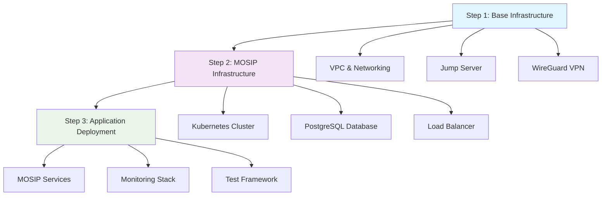
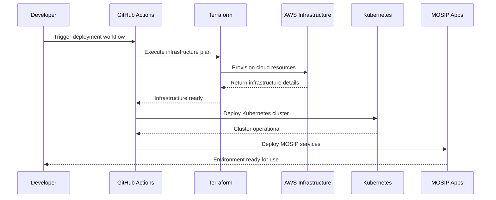

# MOSIP Infrastructure (Rapid Deployment)

## Overview

MOSIP Infrastructure is a **unified, cloud-native deployment platform** that transforms complex, multi-week MOSIP deployments into **automated, 3-step processes** that complete in hours, not days. It replaces fragmented, manual infrastructure setup with a single repository containing everything needed for production-ready MOSIP deployment.

**Core Value:** Deploy complete MOSIP identity platforms with enterprise-grade security, monitoring, and automation through a streamlined CI/CD approach that reduces deployment complexity by 90%.

## Who is this for?

### **🏛️ Government IT Teams**
- **Challenge**: Need to deploy national identity systems quickly and securely
- **Solution**: Automated infrastructure provisioning with built-in security and compliance

### **💼 System Integrators** 
- **Challenge**: Multiple MOSIP deployments across different environments and cloud providers
- **Solution**: Standardized, repeatable deployment patterns with consistent configuration

### **👩‍💻 DevOps Engineers**
- **Challenge**: Complex infrastructure management with manual processes prone to errors
- **Solution**: Infrastructure as Code with automated CI/CD pipelines and monitoring

### **🔧 Cloud Architects**
- **Challenge**: Designing scalable, secure infrastructure for identity workloads
- **Solution**: Pre-built, production-tested architecture patterns with security best practices

## What problems does MOSIP Infrastructure solve?

### **❌ Before: Traditional Deployment Challenges**
- **Weeks-long deployments** with multiple manual steps and potential failures
- **Fragmented repositories** requiring coordination across 5+ separate codebases
- **Manual security configuration** leaving systems vulnerable to misconfigurations
- **Inconsistent environments** leading to "works on my machine" deployment issues
- **Complex scaling** requiring deep Kubernetes and cloud expertise

### **✅ After: Rapid Deployment Benefits**
- **Hours-long deployments** with automated error handling and rollback capabilities
- **Single unified repository** containing all infrastructure and application deployment code
- **Built-in security** with WireGuard VPN, GPG encryption, and zero-trust networking
- **Consistent environments** across development, staging, and production
- **Auto-scaling infrastructure** with monitoring and alerting configured by default

## How it works (High-level Overview)

MOSIP Infrastructure follows a **3-step deployment model** that separates infrastructure concerns from application deployment:



### **Step 1: Base Infrastructure (10-15 minutes)**
- **Virtual Private Cloud (VPC)**: Secure network foundation
- **Jump Server**: Bastion host for secure infrastructure access
- **WireGuard VPN**: Encrypted connection for private network access
- **Security Groups**: Network firewall rules and access controls

### **Step 2: MOSIP Infrastructure (20-30 minutes)**
- **RKE2 Kubernetes Cluster**: Modern container orchestration platform
- **PostgreSQL Database**: High-availability database with automated backups
- **NGINX Load Balancer**: SSL termination and traffic distribution
- **Route 53 DNS**: Automated domain and certificate management

### **Step 3: Application Deployment (30-60 minutes)**
- **MOSIP Services**: All identity platform services (ID Auth, PMS, Kernel, etc.)
- **Monitoring Stack**: Prometheus, Grafana, and alerting
- **Service Mesh**: Istio for secure service-to-service communication
- **Test Framework**: Automated test rigs for validation

## Process Flow

### **Developer/Operator Journey**

1. **Fork Repository**: Get your own copy of the infrastructure code
2. **Configure Secrets**: Set up AWS credentials, SSH keys, and encryption passwords
3. **Run GitHub Actions**: Trigger automated deployment workflows
4. **Monitor Progress**: Track deployment through GitHub Actions interface
5. **Access Environment**: Connect via WireGuard VPN to manage infrastructure
6. **Deploy Applications**: Use Helmsman for declarative service deployment

### **Behind the Scenes**



## Architecture Context

MOSIP Infrastructure serves as the **foundation layer** that supports all MOSIP modules and services:

### **Infrastructure Stack**
```
┌─────────────────────────────────────────┐
│           MOSIP Applications            │ ← Pre-reg, Registration, ID Auth
├─────────────────────────────────────────┤
│         Application Platform           │ ← Kubernetes, Service Mesh, Monitoring
├─────────────────────────────────────────┤
│        MOSIP Infrastructure           │ ← This Module
├─────────────────────────────────────────┤
│           Cloud Provider              │ ← AWS (Azure/GCP coming soon)
└─────────────────────────────────────────┘
```

### **Key Relationships**
- **Provides Runtime Environment**: For all MOSIP services and databases
- **Manages Scaling**: Automatically scales resources based on demand
- **Handles Security**: Network isolation, encryption, and access controls
- **Enables Monitoring**: Observability for all applications and infrastructure
- **Supports Updates**: Rolling updates and rollback capabilities

### **Integration Points**
- **MOSIP Config**: Centralized configuration management
- **K8s-Infra**: Kubernetes cluster management and service deployment
- **Keycloak**: Identity and access management integration
- **File Server**: Document storage and management
- **Notification**: Email and SMS service connectivity

## Key Capabilities

### **🚀 Automated Infrastructure Provisioning**
**Problem**: Manual infrastructure setup takes weeks and is error-prone
**Solution**: Terraform modules provision complete cloud infrastructure in minutes
**Benefit**: Consistent, reproducible environments with zero manual configuration

### **🔒 Built-in Security by Design**
**Problem**: Security often added as an afterthought, leaving vulnerabilities
**Solution**: WireGuard VPN, GPG encryption, zero-trust networking from day one
**Benefit**: Production-grade security without security expertise requirements

### **☁️ Multi-Cloud Foundation**
**Problem**: Vendor lock-in and limited deployment flexibility
**Solution**: Cloud-agnostic Terraform modules (AWS complete, Azure/GCP coming)
**Benefit**: Deploy on any cloud provider with consistent architecture

### **📊 Integrated Monitoring and Observability**
**Problem**: Monitoring setup requires specialized knowledge and tools
**Solution**: Pre-configured Prometheus, Grafana, and alerting stack
**Benefit**: Full visibility into infrastructure and application performance

### **🔄 CI/CD Integration**
**Problem**: Manual deployment processes don't scale and lack auditability
**Solution**: GitHub Actions workflows with automated testing and deployment
**Benefit**: Reliable, auditable deployments with rollback capabilities

### **🎯 Declarative Application Management**
**Problem**: Keeping applications in sync across environments
**Solution**: Helmsman Desired State Files (DSF) for consistent deployments
**Benefit**: GitOps workflow with version-controlled application state

## Prerequisites and Dependencies

### **Cloud Provider Account**
- **AWS Account** with administrative permissions (full support)
- **Alternative**: Azure or GCP account (community implementations in progress)
- **Why needed**: Infrastructure provisioning requires cloud provider API access

### **Domain and DNS Management**
- **Registered domain** with DNS management access
- **Route 53** (AWS) or equivalent DNS service
- **Why needed**: SSL certificates and service discovery require domain control

### **GitHub Repository Access**
- **GitHub account** with repository creation permissions
- **GitHub Actions** enabled for CI/CD workflows
- **Why needed**: Infrastructure deployment uses GitHub Actions for automation

### **Technical Prerequisites**
- **SSH Key Pair** for secure server access
- **GPG Passphrase** for state file encryption
- **Basic cloud knowledge** for troubleshooting and customization

### **Required Skills**
- **Basic Kubernetes** understanding for application management
- **Git workflow** familiarity for version control
- **Cloud provider basics** for cost management and resource monitoring

## Getting Started Pathways

### **For Government Implementers**
**Goal**: Deploy production MOSIP infrastructure for national identity system

**Quick Start Path**:
1. **Review**: [Production Deployment Checklist](production-checklist.md)
2. **Setup**: [AWS Account and Permissions Guide](aws-setup.md)
3. **Deploy**: [3-Step Deployment Guide](deployment-guide.md)
4. **Secure**: [Security Hardening Guide](security-guide.md)
5. **Monitor**: [Operations and Monitoring](operations-guide.md)

**Expected Timeline**: 1-2 days for complete production environment

### **For System Integrators**
**Goal**: Standardize MOSIP deployments across multiple client environments

**Integration Path**:
1. **Understand**: [Architecture Deep Dive](architecture.md)
2. **Customize**: [Multi-Tenant Configuration](multi-tenant.md)
3. **Automate**: [CI/CD Pipeline Setup](cicd-guide.md)
4. **Scale**: [Multi-Environment Management](scaling-guide.md)
5. **Support**: [Troubleshooting Playbook](troubleshooting.md)

**Expected Timeline**: 3-5 days for multi-environment setup and customization

### **For DevOps Engineers**
**Goal**: Understand and extend infrastructure automation capabilities

**Technical Path**:
1. **Learn**: [Terraform Module Structure](terraform-guide.md)
2. **Practice**: [Development Environment Setup](dev-setup.md)
3. **Extend**: [Custom Module Development](module-development.md)
4. **Contribute**: [Community Contribution Guide](contributing.md)
5. **Advanced**: [Infrastructure Scaling Patterns](advanced-patterns.md)

**Expected Timeline**: 1 week for full technical mastery

### **For Cloud Architects**
**Goal**: Design enterprise-grade MOSIP infrastructure

**Architecture Path**:
1. **Design**: [Reference Architecture Guide](reference-architecture.md)
2. **Security**: [Security Architecture Patterns](security-architecture.md)
3. **Networking**: [Network Design Guide](network-design.md)
4. **Storage**: [Data Architecture Planning](data-architecture.md)
5. **Compliance**: [Governance and Compliance](compliance-guide.md)

**Expected Timeline**: 2-3 weeks for comprehensive enterprise design

## Technology Stack

### **Infrastructure as Code**
- **Terraform**: Multi-cloud infrastructure provisioning
- **Ansible**: Server configuration and application installation
- **Cloud-Init**: Automated server initialization

### **Container Orchestration**
- **RKE2 Kubernetes**: Production-ready Kubernetes distribution
- **Helm**: Application package management
- **Helmsman**: Declarative Helm chart deployment

### **Security and Networking**
- **WireGuard**: Modern VPN for secure access
- **Istio**: Service mesh for secure communication
- **Let's Encrypt**: Automated SSL certificate management

### **Monitoring and Observability**
- **Prometheus**: Metrics collection and alerting
- **Grafana**: Visualization and dashboards
- **ElasticSearch**: Log aggregation and search

### **Database and Storage**
- **PostgreSQL**: Primary database with high availability
- **MinIO**: S3-compatible object storage
- **EBS/Persistent Volumes**: Persistent storage management

## Version Information

### **Current Release: v0.1.0-beta**
- **Release Type**: Beta release with core functionality
- **Cloud Support**: AWS (complete), Azure/GCP (placeholder)
- **Status**: Production-ready for AWS deployments

### **Repository Tags**
| Component | Version | Status |
|-----------|---------|---------|
| infra | 0.1.0-beta | ✅ Active |
| keycloak | 1.2.0.2 | ✅ Stable |
| k8s-infra | 1.2.0.3 | ✅ Stable |
| mosip-file-server | 1.2.0.2 | ✅ Stable |
| mosip-config | 1.2.4.3 | ✅ Stable |

### **Compatibility Matrix**
- **MOSIP Platform**: v1.2.0.x series
- **Kubernetes**: v1.28.9+rke2r1
- **Terraform**: v1.0+
- **Cloud Providers**: AWS (full), Azure/GCP (partial)

## Known Limitations

### **Cloud Provider Support**
- **Complete Support**: AWS with all features and automation
- **Limited Support**: Azure and GCP with placeholder implementations
- **Community Needed**: Contributions welcome for non-AWS cloud providers

### **Manual Interventions**
- **Partner Onboarding**: Requires manual completion after initial deployment
- **Certificate Management**: Some SSL certificate scenarios need manual intervention
- **Resource Limits**: AWS availability zones may have capacity constraints

### **Current Workarounds**
- **Docker Rate Limits**: May cause deployment delays; retry mechanisms included
- **DNS Propagation**: Allow 5-10 minutes for DNS changes to propagate
- **First-Time Setup**: Initial deployment may take longer due to image pulls

## Next Steps

### **Ready to Deploy?**

**🚀 For Production Deployment**
[Start with 3-Step Deployment Guide →](deployment-guide.md)

**🧪 For Development/Testing**  
[Quick Development Setup →](dev-setup.md)

**❓ Have Questions?**
[Join MOSIP Community Forum →](https://community.mosip.io) | [View FAQ →](faq.md)

### **Want to Contribute?**

**🔧 Technical Contributions**
[Contribute to Azure/GCP Support →](contributing.md#cloud-providers)

**📚 Documentation Improvements**
[Help Improve Docs →](contributing.md#documentation)

**🐛 Report Issues**
[GitHub Issues →](https://github.com/mosip/infra/issues)

## Related Documentation

### **📋 Planning and Setup**
- [**Production Deployment Checklist**](production-checklist.md) - Complete preparation guide for production deployments
- [**AWS Account Setup**](aws-setup.md) - Step-by-step AWS account configuration and permissions
- [**Security Planning Guide**](security-guide.md) - Security considerations and hardening procedures

### **🚀 Deployment and Configuration**
- [**3-Step Deployment Guide**](deployment-guide.md) - Complete deployment walkthrough with examples
- [**Configuration Reference**](configuration.md) - All configuration options and customization possibilities
- [**Multi-Environment Setup**](multi-environment.md) - Managing development, staging, and production environments

### **🔧 Technical Documentation**
- [**Terraform Documentation**](terraform/README.md) - Infrastructure as Code details and module reference
- [**Helmsman Documentation**](Helmsman/dsf/README.md) - Application deployment and desired state management
- [**WireGuard Setup Guide**](terraform/base-infra/WIREGUARD_SETUP.md) - VPN configuration and troubleshooting

### **📊 Operations and Maintenance**
- [**Monitoring Guide**](monitoring.md) - Prometheus, Grafana setup and alerting configuration
- [**Backup and Recovery**](backup-recovery.md) - Data protection and disaster recovery procedures
- [**Troubleshooting Guide**](troubleshooting.md) - Common issues and resolution procedures

### **🏗️ Architecture and Development**
- [**Architecture Deep Dive**](architecture.md) - Detailed technical architecture and design decisions
- [**Module Development**](module-development.md) - Creating custom Terraform modules and extensions
- [**Contributing Guide**](contributing.md) - How to contribute to the MOSIP Infrastructure project

---

*MOSIP Infrastructure transforms complex identity platform deployments into simple, automated processes. Get started today and deploy production-ready MOSIP infrastructure in hours, not weeks.*